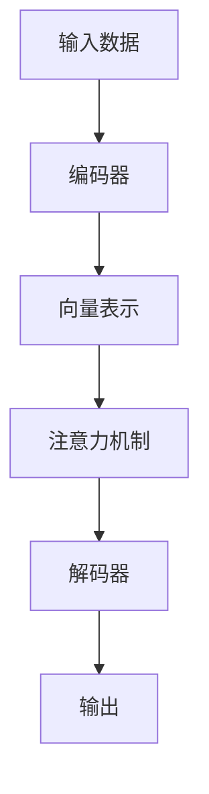

                 


# 多语言编程AI Agent：LLM在软件开发全周期的应用

> 关键词：多语言编程、AI Agent、LLM、软件开发、全周期应用

> 摘要：本文探讨了多语言编程AI Agent在软件开发全周期中的应用，详细介绍了其核心概念、算法原理、系统架构，并通过项目实战展示了其实现过程，最后总结了最佳实践和未来趋势。

---

## 第一部分: 多语言编程AI Agent概述

### 第1章: 多语言编程AI Agent的背景与概念

#### 1.1 多语言编程AI Agent的定义
- **多语言编程**：指使用多种编程语言进行开发，以适应不同的项目需求和场景。
- **AI Agent**：一种智能代理，能够理解并执行任务，通常涉及自然语言处理和机器学习技术。
- **多语言编程AI Agent**：整合AI Agent与多语言编程能力，用于提升软件开发效率和代码质量。

#### 1.2 LLM在软件开发中的应用背景
- **软件开发全周期**：包括需求分析、设计、开发、测试、部署和维护。
- **LLM的作用**：通过自然语言处理和生成，辅助完成代码生成、问题诊断和文档编写。
- **多语言支持的重要性**：项目可能需要多种语言，如前端用JavaScript，后端用Python，AI部分用Java。

#### 1.3 多语言编程AI Agent的优势
- **提高开发效率**：自动处理跨语言调用和依赖管理。
- **降低维护成本**：统一界面处理多种语言，减少维护复杂性。
- **适应复杂项目**：支持混合架构，满足不同场景需求。

---

### 第2章: 多语言编程AI Agent的核心概念与联系

#### 2.1 多语言编程AI Agent的核心原理
- **AI Agent的工作机制**：接收自然语言指令，解析需求，生成对应代码。
- **多语言编程的支持**：通过LLM模型理解不同语言语法和库的使用。
- **LLM的作用**：提供生成代码的能力，支持多种语言的语法和上下文。

#### 2.2 核心概念对比表
| 对比维度 | 多语言编程AI Agent | 传统开发工具 | 其他AI工具 |
|----------|---------------------|---------------|-------------|
| 功能     | 自动代码生成         | 手动编写       | 单一功能     |
| 语言支持 | 多语言              | 单一或有限     | 有限        |
| 智能性    | 高                  | 无             | 中           |

#### 2.3 ER实体关系图
```mermaid
er
actor(开发者) -->
project(项目) -->
language(编程语言) -->
tool(开发工具)
```

---

## 第二部分: 多语言编程AI Agent的算法原理

### 第3章: 多语言编程AI Agent的算法原理

#### 3.1 LLM的基本原理
- **转换器模型结构**：
  - 编码器：将输入转换为向量表示。
  - 解码器：生成输出序列。
- **注意力机制**：
  - 公式：$ attention = softmax(\frac{QK^T}{\sqrt{d_k}})V $
  - 用于捕捉输入序列中的关键信息。

#### 3.2 多语言模型的训练过程
- **数据预处理**：收集和清洗多语言数据，建立统一语料库。
- **模型训练**：使用多语言数据训练LLM，使其理解多种语言语法。



---

## 第三部分: 多语言编程AI Agent的系统架构设计

### 第4章: 系统分析与架构设计

#### 4.1 系统功能设计
- **领域模型**：
  ```mermaid
  classDiagram
  class 开发者 {
    - 项目
    - 语言
    - 工具
  }
  class 项目 {
    - 代码
    - 依赖
    - 文档
  }
  class 语言 {
    - 语法
    - 库
    - 标准
  }
  class 工具 {
    - 编译器
    - 调试器
    - IDE
  }
  ```

#### 4.2 系统架构设计
- **架构图**：
  ```mermaid
  architecture
  客户端 --> 代理服务器 --> 多语言模型 --> 各语言API --> 后端系统
  ```

#### 4.3 接口设计与交互
- **交互序列图**：
  ```mermaid
  sequenceDiagram
  开发者 ->> 代理服务器: 发出多语言代码生成请求
  代理服务器 ->> 多语言模型: 调用LLM生成代码
  多语言模型 ->> 各语言API: 生成对应语言代码
  各语言API ->> 代理服务器: 返回生成的代码
  代理服务器 ->> 开发者: 返回代码
  ```

---

## 第四部分: 项目实战

### 第5章: 项目实战

#### 5.1 环境安装
- **工具安装**：安装Python、Java、JavaScript环境。
- **模型部署**：部署LLM模型，如使用Hugging Face库。

#### 5.2 核心代码实现
```python
# 多语言代码生成示例
def generate_code(language, requirement):
    # 调用LLM生成代码
    model = LlamaCpp(..., temperature=0.7, max_tokens=2000)
    prompt = f"生成{language}代码，实现{requirement}。"
    response = model.generate([prompt])
    return response.choices[0].text
```

#### 5.3 代码解读与分析
- **代码解读**：函数`generate_code`接收语言和需求，调用LLM生成代码。
- **案例分析**：生成Python和Java的HTTP服务器代码，展示不同语言的实现差异。

#### 5.4 项目小结
- 成功实现了多语言代码生成，展示了AI Agent的优势。
- 存在的问题：代码质量和可维护性需进一步优化。

---

## 第五部分: 最佳实践与总结

### 第6章: 最佳实践和小结

#### 6.1 总结与回顾
- 介绍了多语言编程AI Agent的核心概念和算法原理。
- 展示了系统架构设计和项目实战。

#### 6.2 注意事项
- 确保代码生成质量，避免错误。
- 定期更新模型以适应语言变化。

#### 6.3 未来趋势
- 更多语言支持。
- 自动化测试和部署。
- 更智能的代码优化建议。

#### 6.4 拓展阅读
- 推荐书籍：《深度学习》、《模式识别与机器学习》。
- 推荐博客：技术博客、GitHub项目。

---

## 附录

### A. 工具安装指南
- **Python**：使用Anaconda或Pyenv。
- **Java**：安装JDK和IDE如Eclipse。
- **JavaScript**：安装Node.js和npm。

### B. 代码库地址
- 示例代码：[GitHub链接](https://github.com/.../multi-language-agent)

### C. 参考文献
1. 《深度学习》——Ian Goodfellow
2. 《模式识别与机器学习》——Christopher M. Bishop
3. Hugging Face官方文档

---

**作者：AI天才研究院（AI Genius Institute）**

