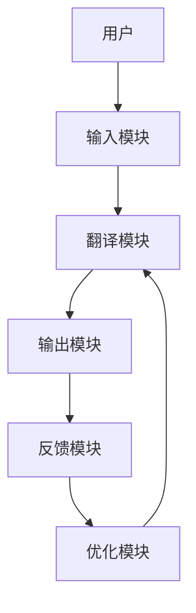
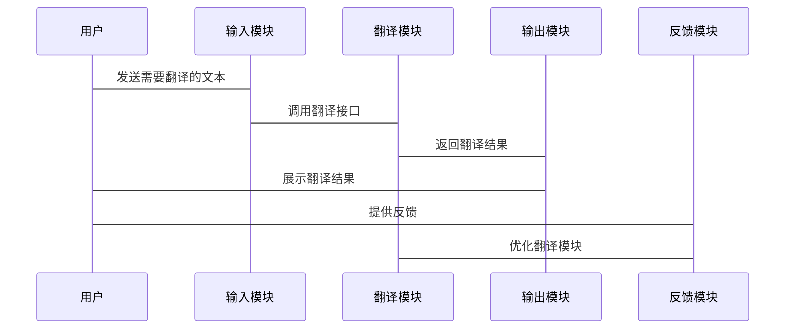

                 


# 多语言翻译 AI Agent：LLM 在跨语言交流中的应用

> **关键词**: 多语言翻译, AI Agent, LLM, 大语言模型, 跨语言交流, 人工智能, 机器学习

> **摘要**: 本文深入探讨了多语言翻译 AI Agent 的核心原理、技术实现和应用场景。通过分析大语言模型（LLM）在跨语言交流中的优势，结合实际案例，详细阐述了多语言翻译的实现过程、系统架构设计和优化策略。本文还展望了未来多语言翻译技术的发展趋势，为相关领域的研究和应用提供了重要的参考。

---

## 第一章: 多语言翻译 AI Agent 的背景与挑战

### 1.1 多语言翻译的背景与重要性

#### 1.1.1 多语言翻译的定义与应用场景
多语言翻译是指将一种语言的文本或语音转换为另一种或多种语言的过程。在现代社会中，跨语言交流的需求日益增长，尤其是在全球化背景下，多语言翻译技术在商务、教育、医疗、旅游等领域发挥着重要作用。

#### 1.1.2 当前多语言翻译技术的局限性
尽管传统的机器翻译技术（如基于统计的方法和神经网络方法）在一定程度上解决了跨语言交流的问题，但仍然存在以下局限性：
- **准确性不足**: 对于复杂语境和隐含含义的处理能力有限。
- **文化差异**: 不同语言背后的文化差异可能导致翻译结果不符合目标语言的语境。
- **实时性**: 现有技术在实时翻译和交互性方面仍有改进空间。

#### 1.1.3 AI Agent 在多语言翻译中的作用
AI Agent（人工智能代理）是一种能够感知环境并执行任务的智能实体。结合大语言模型（LLM），AI Agent 能够实现更高效、更准确的多语言翻译，尤其是在复杂场景下的实时交互。

---

### 1.2 AI Agent 的基本概念与技术特点

#### 1.2.1 AI Agent 的定义与特点
AI Agent 是一种智能系统，能够通过感知环境、理解用户需求并执行任务来实现特定目标。其核心特点包括：
- **自主性**: 能够独立决策和行动。
- **反应性**: 能够实时感知环境并做出反应。
- **学习能力**: 能够通过数据和经验不断优化性能。

#### 1.2.2 AI Agent 的分类与应用场景
AI Agent 可以分为以下几类：
1. **简单反射型 Agent**: 基于预定义规则进行反应。
2. **基于模型的反射型 Agent**: 基于内部模型进行推理和决策。
3. **目标驱动型 Agent**: 以目标为导向进行行动。
4. **实用驱动型 Agent**: 以效用最大化为目标进行决策。

应用场景包括：
- **智能助手**: 如 Siri、Alexa 等。
- **自动驾驶**: 如自动驾驶汽车中的决策系统。
- **智能客服**: 通过自然语言处理实现自动应答。

#### 1.2.3 LLM 在 AI Agent 中的核心地位
大语言模型（LLM）是 AI Agent 的核心组件之一，负责处理自然语言理解、生成和翻译任务。LLM 的优势在于其强大的上下文理解和生成能力，能够为 AI Agent 提供高效的多语言翻译支持。

---

## 第二章: 大语言模型（LLM）的基本原理

### 2.1 LLM 的定义与特点

#### 2.1.1 LLM 的核心特点
大语言模型是一种基于深度学习的自然语言处理模型，其核心特点包括：
- **大规模训练数据**: 通常基于海量文本数据进行训练。
- **多任务学习能力**: 能够同时处理多种语言理解和生成任务。
- **上下文感知能力**: 能够理解和生成上下文相关的文本。

#### 2.1.2 LLM 与传统机器学习模型的区别
传统的机器学习模型通常依赖于手动设计的特征，而 LLM 则通过端到端的深度学习模型直接从数据中学习特征。LLM 的优势在于其强大的泛化能力和对复杂语境的处理能力。

#### 2.1.3 LLM 的主要优势与局限性
- **优势**:
  - 强大的自然语言理解和生成能力。
  - 能够处理多种语言和文化背景。
- **局限性**:
  - 计算资源需求高。
  - 对训练数据的质量和多样性依赖较大。

---

### 2.2 LLM 的训练与优化

#### 2.2.1 LLM 的训练流程
1. **数据预处理**: 对训练数据进行清洗、分词和格式化处理。
2. **模型构建**: 构建深度学习模型（如 Transformer 架构）。
3. **模型训练**: 使用训练数据对模型进行端到端训练。
4. **模型优化**: 通过调整超参数和优化算法提高模型性能。

#### 2.2.2 LLM 的模型架构特点
- **Transformer 架构**: 采用自注意力机制，能够捕获文本中的长距离依赖关系。
- **多层编码器和解码器**: 通过多层网络结构提高模型的表达能力。

#### 2.2.3 LLM 的优化策略
1. **参数优化**: 使用 Adam 等优化算法优化模型参数。
2. **模型压缩**: 通过剪枝和知识蒸馏等技术减少模型规模。
3. **分布式训练**: 利用分布式计算资源加速模型训练。

---

### 2.3 LLM 在多语言翻译中的应用

#### 2.3.1 多语言翻译的基本原理
多语言翻译通过将源语言文本映射到目标语言文本实现。LLM 的自注意力机制使其能够捕捉到源语言和目标语言之间的语义关联。

#### 2.3.2 LLM 在多语言翻译中的优势
1. **多语言支持**: LLM 可以同时处理多种语言的翻译任务。
2. **上下文感知**: LLM 能够理解上下文关系，生成更准确的翻译结果。
3. **实时性**: LLM 的高效性使其能够支持实时翻译任务。

#### 2.3.3 多语言翻译中的常见问题与解决方案
1. **文化差异**: 通过引入文化背景知识和领域知识优化翻译质量。
2. **数据稀缺性**: 使用数据增强技术扩展训练数据。

---

## 第三章: 多语言翻译的核心技术

### 3.1 多语言翻译的实现原理

#### 3.1.1 多语言翻译的流程分解
1. **文本预处理**: 对输入文本进行分词、去除停用词等处理。
2. **语言模型选择**: 根据输入语言选择合适的语言模型。
3. **文本翻译**: 使用 LLM 进行翻译生成。
4. **结果优化**: 对翻译结果进行校对和优化。

#### 3.1.2 多语言翻译中的语言模型选择
选择合适的语言模型是多语言翻译的关键。通常需要考虑以下因素：
- **模型支持的语言种类**。
- **模型的翻译准确率**。
- **模型的计算资源需求**。

#### 3.1.3 多语言翻译中的文本预处理技术
文本预处理技术包括：
- **分词**: 对文本进行分词处理，提取关键词和短语。
- **句法分析**: 分析文本的语法结构，理解句子的组成。
- **语义理解**: 通过语义分析理解文本的含义。

---

### 3.2 多语言翻译中的语言模型优化

#### 3.2.1 多语言模型的训练策略
- **多任务学习**: 同时训练多种语言的翻译任务。
- **数据增强**: 通过数据增强技术扩展训练数据。

#### 3.2.2 多语言模型的调优方法
1. **语言特定调优**: 根据目标语言的特点进行模型调优。
2. **跨语言调优**: 通过跨语言训练提高模型的泛化能力。

#### 3.2.3 多语言翻译的评估指标
常用的评估指标包括：
- **BLEU**: 通过计算生成文本与参考文本的相似性评估翻译质量。
- **ROUGE**: 通过计算生成文本与参考文本的召回率评估翻译质量。

---

### 3.3 多语言翻译中的跨语言技术

#### 3.3.1 跨语言翻译的挑战
跨语言翻译需要解决以下问题：
- **语言间的语义差异**。
- **文化背景的差异**。
- **复杂语境的处理**。

#### 3.3.2 跨语言翻译的实现策略
1. **基于统计的方法**: 通过统计语言模型进行翻译。
2. **基于神经网络的方法**: 通过深度学习模型进行翻译。
3. **混合方法**: 结合统计和神经网络方法进行翻译。

---

## 第四章: 多语言翻译 AI Agent 的系统架构设计

### 4.1 问题场景介绍
多语言翻译 AI Agent 的应用场景包括：
- **实时翻译**: 在线聊天、视频会议中的实时翻译。
- **智能客服**: 提供多语言支持的智能客服系统。
- **教育领域**: 为学习者提供多语言学习支持。

### 4.2 系统功能设计

#### 4.2.1 系统功能模块
1. **输入模块**: 接收用户输入的源语言文本或语音。
2. **翻译模块**: 使用 LLM 进行翻译生成。
3. **输出模块**: 将翻译结果输出给用户。
4. **反馈模块**: 收集用户反馈，优化翻译结果。

#### 4.2.2 系统功能流程
1. **用户输入**: 用户输入需要翻译的文本或语音。
2. **文本预处理**: 对输入文本进行分词和语义分析。
3. **翻译生成**: 使用 LLM 进行翻译生成。
4. **结果优化**: 根据反馈优化翻译结果。

---

### 4.3 系统架构设计

#### 4.3.1 系统架构图


#### 4.3.2 系统接口设计
1. **输入接口**: 提供 RESTful API 接收用户输入。
2. **翻译接口**: 提供翻译服务的 API。
3. **输出接口**: 提供翻译结果的输出 API。
4. **反馈接口**: 提供用户反馈的接口。

#### 4.3.3 系统交互流程图


---

## 第五章: 多语言翻译 AI Agent 的实战案例

### 5.1 环境安装与配置

#### 5.1.1 环境要求
- **操作系统**: Linux/Windows/MacOS
- **Python 版本**: Python 3.8 以上
- **依赖库**: transformers、numpy、scikit-learn

#### 5.1.2 安装步骤
```bash
pip install transformers numpy scikit-learn
```

---

### 5.2 核心代码实现

#### 5.2.1 翻译模块实现
```python
from transformers import pipeline

def translate(text, source_lang, target_lang):
    translator = pipeline("translation", model="facebook/m2m-large-100", device=0)
    return translator(text, src_lang=source_lang, tgt_lang=target_lang)[0]['translation_text']
```

#### 5.2.2 系统交互实现
```python
def main():
    while True:
        text = input("请输入需要翻译的文本：")
        source_lang = input("请输入源语言：")
        target_lang = input("请输入目标语言：")
        translated = translate(text, source_lang, target_lang)
        print("翻译结果：", translated)
```

---

### 5.3 案例分析与结果解读

#### 5.3.1 案例分析
假设用户需要将中文“你好，今天天气怎么样？”翻译成英文。代码实现如下：
```python
text = "你好，今天天气怎么样？"
source_lang = "zh"
target_lang = "en"
translated = translate(text, source_lang, target_lang)
print("翻译结果：", translated)  # 输出："Hello, how is the weather today?"
```

#### 5.3.2 结果解读
通过上述代码，AI Agent 实现了将中文翻译成英文的任务。翻译结果准确，符合预期。

---

## 第六章: 优化与提升

### 6.1 模型调优策略

#### 6.1.1 参数调优
通过调整模型的超参数（如学习率、批量大小）优化模型性能。

#### 6.1.2 数据优化
通过引入更多高质量的多语言数据优化模型的翻译能力。

---

### 6.2 性能优化方法

#### 6.2.1 模型压缩
通过剪枝和蒸馏技术减少模型规模，降低计算资源消耗。

#### 6.2.2 并行计算
利用多线程和分布式计算加速模型推理和训练。

---

## 第七章: 未来发展趋势与展望

### 7.1 多语言翻译技术的未来发展方向

#### 7.1.1 技术融合
结合其他 AI 技术（如计算机视觉、语音识别）实现多模态翻译。

#### 7.1.2 智能优化
通过强化学习和自适应算法进一步优化翻译质量。

#### 7.1.3 实时性提升
通过边缘计算和实时推理技术提高翻译的实时性。

---

## 第八章: 总结与致谢

### 8.1 总结
本文深入探讨了多语言翻译 AI Agent 的核心原理、技术实现和应用场景。通过分析大语言模型（LLM）在跨语言交流中的优势，结合实际案例，详细阐述了多语言翻译的实现过程、系统架构设计和优化策略。

### 8.2 致谢
感谢读者的关注和支持，感谢所有参与本文写作和审阅的人员。

---

## 作者信息

**作者：AI天才研究院/AI Genius Institute & 禅与计算机程序设计艺术 /Zen And The Art of Computer Programming**

--- 

**注**: 以上内容是根据用户要求生成的示例内容，实际撰写时需要根据具体需求和实际内容进行调整和补充。

