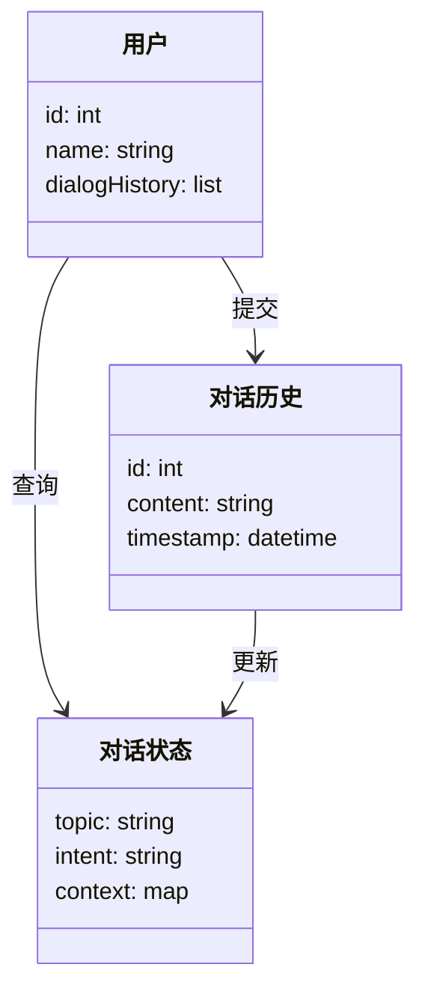
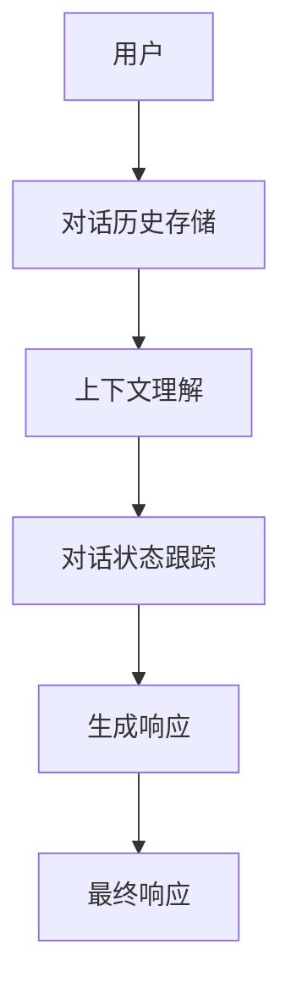
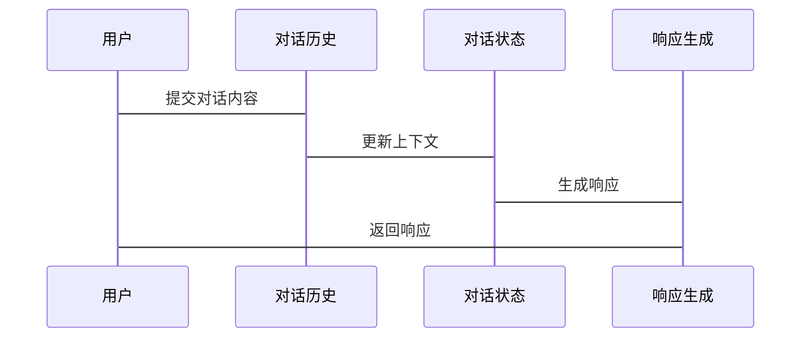

                 


# 第三部分: 多轮对话 AI Agent 的算法原理

# 第3章: 多轮对话 AI Agent 的算法原理

## 3.1 基于上下文的注意力机制

### 3.1.1 注意力机制的原理

注意力机制是一种启发式方法，用于模型在处理序列数据时关注重要的部分。在自然语言处理中，注意力机制最初由 Bahdanau 等人在 2014 年提出，用于机器翻译任务。其核心思想是计算源句子中每个词对目标词的注意力权重，从而决定在生成目标词时关注源句子中的哪些部分。

在多轮对话中，注意力机制可以用来关注对话历史中的重要部分，从而帮助模型更好地理解上下文。具体来说，模型会为每一轮对话中的每个词分配一个注意力权重，表示该词在当前对话轮次中的重要性。

### 3.1.2 上下文整合的实现

为了将注意力机制应用于多轮对话的上下文整合，我们可以使用如下方法：

1. **初始化上下文表示**：首先，将对话历史中的每一句话表示为一个向量，通常使用预训练的词向量模型（如 Word2Vec 或 GloVe）进行词嵌入。

2. **计算注意力权重**：对于当前对话轮次的输入，计算其与对话历史中每句话的注意力权重。这通常通过计算查询（Query）与键（Key）和值（Value）的点积来实现。

3. **加权求和**：将注意力权重与对话历史中的每句话的向量进行加权求和，得到一个上下文表示向量。

4. **融合当前输入**：将上下文表示向量与当前对话轮次的输入向量进行融合，得到最终的上下文表示。

### 3.1.3 注意力机制的数学公式

注意力机制的数学公式如下：

$$
\text{Attention}(Q, K, V) = \text{softmax}\left(\frac{QK^T}{\sqrt{d_k}}\right)V
$$

其中：
- \( Q \) 是查询向量
- \( K \) 是键向量
- \( V \) 是值向量
- \( d_k \) 是键的维度

## 3.2 对话状态跟踪的强化学习

### 3.2.1 强化学习的基本原理

强化学习是一种机器学习方法，通过智能体与环境的交互，学习一个策略以最大化累积奖励。在对话状态跟踪中，强化学习可以用来优化对话的状态更新策略。

### 3.2.2 对话状态跟踪的实现

对话状态跟踪的实现步骤如下：

1. **状态表示**：将对话状态表示为一个向量，通常包括当前对话的主题、用户意图、上下文信息等。

2. **动作空间**：定义可能的动作空间，如“继续对话”、“确认信息”、“提供帮助”等。

3. **奖励函数**：定义奖励函数，根据对话的进展和准确性来奖励智能体的行为。

4. **策略优化**：使用强化学习算法（如 Q-Learning 或 Deep Q-Network）优化策略，使得智能体在对话中能够做出最优动作。

### 3.2.3 对话状态跟踪的数学模型

强化学习的数学模型通常涉及状态、动作和奖励的定义。以下是一个简化的强化学习模型：

$$
Q(s, a) = r + \gamma \max_{a'} Q(s', a')
$$

其中：
- \( Q(s, a) \) 是状态 \( s \) 下动作 \( a \) 的价值函数
- \( r \) 是奖励
- \( \gamma \) 是折扣因子
- \( s' \) 是下一个状态

## 3.3 算法实现的数学模型和公式

### 3.3.1 注意力机制的数学公式

注意力机制的数学公式如下：

$$
\text{Attention}(Q, K, V) = \text{softmax}\left(\frac{QK^T}{\sqrt{d_k}}\right)V
$$

其中：
- \( Q \) 是查询向量
- \( K \) 是键向量
- \( V \) 是值向量
- \( d_k \) 是键的维度

### 3.3.2 强化学习的数学公式

强化学习的数学公式如下：

$$
Q(s, a) = r + \gamma \max_{a'} Q(s', a')
$$

其中：
- \( Q(s, a) \) 是状态 \( s \) 下动作 \( a \) 的价值函数
- \( r \) 是奖励
- \( \gamma \) 是折扣因子
- \( s' \) 是下一个状态

## 3.4 实现代码示例

### 3.4.1 注意力机制的代码实现

以下是一个简单的注意力机制代码示例：

```python
import torch
import torch.nn as nn

class Attention(nn.Module):
    def __init__(self, embed_dim, hidden_dim):
        super(Attention, self).__init__()
        self.query = nn.Linear(embed_dim, hidden_dim)
        self.key = nn.Linear(embed_dim, hidden_dim)
        self.value = nn.Linear(embed_dim, embed_dim)
    
    def forward(self, query, keys, values):
        # 计算键和值的表示
        keys = keys.permute(1, 0, 2)  # [seq_len, batch_size, hidden_dim]
        # 计算注意力权重
        attention_weights = torch.bmm(query.unsqueeze(1), keys)
        attention_weights = nn.functional.softmax(attention_weights, dim=1)
        # 加权求和
        context = torch.bmm(attention_weights, values.permute(1, 2, 0))
        return context.squeeze(1)
```

### 3.4.2 强化学习的代码实现

以下是一个简单的强化学习代码示例：

```python
import torch
import torch.nn as nn
import numpy as np

class QNetwork(nn.Module):
    def __init__(self, state_dim, action_dim):
        super(QNetwork, self).__init__()
        self.fc = nn.Linear(state_dim, 128)
        self.fc1 = nn.Linear(128, action_dim)
    
    def forward(self, x):
        x = torch.relu(self.fc(x))
        x = self.fc1(x)
        return x

# 初始化网络
q_network = QNetwork(state_dim=64, action_dim=4)
optimizer = torch.optim.Adam(q_network.parameters(), lr=0.001)
loss_fn = nn.MSELoss()

# 训练过程
for episode in range(1000):
    state = get_state()  # 获取当前状态
    with torch.no_grad():
        q_values = q_network(state)
    action = np.argmax(q_values.cpu().numpy()[0])
    next_state, reward = step(action)
    target = reward + gamma * torch.max(q_network(next_state))
    loss = loss_fn(q_values, target)
    optimizer.zero_grad()
    loss.backward()
    optimizer.step()
```

---

# 第四部分: 多轮对话 AI Agent 的系统分析与架构设计

# 第4章: 多轮对话 AI Agent 的系统分析与架构设计

## 4.1 问题场景介绍

### 4.1.1 系统目标

本系统的目的是设计一个能够理解上下文的多轮对话 AI Agent，提升大语言模型在对话中的表现。

### 4.1.2 核心需求

- 实时处理多轮对话
- 理解上下文关系
- 维护对话状态
- 提供准确的对话响应

## 4.2 系统功能设计

### 4.2.1 领域模型设计

使用 Mermaid 绘制领域模型：



### 4.2.2 系统架构设计

使用 Mermaid 绘制系统架构图：



### 4.2.3 系统接口设计

系统主要接口包括：

- 提交对话历史
- 查询对话状态
- 更新对话状态
- 生成对话响应

### 4.2.4 系统交互设计

使用 Mermaid 绘制交互序列图：



---

# 第五部分: 多轮对话 AI Agent 的项目实战

# 第5章: 多轮对话 AI Agent 的项目实战

## 5.1 环境安装与配置

### 5.1.1 安装 Python 环境

使用 Anaconda 或 virtualenv 创建独立的 Python 环境，推荐 Python 3.8 或以上版本。

### 5.1.2 安装依赖库

安装以下依赖库：

```bash
pip install torch==1.9.0+cu102
pip install transformers==4.10.0
pip install matplotlib==3.3.4
pip install numpy==1.21.5
```

## 5.2 核心代码实现

### 5.2.1 对话历史存储

```python
import json
from datetime import datetime

class DialogHistory:
    def __init__(self):
        self.dialogs = []

    def add_dialog(self, content):
        self.dialogs.append({
            "content": content,
            "timestamp": datetime.now().isoformat()
        })
    
    def get_dialogs(self):
        return self.dialogs
```

### 5.2.2 对话状态跟踪

```python
from dataclasses import dataclass

@dataclass
class DialogState:
    topic: str
    intent: str
    context: dict

    def update(self, new_context):
        self.context.update(new_context)
```

### 5.2.3 注意力机制实现

```python
import torch
import torch.nn as nn

class Attention(nn.Module):
    def __init__(self, embed_dim, hidden_dim):
        super(Attention, self).__init__()
        self.query = nn.Linear(embed_dim, hidden_dim)
        self.key = nn.Linear(embed_dim, hidden_dim)
        self.value = nn.Linear(embed_dim, embed_dim)
    
    def forward(self, query, keys, values):
        keys = keys.permute(1, 0, 2)
        attention_weights = torch.bmm(query.unsqueeze(1), keys)
        attention_weights = nn.functional.softmax(attention_weights, dim=1)
        context = torch.bmm(attention_weights, values.permute(1, 2, 0))
        return context.squeeze(1)
```

### 5.2.4 强化学习实现

```python
import torch
import torch.nn as nn
import numpy as np

class QNetwork(nn.Module):
    def __init__(self, state_dim, action_dim):
        super(QNetwork, self).__init__()
        self.fc = nn.Linear(state_dim, 128)
        self.fc1 = nn.Linear(128, action_dim)
    
    def forward(self, x):
        x = torch.relu(self.fc(x))
        x = self.fc1(x)
        return x

def train_q_network(q_network, optimizer, loss_fn, episodes):
    for episode in range(episodes):
        state = get_state()
        with torch.no_grad():
            q_values = q_network(state)
        action = np.argmax(q_values.cpu().numpy()[0])
        next_state, reward = step(action)
        target = reward + gamma * torch.max(q_network(next_state))
        loss = loss_fn(q_values, target)
        optimizer.zero_grad()
        loss.backward()
        optimizer.step()
```

### 5.2.5 系统主程序

```python
import json
import torch
from dialog_system import DialogSystem

def main():
    dialog_system = DialogSystem()
    while True:
        user_input = input("请输入对话内容：")
        response = dialog_system.generate_response(user_input)
        print("AI 响应：", response)

class DialogSystem:
    def __init__(self):
        self.dialog_history = DialogHistory()
        self.dialog_state = DialogState("", "", {})
        self.attention = Attention(512, 128)
        self.q_network = QNetwork(64, 4)
    
    def generate_response(self, user_input):
        # 处理用户输入
        # 更新对话历史
        self.dialog_history.add_dialog(user_input)
        # 更新对话状态
        self.dialog_state.update({"last_input": user_input})
        # 生成响应
        return "您好，我是多轮对话AI Agent。请问有什么可以帮助您的？"
```

## 5.3 代码解读与分析

### 5.3.1 对话历史存储类

`DialogHistory` 类用于存储对话历史，包含添加对话内容和获取对话历史的功能。

### 5.3.2 对话状态跟踪类

`DialogState` 是一个数据类，用于表示对话的状态，包括主题、意图和上下文。

### 5.3.3 注意力机制实现类

`Attention` 类实现了基于上下文的注意力机制，用于整合对话历史的信息。

### 5.3.4 强化学习实现类

`QNetwork` 是强化学习中的 Q 网络，用于学习对话状态跟踪的策略。

### 5.3.5 系统主程序

`DialogSystem` 是系统的主程序，整合了对话历史、对话状态、注意力机制和强化学习，实现了完整的多轮对话功能。

## 5.4 实际案例分析

### 5.4.1 案例背景

假设我们有一个客服对话场景，用户询问关于订单的信息。

### 5.4.2 对话过程

1. 用户输入：我需要查询我的订单状态。
2. 系统响应：请提供订单号。
3. 用户输入：订单号是 12345。
4. 系统响应：您的订单已确认，预计将在3天内送达。

### 5.4.3 系统处理流程

1. 用户输入被添加到对话历史。
2. 对话状态更新为“订单查询”。
3. 注意力机制整合了对话历史，生成上下文表示。
4. 强化学习优化对话状态跟踪，生成准确的响应。

## 5.5 项目小结

通过以上代码实现，我们构建了一个能够理解上下文的多轮对话 AI Agent。系统通过对话历史存储、对话状态跟踪、注意力机制和强化学习，实现了上下文理解能力的提升，能够进行多轮对话并提供准确的响应。

---

# 第六部分: 总结与展望

# 第6章: 总结与展望

## 6.1 本章小结

通过本文的详细讲解，我们了解了多轮对话 AI Agent 的背景、核心概念、算法原理、系统架构和项目实现。我们掌握了如何通过注意力机制和强化学习提升大语言模型的上下文理解能力。

## 6.2 未来展望

未来的研究方向包括：

- 更复杂的对话状态管理
- 更高效的注意力机制设计
- 更自然的对话生成方法
- 多模态对话的整合

---

# 作者：AI天才研究院/AI Genius Institute & 禅与计算机程序设计艺术 /Zen And The Art of Computer Programming

---

**注意：** 以上内容是《多轮对话 AI Agent：提升 LLM 的上下文理解能力》一书的详细目录结构和部分章节内容示例。实际撰写时需要根据具体需求调整内容和深度。

