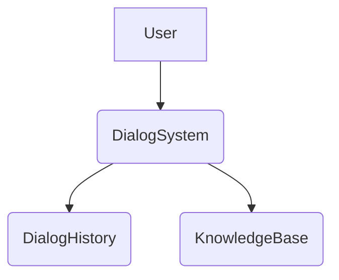

                 


# 多轮对话AI Agent：提升LLM的长期交互能力

---

## 关键词：
- 多轮对话
- AI Agent
- LLM
- 对话系统
- 知识库
- 长期交互

---

## 摘要：
本文深入探讨了多轮对话AI Agent的核心概念、算法原理和系统架构，重点分析了如何通过对话历史管理和知识库构建来提升大语言模型（LLM）的长期交互能力。文章从背景介绍、核心概念、算法实现、系统设计到项目实战，全面解析了多轮对话AI Agent的关键技术，并结合实际案例和代码示例，为读者提供了从理论到实践的完整指导。

---

# 第一部分: 多轮对话AI Agent的背景与概念

---

## 第1章: 多轮对话AI Agent的背景介绍

### 1.1 多轮对话的背景与问题背景

#### 1.1.1 当前对话系统的发展现状
随着自然语言处理（NLP）技术的快速发展，对话系统已从早期的基于规则的简单问答系统，逐步演变为基于深度学习的生成式对话系统。然而，现有的对话系统在多轮对话中仍面临诸多挑战，例如对话历史的理解与利用不足、对话目标的偏离等问题。

#### 1.1.2 多轮对话的核心问题与挑战
- **对话历史的遗忘**：对话系统在处理多轮对话时，常常无法有效利用之前的对话历史，导致信息丢失，影响回答的连贯性和准确性。
- **知识库的构建与应用**：在复杂对话场景中，对话系统需要依赖外部知识库来提供准确的信息，但如何高效地构建和利用知识库是一个关键问题。
- **对话目标的动态变化**：在多轮对话中，对话目标可能随着对话的进展而变化，如何实时调整对话策略是一个重要挑战。

#### 1.1.3 提升LLM长期交互能力的必要性
通过引入AI Agent的概念，结合对话历史管理和知识库构建，可以显著提升大语言模型的长期交互能力，使其在复杂对话场景中表现更加自然和智能。

---

### 1.2 多轮对话AI Agent的定义与问题描述

#### 1.2.1 多轮对话AI Agent的定义
多轮对话AI Agent是一种基于LLM的智能对话系统，能够通过多轮交互理解和处理用户的意图，并结合对话历史和外部知识库生成连贯且准确的回复。

#### 1.2.2 多轮对话中的关键问题
- 对话历史的理解与存储。
- 对话目标的动态调整。
- 对话系统的知识表达与推理能力。

#### 1.2.3 LLM在多轮对话中的角色与作用
LLM作为多轮对话AI Agent的核心，负责处理输入的自然语言文本，生成回复内容，并通过对话历史和知识库辅助对话的进行。

---

### 1.3 多轮对话AI Agent的解决思路

#### 1.3.1 基于记忆机制的解决方案
通过引入记忆机制，系统可以有效存储和利用对话历史信息，避免信息遗忘问题。

#### 1.3.2 对话历史的管理和利用
对话历史的存储与检索是多轮对话系统的核心功能之一，需要设计高效的对话历史管理方法。

#### 1.3.3 知识库的构建与应用
通过构建结构化的知识库，对话系统可以快速获取相关信息，提升回答的准确性和丰富性。

---

### 1.4 多轮对话的边界与外延

#### 1.4.1 多轮对话的边界条件
- 对话参与者的数量和角色。
- 对话场景的限制与扩展。
- 对话系统的功能边界。

#### 1.4.2 多轮对话与单轮对话的区别
- 对话轮次的数量。
- 对话历史的利用。
- 对话目标的动态变化。

#### 1.4.3 多轮对话的适用场景与限制
- 适用场景：复杂问题解答、任务型对话、情感交互等。
- 限制：对话系统的知识覆盖范围、对话历史的处理能力等。

---

### 1.5 多轮对话的核心概念结构

#### 1.5.1 核心要素组成
- 对话参与者（用户和AI Agent）。
- 对话内容（输入和输出）。
- 对话历史（记录和存储）。
- 对话目标（动态调整）。
- 知识库（信息检索）。

#### 1.5.2 交互流程模型
1. 用户输入问题。
2. 系统解析问题并检索知识库。
3. 系统生成回复并输出。
4. 用户反馈或继续对话。
5. 对话历史更新。

#### 1.5.3 对话系统架构
- 用户端：接收输入和输出。
- 系统端：处理对话逻辑和知识检索。
- 知识库：存储相关信息。

---

## 第2章: 多轮对话AI Agent的核心概念与联系

---

### 2.1 多轮对话系统的基本概念

#### 2.1.1 对话系统的分类
- 基于规则的对话系统。
- 基于检索的对话系统。
- 基于生成的对话系统。

#### 2.1.2 基于规则的对话系统
- 通过预定义的规则和模板生成回复。
- 优点：简单易实现。
- 缺点：灵活性和扩展性有限。

#### 2.1.3 基于模型的对话系统
- 使用深度学习模型（如Transformer）生成回复。
- 优点：灵活性高，能够处理复杂对话。
- 缺点：需要大量训练数据，计算资源消耗大。

---

### 2.2 多轮对话中的关键概念

#### 2.2.1 对话历史的存储与管理
- 对话历史的记录方式：序列化存储。
- 对话历史的检索方法：基于关键词或上下文。

#### 2.2.2 对话状态的表示与更新
- 对话状态的表示方法：向量表示。
- 对话状态的更新机制：基于用户输入和系统回复。

#### 2.2.3 对话目标的设定与优化
- 对话目标的设定：基于用户意图。
- 对话目标的动态调整：根据对话进展实时优化。

---

### 2.3 多轮对话系统的核心原理

#### 2.3.1 对话生成的基本原理
- 输入：用户的问题或指令。
- 处理：解析问题，检索知识库，生成回复。
- 输出：系统的回复。

#### 2.3.2 对话理解的实现方法
- 文本解析：将用户输入转换为系统可理解的结构化信息。
- 意图识别：识别用户的意图和需求。

#### 2.3.3 对话历史的关联性分析
- 对话历史的关联性分析：通过自然语言处理技术，识别对话历史中的相关信息。
- 关联性评分：根据相关性评分，确定对话历史中哪些信息对当前对话最有帮助。

---

### 2.4 多轮对话系统的属性对比

#### 2.4.1 对比表格：单轮对话与多轮对话的核心区别
| 特性               | 单轮对话             | 多轮对话             |
|--------------------|----------------------|----------------------|
| 对话轮次           | 1                   | 多                   |
| 对话历史           | 无或简单            | 有复杂               |
| 对话目标           | 固定或简单           | 动态或复杂           |
| 系统复杂度         | 低                  | 高                  |

#### 2.4.2 对比表格：不同对话系统的优缺点分析
| 类型               | 优点                 | 缺点                 |
|--------------------|----------------------|----------------------|
| 基于规则           | 简单易实现            | 灵活性差             |
| 基于检索           | 精度高                | 计算资源消耗大        |
| 基于生成           | 灵活性高              | 对数据依赖性强        |

---

### 2.5 多轮对话系统的ER实体关系图

```mermaid
er
actor: User
agent: AI Agent
message: Message
conversation: Conversation
knowledge_base: Knowledge Base

actor -[发送消息]-> message
message -[属于]-> conversation
conversation -[关联]-> knowledge_base
message -[传递]-> agent
agent -[生成]-> message
```

---

## 第3章: 多轮对话AI Agent的算法原理

---

### 3.1 基于检索的对话系统

#### 3.1.1 系统架构
- 用户输入：用户的问题或指令。
- 系统处理：解析问题，检索知识库，生成回复。
- 知识库：存储相关领域的结构化信息。

#### 3.1.2 算法实现
1. 用户输入问题。
2. 系统解析问题，提取关键词。
3. 系统根据关键词检索知识库。
4. 系统生成回复。
5. 回复输出给用户。

#### 3.1.3 检索算法
- 基于向量的检索算法：将知识库中的信息转换为向量表示，计算与用户输入的相似度，选择最相关的回复。

---

### 3.2 基于生成的对话系统

#### 3.2.1 系统架构
- 用户输入：用户的问题或指令。
- 系统处理：生成回复。
- 知识库：提供上下文信息。

#### 3.2.2 算法实现
1. 用户输入问题。
2. 系统解析问题，生成回复。
3. 系统输出回复。

#### 3.2.3 生成模型
- 基于Transformer的生成模型：利用注意力机制，生成连贯且相关的回复。

---

### 3.3 对话历史的关联性分析

#### 3.3.1 对话历史的存储与管理
- 对话历史的存储方式：序列化存储。
- 对话历史的检索方法：基于关键词或上下文。

#### 3.3.2 对话历史的关联性分析
- 关联性分析方法：通过自然语言处理技术，识别对话历史中的相关信息。
- 关联性评分：根据相关性评分，确定对话历史中哪些信息对当前对话最有帮助。

---

### 3.4 知识库的构建与应用

#### 3.4.1 知识库的构建
- 数据来源：结构化数据、非结构化数据。
- 数据预处理：清洗、标注、格式化。
- 知识图谱构建：将知识库中的信息组织成图结构，便于检索和推理。

#### 3.4.2 知识库的应用
- 基于关键词的检索：根据用户输入的关键词，检索知识库中的相关信息。
- 基于上下文的推理：结合对话历史和当前对话内容，推理出最相关的知识。

---

### 3.5 对话系统的数学模型

#### 3.5.1 基于检索的对话系统的数学模型
- 检索算法：余弦相似度。
$$ \text{相似度} = \frac{\vec{u} \cdot \vec{v}}{|\vec{u}| |\vec{v}|} $$

#### 3.5.2 基于生成的对话系统的数学模型
- 生成模型：Transformer模型。
$$ \text{输出概率} = \text{softmax}(QK^T/V) $$

---

### 3.6 对话系统的优化方法

#### 3.6.1 对话历史的优化
- 对话历史的存储优化：压缩存储、分块存储。
- 对话历史的检索优化：基于索引的检索、基于哈希的检索。

#### 3.6.2 知识库的优化
- 知识库的构建优化：数据清洗、数据增强。
- 知识库的检索优化：基于向量的检索、基于图的检索。

---

### 3.7 对话系统的代码实现

#### 3.7.1 环境安装
- Python 3.8+
- numpy
- transformers

#### 3.7.2 代码实现

```python
from transformers import AutoTokenizer, AutoModelForSeq2Seq
import numpy as np

class DialogSystem:
    def __init__(self, model_name):
        self.tokenizer = AutoTokenizer.from_pretrained(model_name)
        self.model = AutoModelForSeq2Seq.from_pretrained(model_name)
        self.dialog_history = []
    
    def generate_response(self, input_text):
        inputs = self.tokenizer(input_text, return_tensors="np")
        outputs = self.model.generate(**inputs, max_length=50)
        response = self.tokenizer.decode(outputs[0], skip_special_tokens=True)
        self.dialog_history.append(input_text)
        self.dialog_history.append(response)
        return response
    
    def get_dialog_history(self):
        return self.dialog_history
```

---

## 第4章: 多轮对话AI Agent的系统分析与架构设计

---

### 4.1 系统功能设计

#### 4.1.1 系统功能模块
- 对话输入模块：接收用户的输入。
- 对话处理模块：解析输入，生成回复。
- 对话输出模块：输出系统的回复。
- 对话历史管理模块：记录和管理对话历史。
- 知识库管理模块：构建和维护知识库。

#### 4.1.2 功能设计流程
1. 用户输入问题。
2. 系统解析问题，生成回复。
3. 系统输出回复。
4. 对话历史更新。
5. 知识库更新。

---

### 4.2 系统架构设计

#### 4.2.1 系统架构图


#### 4.2.2 模块设计
- 对话系统：负责处理对话逻辑。
- 对话历史管理：负责记录和管理对话历史。
- 知识库管理：负责构建和维护知识库。

---

### 4.3 接口设计

#### 4.3.1 对话输入接口
- 输入格式：JSON格式或文本格式。
- 接口描述：用户输入问题，系统解析问题。

#### 4.3.2 对话输出接口
- 输出格式：JSON格式或文本格式。
- 接口描述：系统生成回复，输出给用户。

---

### 4.4 交互设计

#### 4.4.1 交互流程
1. 用户输入问题。
2. 系统解析问题，生成回复。
3. 系统输出回复。
4. 用户反馈或继续对话。
5. 对话历史更新。

#### 4.4.2 交互设计图
```mermaid
sequenceDiagram
actor User
agent DialogSystem
User -> DialogSystem: 提问
DialogSystem -> DialogSystem: 解析问题
DialogSystem -> DialogSystem: 生成回复
DialogSystem -> User: 回复
```

---

## 第5章: 多轮对话AI Agent的项目实战

---

### 5.1 环境安装

#### 5.1.1 安装依赖
```bash
pip install transformers numpy
```

#### 5.1.2 环境配置
- 设置GPU支持（如果需要）。
- 配置模型下载路径。

---

### 5.2 系统核心实现

#### 5.2.1 对话系统实现
```python
from transformers import AutoTokenizer, AutoModelForSeq2Seq
import numpy as np

class DialogSystem:
    def __init__(self, model_name):
        self.tokenizer = AutoTokenizer.from_pretrained(model_name)
        self.model = AutoModelForSeq2Seq.from_pretrained(model_name)
        self.dialog_history = []
    
    def generate_response(self, input_text):
        inputs = self.tokenizer(input_text, return_tensors="np")
        outputs = self.model.generate(**inputs, max_length=50)
        response = self.tokenizer.decode(outputs[0], skip_special_tokens=True)
        self.dialog_history.append(input_text)
        self.dialog_history.append(response)
        return response
    
    def get_dialog_history(self):
        return self.dialog_history
```

#### 5.2.2 对话历史管理实现
```python
class DialogHistoryManager:
    def __init__(self):
        self.dialog_history = []
    
    def add_dialog(self, input_text, response):
        self.dialog_history.append(input_text)
        self.dialog_history.append(response)
    
    def get_dialog_history(self):
        return self.dialog_history
```

---

### 5.3 代码实现与应用解读

#### 5.3.1 对话系统的实现细节
- 模型选择：使用预训练的生成模型。
- 对话历史的管理：使用列表存储对话历史。

#### 5.3.2 知识库的构建与应用
- 数据来源：结构化数据和非结构化数据。
- 数据预处理：清洗、标注、格式化。

---

### 5.4 案例分析与详细讲解

#### 5.4.1 案例分析
- 用户输入：如何提高编程效率？
- 系统处理：解析问题，生成回复。
- 系统输出：提供具体建议。

#### 5.4.2 代码实现细节
- 对话系统的实现：基于生成模型的对话系统。
- 对话历史的管理：记录每次对话的内容。

---

### 5.5 项目小结

#### 5.5.1 项目总结
- 项目目标：实现一个多轮对话AI Agent，提升LLM的长期交互能力。
- 项目成果：实现了一个基于生成模型的对话系统，能够处理多轮对话。

#### 5.5.2 经验总结
- 对话系统的实现需要结合生成模型和对话历史管理。
- 知识库的构建与应用是提升对话系统性能的关键。

---

## 第6章: 多轮对话AI Agent的最佳实践

---

### 6.1 小结

#### 6.1.1 核心观点总结
- 多轮对话AI Agent的核心在于对话历史管理和知识库构建。
- 对话系统的实现需要结合生成模型和对话历史管理。

---

### 6.2 注意事项

#### 6.2.1 知识库的构建与管理
- 数据质量：确保知识库中的数据准确无误。
- 数据更新：定期更新知识库，保持信息的时效性。

#### 6.2.2 对话系统的优化
- 对话历史的优化：压缩存储、分块存储。
- 知识库的优化：数据清洗、数据增强。

---

### 6.3 拓展阅读

#### 6.3.1 推荐书籍
- 《深度学习入门：基于Python的理论与实现》
- 《自然语言处理入门：基于Python和深度学习的实践》

#### 6.3.2 推荐论文
- "Attention Is All You Need"
- "BERT: Pre-training of Deep Bidirectional Transformers for NLP"

---

## 附录: 代码实现

---

### 附录A: 对话系统的代码实现

```python
from transformers import AutoTokenizer, AutoModelForSeq2Seq
import numpy as np

class DialogSystem:
    def __init__(self, model_name):
        self.tokenizer = AutoTokenizer.from_pretrained(model_name)
        self.model = AutoModelForSeq2Seq.from_pretrained(model_name)
        self.dialog_history = []
    
    def generate_response(self, input_text):
        inputs = self.tokenizer(input_text, return_tensors="np")
        outputs = self.model.generate(**inputs, max_length=50)
        response = self.tokenizer.decode(outputs[0], skip_special_tokens=True)
        self.dialog_history.append(input_text)
        self.dialog_history.append(response)
        return response
    
    def get_dialog_history(self):
        return self.dialog_history
```

---

### 附录B: 对话历史管理模块的代码实现

```python
class DialogHistoryManager:
    def __init__(self):
        self.dialog_history = []
    
    def add_dialog(self, input_text, response):
        self.dialog_history.append(input_text)
        self.dialog_history.append(response)
    
    def get_dialog_history(self):
        return self.dialog_history
```

---

## 作者信息

---

作者：AI天才研究院/AI Genius Institute & 禅与计算机程序设计艺术 /Zen And The Art of Computer Programming

---

---

**结束**

