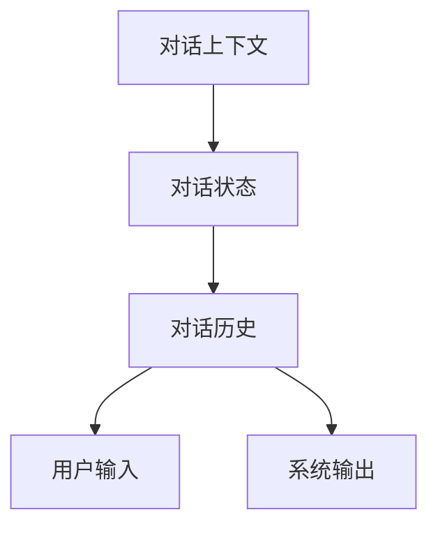
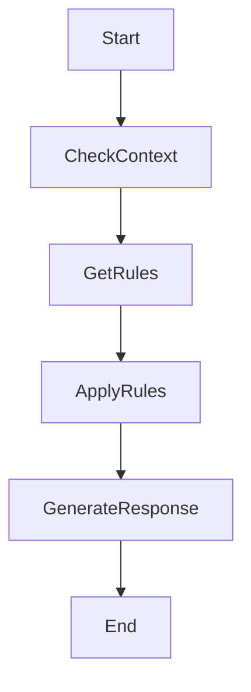
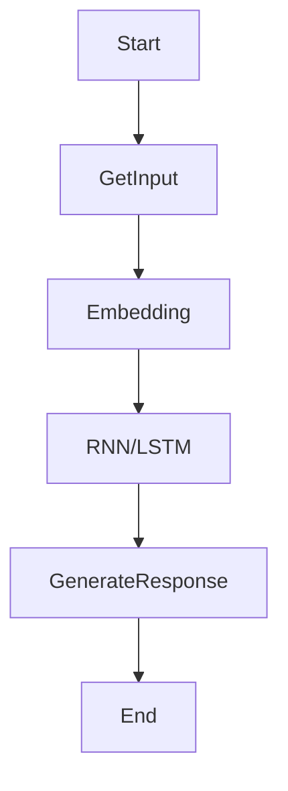
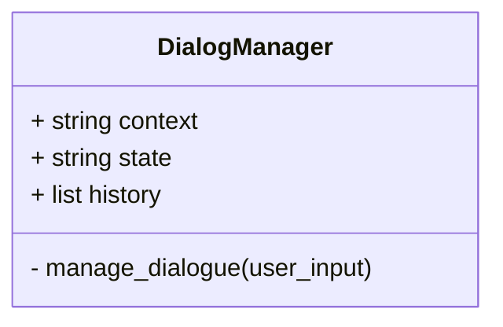
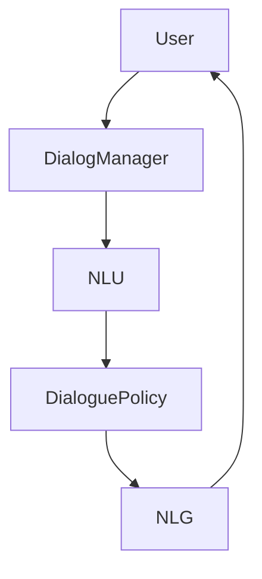

                 


# 多轮对话管理：提升AI Agent的交互体验

## 关键词：多轮对话管理、AI Agent、交互体验、自然语言处理、对话系统

## 摘要：  
多轮对话管理是实现高效、自然人机交互的核心技术，本文从基础概念、算法原理、系统架构到实际应用，全面解析多轮对话管理的实现方法，探讨如何通过优化对话流程和提升用户体验，打造更加智能的AI Agent。

---

# 正文

## 第一部分：多轮对话管理基础

### 第1章：多轮对话管理概述

#### 1.1 多轮对话管理的定义与背景

##### 1.1.1 多轮对话的基本概念
多轮对话是指用户与AI Agent之间进行的连续、交互式的对话，每一轮对话之间需要保持上下文的一致性和逻辑性。例如，用户询问“明天北京的天气怎么样？”AI回答后，用户可能接着问“那上海呢？”，AI需要根据之前的对话历史理解上下文。

##### 1.1.2 多轮对话管理的背景与重要性
随着AI技术的快速发展，AI Agent（智能助手）的应用场景越来越广泛，如智能客服、智能音箱、自动驾驶等。然而，单轮对话只能处理简单的查询，无法应对复杂的场景。因此，多轮对话管理技术成为提升用户体验的关键。

##### 1.1.3 多轮对话管理的核心目标
- 提供自然、连贯的对话体验
- 理解并维护对话上下文
- 根据对话历史动态调整对话策略

#### 1.2 多轮对话管理的关键问题

##### 1.2.1 对话状态跟踪
对话状态是多轮对话管理的核心，它记录了当前对话的上下文信息，包括用户意图、对话历史等。例如，在客服系统中，用户可能需要多次确认订单信息，AI Agent需要跟踪这些信息以提供准确的服务。

##### 1.2.2 对话上下文管理
对话上下文是指当前对话中所有相关的上下文信息，包括用户的历史输入、系统的历史响应等。有效的上下文管理可以帮助AI Agent更好地理解用户需求。

##### 1.2.3 对话策略优化
对话策略决定了AI Agent在每一轮对话中的响应方式。优化对话策略可以提升对话的流畅性和用户满意度。

#### 1.3 多轮对话管理的应用场景

##### 1.3.1 智能客服系统
智能客服系统通过多轮对话管理技术，能够理解用户的问题，并根据历史对话提供准确的解决方案。

##### 1.3.2 智能助手（如Siri、Alexa）
智能助手通过多轮对话管理技术，能够与用户进行自然的交互，完成复杂任务。

##### 1.3.3 游戏AI对话系统
在游戏场景中，多轮对话管理可以帮助AI角色与玩家进行更自然的互动，提升游戏体验。

### 第2章：多轮对话管理的核心概念与联系

#### 2.1 对话管理的核心概念

##### 2.1.1 对话上下文
对话上下文是指当前对话中所有相关的上下文信息，包括用户的历史输入、系统的历史响应等。例如，在用户问“我今天没时间，改天可以吗？”时，系统需要记录用户的时间偏好。

##### 2.1.2 对话状态
对话状态是多轮对话管理的核心，记录了当前对话的上下文信息，包括用户意图、对话历史等。例如，在用户问“我需要预订一张去北京的机票”，系统需要记录用户的需求、出发地、目的地等信息。

##### 2.1.3 对话历史
对话历史是指对话过程中所有历史的输入和输出信息。例如，用户问“今天北京的天气怎么样？”，系统回答“晴，25℃”，然后用户问“那明天呢？”，系统需要根据对话历史提供明天的天气信息。

#### 2.2 关键概念的属性特征对比

| 概念      | 属性特征 |
|-----------|----------|
| 对话上下文 | 当前对话的背景信息、用户意图 |
| 对话状态   | 当前对话的上下文信息 |
| 对话历史   | 所有历史对话的记录 |

#### 2.3 实体关系图（ER图）



---

## 第二部分：多轮对话管理的算法原理

### 第3章：基于规则的对话管理算法

#### 3.1 基于规则的对话管理原理

##### 3.1.1 基于规则的对话管理流程



##### 3.1.2 基于规则的对话管理示例

```python
def manage_dialogue(user_input, context):
    # 状态转移矩阵
    transition_matrix = {
        "intent": ["weather", "book"],
        "context": ["temperature", "date"]
    }
    # 根据规则生成响应
    if user_input == "天气":
        return "当前天气晴朗，25℃"
    elif user_input == "预订":
        return "请问您需要预订什么时间的机票？"
    else:
        return "抱歉，我暂时无法理解您的问题。"
```

##### 3.1.3 基于规则的对话管理的数学模型

$$ 状态转移概率 = \sum_{i=1}^{n} P(state_i | input_i) $$

### 第4章：基于深度学习的对话管理算法

#### 4.1 基于深度学习的对话管理原理

##### 4.1.1 基于深度学习的对话管理流程



##### 4.1.2 基于深度学习的对话管理示例

```python
import tensorflow as tf

model = tf.keras.Sequential([
    tf.keras.layers.Embedding(input_dim=1000, output_dim=64),
    tf.keras.layers.LSTM(128),
    tf.keras.layers.Dense(50, activation='relu'),
    tf.keras.layers.Dense(10, activation='softmax')
])

loss = tf.keras.losses.SparseCategoricalCrossentropy()
optimizer = tf.keras.optimizers.Adam()
model.compile(loss=loss, optimizer=optimizer, metrics=['accuracy'])
```

##### 4.1.3 基于深度学习的对话管理的数学模型

$$ P(y_t|x_1, x_2, ..., x_t) = \prod_{t=1}^{T} P(y_t|y_{t-1}, x_1, x_2, ..., x_t) $$

---

## 第三部分：系统分析与架构设计

### 第5章：对话管理系统的架构设计

#### 5.1 问题场景介绍

##### 5.1.1 项目介绍
本项目旨在设计一个智能客服对话系统，实现多轮对话管理功能，提升用户体验。

##### 5.1.2 系统功能设计



##### 5.1.3 系统架构设计



---

## 第四部分：项目实战

### 第6章：智能客服对话系统实现

#### 6.1 环境安装

##### 6.1.1 安装必要的库
```bash
pip install numpy
pip install tensorflow
pip install mermaid
```

#### 6.2 系统核心实现源代码

##### 6.2.1 对话管理器实现

```python
class DialogManager:
    def __init__(self):
        self.context = ""
        self.state = ""
        self.history = []

    def manage_dialogue(self, user_input):
        # 处理用户输入
        # 更新上下文和状态
        self.context = user_input
        self.history.append(user_input)
        # 返回响应
        return self.generate_response()

    def generate_response(self):
        # 根据上下文生成响应
        return "您好，请问有什么可以帮助您的？"
```

#### 6.3 代码应用解读与分析

##### 6.3.1 代码结构分析
对话管理器类`DialogManager`包含上下文、状态和历史记录，方法`manage_dialogue`处理用户输入，`generate_response`生成响应。

##### 6.3.2 代码功能实现
通过对话管理器类，实现对多轮对话的管理，维护对话上下文和历史记录，生成适当的响应。

#### 6.4 实际案例分析

##### 6.4.1 案例分析
用户与AI Agent的对话流程：

1. 用户：我需要帮助。
2. 系统：请问您需要什么帮助？
3. 用户：我遇到了一个问题。
4. 系统：请问是什么问题？

##### 6.4.2 对话流程解读
对话管理器根据用户输入和历史记录生成适当的响应，确保对话的连贯性和自然性。

#### 6.5 项目小结
通过实现智能客服对话系统，我们能够理解多轮对话管理的核心流程和实现方法，为后续的优化和改进打下基础。

---

## 第五部分：总结与展望

### 第7章：总结与展望

#### 7.1 本章总结
本文从基础概念、算法原理到系统架构和项目实战，全面解析了多轮对话管理的实现方法。通过对对话管理器的设计与实现，我们能够理解如何提升AI Agent的交互体验。

#### 7.2 对话系统的未来发展方向
- 更加智能化的对话管理算法
- 结合领域知识的对话优化
- 多模态对话系统的研发

---

## 附录

### 附录A：工具与参考资料

#### A.1 参考资料
- 《自然语言处理入门》
- 《深度学习与对话系统》

#### A.2 开发工具
- Python
- TensorFlow
- Mermaid

---

## 作者：AI天才研究院/AI Genius Institute & 禅与计算机程序设计艺术 /Zen And The Art of Computer Programming

---

通过本文的详细分析和实际案例，我们能够理解多轮对话管理的核心技术和实现方法，为提升AI Agent的交互体验提供了理论基础和实践指导。

