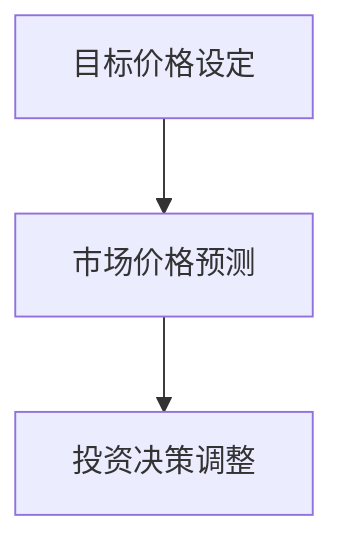

                 


# 大卫·德雷曼的反向定价：从目标价格倒推投资决策

## 关键词：
反向定价、大卫·德雷曼、投资决策、目标价格、定价模型、投资策略、市场分析

## 摘要：
大卫·德雷曼的反向定价是一种基于目标价格的定价方法，通过从目标价格倒推投资决策，帮助投资者优化投资组合和风险管理。本文从反向定价的核心概念、数学模型、算法实现、系统架构设计、项目实战等多方面进行详细讲解，并通过实际案例分析，深入剖析反向定价的应用场景和实际效果。文章内容丰富，结构清晰，旨在为投资者和金融专业人士提供有价值的参考和指导。

---

## 第一部分：引言

## 第1章：反向定价概述

### 1.1 什么是反向定价
反向定价（Reverse Pricing）是一种从目标价格出发，倒推投资决策的定价方法。与传统的从成本或市场需求出发的定价方法不同，反向定价强调以目标价格为核心，通过分析市场价格波动和投资目标，制定相应的投资策略。

#### 1.1.1 反向定价的定义
反向定价是一种基于目标价格的定价方法，通过设定一个目标价格，结合市场价格的波动情况，倒推投资决策，优化投资组合和风险管理。

#### 1.1.2 反向定价的核心思想
反向定价的核心思想是：通过设定一个合理的目标价格，结合市场价格的波动，调整投资策略，以实现投资目标的最大化。

#### 1.1.3 反向定价与传统定价方法的区别
传统的定价方法通常是从成本或市场需求出发，而反向定价则是从目标价格出发，强调价格波动对投资决策的影响。

### 1.2 反向定价的背景与重要性
在现代投资市场中，价格波动是不可避免的。反向定价通过设定目标价格，帮助投资者在价格波动中找到最优的投资策略。

#### 1.2.1 投资决策中的定价问题
投资决策中的定价问题通常涉及市场预测和风险管理。反向定价通过设定目标价格，帮助投资者在价格波动中找到最优的投资策略。

#### 1.2.2 反向定价在投资决策中的作用
反向定价在投资决策中的作用是通过设定目标价格，优化投资组合，降低风险，提高收益。

#### 1.2.3 反向定价的实际应用场景
反向定价的实际应用场景包括股票投资、风险管理、组合优化等。

---

## 第2章：大卫·德雷曼的反向定价理论

### 2.1 大卫·德雷曼的简介
大卫·德雷曼（David Dreman）是美国著名投资专家，他在反向定价理论方面有着深厚的造诣。

#### 2.1.1 大卫·德雷曼的学术背景
大卫·德雷曼是金融学领域的权威专家，他的研究成果广泛应用于投资领域。

#### 2.1.2 大卫·德雷曼在投资领域的贡献
大卫·德雷曼在反向定价理论方面的贡献，为投资决策提供了新的视角和方法。

### 2.2 反向定价的核心理念
反向定价的核心理念是通过设定目标价格，倒推投资决策。

#### 2.2.1 从目标价格倒推投资决策
从目标价格出发，分析市场价格的波动，制定相应的投资策略。

#### 2.2.2 反向定价的逻辑框架
反向定价的逻辑框架包括目标价格的设定、市场价格的预测、投资决策的调整等步骤。

#### 2.2.3 反向定价与市场效率的关系
反向定价与市场效率密切相关，市场价格的波动会影响目标价格的实现。

---

## 第3章：反向定价的核心概念与联系

### 3.1 反向定价的核心要素
反向定价的核心要素包括目标价格、市场价格、投资决策等。

#### 3.1.1 目标价格的确定
目标价格的确定是反向定价的核心步骤，通常基于投资目标和市场分析。

#### 3.1.2 市场价格的波动
市场价格的波动是反向定价的重要输入，分析市场价格波动对投资决策的影响。

#### 3.1.3 投资决策的调整
根据目标价格和市场价格的波动，调整投资策略，优化投资组合。

### 3.2 反向定价的原理与数学模型
反向定价的原理和数学模型是理解其核心机制的关键。

#### 3.2.1 反向定价的数学公式
反向定价的数学公式包括目标价格计算公式、市场价格预测公式等。

#### 3.2.2 目标价格与市场价格的关系
目标价格与市场价格的关系是反向定价的核心分析内容。

#### 3.2.3 投资决策的调整策略
根据目标价格和市场价格的关系，制定相应的投资决策调整策略。

---

## 第4章：反向定价的算法原理

### 4.1 反向定价的算法概述
反向定价的算法概述包括算法的基本流程、核心步骤和实现方法。

#### 4.1.1 算法的基本流程
目标价格设定、市场价格预测、投资决策调整。

#### 4.1.2 算法的核心步骤
设定目标价格、分析市场价格波动、调整投资策略。

#### 4.1.3 算法的实现方法
通过数学模型和算法实现目标价格的设定和市场价格的预测。

### 4.2 反向定价的数学模型与公式
反向定价的数学模型与公式是其理论基础的核心内容。

#### 4.2.1 目标价格计算公式
$$目标价格 = f(市场分析, 投资目标)$$

#### 4.2.2 市场价格预测公式
$$市场价格预测 = f(历史数据, 市场趋势)$$

#### 4.2.3 投资决策调整公式
$$投资决策调整 = f(目标价格, 市场价格预测)$$

---

## 第5章：反向定价的系统分析与架构设计

### 5.1 系统分析
反向定价的系统分析包括问题场景介绍、系统功能需求和系统性能需求。

#### 5.1.1 问题场景介绍
投资决策中的定价问题，目标价格的设定和市场价格的预测。

#### 5.1.2 系统功能需求
目标价格设定、市场价格预测、投资决策调整。

#### 5.1.3 系统性能需求
高精度的市场价格预测、高效的算法实现。

### 5.2 系统架构设计
反向定价的系统架构设计包括系统架构图、系统功能模块设计和系统接口设计。

#### 5.2.1 系统架构图（Mermaid）


#### 5.2.2 系统功能模块设计
目标价格设定模块、市场价格预测模块、投资决策调整模块。

#### 5.2.3 系统接口设计
API接口设计，模块之间的数据交互。

---

## 第6章：反向定价的项目实战

### 6.1 项目环境安装
反向定价的项目实战需要安装必要的软件和环境。

#### 6.1.1 系统环境要求
Python 3.8及以上版本，安装必要的库。

#### 6.1.2 软件安装与配置
安装numpy、pandas、scikit-learn等库。

#### 6.1.3 环境配置
设置项目路径，配置环境变量。

### 6.2 项目核心实现

#### 6.2.1 核心代码实现
```python
import numpy as np
import pandas as pd
from sklearn.linear_model import LinearRegression

# 数据加载
data = pd.read_csv('market_data.csv')

# 目标价格设定
target_price = 100

# 市场价格预测
model = LinearRegression()
model.fit(data[['feature1', 'feature2']], data['price'])
predicted_price = model.predict([[feature1_value, feature2_value]])

# 投资决策调整
if predicted_price > target_price:
    print("卖出")
else:
    print("买入")
```

#### 6.2.2 代码解读与分析
解释代码的功能，分析其如何实现反向定价的核心逻辑。

### 6.3 项目实战案例分析
通过具体案例分析反向定价的应用效果。

#### 6.3.1 案例背景
假设市场数据和目标价格设定。

#### 6.3.2 数据分析与预测
使用模型预测市场价格。

#### 6.3.3 投资决策调整
根据预测结果调整投资策略。

#### 6.3.4 结果分析
分析预测结果与实际市场的吻合程度，评估反向定价的效果。

---

## 第7章：反向定价的总结与展望

### 7.1 总结
反向定价作为一种新兴的定价方法，为投资决策提供了新的视角和方法。

#### 7.1.1 核心内容回顾
总结反向定价的核心概念、算法原理和系统设计。

#### 7.1.2 重要性与意义
强调反向定价在投资决策中的重要性和实际意义。

### 7.2 未来展望
反向定价的未来发展和潜在应用。

#### 7.2.1 研究方向
进一步优化反向定价的数学模型和算法。

#### 7.2.2 技术发展趋势
结合人工智能和大数据技术，提升反向定价的预测精度和效率。

---

## 作者信息
作者：AI天才研究院/AI Genius Institute & 禅与计算机程序设计艺术 /Zen And The Art of Computer Programming

