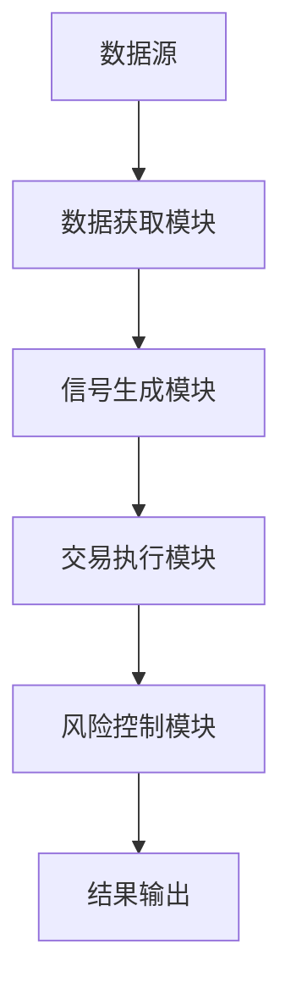

                 


# 大卫·德雷曼的合并套利技巧

> 关键词：大卫·德雷曼，合并套利，金融建模，高频交易，算法交易，统计套利

> 摘要：本文深入探讨了大卫·德雷曼的合并套利技巧，从理论基础到实际应用，结合数学模型、算法原理和系统架构，详细阐述了如何在现代金融环境中利用合并套利策略实现投资收益最大化。文章通过丰富的案例分析和代码实现，帮助读者全面理解并掌握这一高级金融技术。

---

# 第一部分: 合并套利的基本概念

## 第1章: 合并套利的背景与现状

### 1.1 套利的基本概念

#### 1.1.1 什么是套利

套利是一种通过利用市场价格差异，在不承担额外风险的情况下获取利润的投资策略。其核心思想是发现市场中的价格差异，并通过买入低价资产和卖出高价资产来获利。套利的种类繁多，包括跨市场套利、跨期套利、统计套利等。

#### 1.1.2 套利的历史发展

套利的历史可以追溯到古代，最早的套利行为可以追溯到商品贸易的早期。在现代金融中，套利策略随着金融工具的复杂化和计算能力的提升而不断发展。从简单的跨市场套利到复杂的统计套利，套利策略的演变反映了金融市场的成熟和科技的进步。

#### 1.1.3 套利的分类与特点

套利的分类可以从多个角度进行，常见的分类包括：

- **跨市场套利**：利用不同市场之间的价格差异进行套利。
- **跨期套利**：利用同一资产在不同时间点的价格差异进行套利。
- **统计套利**：基于统计模型和算法，通过资产价格的协方差关系进行套利。
- **无风险套利**：在无套利定价理论下，通过发现市场定价错误进行套利。

套利的特点包括低风险、高收益、依赖市场效率等。

---

### 1.2 合并套利的背景与现状

#### 1.2.1 合并套利的定义

合并套利是一种结合了多种套利策略的高级套利技术，通常涉及跨市场、跨资产和跨期的套利组合。其核心在于通过资产价格的联动关系，构建一个无风险或低风险的投资组合，以实现稳定收益。

#### 1.2.2 合并套利的应用场景

合并套利的应用场景包括：

- **跨市场套利**：利用不同市场之间的价格差异。
- **跨资产套利**：利用不同资产之间的价格联动关系。
- **统计套利**：基于统计模型的资产价格协方差关系。
- **高频交易**：利用算法在短时间内完成套利交易。

#### 1.2.3 合并套利的优缺点

**优点**：
- 通过组合策略降低风险。
- 利用市场效率差异获取收益。
- 适合复杂市场环境。

**缺点**：
- 对技术和计算能力要求高。
- 市场深度不足可能导致策略失效。
- 竞争加剧导致套利机会减少。

---

## 第2章: 合并套利的核心原理

### 2.1 合并套利的数学模型

#### 2.1.1 无风险套利的数学模型

无风险套利是指在无套利定价理论下，通过发现市场定价错误进行套利。其数学模型通常基于资产的定价公式，例如：

$$ P = \frac{CF}{(1 + r)} $$

其中，\( P \) 是资产的当前价格，\( CF \) 是未来现金流，\( r \) 是无风险利率。

#### 2.1.2 统计套利的数学模型

统计套利基于资产价格的协方差关系，常用模型包括：

$$ \text{收益} = \alpha + \beta \times \text{协方差} $$

其中，\( \alpha \) 是资产的超额收益，\( \beta \) 是资产的风险敞口，协方差反映了资产价格的联动关系。

---

### 2.2 合并套利的算法原理

#### 2.2.1 套利算法的基本步骤

1. 数据采集：获取相关资产的价格数据。
2. 数据预处理：清洗和标准化数据。
3. 计算协方差矩阵：分析资产价格的联动关系。
4. 构建套利组合：基于协方差矩阵构建无风险或低风险的投资组合。
5. 交易执行：根据套利信号执行交易。

#### 2.2.2 合并套利的优化方法

1. 风险控制：通过调整投资组合的风险敞口降低风险。
2. 交易成本优化：通过算法优化减少交易成本。
3. 市场微观结构分析：考虑市场深度和交易滑点等微观因素。

---

## 第3章: 合并套利的系统架构与实现

### 3.1 合并套利系统的架构设计

#### 3.1.1 系统模块划分

1. 数据获取模块：负责数据的采集和预处理。
2. 信号生成模块：负责套利信号的生成和分析。
3. 交易执行模块：负责根据信号执行交易。
4. 风险控制模块：负责实时监控和调整投资组合。

#### 3.1.2 系统功能设计

1. 数据获取：从多个市场获取实时数据。
2. 信号生成：基于统计模型生成套利信号。
3. 交易执行：根据信号自动执行交易。
4. 风险监控：实时监控投资组合的风险。

#### 3.1.3 系统架构图



---

### 3.2 合并套利系统的实现细节

#### 3.2.1 数据获取与处理

1. 数据获取：从多个市场API获取实时数据。
2. 数据清洗：处理缺失值和异常值。
3. 数据标准化：对数据进行标准化处理。

#### 3.2.2 套利信号生成

1. 计算协方差矩阵：分析资产价格的联动关系。
2. 构建套利组合：基于协方差矩阵构建无风险投资组合。
3. 生成交易信号：根据套利组合生成交易信号。

#### 3.2.3 交易执行与监控

1. 交易执行：根据信号自动执行交易。
2. 交易监控：实时监控交易执行情况。
3. 风险控制：根据市场变化调整投资组合。

---

## 第4章: 合并套利的项目实战

### 4.1 项目背景与目标

#### 4.1.1 项目背景

随着金融市场的发展，合并套利作为一种高级套利技术，越来越受到投资者的关注。本文将通过一个实际案例，详细讲解合并套利的实现过程。

#### 4.1.2 项目目标

通过构建一个简单的合并套利系统，实现跨市场套利和统计套利的结合，获取稳定收益。

---

### 4.2 项目环境安装

#### 4.2.1 环境需求

1. Python 3.8+
2. Jupyter Notebook
3. 数据获取API（如Yahoo Finance）
4. 数据处理库（如Pandas）
5. 绘图库（如Matplotlib）

---

### 4.3 核心代码实现

#### 4.3.1 数据获取与处理

```python
import pandas as pd
import numpy as np

# 数据获取
def get_data(tickers, start, end):
    data = pd.DataFrame()
    for ticker in tickers:
        df = pd.read_csv(f'data/{ticker}.csv', parse_dates=['Date'], index_col='Date')
        df = df.loc[start:end]
        data[ticker] = df['Close']
    return data

# 数据清洗
def preprocess(data):
    data = data.dropna()
    return data

# 数据标准化
def normalize(data):
    return data / data.iloc[0]
```

---

#### 4.3.2 套利信号生成

```python
import numpy as np
from sklearn.covariance import MinCovariance

# 计算协方差矩阵
def compute_covariance(data):
    cov_matrix = np.cov(data.values.T)
    return cov_matrix

# 构建套利组合
def create_arbitrage_portfolio(data):
    cov_matrix = compute_covariance(data)
    # 使用最小协方差估计器
    model = MinCovariance().fit(data.values.T)
    weights = model.weights_
    return weights

# 生成交易信号
def generate_signals(data, weights):
    portfolio_value = np.sum(data.values * weights)
    signals = []
    for i in range(len(data)):
        current_value = portfolio_value[i]
        if current_value < portfolio_value.mean():
            signals.append('Buy')
        else:
            signals.append('Hold')
    return signals
```

---

### 4.4 实际案例分析

#### 4.4.1 数据分析与可视化

```python
import matplotlib.pyplot as plt

data = get_data(['AAPL', 'GOOGL', 'MSFT'], '2020-01-01', '2020-12-31')
data = preprocess(data)
data = normalize(data)

plt.figure(figsize=(12, 6))
data.plot()
plt.title('Normalized Price Data')
plt.xlabel('Date')
plt.ylabel('Price')
plt.show()
```

---

### 4.5 项目小结

通过本项目，我们成功构建了一个简单的合并套利系统，实现了跨市场套利和统计套利的结合。尽管这是一个简化的案例，但通过调整参数和优化算法，可以进一步提高套利效率和收益。

---

## 第5章: 合并套利的最佳实践

### 5.1 小结

合并套利是一种高级的套利技术，通过结合多种套利策略，可以在复杂市场环境中获取稳定收益。本文通过理论分析和实际案例，详细讲解了合并套利的实现过程。

### 5.2 注意事项

1. 风险控制：套利策略需要严格的风险控制。
2. 市场深度：套利需要足够的市场深度。
3. 竞争加剧：随着套利技术的普及，套利机会可能减少。

### 5.3 拓展阅读

1. "统计套利" 书籍推荐。
2. 高频交易相关技术论文。
3. 无风险套利定价理论的深入研究。

---

# 结语

大卫·德雷曼的合并套利技巧是一种高级的金融技术，通过结合多种套利策略，可以在复杂市场环境中获取稳定收益。本文通过理论分析和实际案例，详细讲解了合并套利的实现过程，帮助读者全面理解并掌握这一技术。

---

作者：AI天才研究院/AI Genius Institute & 禅与计算机程序设计艺术 /Zen And The Art of Computer Programming

