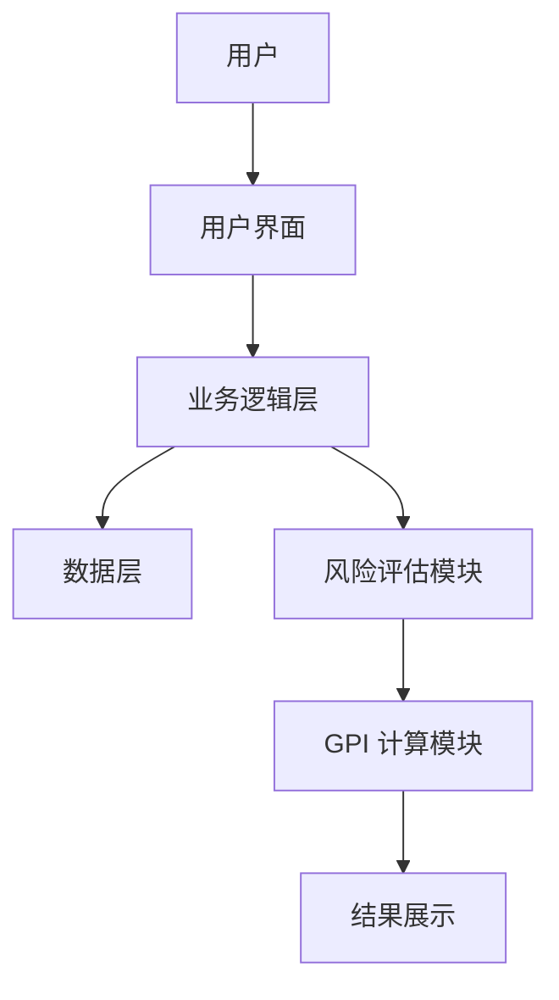

                 


# 大卫·德雷曼的地缘政治因素投资分析

> 关键词：大卫·德雷曼、地缘政治、投资分析、风险评估、模型构建、量化分析

> 摘要：地缘政治因素对投资决策的影响日益显著，本文通过分析大卫·德雷曼的地缘政治投资理论，构建地缘政治风险评估模型，并结合实际案例，探讨如何将地缘政治因素纳入投资分析框架，优化投资决策。

---

## 第一部分：地缘政治因素与投资分析的背景介绍

### 第1章：地缘政治因素的定义与核心概念

#### 1.1 地缘政治的基本概念
- **1.1.1 地缘政治的定义**  
  地缘政治是指地理位置、资源分布、政治结构和国际关系等因素的综合影响，研究国家间竞争与合作的规律。

- **1.1.2 地缘政治的核心要素**  
  - 国家利益：主权、安全、经济资源。
  - 地理位置：领土、边界、资源分布。
  - 国际关系：盟友、对手、冲突与合作。

- **1.1.3 地缘政治与投资分析的关系**  
  地缘政治事件（如战争、制裁、贸易摩擦）直接影响市场、资产价格和经济政策。

#### 1.2 地缘政治因素对投资的影响
- **1.2.1 地缘政治风险的类型**  
  - 政治风险：政策变化、政权更迭。
  - 经济风险：贸易制裁、资源枯竭。
  - 军事冲突：战争、恐怖主义。

- **1.2.2 地缘政治事件对市场的冲击**  
  - 股票市场：波动性增加，行业风险上升。
  - 债券市场：主权债务风险上升，债券收益率波动。
  - 外汇市场：汇率短期剧烈波动。

- **1.2.3 地缘政治与资产价格波动**  
  - 短期冲击：地缘政治事件引发市场恐慌。
  - 长期影响：政策调整、供应链重构。

### 第2章：地缘政治与投资分析的关联性

#### 2.1 地缘政治风险的量化
- **2.1.1 地缘政治风险的评估指标**  
  - 风险指数：综合多个因素量化风险。
  - 波动率：资产价格波动性。

- **2.1.2 地缘政治风险的分类**  
  - 国家层面：主权风险。
  - 区域层面：地区冲突。
  - 全球层面：全球经济政策。

- **2.1.3 地缘政治与投资决策的关系**  
  投资者需要通过地缘政治分析优化资产配置，降低风险。

#### 2.2 地缘政治事件的历史案例分析
- **2.2.1 美国制裁俄罗斯的经济影响**  
  - 俄罗斯经济衰退，美元资产转移。
  - 油价波动，能源市场受冲击。

- **2.2.2 中东地缘政治冲突对油价的影响**  
  - 供给减少，油价上涨。
  - 石油公司股价波动。

- **2.2.3 美中贸易摩擦对全球市场的冲击**  
  - 供应链中断，企业利润下降。
  - 全球化受阻，经济增速放缓。

---

## 第二部分：地缘政治因素投资分析的核心概念与联系

### 第3章：地缘政治因素对不同资产类别的影响

#### 3.1 股票市场的地缘政治风险
- **3.1.1 地缘政治事件对股市波动的影响**  
  - 事件发生前，投资者情绪趋于谨慎。
  - 事件后，市场波动性显著增加。

- **3.1.2 行业风险的地理分布**  
  - 能源行业受地缘政治影响最大。
  - 军工行业在冲突中受益。

- **3.1.3 地缘政治对上市公司业绩的影响**  
  - 供应链中断导致成本上升。
  - 政治制裁导致海外市场受限。

#### 3.2 债券市场的地缘政治风险
- **3.2.1 国家主权债务风险与地缘政治**  
  - 地缘政治冲突增加主权违约风险。
  - 债券评级下调影响市场信心。

- **3.2.2 地缘政治对债券评级的影响**  
  - 冲突国家的债券评级下降。
  - 非冲突国家的债券评级可能上升。

- **3.2.3 地缘政治对债券收益率的影响**  
  - 冲突国家债券收益率上升。
  - 全球债券市场收益率联动。

#### 3.3 外汇市场的地缘政治风险
- **3.3.1 地缘政治事件对外汇波动的影响**  
  - 短期波动：事件发生后汇率剧烈波动。
  - 长期影响：市场对地缘政治的预期影响汇率走势。

- **3.3.2 主要货币的地缘政治风险分析**  
  - 美元：全球避险货币，地缘政治事件中表现稳定。
  - 欧元：受欧洲地缘政治影响较大。
  - 人民币：受中美关系影响显著。

- **3.3.3 地缘政治对汇率预测的影响**  
  - 汇率预测模型需纳入地缘政治因素。
  - 事件发生前，市场预期影响汇率走势。

---

## 第三部分：地缘政治因素投资分析的数学模型与算法

### 第4章：地缘政治风险的评估模型

#### 4.1 地缘政治风险的评估框架
- **4.1.1 风险评估的层次分析**  
  - 确定目标层（投资风险）、准则层（地缘政治因素）、方案层（资产选择）。
  - 使用AHP（层次分析法）计算各因素的权重。

- **4.1.2 风险评估的关键指标**  
  - 冲突强度：战争、制裁的严重程度。
  - 经济影响：GDP增速、失业率。
  - 市场反应：资产价格波动率。

- **4.1.3 风险评估的权重分配**  
  - 根据地缘政治事件的历史数据，计算各因素的权重。

#### 4.2 地缘政治风险的量化方法
- **4.2.1 风险指数的构建**  
  - 通过加权平均法计算地缘政治风险指数（ GPI ）。

- **4.2.2 风险指数的计算公式**  
  $$ GPI = \sum_{i=1}^{n} w_i \cdot f_i $$
  其中，$w_i$ 是第 $i$ 个因素的权重，$f_i$ 是第 $i$ 个因素的指标值。

- **4.2.3 风险指数的验证与优化**  
  - 使用历史数据验证模型准确性。
  - 根据新数据优化权重分配。

---

## 第四部分：地缘政治因素投资分析的系统架构与实现

### 第5章：地缘政治风险评估系统的架构设计

#### 5.1 系统功能设计
- **5.1.1 功能模块**  
  - 数据采集：收集地缘政治事件数据。
  - 风险评估：计算 GPI。
  - 投资建议：生成投资策略。

- **5.1.2 系统架构**  
  - 数据层：存储历史数据和实时数据。
  - 业务逻辑层：处理数据，计算 GPI。
  - 用户界面层：展示结果，提供投资建议。

#### 5.2 系统架构图


#### 5.3 系统接口设计
- **API 接口**  
  - GET 请求获取 GPI 数据。
  - POST 请求提交投资需求。

---

## 第五部分：地缘政治因素投资分析的项目实战

### 第6章：地缘政治风险评估系统的实现

#### 6.1 项目环境安装
- **6.1.1 Python 环境**  
  - 安装 Python 3.8+。
  - 安装依赖：numpy、pandas、scipy。

#### 6.2 系统核心实现
- **6.2.1 数据采集**  
  - 使用爬虫获取地缘政治事件数据。
  - 数据清洗与预处理。

- **6.2.2 风险评估模型实现**  
  - 编写 Python 代码实现 GPI 计算。
  - 使用层次分析法计算权重。

#### 6.3 代码示例
```python
import numpy as np
import pandas as pd

# 示例数据
data = {
    '国家': ['A', 'B', 'C'],
    '冲突强度': [0.8, 0.5, 0.7],
    '经济影响': [0.6, 0.4, 0.5],
    '市场反应': [0.7, 0.3, 0.6]
}

df = pd.DataFrame(data)

# 计算 GPI
weights = [0.4, 0.3, 0.3]  # 冲突强度、经济影响、市场反应的权重
gpi = np.dot(df[['冲突强度', '经济影响', '市场反应']].values, weights)

print(gpi)
```

---

## 第六部分：地缘政治因素投资分析的最佳实践

### 第7章：地缘政治因素投资分析的总结与展望

#### 7.1 小结
- 地缘政治因素对投资决策的影响不容忽视。
- 通过构建风险评估模型，投资者可以更好地应对地缘政治风险。

#### 7.2 注意事项
- 数据的准确性和及时性至关重要。
- 模型需要不断优化和更新。

#### 7.3 拓展阅读
- 推荐阅读大卫·德雷曼的相关著作，深入了解地缘政治与投资的关系。

---

## 作者：AI天才研究院/AI Genius Institute & 禅与计算机程序设计艺术 /Zen And The Art of Computer Programming

