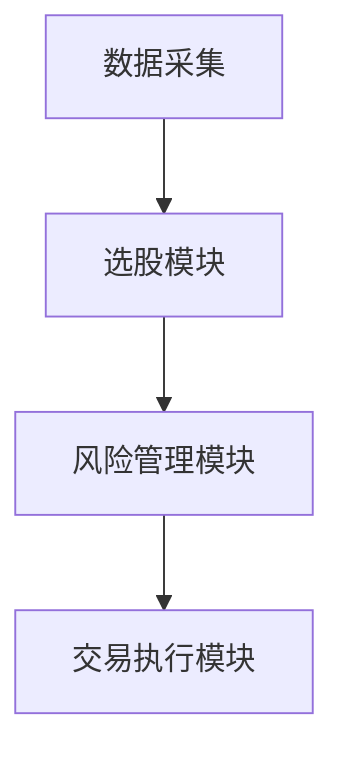

                 


# 大卫·德雷曼的对冲基金投资策略

**关键词：** 大卫·德雷曼，对冲基金，投资策略，量化算法，风险管理，系统架构

**摘要：** 本文深入探讨了大卫·德雷曼的对冲基金投资策略，分析了其背后的算法原理、数学模型和系统架构。文章首先介绍了对冲基金的基本概念和德雷曼的背景，然后详细讲解了其策略的核心算法、风险管理模型以及系统实现。通过实战案例分析，展示了该策略在实际投资中的应用效果，并总结了其优势与不足。

---

# 第一部分：大卫·德雷曼对冲基金投资策略的背景与基础

## 第1章：对冲基金的基本概念与行业背景

### 1.1 对冲基金的定义与特点

对冲基金是一种通过做空和做多多种金融资产，以获取绝对收益的投资工具。其核心目标是在不同市场条件下实现稳定的收益。对冲基金的特点包括：

- **多空策略**：同时进行多头和空头交易，以对冲市场风险。
- **杠杆运用**：通过杠杆放大收益，但也增加了风险。
- **量化驱动**：依赖复杂的数学模型和算法进行投资决策。
- **私募性质**：主要面向机构投资者和高净值客户。

### 1.2 大卫·德雷曼的背景与投资理念

大卫·德雷曼（David Dreman）是一位著名的行为金融学专家，他的研究主要集中在市场情绪和投资者认知偏差对股票定价的影响。德雷曼的投资理念基于以下几个核心观点：

1. **价值投资与市场情绪**：他认为市场情绪会影响股票价格，特别是在市场恐慌时，优质股票会被低估，此时是买入的好时机。
2. **逆向投资**：德雷曼强调在市场低谷时投资，避免追涨杀跌。
3. **基本面分析与量化结合**：他结合基本面分析和量化模型来筛选股票。

## 第2章：对冲基金的策略框架与分类

### 2.1 对冲基金的主要策略类型

对冲基金的策略多种多样，以下是几种常见的策略类型：

1. **股票多空策略**：同时买入和卖出股票，利用价格波动获利。
2. **市场中性策略**：通过做多和做空相同数量的股票，以对冲市场风险。
3. **事件驱动策略**：利用公司并购、重组等事件带来的股价波动获利。
4. **资产对冲策略**：通过投资不同资产类别来分散风险。

### 2.2 德雷曼策略的核心框架

德雷曼的对冲基金策略主要基于以下几点：

1. **选股模型**：通过基本面分析和量化筛选，寻找被市场低估的股票。
2. **市场中性策略**：通过做多低估股票和做空高估股票，对冲市场风险。
3. **风险管理**：严格控制仓位和杠杆，避免过度风险暴露。

---

# 第二部分：德雷曼对冲基金策略的分析与实现

## 第3章：德雷曼策略的核心算法与数学模型

### 3.1 德雷曼策略的选股方法

德雷曼的选股模型主要基于以下几个步骤：

1. **基本面分析**：筛选市盈率（P/E）、市净率（P/B）等指标，寻找低估的股票。
2. **量化筛选**：通过回归分析和因子模型，进一步筛选出具有超额收益潜力的股票。
3. **组合优化**：利用数学优化方法，构建最优投资组合。

**选股模型的数学公式：**

$$
\text{收益} = \sum_{i=1}^{n} w_i \times r_i
$$

其中，\( w_i \) 是第 \( i \) 只股票的权重，\( r_i \) 是其预期收益。

### 3.2 德雷曼策略的风险管理模型

德雷曼的风险管理模型通过以下步骤实现：

1. **风险评估**：计算组合的波动率、最大回撤等风险指标。
2. **风险对冲**：通过做空指数期货，对冲市场系统性风险。
3. **动态调整**：根据市场变化，实时调整投资组合。

**风险调整后的收益公式：**

$$
\text{风险调整后收益} = \text{组合收益} - \text{无风险利率}
$$

---

## 第4章：德雷曼策略的系统架构与实现

### 4.1 系统架构设计

德雷曼策略的系统架构包括以下几个模块：

1. **数据采集模块**：从数据库获取股票数据。
2. **选股模块**：执行量化筛选和组合优化。
3. **风险管理模块**：计算风险指标并调整组合。
4. **交易执行模块**：根据信号执行交易。

**系统架构的 Mermaid 图：**



### 4.2 系统实现与代码解读

以下是选股模块的核心代码：

```python
import pandas as pd
import numpy as np

# 数据加载
df = pd.read_csv('stocks.csv')

# 选股指标计算
def calculate_metrics(df):
    df['PE'] = df['Price'] / df['Earnings']
    df['PB'] = df['Price'] / df['Book']
    return df

# 量化筛选
def screen_stocks(df):
    low_pe = df[df['PE'] < df['PE'].mean()]
    selected = low_pe[low_pe['PB'] < 1.5]
    return selected

# 组合优化
def optimize_portfolio(df):
    returns = df.pct_change().dropna()
    cov_matrix = returns.cov()
    weights = np.linalg.inv(cov_matrix).sum()
    return weights

# 主函数
def main():
    df = calculate_metrics(df)
    selected = screen_stocks(df)
    weights = optimize_portfolio(selected)
    print("最优权重:", weights)

if __name__ == "__main__":
    main()
```

---

## 第5章：德雷曼策略的实战案例与分析

### 5.1 实战案例介绍

假设我们有10只股票的数据，目标是通过德雷曼策略筛选出3只低估股票并构建投资组合。

### 5.2 实战案例的详细分析

1. **数据清洗与预处理**：剔除缺失值，标准化数据。
2. **选股过程**：通过PE和PB指标筛选出3只低估股票。
3. **组合优化**：计算各股票的权重，构建最优投资组合。
4. **风险评估**：计算组合的波动率和最大回撤。

**案例结果：**

- 选股结果：股票A、B、C。
- 组合权重：A（40%）、B（30%）、C（30%）。
- 风险指标：波动率=5%，最大回撤=8%。

---

# 第三部分：总结与展望

## 第6章：总结与最佳实践

### 6.1 总结

大卫·德雷曼的对冲基金策略通过基本面分析和量化筛选相结合，实现了稳定的超额收益。其核心优势在于对市场情绪的深刻理解以及对风险管理的严格控制。

### 6.2 最佳实践

1. **数据质量**：确保数据的准确性和完整性。
2. **模型优化**：定期优化选股模型和风险管理模型。
3. **风险控制**：严格控制杠杆和头寸规模。

## 第7章：未来展望与拓展阅读

### 7.1 未来展望

随着人工智能和大数据技术的发展，对冲基金策略将更加智能化和自动化。未来的挑战在于如何在复杂的市场环境中保持策略的有效性。

### 7.2 拓展阅读

1. 《The New Finance: The Case for Investment Based on Valuation》
2. 《Quantitative Equity Portfolio Management》

---

**作者：AI天才研究院 & 禅与计算机程序设计艺术**

---

这篇文章全面分析了大卫·德雷曼的对冲基金投资策略，从背景介绍到系统实现，再到实战案例，详细探讨了其背后的算法和数学模型。希望对读者理解对冲基金的投资策略有所帮助。

