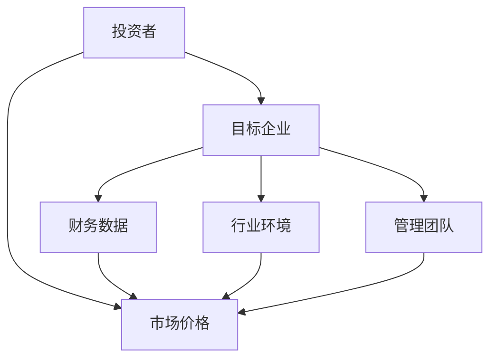
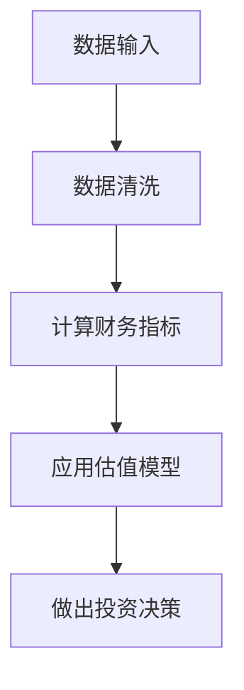
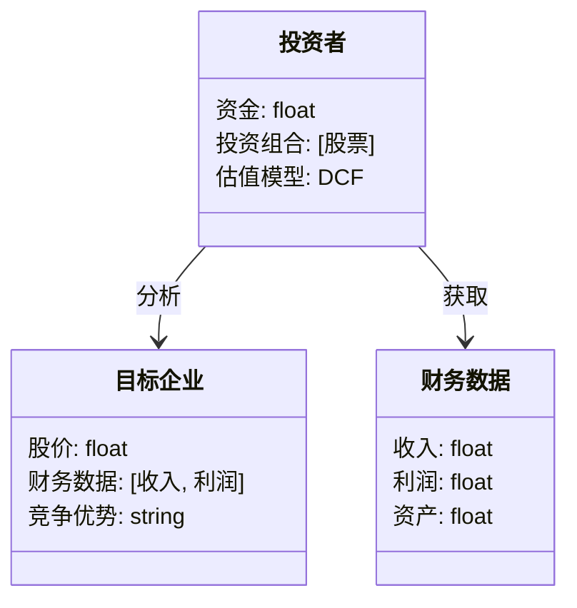
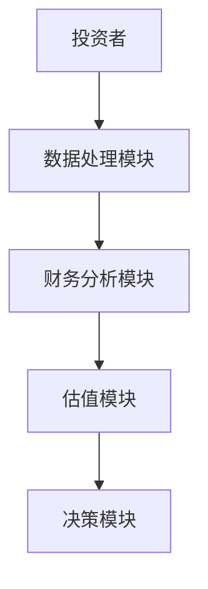

                 


# 大卫·德雷曼的特殊情况价值投资

## 关键词：
- 价值投资
- 特殊情况
- 逆向思维
- 投资策略
- 投资哲学
- 财务分析
- 投资决策

## 摘要：
本文深入探讨大卫·德雷曼的特殊情况价值投资策略，分析其核心理念、分析框架和算法原理，并通过实际案例展示其应用。内容涵盖价值投资的背景、核心概念、数学模型、系统架构、项目实战等，帮助读者全面理解德雷曼的投资哲学和策略。

---

# 第一部分: 价值投资的背景与核心理念

# 第1章: 价值投资的起源与发展

## 1.1 价值投资的定义与核心理念
- **1.1.1 价值投资的定义**：价值投资是一种以企业内在价值为导向的投资策略，强调以低于内在价值的价格买入优质资产。
- **1.1.2 价值投资的核心理念**：寻找市场低估的优质企业，长期持有，等待价格回归内在价值。
- **1.1.3 价值投资与其它投资策略的对比**：通过表格对比价值投资、成长投资和趋势投资的异同。

## 1.2 大卫·德雷曼的投资哲学
- **1.2.1 大卫·德雷曼的生平简介**：介绍德雷曼的背景及其在投资领域的影响力。
- **1.2.2 德雷曼的逆向思维投资理念**：强调在市场恐慌时寻找机会，逆向投资。
- **1.2.3 德雷曼投资策略的核心要素**：深入分析其策略中的关键点，如安全边际和竞争优势。

## 1.3 特殊情况下的价值投资
- **1.3.1 什么是特殊情况**：定义市场恐慌、经济危机等特殊情况。
- **1.3.2 特殊情况下的投资机会**：分析这些情况下可能存在的低价优质资产。
- **1.3.3 特殊情况下的投资风险**：探讨逆周期投资的风险管理和应对策略。

## 1.4 本章小结
总结价值投资的背景、德雷曼的投资哲学以及特殊情况下的投资策略。

---

# 第二部分: 价值投资的核心概念与分析框架

# 第2章: 价值投资的核心概念

## 2.1 价值投资的核心概念
- **2.1.1 企业的内在价值**：解释企业未来现金流的现值，强调其作为投资决策的基础。
- **2.1.2 市场价格与内在价值的差异**：分析市场价格波动与内在价值的关系。
- **2.1.3 安全边际的概念**：定义安全边际，解释其在投资中的重要性。

## 2.2 价值投资的分析框架
- **2.2.1 财务报表分析**：介绍如何通过财务报表评估企业价值。
- **2.2.2 行业分析与竞争优势**：分析企业所处行业和竞争优势。
- **2.2.3 管理团队评估**：探讨管理层能力对企业价值的影响。

## 2.3 价值投资的决策模型
- **2.3.1 多因子模型**：介绍多因子模型在投资决策中的应用。
- **2.3.2 估值模型**：解释常用的估值模型，如DCF模型。
- **2.3.3 风险评估模型**：探讨如何量化投资风险。

## 2.4 核心概念对比表
- 表2.1：价值投资与其他投资策略的对比，涵盖目标、方法、风险等方面。

## 2.5 实体关系图


## 2.6 本章小结
总结价值投资的核心概念及其在投资决策中的应用。

---

# 第三部分: 价值投资的算法原理与数学模型

# 第3章: 价值投资的算法原理

## 3.1 价值投资的算法流程
- **3.1.1 数据收集与清洗**：介绍如何收集和处理市场数据。
- **3.1.2 财务指标计算**：讲解关键财务指标的计算方法。
- **3.1.3 估值模型应用**：详细说明DCF模型等估值方法。
- **3.1.4 投资决策判断**：基于估值结果做出买入、持有或卖出的决策。

## 3.2 价值投资的数学模型
- **3.2.1 市盈率模型**：$$ P = \frac{E}{S} $$
- **3.2.2 市净率模型**：$$ P = \frac{B}{S} $$
- **3.2.3 股息率模型**：$$ D = \frac{C}{P} $$

## 3.3 算法流程图


## 3.4 本章小结
总结价值投资的算法流程及其数学模型的应用。

---

# 第四部分: 系统分析与架构设计

# 第4章: 系统分析与架构设计

## 4.1 系统功能设计
- **4.1.1 领域模型类图**：展示投资者、目标企业、财务数据等实体的关系。


## 4.2 系统架构设计
- **4.2.1 系统架构图**：展示系统各模块的交互。


## 4.3 系统接口设计
- **4.3.1 数据接口**：定义数据输入和输出的格式。
- **4.3.2 交互接口**：描述投资者与系统之间的交互流程。

## 4.4 本章小结
总结系统分析与架构设计在价值投资中的应用。

---

# 第五部分: 项目实战与案例分析

# 第5章: 项目实战与案例分析

## 5.1 项目实战
- **5.1.1 环境安装**：介绍所需工具和环境的安装步骤。
- **5.1.2 核心代码实现**：展示Python代码实现价值投资算法。
```python
def calculate_intrinsic_value(financials):
    # 计算DCF模型的内在价值
    return financials['现金流'].sum() / (0.12)  # 简化示例
```

## 5.2 案例分析
- **5.2.1 案例背景**：选择一个具体的公司进行分析。
- **5.2.2 数据分析**：展示财务数据和估值结果。
- **5.2.3 投资决策**：基于分析结果做出投资决策。

## 5.3 本章小结
总结项目实战和案例分析的过程及结果。

---

# 第六部分: 最佳实践与总结

# 第6章: 最佳实践与总结

## 6.1 最佳实践
- **6.1.1 投资心态管理**：强调心态在投资中的重要性。
- **6.1.2 持续学习与更新**：建议投资者不断学习新知识和技能。
- **6.1.3 风险控制策略**：提供有效的风险管理方法。

## 6.2 本章小结
总结全文，强调价值投资的核心理念和实际应用。

---

# 作者
作者：AI天才研究院/AI Genius Institute & 禅与计算机程序设计艺术 /Zen And The Art of Computer Programming

---

通过以上目录结构，文章将系统地介绍大卫·德雷曼的特殊情况价值投资策略，从理论到实践，帮助读者全面理解和应用这一投资方法。

