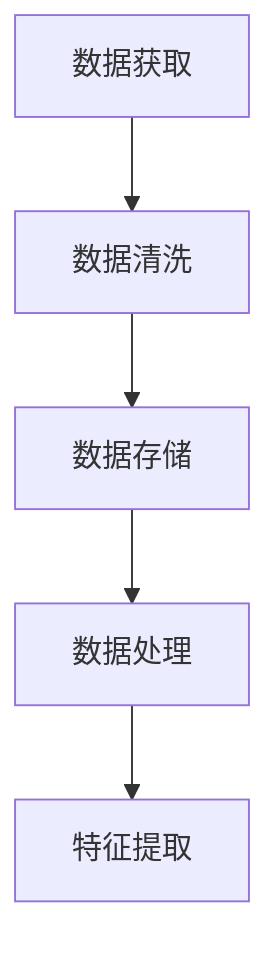
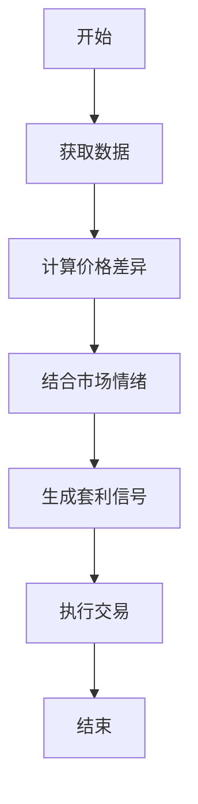
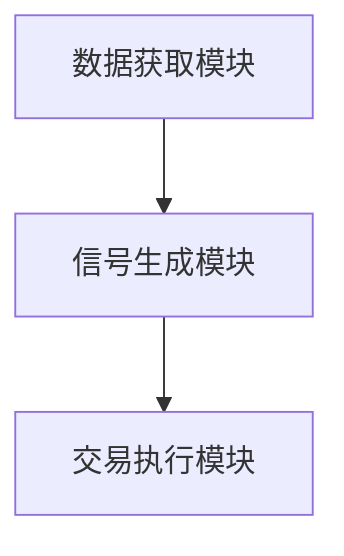
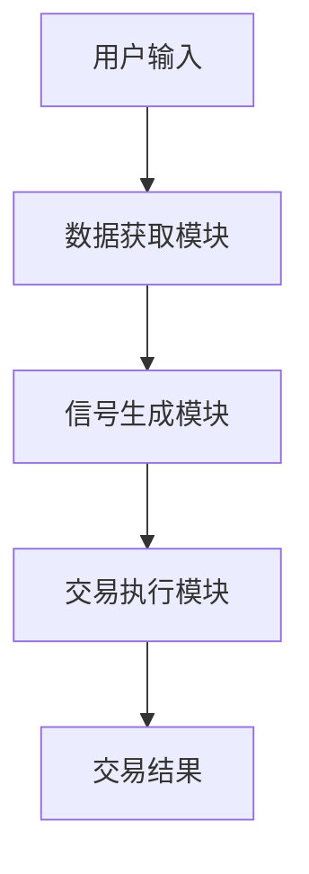

                 


# 大卫·德雷曼的特殊情况套利策略

> 关键词：套利策略，大卫·德雷曼，特殊情况，算法交易，统计套利，系统架构

> 摘要：本文详细探讨了大卫·德雷曼的特殊情况套利策略，从套利的基本概念到策略的数学模型，再到算法的设计与实现，以及系统的架构与实战案例，最后总结了最佳实践和注意事项。文章深入分析了套利策略的核心原理，并结合实际案例，展示了如何在复杂市场环境中应用该策略。

---

# 第1章: 特殊情况套利策略的背景与概念

## 1.1 套利的基本概念
### 1.1.1 什么是套利
套利是一种利用市场中资产价格差异获利的交易策略。通过在不同市场或资产之间同时进行买入和卖出操作，套利者能够在价格差异消失时实现无风险收益。套利的核心思想是利用市场中的价格不公允性。

### 1.1.2 套利的分类与特点
套利可以分为以下几种类型：
- **跨市场套利**：利用不同市场之间的价格差异进行交易。
- **跨期套利**：利用同一资产在不同时间点的价格差异进行交易。
- **统计套利**：基于统计学方法寻找资产价格的均值回归特性，进行套利交易。

套利的特点包括：
1. 通常具有较低的风险（如果市场是有效的）。
2. 依赖于价格差异的存在。
3. 需要较高的交易效率和快速的执行能力。

### 1.1.3 特殊情况套利的定义
特殊情况套利是指在特定市场条件下，利用某些特殊资产或市场的价格波动进行套利。这种策略通常依赖于市场的不完全性或某些资产的特殊属性。

---

## 1.2 大卫·德雷曼策略的特殊性
### 1.2.1 大卫·德雷曼策略的起源
大卫·德雷曼（David Dreman）是美国著名的投资专家，他的套利策略基于对市场情绪和资产价格波动的研究。他提出了一种基于市场过度反应的套利方法，特别是在市场恐慌或过度乐观时，利用资产价格的短期偏离进行套利。

### 1.2.2 策略的核心思想
德雷曼的策略的核心思想是：
1. 市场情绪会影响资产价格，导致价格偏离其内在价值。
2. 套利者可以通过识别这些偏离并利用它们进行交易。

### 1.2.3 策略的适用场景与限制
- **适用场景**：
  - 市场情绪剧烈波动时。
  - 资产价格短期偏离其长期趋势时。
- **限制**：
  - 市场效率提高后，套利机会减少。
  - 套利者需要快速的交易执行能力。

---

## 1.3 套利与市场效率的关系
### 1.3.1 市场效率的基本概念
市场效率是指市场价格能够迅速反映所有相关信息的程度。市场效率越高，套利机会越少。

### 1.3.2 套利对市场效率的影响
套利者通过套利行为，可以消除市场中的价格差异，从而提高市场效率。然而，过度套利可能导致市场波动加剧，反而降低市场效率。

### 1.3.3 特殊情况套利的市场适应性
特殊情况套利在低效率市场中更容易成功，但在高效率市场中，套利机会有限。因此，套利者需要结合市场环境选择合适的策略。

---

## 1.4 本章小结
本章介绍了套利的基本概念、分类与特点，重点分析了大卫·德雷曼策略的特殊性及其与市场效率的关系。套利是一种依赖市场不公允性的策略，而特殊情况套利则更关注市场情绪和资产价格的短期偏离。

---

# 第2章: 套利策略的核心原理

## 2.1 套利的数学模型
### 2.1.1 套利的数学公式
套利的收益可以通过以下公式计算：
$$ \text{收益} = \text{卖出价格} - \text{买入价格} $$

### 2.1.2 套利的收益与风险模型
套利的收益与风险模型可以表示为：
$$ \text{收益} = \mu - \sigma^2 $$

其中，$\mu$ 是套利的期望收益，$\sigma^2$ 是套利的风险。

---

## 2.2 套利的统计套利模型
### 2.2.1 统计套利的基本原理
统计套利基于资产价格的均值回归特性。套利者通过识别资产价格的短期偏离，利用其回归均值的特性进行交易。

### 2.2.2 常见的统计套利模型
1. **配对交易**：通过配对资产的价格差异进行套利。
2. **动量策略**：利用资产价格的动量效应进行套利。

---

## 2.3 大卫·德雷曼策略的数学推导
### 2.3.1 策略的核心公式
德雷曼策略的核心公式是：
$$ \text{套利收益} = \text{资产A价格} - \text{资产B价格} $$

### 2.3.2 策略的优化与改进
1. 引入市场情绪指标，优化套利时机。
2. 结合动量策略，提高套利收益。

---

## 2.4 本章小结
本章从数学角度分析了套利的核心原理，重点介绍了统计套利模型和大卫·德雷曼策略的数学推导。套利的收益与风险模型为套利者提供了理论依据，而统计套利模型则为套利策略提供了实际操作的方向。

---

# 第3章: 特殊情况套利的算法与实现

## 3.1 套利算法的设计与实现
### 3.1.1 数据获取与预处理
- 数据源：股票价格、市场情绪指标等。
- 数据清洗：去除缺失值、异常值。



### 3.1.2 信号生成与交易决策
- 信号生成：基于市场情绪指标和资产价格差异生成套利信号。
- 交易决策：根据信号决定买入或卖出。

```python
def generate_signal(price_data, emotion_data):
    # 计算资产价格差异
    price_diff = price_data['资产A'] - price_data['资产B']
    # 结合市场情绪指标
    signal = emotion_data['市场情绪'] * price_diff
    return signal
```

### 3.1.3 交易执行与风险控制
- 交易执行：根据信号执行交易。
- 风险控制：设定止损和止盈点。

---

## 3.2 套利算法的具体实现
### 3.2.1 算法的优化与改进
1. 引入机器学习模型，提高套利信号的准确性。
2. 结合实时数据，动态调整套利策略。

### 3.2.2 算法的流程图


---

## 3.3 本章小结
本章详细介绍了特殊情况套利的算法设计与实现，重点讲解了数据获取、信号生成和交易执行的流程。通过结合市场情绪指标和价格差异，套利者可以更有效地捕捉套利机会。

---

# 第4章: 特殊情况套利的系统架构与设计

## 4.1 系统的总体架构
### 4.1.1 系统的功能模块划分
- 数据获取模块：负责获取市场数据。
- 信号生成模块：负责生成套利信号。
- 交易执行模块：负责执行交易。

### 4.1.2 系统的模块间关系


## 4.2 系统的详细设计
### 4.2.1 数据获取模块
- 数据来源：股票市场、期货市场等。
- 数据类型：价格、成交量、市场情绪等。

### 4.2.2 信号生成模块
- 数据处理：清洗、转换。
- 算法实现：套利信号生成。

### 4.2.3 交易执行模块
- 交易策略：套利策略实现。
- 风险控制：止损、止盈。

---

## 4.3 系统的接口设计
### 4.3.1 系统内部接口
- 数据获取模块与信号生成模块的接口。
- 信号生成模块与交易执行模块的接口。

### 4.3.2 系统外部接口
- 用户界面：输入参数、显示结果。
- 数据源接口：获取市场数据。

---

## 4.4 系统的交互流程


---

## 4.5 本章小结
本章从系统架构的角度分析了特殊情况套利的实现，重点讲解了系统的功能模块划分、接口设计和交互流程。通过模块化设计，套利系统可以高效地实现套利策略。

---

# 第5章: 特殊情况套利的项目实战

## 5.1 项目环境的安装与配置
### 5.1.1 开发环境的搭建
- 安装Python、Jupyter Notebook、Pandas、NumPy等工具。

### 5.1.2 数据源的获取与处理
- 数据来源：Yahoo Finance、Quandl等。
- 数据处理：清洗、转换。

## 5.2 系统核心功能的实现
### 5.2.1 数据获取与预处理的代码实现
```python
import pandas as pd

def get_data(ticker):
    data = pd.read_csv(f'{ticker}.csv')
    return data
```

### 5.2.2 信号生成与交易决策的代码实现
```python
def generate_signal(data):
    price_diff = data['资产A'] - data['资产B']
    signal = price_diff.rolling(20).mean()
    return signal
```

### 5.2.3 交易执行与风险控制的代码实现
```python
def execute_trade(signal):
    if signal > 0:
        return '买入'
    elif signal < 0:
        return '卖出'
    else:
        return '观望'
```

## 5.3 项目案例分析
### 5.3.1 案例一：某市场的套利机会分析
- 数据分析：资产A和资产B的价格差异。
- 信号生成：基于市场情绪和价格差异生成套利信号。

### 5.3.2 案例二：大卫·德雷曼策略的实际应用
- 策略实现：结合市场情绪和价格差异进行套利。

## 5.4 项目总结与经验分享
### 5.4.1 项目实施的关键点
- 数据的准确性和及时性。
- 策略的实时性和可扩展性。

### 5.4.2 项目中的常见问题与解决方案
- 数据缺失：通过数据清洗和补充数据解决。
- 信号误判：通过引入机器学习模型提高信号准确性。

---

## 5.5 本章小结
本章通过实际案例展示了特殊情况套利的项目实战，重点讲解了环境安装、数据处理、信号生成和交易执行的实现过程。通过案例分析，套利者可以更好地理解策略的实际应用。

---

# 第6章: 特殊情况套利的最佳实践与注意事项

## 6.1 最佳实践
### 6.1.1 策略的优化与改进
- 引入机器学习模型，提高套利信号的准确性。
- 结合实时数据，动态调整套利策略。

### 6.1.2 风险控制
- 设定止损和止盈点。
- 风险分散：避免过度集中于某一种资产。

## 6.2 小结
特殊情况套利是一种依赖市场不公允性的策略，套利者需要结合市场环境和自身能力选择合适的策略。

## 6.3 注意事项
- 市场效率提高后，套利机会减少。
- 套利者需要快速的交易执行能力。

## 6.4 拓展阅读
- 《套利交易》——约翰·米勒
- 《算法交易》——彼得·林德

---

# 作者：AI天才研究院/AI Genius Institute & 禅与计算机程序设计艺术 /Zen And The Art of Computer Programming

