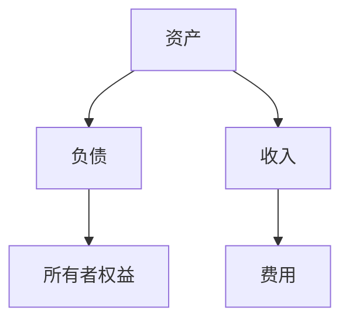
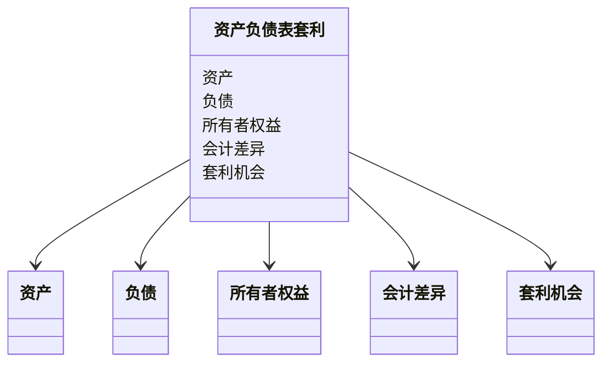
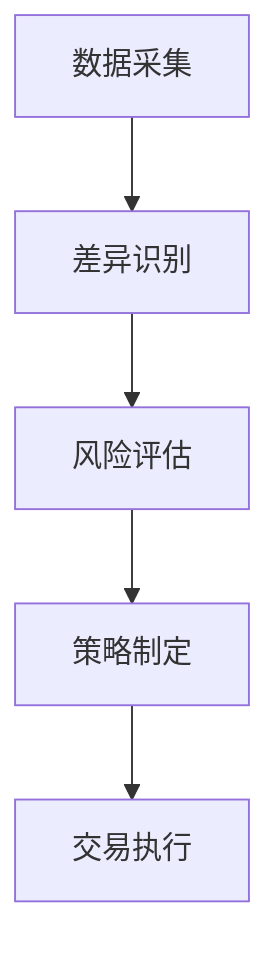
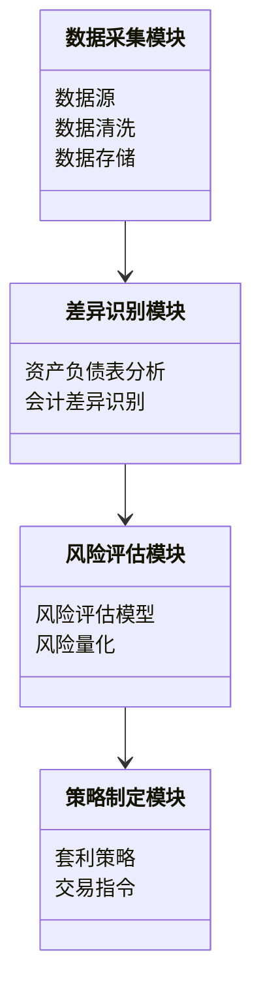
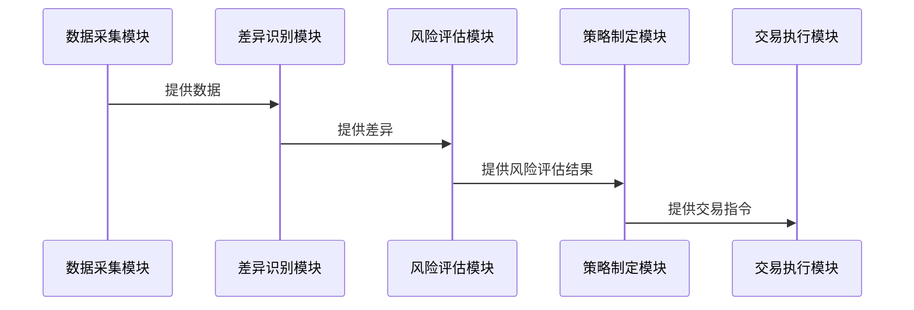

                 


# 大卫·德雷曼的资产负债表套利：利用会计差异创造价值

> **关键词**：大卫·德雷曼、资产负债表套利、会计差异、金融套利、投资策略  
>
> **摘要**：本文深入探讨了大卫·德雷曼提出的资产负债表套利理论，分析了如何通过识别和利用会计差异来创造投资价值。文章从理论基础、算法原理、系统架构到实战案例，全面解析了资产负债表套利的实现过程，并结合实际案例进行详细分析。最后，文章总结了套利的法律与道德边界，为读者提供了宝贵的实践经验。

---

# 第一部分: 资产负债表套利的背景与概念

## 第1章: 资产负债表套利的背景与概念

### 1.1 套利的基本概念
套利是指利用不同市场或不同资产之间的价格差异，通过同时买入低估资产和卖出高估资产，从中获取无风险或低风险利润的交易策略。套利在金融市场中广泛存在，但其核心在于发现价格差异并快速获利。

#### 1.1.1 套利的定义与分类
- **定义**：套利是利用两个或多个市场中同一资产的价格差异进行交易，以期在价格回归一致时获利。
- **分类**：
  1. **跨市场套利**：利用不同市场间的价差。
  2. **跨期套利**：利用同一资产在不同时间点的价差。
  3. **跨资产套利**：利用相关资产之间的价差。

#### 1.1.2 资产负债表套利的特殊性
资产负债表套利是一种特殊的套利形式，主要关注于公司资产负债表中的会计差异。通过分析公司在不同会计准则下的财务报表，寻找资产或负债的确认和计量差异，进而发现套利机会。

#### 1.1.3 套利在金融市场中的作用
套利在金融市场中起到价格发现、提高市场效率和降低流动性风险的作用。然而，套利也可能会加剧市场的波动，尤其是在高频交易和算法交易日益普及的今天。

### 1.2 大卫·德雷曼的资产负债表套利理论
大卫·德雷曼是资产负债表套利领域的权威学者，他提出了通过分析公司资产负债表中的会计差异来发现套利机会的理论。

#### 1.2.1 大卫·德雷曼的学术背景
大卫·德雷曼是一位著名的金融学家和经济学家，他的研究领域主要集中在公司财务、资产定价和套利策略上。他的研究成果为金融市场套利理论的发展提供了重要贡献。

#### 1.2.2 资产负债表套利的核心思想
资产负债表套利的核心思想是通过分析公司在不同会计准则下的财务报表，寻找资产或负债的确认和计量差异，进而发现套利机会。德雷曼指出，会计准则的差异可能导致同一资产在不同公司或不同市场中被以不同的方式记录，从而产生套利空间。

#### 1.2.3 理论的实际应用案例
德雷曼通过多个实际案例展示了资产负债表套利的应用。例如，某公司在采用国际财务报告准则（IFRS）时，将某项资产以较低的公允价值计量，而在采用美国会计准则（US GAAP）时，该资产以较高的历史成本计量。通过分析这种差异，投资者可以在两个市场之间进行套利交易，从而获利。

### 1.3 会计差异的来源与利用
会计差异的来源主要包括会计准则差异、会计政策选择差异以及会计估计差异。这些差异可能为套利者提供机会。

#### 1.3.1 会计准则的差异
不同会计准则（如IFRS和US GAAP）在资产和负债的确认、计量和列报方面存在差异。例如，某些资产在IFRS下需要按公允价值计量，而在US GAAP下可能按历史成本计量。

#### 1.3.2 资产与负债的确认与计量差异
资产和负债的确认标准不同可能导致会计差异。例如，某些负债在一家公司可能被确认为流动负债，而在另一家公司可能被确认为长期负债。

#### 1.3.3 利用会计差异创造价值的途径
套利者可以通过以下途径利用会计差异：
1. **跨市场套利**：在不同市场间进行资产或负债的买卖。
2. **跨公司套利**：在同一市场内，利用不同公司之间的会计差异进行套利。
3. **跨期套利**：利用同一公司不同会计期间的会计差异进行套利。

---

## 第2章: 资产负债表套利的核心概念与联系

### 2.1 资产负债表套利的原理
资产负债表套利的原理是通过分析资产负债表中的会计差异，寻找套利机会。

#### 2.1.1 资产负债表的结构与内容
资产负债表由资产、负债和所有者权益三部分组成。资产和负债的确认和计量差异是套利的核心。

#### 2.1.2 会计差异的识别与量化
套利者需要识别资产负债表中资产或负债的确认和计量差异，并量化这些差异的影响。

#### 2.1.3 利用差异进行套利的机制
通过分析不同市场或公司之间的会计差异，套利者可以进行跨市场或跨公司的套利交易，以期在价格回归一致时获利。

### 2.2 核心概念的对比分析
为了更好地理解资产负债表套利的核心概念，我们需要进行对比分析。

#### 2.2.1 资产与负债的确认标准对比
- **资产确认标准**：在财务报表中确认资产需要满足可识别性、控制权和未来经济利益。
- **负债确认标准**：在财务报表中确认负债需要满足可识别性、清偿义务和时间价值。

#### 2.2.2 不同会计准则下的差异对比
- **IFRS vs. US GAAP**：不同会计准则在资产和负债的确认和计量方面存在差异。
- **差异对比表**：以下是一个简单的对比表：

| 会计准则 | 资产确认 | 负债确认 |
|----------|----------|----------|
| IFRS    | 公允价值 | 公允价值 |
| US GAAP  | 历史成本 | 历史成本 |

#### 2.2.3 会计差异与套利机会的关系
会计差异是套利机会的来源。通过分析会计差异，套利者可以发现市场中的价格偏离，并利用这种偏离进行套利。

### 2.3 实体关系图与领域模型
为了更好地理解资产负债表套利的核心概念，我们可以通过实体关系图和领域模型来描述。

#### 2.3.1 实体关系图
以下是一个简单的实体关系图，展示了资产负债表中的核心实体及其关系：



#### 2.3.2 领域模型类图
以下是一个领域模型类图，展示了资产负债表套利的核心概念：



---

## 第3章: 资产负债表套利的算法原理

### 3.1 套利算法的基本流程
套利算法的基本流程包括数据收集、差异识别、风险评估和策略执行。

#### 3.1.1 数据收集与处理
套利者需要收集不同市场或公司的财务报表数据，并进行清洗和整理。

#### 3.1.2 差异识别与量化
通过分析资产负债表中的资产和负债项目，识别会计差异，并量化这些差异的影响。

#### 3.1.3 风险评估与策略制定
套利者需要评估套利交易的风险，并制定相应的策略。

### 3.2 套利算法的数学模型
套利算法的数学模型可以帮助套利者量化差异并制定策略。

#### 3.2.1 差异量化公式
差异量化公式可以表示为：

$$ \text{差异} = \max(a_i - b_i, 0) $$

其中，$a_i$ 是资产在市场A中的价格，$b_i$ 是资产在市场B中的价格。

#### 3.2.2 风险评估模型
风险评估模型可以表示为：

$$ \text{风险} = \frac{\text{套利成本}}{\text{预期收益}} $$

套利成本包括交易成本和机会成本，预期收益是套利者预期的收益。

---

## 第4章: 系统分析与架构设计

### 4.1 系统分析
套利系统的分析包括需求分析和功能模块设计。

#### 4.1.1 需求分析
套利系统需要满足以下需求：
1. 数据采集与处理模块。
2. 差异识别与量化模块。
3. 风险评估与策略制定模块。
4. 交易执行模块。

#### 4.1.2 功能模块设计
套利系统的功能模块设计如下：



### 4.2 系统架构设计
套利系统的架构设计包括系统架构图和接口设计。

#### 4.2.1 系统架构图
套利系统的架构图如下：



#### 4.2.2 接口设计
套利系统的接口设计如下：



---

## 第5章: 项目实战

### 5.1 环境安装
套利系统的环境安装包括以下步骤：
1. 安装Python和相关库（如Pandas、NumPy、Matplotlib）。
2. 安装数据采集工具（如爬虫框架Scrapy）。
3. 安装交易执行工具（如Interactive Brokers API）。

### 5.2 系统核心实现源代码
以下是套利系统的核心实现源代码：

```python
import pandas as pd
import numpy as np

def collect_data(company_list):
    # 数据采集函数，从数据库或网络获取公司财务报表数据
    pass

def identify_differences(dataframe):
    # 差异识别函数，分析资产负债表中的会计差异
    pass

def risk_assessment(differences):
    # 风险评估函数，量化套利交易的风险
    pass

def strategy_execution(risk_assessment_result):
    # 策略执行函数，根据风险评估结果制定套利策略
    pass

if __name__ == "__main__":
    company_list = ["公司A", "公司B", "公司C"]
    data = collect_data(company_list)
    differences = identify_differences(data)
    risk = risk_assessment(differences)
    strategy_execution(risk)
```

### 5.3 实际案例分析
以下是一个实际案例分析：

假设公司A和公司B在不同会计准则下的资产负债表数据如下：

| 项目       | 公司A（IFRS） | 公司B（US GAAP） |
|------------|---------------|------------------|
| 资产A      | 100           | 80               |
| 负债A      | 50            | 60               |

通过分析，资产A在公司A和公司B之间的差异为$20（100 - 80 = 20）。负债A在公司A和公司B之间的差异为$10（50 - 60 = -10）。套利者可以通过买入公司A的资产A和卖出公司B的负债A进行套利。

### 5.4 项目总结
通过项目实战，我们可以看到资产负债表套利的实现过程。套利者需要结合实际案例，分析会计差异，并制定相应的策略。

---

## 第6章: 最佳实践与注意事项

### 6.1 套利的法律与道德边界
套利者需要遵守相关法律法规，并注意道德风险。

### 6.2 最佳实践 tips
1. 选择可靠的财务数据源。
2. 定期更新套利算法，以适应市场变化。
3. 严格控制风险，避免过度杠杆。

### 6.3 拓展阅读
推荐阅读大卫·德雷曼的《资产负债表套利：利用会计差异创造价值》一书，了解更多细节。

---

**作者：AI天才研究院/AI Genius Institute & 禅与计算机程序设计艺术 /Zen And The Art of Computer Programming**

---

以上是关于大卫·德雷曼的资产负债表套利的详细分析，涵盖理论、算法、系统架构和项目实战。希望对您有所帮助！

