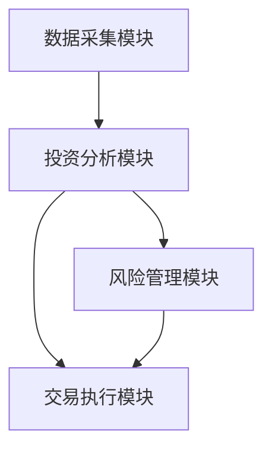
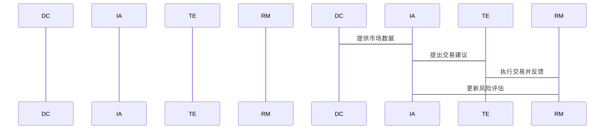

                 


# 大卫·斯文森的机构投资者长期价值创造

## 关键词：机构投资者，长期价值投资，大卫·斯文森，资产配置，投资组合管理，风险管理

## 摘要：本文深入探讨了大卫·斯文森在机构投资者长期价值创造方面的理念与实践。通过分析斯文森的投资策略、资产配置方法、风险管理机制以及长期价值投资的核心思想，揭示了机构投资者如何在复杂多变的金融市场中实现稳健的长期收益。文章结合理论与实践，为机构投资者提供了可操作的策略和方法。

---

# 第一部分：机构投资者与长期价值投资的背景

## 第1章：机构投资者与长期价值投资概述

### 1.1 机构投资者的定义与特点

#### 1.1.1 机构投资者的定义
机构投资者是指那些代表机构（如保险公司、养老基金、捐赠基金等）进行投资的主体。他们通常具有较大的资金规模和专业的投资团队，能够进行长期、系统化的投资管理。

#### 1.1.2 机构投资者的核心特点
- **资金规模大**：机构投资者通常管理的资金规模庞大，能够分散投资风险。
- **投资期限长**：机构投资者通常追求长期收益，而非短期投机。
- **专业化管理**：机构投资者依赖专业的投资团队和系统化的投资策略。
- **合规性与透明度**：机构投资者需要遵守严格的监管要求，并定期向利益相关方披露投资信息。

#### 1.1.3 机构投资者在金融体系中的地位
机构投资者是金融市场的重要参与者，通过大规模的投资活动，影响市场的流动性和资产定价。同时，机构投资者的长期投资策略有助于市场的稳定性和健康发展。

### 1.2 长期价值投资的背景与意义

#### 1.2.1 长期价值投资的起源
长期价值投资的理念起源于20世纪初，以本杰明·格雷厄姆和大卫·多德为代表的价值投资理论为基础。该理论强调以低于内在价值的价格买入优质股票，长期持有，等待市场重新认识其价值。

#### 1.2.2 长期价值投资的核心理念
- **注重内在价值**：投资者应关注公司的基本面，寻找市场价格低于内在价值的投资标的。
- **长期持有**：避免频繁交易，减少交易成本和税收负担，同时降低短期市场波动的影响。
- **分散投资**：通过合理的资产配置和分散投资，降低特定风险，提高投资组合的稳定性。

#### 1.2.3 长期价值投资在现代金融中的作用
长期价值投资不仅帮助投资者实现稳健收益，还促进了市场的健康发展。通过长期持有优质资产，机构投资者能够支持企业的持续发展，同时为股东创造长期价值。

### 1.3 大卫·斯文森与耶鲁大学捐赠基金

#### 1.3.1 大卫·斯文森的背景介绍
大卫·斯文森是耶鲁大学首席投资官，以其卓越的投资业绩和创新的投资理念闻名。他在机构投资领域的成就使其成为全球机构投资者的典范。

#### 1.3.2 耶鲁大学捐赠基金的投资策略
耶鲁大学捐赠基金的投资策略以长期价值投资为核心，注重资产配置和风险控制。斯文森通过多元化投资、长期持有和精选优质资产，实现了捐赠基金的稳健增长。

#### 1.3.3 斯文森投资理念的核心思想
斯文森的投资理念强调：
- **分散化投资**：通过多元化配置降低风险。
- **长期视角**：关注企业的长期价值，而非短期市场波动。
- **基本面分析**：深入研究企业的财务状况和行业前景，选择具有竞争优势的公司。

### 1.4 本章小结
本章介绍了机构投资者的基本概念和特点，分析了长期价值投资的背景与意义，并重点阐述了大卫·斯文森的投资理念和耶鲁大学捐赠基金的成功经验。这些内容为后续章节的深入分析奠定了基础。

---

## 第2章：资产配置与投资组合管理

### 2.1 资产配置的原理与方法

#### 2.1.1 资产配置的定义与分类
资产配置是指将资金分配到不同资产类别（如股票、债券、房地产等）以实现投资目标的过程。资产配置的分类主要依据资产的流动性、风险性和收益性。

#### 2.1.2 资产配置的基本原则
- **分散化原则**：通过投资不同资产类别降低风险。
- **风险与收益匹配原则**：根据风险承受能力选择合适的资产配置。
- **长期视角原则**：资产配置应基于长期投资目标进行动态调整。

#### 2.1.3 资产配置的实施步骤
1. **确定投资目标**：明确投资期限、收益目标和风险承受能力。
2. **分析市场环境**：研究宏观经济、行业趋势和市场流动性。
3. **选择资产类别**：根据风险偏好和收益目标选择合适的资产。
4. **分配权重**：确定各类资产的投资比例。
5. **定期再平衡**：根据市场变化和个人目标调整资产配置。

#### 2.1.4 资产配置的数学模型
资产配置可以通过现代投资组合理论（MPT）进行优化。以下是MPT的核心公式：

$$
\text{最优权重} = \frac{\mu_i - r_f}{\sigma_i^2}
$$

其中：
- $\mu_i$ 是资产i的预期收益率
- $r_f$ 是无风险利率
- $\sigma_i^2$ 是资产i的收益波动率

#### 2.1.5 资产配置的案例分析
以斯文森管理的耶鲁大学捐赠基金为例，其资产配置主要分为以下几个部分：
- **股票**：约占60%，包括美国和国际股票。
- **债券**：约占20%，用于降低组合的整体风险。
- **另类资产**：约占20%，包括房地产、私募股权和商品。

### 2.2 投资组合管理的策略

#### 2.2.1 投资组合管理的目标
投资组合管理的目标是通过科学的管理和调整，实现投资收益的最大化，同时控制风险。

#### 2.2.2 投资组合管理的流程
1. **目标设定**：明确投资目标和风险偏好。
2. **资产配置**：根据目标选择合适的资产类别和权重。
3. **证券选择**：挑选符合配置要求的个股或债券。
4. **组合构建**：将选定的资产按比例组合在一起。
5. **监控与调整**：定期检查组合表现，根据市场变化进行调整。

#### 2.2.3 投资组合管理的风险控制
- **分散化**：通过投资不同资产类别和行业降低风险。
- **杠杆控制**：避免过度使用杠杆，降低财务风险。
- **定期再平衡**：根据市场变化和个人目标调整组合。

### 2.3 股票与债券的投资策略

#### 2.3.1 股票投资的基本原则
- **长期持有**：避免频繁交易，降低交易成本和税务负担。
- **基本面分析**：选择具有强大财务状况和竞争优势的公司。
- **分散投资**：投资于不同行业和地区的股票，降低特定风险。

#### 2.3.2 债券投资的基本原则
- **信用评估**：选择信用评级高的债券，降低违约风险。
- **期限匹配**：根据资金需求选择债券的期限。
- **利率风险控制**：通过合理的期限配置降低利率波动的影响。

### 2.4 其他资产类别与另类投资

#### 2.4.1 房地产投资
房地产投资是机构投资者重要的资产类别之一。通过投资房地产信托基金（REITs）或直接购买房地产，投资者可以获得稳定的租金收入和资本增值。

#### 2.4.2 私募股权与风险投资
私募股权和风险投资是高风险、高回报的资产类别。机构投资者通过投资初创企业和成长期企业，分享其快速发展的收益。

#### 2.4.3 商品与衍生品投资
商品（如黄金、原油）和衍生品（如期权、期货）是机构投资者对冲风险和套利的重要工具。通过合理配置商品和衍生品，投资者可以降低组合的波动性并捕捉市场机会。

### 2.5 本章小结
本章详细探讨了资产配置和投资组合管理的核心策略，分析了股票、债券、房地产、私募股权和商品等资产类别的投资策略。通过科学的资产配置和有效的投资组合管理，机构投资者可以在复杂多变的市场环境中实现长期稳健的收益。

---

## 第3章：长期价值创造的核心理念

### 3.1 价值投资的哲学与实践

#### 3.1.1 价值投资的哲学基础
价值投资强调以低于内在价值的价格买入优质资产，并长期持有。这种方法要求投资者具备深刻的企业分析能力和长期投资的耐心。

#### 3.1.2 价值投资与市场有效性的关系
价值投资基于市场无效性的假设，认为市场价格有时会偏离内在价值。通过识别这种偏差，投资者可以在市场低估时买入优质资产，实现超额收益。

#### 3.1.3 价值投资的长期视角
长期视角是价值投资的核心，投资者需要关注企业的长期价值，而非短期市场波动。通过长期持有优质资产，投资者可以避免短期市场的干扰，实现稳健的收益。

### 3.2 价值投资的实践方法

#### 3.2.1 股票筛选的标准
价值投资者通常关注以下指标：
- **低市盈率（P/E）**：市盈率低于行业平均水平。
- **低市净率（P/B）**：市净率低于行业平均水平。
- **高股息率**：股息率高且稳定的公司。
- **强大的财务状况**：低负债率、高利润率、稳定的现金流。

#### 3.2.2 公司基本面分析
基本面分析是价值投资的核心方法，主要包括：
- **财务报表分析**：分析公司的收入、利润、现金流等财务数据。
- **行业分析**：研究公司的行业地位、竞争优势和未来发展前景。
- **管理团队评估**：评估公司管理团队的能力和稳定性。

#### 3.2.3 安全边际的概念
安全边际是指买入价格与内在价值之间的差距。通过预留安全边际，投资者可以在市场价格波动时保持投资的稳健性。

### 3.3 长期价值创造的实现路径

#### 3.3.1 买入并持有策略
买入并持有策略是价值投资的核心策略，通过长期持有优质资产，投资者可以分享企业的成长收益。

#### 3.3.2 资产配置的动态调整
尽管强调长期持有，但资产配置需要根据市场环境和投资目标进行动态调整。例如，在市场低迷时增加股票配置，在市场高涨时适当降低股票比例。

#### 3.3.3 风险管理与组合优化
有效的风险管理是长期价值创造的重要保障。通过合理的资产配置和分散投资，投资者可以降低组合的整体风险，同时捕捉市场机会。

### 3.4 本章小结
本章深入探讨了长期价值创造的核心理念，分析了价值投资的哲学基础、实践方法和实现路径。通过买入并持有优质资产、动态调整资产配置和加强风险管理，机构投资者可以在长期投资中实现稳健的收益。

---

## 第4章：风险控制与投资组合优化

### 4.1 风险管理的核心原则

#### 4.1.1 风险管理的目标
风险管理的目标是通过识别、评估和控制风险，降低投资组合的波动性和潜在损失。

#### 4.1.2 风险管理的步骤
1. **风险识别**：识别投资组合中的主要风险来源。
2. **风险评估**：量化各风险因素的影响程度。
3. **风险控制**：通过分散化、对冲或其他方式降低风险。

### 4.2 投资组合优化的策略

#### 4.2.1 现代投资组合理论（MPT）
现代投资组合理论强调通过分散化投资降低组合的整体风险。以下是MPT的核心公式：

$$
\text{最优权重} = \frac{\mu_i - r_f}{\sigma_i^2}
$$

其中：
- $\mu_i$ 是资产i的预期收益率
- $r_f$ 是无风险利率
- $\sigma_i^2$ 是资产i的收益波动率

#### 4.2.2 基于现代投资组合理论的资产配置
通过计算各资产的预期收益率和波动率，投资者可以找到最优的资产配置组合，实现风险和收益的最佳平衡。

#### 4.2.3 动态再平衡策略
为了保持投资组合的最优配置，投资者需要定期根据市场变化和投资目标进行再平衡。例如，当某资产的权重超过目标比例时，减少该资产的持有比例，增加其他资产的配置。

### 4.3 风险控制的实战案例

#### 4.3.1 股票市场风险的对冲
通过投资股指期货或期权，投资者可以对冲股票市场的系统性风险，降低组合的波动性。

#### 4.3.2 利率风险的管理
对于债券投资，投资者可以通过选择不同期限的债券或使用利率掉期工具，降低利率波动对组合收益的影响。

#### 4.3.3 汇率风险的控制
对于跨国投资，投资者可以通过外汇衍生品（如远期合约和期权）对冲汇率风险，保护投资组合的价值。

### 4.4 本章小结
本章重点分析了风险管理和投资组合优化的核心策略，介绍了现代投资组合理论和动态再平衡策略，并通过实际案例展示了风险控制的实现方法。通过有效的风险管理，投资者可以在复杂多变的市场环境中实现稳健的长期收益。

---

## 第5章：长期投资策略与可持续发展

### 5.1 长期投资策略的实施路径

#### 5.1.1 确定长期投资目标
长期投资目标需要与机构的财务需求和战略目标一致，通常包括收益目标、风险承受能力和投资期限。

#### 5.1.2 制定资产配置方案
根据长期目标，制定合理的资产配置方案，选择适合的资产类别和权重。

#### 5.1.3 实施投资计划
按照资产配置方案，选择具体的证券进行投资，构建投资组合。

#### 5.1.4 定期评估与调整
定期评估投资组合的表现，根据市场变化和目标调整配置。

### 5.2 可持续投资与ESG因素

#### 5.2.1 ESG投资理念
ESG（环境、社会、治理）投资理念强调在投资决策中考虑企业的环境表现、社会责任和治理结构。通过关注ESG因素，投资者可以选择更具可持续性的企业，实现长期价值创造。

#### 5.2.2 ESG投资的实践方法
- **ESG筛选**：通过ESG评级筛选出表现优秀的公司。
- **ESG整合**：将ESG因素纳入投资分析和决策过程。
- **ESG投资工具**：通过ESG指数基金或ETF进行投资。

### 5.3 长期投资与可持续发展的结合

#### 5.3.1 长期投资与ESG理念的契合
长期投资强调企业的长期价值，而ESG理念关注企业的可持续发展能力。两者结合可以实现经济价值与社会责任的统一。

#### 5.3.2 可持续投资的案例分析
以斯文森管理的耶鲁大学捐赠基金为例，其投资组合中 increasingly includes ESG表现优秀的公司，通过支持可持续发展，实现长期的价值增长。

### 5.4 本章小结
本章探讨了长期投资策略的实施路径，分析了可持续投资与ESG因素的重要性。通过将长期投资与可持续发展相结合，机构投资者可以在实现经济效益的同时，推动社会和环境的可持续发展。

---

## 第6章：投资组合的数学模型与算法实现

### 6.1 投资组合优化的数学模型

#### 6.1.1 现代投资组合理论（MPT）
MPT通过优化资产配置，实现风险与收益的最佳平衡。以下是MPT的核心公式：

$$
\text{最优权重} = \frac{\mu_i - r_f}{\sigma_i^2}
$$

其中：
- $\mu_i$ 是资产i的预期收益率
- $r_f$ 是无风险利率
- $\sigma_i^2$ 是资产i的收益波动率

#### 6.1.2 均值-方差优化
均值-方差优化是一种常用的投资组合优化方法，通过最小化组合的方差（风险）来实现预期收益的最大化。

#### 6.1.3 风险平价策略
风险平价策略通过将风险分配到不同的资产类别，实现组合的均衡风险配置。以下是风险平价策略的核心公式：

$$
\text{资产权重} = \frac{\sigma_i}{\sum_{j}\sigma_j}
$$

其中：
- $\sigma_i$ 是资产i的风险贡献
- $\sum_{j}\sigma_j$ 是所有资产风险贡献的总和

### 6.2 投资组合优化的算法实现

#### 6.2.1 基于Python的投资组合优化

```python
import numpy as np
import pandas as pd

# 示例数据：资产的预期收益率和协方差矩阵
mu = np.array([0.1, 0.15, 0.08])
cov_matrix = np.array([
    [0.16, 0.05, 0.03],
    [0.05, 0.20, 0.08],
    [0.03, 0.08, 0.16]
])

# 计算最优权重
def optimal_weights(mu, cov_matrix, risk_free_rate=0.05):
    # 假设目标是最小化方差
    # 使用拉格朗日乘数法求解
    n = len(mu)
    C = np.matrix(cov_matrix)
    inv_C = C.I
    ones = np.matrix(np.ones(n))
    denominator = ones * inv_C * ones.T
    weights = inv_C * ones.T / denominator
    return np.array(weights).flatten()

weights = optimal_weights(mu, cov_matrix)
print("最优权重:", weights)
```

#### 6.2.2 基于机器学习的投资组合优化
机器学习算法（如支持向量机、随机森林）可以用于预测资产收益和风险，从而优化投资组合。以下是基于机器学习的简单实现：

```python
from sklearn.ensemble import RandomForestRegressor
from sklearn.model_selection import train_test_split

# 示例数据：训练集和测试集
X_train, X_test, y_train, y_test = train_test_split(X, y, test_size=0.2)

# 训练随机森林模型
model = RandomForestRegressor(n_estimators=100)
model.fit(X_train, y_train)

# 预测测试集的收益和风险
y_pred = model.predict(X_test)
```

#### 6.2.3 数学模型的优缺点
- **优点**：数学模型能够量化投资风险和收益，提供科学的投资决策依据。
- **缺点**：模型假设可能与实际情况不符，市场波动和非理性行为可能导致模型失效。

### 6.3 本章小结
本章通过数学模型和算法实现，展示了投资组合优化的核心方法。通过Python代码和机器学习算法，投资者可以更好地理解和实现投资组合优化，提高投资效率和收益。

---

## 第7章：投资组合的系统分析与架构设计

### 7.1 投资组合系统的功能设计

#### 7.1.1 系统功能模块
- **数据采集模块**：采集市场数据、公司财务数据等。
- **投资分析模块**：进行基本面分析、风险评估和资产配置。
- **交易执行模块**：根据策略执行交易指令。
- **风险管理模块**：监控和管理投资风险。

#### 7.1.2 功能模块的交互流程
1. 数据采集模块收集市场数据。
2. 投资分析模块进行分析和评估。
3. 根据分析结果，交易执行模块执行交易。
4. 风险管理模块实时监控组合风险，发出调整指令。

### 7.2 投资组合系统的架构设计

#### 7.2.1 系统架构图


#### 7.2.2 模块之间的关系
- **数据采集模块**与**投资分析模块**：数据采集模块为投资分析模块提供必要的数据支持。
- **投资分析模块**与**交易执行模块**：投资分析模块根据分析结果指导交易执行。
- **风险管理模块**与**交易执行模块**：风险管理模块实时监控风险，并根据需要调整交易策略。

### 7.3 系统接口设计

#### 7.3.1 数据接口
- **输入接口**：接收市场数据、公司财务数据等。
- **输出接口**：输出投资组合的配置建议、风险评估结果等。

#### 7.3.2 交易接口
- **订单生成**：根据分析结果生成交易订单。
- **订单执行**：将订单发送至交易系统执行。

### 7.4 系统交互流程图



### 7.5 本章小结
本章通过系统分析与架构设计，展示了投资组合管理的复杂性和系统性。通过功能模块的划分和系统架构的设计，投资者可以更好地管理投资组合，实现长期稳健的收益。

---

## 第8章：项目实战与案例分析

### 8.1 项目实战：投资组合构建

#### 8.1.1 环境安装
- **工具安装**：安装Python、Pandas、NumPy、Matplotlib等工具。
- **数据获取**：通过Yahoo Finance获取历史数据。

#### 8.1.2 核心代码实现

```python
import pandas as pd
import numpy as np
import matplotlib.pyplot as plt

# 示例数据：股票收益和风险
stocks = pd.DataFrame({
    '股票': ['A', 'B', 'C'],
    '收益率': [0.1, 0.15, 0.08],
    '波动率': [0.2, 0.3, 0.15]
})

# 计算最优权重
def compute_weights(stocks):
    n = len(stocks['股票'])
    mu = stocks['收益率'].values
    sigma = stocks['波动率'].values
    C = np.diag(sigma**2)
    inv_C = np.linalg.inv(C)
    ones = np.ones(n)
    denominator = ones.dot(inv_C).dot(ones.T)
    weights = inv_C.dot(ones) / denominator
    return weights

weights = compute_weights(stocks)
print("最优权重:", weights)
```

#### 8.1.3 代码应用解读
上述代码通过计算资产的最优权重，展示了如何实现投资组合优化。通过调整参数和数据，投资者可以构建符合自己需求的投资组合。

### 8.2 投资组合风险管理

#### 8.2.1 风险管理策略
- **动态再平衡**：定期调整投资组合，保持最优配置。
- **风险对冲**：通过期货、期权等工具对冲市场风险。
- **风险分散**：投资于不同资产类别和行业，降低特定风险。

#### 8.2.2 风险管理的实战案例
以斯文森管理的耶鲁大学捐赠基金为例，其通过多元化的资产配置和严格的风险管理，实现了投资组合的稳健增长。以下是具体策略：
- **资产类别分散**：股票、债券、房地产等多种资产配置。
- **行业分散**：投资于不同行业的优质企业，降低行业风险。
- **定期再平衡**：每年根据市场变化调整投资组合，保持最优配置。

### 8.3 投资组合优化的案例分析

#### 8.3.1 投资组合优化的数学模型
通过计算各资产的预期收益率和波动率，使用现代投资组合理论（MPT）确定最优资产配置。

#### 8.3.2 投资组合优化的实战应用
以斯文森管理的捐赠基金为例，其通过优化资产配置和精选优质资产，实现了长期稳定的收益。

### 8.4 本章小结
本章通过项目实战和案例分析，展示了投资组合构建和风险管理的具体方法。通过实际操作和案例分析，投资者可以更好地理解长期价值创造的核心理念和实现路径。

---

## 第9章：总结与展望

### 9.1 长期价值投资的核心要点

#### 9.1.1 长期视角的重要性
长期视角是价值投资的核心，投资者需要关注企业的长期价值，而非短期市场波动。

#### 9.1.2 资产配置与投资组合管理
科学的资产配置和有效的投资组合管理是实现长期稳健收益的关键。

#### 9.1.3 风险管理与风险控制
有效的风险管理是投资成功的重要保障，通过分散化和对冲策略降低投资风险。

### 9.2 长期投资的未来展望

#### 9.2.1 数字化与智能化投资
随着科技的发展，数字化和智能化投资将成为未来的重要趋势。通过大数据和人工智能技术，投资者可以更好地捕捉市场机会，优化投资决策。

#### 9.2.2 ESG投资的兴起
随着社会对可持续发展的关注增加，ESG投资将越来越受到重视。通过关注环境、社会和治理因素，投资者可以实现经济价值与社会责任的统一。

#### 9.2.3 全球化与多元化投资
全球化背景下，多元化投资将成为机构投资者的重要策略。通过投资于不同国家和地区的资产，投资者可以降低地域风险，捕捉全球市场机会。

### 9.3 本章小结
本章总结了长期价值投资的核心要点，并展望了未来投资的发展趋势。通过数字化、智能化、ESG投资和全球化等策略，机构投资者可以在未来实现更加稳健和可持续的长期收益。

---

## 作者简介

作者：AI天才研究院/AI Genius Institute & 禅与计算机程序设计艺术/Zen And The Art of Computer Programming

---

**本文详细分析了大卫·斯文森的机构投资者长期价值创造理念与实践，结合理论与实践，为机构投资者提供了可操作的策略和方法。通过长期视角、科学的资产配置和有效的风险管理，机构投资者可以在复杂多变的市场环境中实现稳健的长期收益。未来，随着科技的发展和投资理念的创新，长期价值投资将更加注重可持续发展和多元化投资，为机构投资者创造更大的价值。**

--- 

如果需要进一步扩展或细化内容，可以随时告知，我会继续补充。

