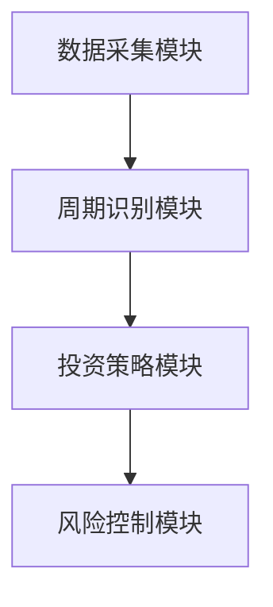
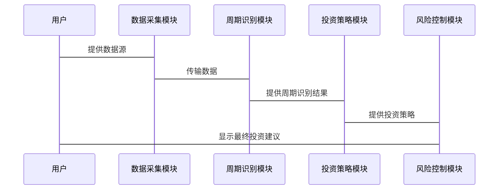

                 


# 大卫·温特斯的周期性价值投资：把握行业起落节奏

> 关键词：大卫·温特斯，周期性价值投资，经济周期，行业周期，投资策略，风险管理

> 摘要：本文深入探讨了大卫·温特斯的周期性价值投资理念，分析了其在经济周期和行业周期中的应用，结合数学模型和算法实现，为投资者提供了从理论到实践的全面指导。

---

## 第1章: 大卫·温特斯与周期性价值投资

### 1.1 大卫·温特斯的背景与投资理念

#### 1.1.1 大卫·温特斯的生平简介
大卫·温特斯是桥水基金（Bridgewater Associates）的创始人，被誉为全球最成功的对冲基金经理之一。他以独特的周期性价值投资理念闻名，强调通过识别经济周期和行业周期来优化投资决策。

#### 1.1.2 周期性价值投资的核心理念
温特斯提出，市场波动和经济周期是投资中的关键因素。他主张通过分析经济周期和行业周期，找到价值低估的资产，在周期性低谷时买入，周期性高点时卖出。

#### 1.1.3 大卫·温特斯投资哲学的演变
从早期的宏观对冲策略到后期的周期性价值投资，温特斯的投资哲学经历了从量变到质变的演变。他将宏观经济分析与微观资产定价相结合，形成了独特的投资体系。

### 1.2 周期性价值投资的定义与特点

#### 1.2.1 周期性价值投资的定义
周期性价值投资是一种以经济周期和行业周期为基础的价值投资策略。它通过分析周期性资产的波动性，捕捉周期性低谷时的价值低估机会。

#### 1.2.2 周期性价值投资的核心特点
- **周期性驱动**：强调经济周期和行业周期对资产价格的影响。
- **逆向投资**：在市场低谷时买入，在市场高点时卖出。
- **长期视角**：关注长期经济趋势，而非短期市场波动。

#### 1.2.3 周期性价值投资与传统价值投资的区别
| 特性 | 周期性价值投资 | 传统价值投资 |
|------|----------------|---------------|
| 核心驱动力 | 经济周期和行业周期 | 个股基本面分析 |
| 投资策略 | 逆周期操作 | 逆市买入低估资产 |
| 风险管理 | 强调周期性风险控制 | 侧重个股风险分散 |

### 1.3 周期性价值投资的意义与应用

#### 1.3.1 周期性价值投资的潜在应用场景
- **宏观经济预测**：通过周期性分析，预测经济走势。
- **行业投资决策**：选择处于周期性低谷的行业进行投资。
- **资产配置优化**：根据周期性变化调整投资组合。

#### 1.3.2 周期性价值投资的优势与劣势
- **优势**：能够有效捕捉周期性低估资产，降低投资风险。
- **劣势**：周期性预测的不确定性较高，容易受到市场波动影响。

#### 1.3.3 周期性价值投资的未来发展趋势
随着大数据和人工智能技术的发展，周期性价值投资将更加依赖量化分析和模型预测，进一步提升投资决策的科学性和精准性。

---

## 第2章: 经济周期与行业周期分析

### 2.1 经济周期的基本理论

#### 2.1.1 经济周期的定义与划分
经济周期是指经济活动的波动性变化，通常分为以下几个阶段：
1. **衰退**：经济活动下降，失业率上升。
2. **萧条**：经济处于最低点，投资和消费低迷。
3. **复苏**：经济开始恢复，企业利润回升。
4. **繁荣**：经济高速增长，市场过热。

#### 2.1.2 经济周期的驱动因素
- **货币政策**：央行的利率和货币政策直接影响经济周期。
- **财政政策**：政府的财政支出和税收政策影响经济活动。
- **市场信心**：投资者和消费者的信心影响经济波动。

#### 2.1.3 经济周期对投资的影响
在经济衰退期，周期性价值投资策略倾向于寻找低估资产；在经济繁荣期，策略倾向于减少风险敞口。

### 2.2 行业周期的分析框架

#### 2.2.1 行业周期的定义与特征
行业周期是指特定行业因外部经济环境变化而产生的周期性波动。例如，周期性行业包括能源、材料和工业等。

#### 2.2.2 行业周期的划分方法
- **行业生命周期**：从幼稚期到成熟期，再到衰退期。
- **行业波动性**：行业波动与经济周期的相关性。

#### 2.2.3 行业周期与经济周期的关系
行业周期通常与经济周期密切相关，但不同行业受周期性影响的程度不同。

### 2.3 大卫·温特斯的行业周期分析方法

#### 2.3.1 从行业周期角度选择投资标的
温特斯通过分析行业周期，选择那些在经济周期低谷时具有估值优势的行业。

#### 2.3.2 行业周期拐点的识别技巧
- **行业数据监测**：通过行业数据（如利润、收入、库存）识别周期拐点。
- **市场情绪分析**：通过市场情绪指标判断行业周期位置。

#### 2.3.3 行业周期波动中的投资策略
- **低位布局**：在行业周期低谷时买入低估资产。
- **高位减仓**：在行业周期顶峰时减少投资。

---

## 第3章: 周期性行业的投资策略

### 3.1 周期性行业的识别与分类

#### 3.1.1 周期性行业的定义与特征
周期性行业是指那些受经济周期波动影响较大的行业，如能源、材料和工业等。

#### 3.1.2 常见周期性行业的分类
- **强周期性行业**：波动性极高，如能源和材料行业。
- **弱周期性行业**：波动性较低，如公用事业和医疗行业。

#### 3.1.3 周期性行业波动的规律
周期性行业的波动通常与经济周期密切相关，但在特定行业内部也有其独特的周期性规律。

### 3.2 大卫·温特斯的周期性行业投资策略

#### 3.2.1 周期性行业的估值方法
- **市盈率（P/E）**：用于评估股票的相对估值。
- **市净率（P/B）**：用于评估股票相对于账面价值的估值。

#### 3.2.2 周期性行业的投资时机选择
- **低位布局**：在行业周期低谷时买入低估资产。
- **高位减仓**：在行业周期顶峰时减少投资。

#### 3.2.3 周期性行业的风险控制策略
- **分散投资**：通过投资不同行业的资产分散风险。
- **动态调整**：根据市场变化及时调整投资组合。

### 3.3 周期性行业投资案例分析

#### 3.3.1 典型周期性行业的投资案例
- **能源行业**：在经济衰退时，能源行业的股票通常被低估。
- **材料行业**：在经济复苏期，材料行业的股票通常表现较好。

#### 3.3.2 投资案例中的周期性分析
通过具体案例分析，说明如何利用周期性价值投资策略在特定行业中捕捉投资机会。

#### 3.3.3 投资案例的启示与总结
总结周期性价值投资在实际操作中的成功与失败经验，为投资者提供借鉴。

---

## 第4章: 周期性价值投资的数学模型与算法

### 4.1 周期性价值投资的数学模型

#### 4.1.1 周期性行业的波动模型
- **波动性分析**：通过统计学方法分析行业波动性。
- **周期性回归模型**：通过回归分析确定行业周期与经济周期的关系。

#### 4.1.2 投资组合的收益与风险模型
- **均值-方差模型**：用于优化投资组合的收益与风险。

#### 4.1.3 行业周期与股价关系的回归模型
通过回归分析，建立行业周期与股价之间的关系模型。

### 4.2 周期性价值投资的算法实现

#### 4.2.1 数据采集与预处理
- **数据来源**：从金融数据库获取行业数据。
- **数据清洗**：去除异常值和缺失值。

#### 4.2.2 行业周期识别的算法流程
- **特征提取**：提取行业周期相关的特征变量。
- **模型训练**：使用机器学习算法训练周期识别模型。

#### 4.2.3 投资组合优化的算法实现
- **优化目标**：最大化收益，最小化风险。
- **算法选择**：使用遗传算法或模拟退火算法优化投资组合。

### 4.3 数学公式与模型

#### 4.3.1 波动模型公式
$$ \sigma = \sqrt{\frac{1}{n-1} \sum_{i=1}^{n} (x_i - \bar{x})^2} $$

#### 4.3.2 均值-方差模型公式
$$ \text{风险} = \sqrt{\omega^T \Sigma \omega} $$

#### 4.3.3 回归模型公式
$$ y = \beta x + \epsilon $$

---

## 第5章: 系统架构与设计

### 5.1 系统架构设计

#### 5.1.1 系统功能设计
- **数据采集模块**：采集行业数据和市场数据。
- **周期识别模块**：识别行业周期和经济周期。
- **投资策略模块**：根据周期识别结果制定投资策略。
- **风险控制模块**：监控投资组合的风险。

#### 5.1.2 系统架构图


### 5.2 系统接口设计

#### 5.2.1 数据接口
- **数据输入接口**：接收外部数据源的数据。
- **数据输出接口**：输出周期识别结果和投资策略。

#### 5.2.2 用户接口
- **用户输入接口**：接收用户的投资参数。
- **用户输出接口**：显示投资建议和风险提示。

### 5.3 系统交互流程

#### 5.3.1 交互流程图


---

## 第6章: 项目实战与案例分析

### 6.1 项目实战

#### 6.1.1 环境安装
- **编程语言**：Python
- **库的安装**：pandas、numpy、scikit-learn

#### 6.1.2 核心实现源代码
```python
import pandas as pd
import numpy as np
from sklearn.linear_model import LinearRegression

# 数据加载
data = pd.read_csv('industry_data.csv')

# 特征提取
X = data[['GDP', ' unemployment']]
y = data['stock_price']

# 模型训练
model = LinearRegression()
model.fit(X, y)

# 预测周期拐点
predicted_prices = model.predict(X)
```

#### 6.1.3 代码应用解读与分析
通过上述代码，我们可以利用线性回归模型预测行业周期拐点，从而指导投资决策。

### 6.2 实际案例分析

#### 6.2.1 案例分析
以能源行业为例，分析如何利用周期性价值投资策略捕捉投资机会。

#### 6.2.2 案例解读
通过具体案例分析，说明周期性价值投资策略在实际中的应用效果。

### 6.3 项目小结
总结周期性价值投资策略在实际中的应用效果，分析其优缺点，并提出改进建议。

---

## 第7章: 最佳实践与总结

### 7.1 最佳实践 Tips

#### 7.1.1 投资策略
- **分散投资**：避免过度集中于某一行

