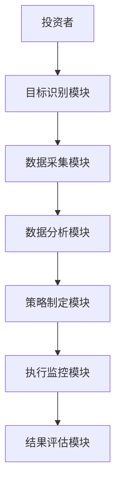

                 


# 大卫·艾伦·科恩的Activist投资策略

---

## 第1章: 引言

### 1.1 背景介绍

- **问题背景**：传统投资策略与activist投资策略的区别。
- **问题描述**：activist投资策略的核心目标与实施方式。
- **问题解决**：大卫·艾伦·科恩的activist投资策略如何实现目标。
- **边界与外延**：activist投资的范围与局限性。
- **概念结构与核心要素组成**：包括投资者角色、目标公司、公司治理、市场反应等核心要素。

---

## 第2章: Activist投资策略的核心概念与联系

### 2.1 核心概念术语说明

- **Activist投资**：定义与特征。
- **代理权争夺**：定义、目标与策略。
- **股东 activism**：定义、目标与策略。
- **公司治理**：定义、关键要素与activist投资的关系。

### 2.2 核心概念属性特征对比表格

| 概念             | 定义                                                                 | 特点                                                                 |
|------------------|----------------------------------------------------------------------|----------------------------------------------------------------------|
| Activist投资     | 投资者通过持有公司股份，积极参与公司治理，推动变革以实现更高回报。 | 积极介入公司管理，注重短期收益与长期价值的结合。                   |
| 代理权争夺       | 投资者通过获得董事会多数席位来改变公司战略或管理层。               | 高风险、高回报，需要大量资源与时间投入。                         |
| 股东 activism    | 股东通过行使权利影响公司决策，包括投票、提案等。                   | 强调股东权利，推动公司治理透明化与高效化。                         |
| 公司治理         | 公司内部管理结构与决策机制，包括董事会、管理层与股东关系。         | 健好的公司治理是企业长期成功的关键。                               |

### 2.3 实体关系图

```mermaid
er
actor 投资者 {
  name: 大卫·艾伦·科恩
  role: 投资者
}
actor 目标公司 {
  name: [公司A]
  role: 被投资公司
}
actor 公司治理结构 {
  name: 董事会、管理层
  role: 公司治理机构
}
actor 市场反应 {
  name: 投资者、分析师、媒体
  role: 市场参与者
}
```

---

## 第3章: 大卫·艾伦·科恩的Activist投资策略

### 3.1 投资哲学与策略

- **长期价值 vs. 短期收益**：大卫·艾伦·科恩如何平衡两者。
- **目标公司选择标准**：基本面分析、管理团队、行业地位等。

### 3.2 成功案例分析

- **案例1**：某公司代理权争夺案例。
  - **问题背景**：公司管理混乱，业绩下滑。
  - **策略实施**：大卫·艾伦·科恩提出改组董事会，更换管理层。
  - **结果**：公司扭亏为盈，股价上涨。
- **案例2**：推动环境、社会与治理（ESG）改革。
  - **问题背景**：公司存在环境污染问题。
  - **策略实施**：大卫·艾伦·科恩推动公司实施严格的ESG标准。
  - **结果**：公司形象提升，获得更多投资者青睐。

---

## 第4章: Activist投资策略的法律与道德问题

### 4.1 法律框架

- **美国公司治理法律**：如《证券交易法》、《公司治理准则》。
- **股东权利与义务**：法律赋予股东的权利与限制。

### 4.2 合规性与道德责任

- **合规性问题**：如何在法律框架内推动公司变革。
- **道德责任**：activist投资是否可能损害其他利益相关者。

---

## 第5章: Activist投资策略的系统分析与架构设计方案

### 5.1 问题场景介绍

- **目标识别**：如何识别具有潜力的公司。
- **策略制定**：如何制定具体的activist策略。

### 5.2 项目介绍

- **项目目标**：实现大卫·艾伦·科恩的activist投资策略。
- **系统功能设计**：包括目标识别模块、策略制定模块、执行监控模块。

### 5.3 系统架构设计



### 5.4 系统接口设计

- **API接口**：数据采集模块与外部数据库的接口设计。

---

## 第6章: Activist投资策略的项目实战

### 6.1 环境安装

- **工具安装**：安装数据分析工具、法律咨询工具等。

### 6.2 核心实现

- **代码实现**：数据采集、分析、策略制定等模块的代码实现。

### 6.3 案例分析

- **案例分析**：详细分析大卫·艾伦·科恩的一个成功案例。

---

## 第7章: 总结与展望

### 7.1 最佳实践 tips

- **策略制定**：如何制定有效的activist策略。
- **风险控制**：如何降低投资风险。

### 7.2 小结

- 重申activist投资策略的核心内容。

### 7.3 注意事项

- 法律合规性的重要性。

### 7.4 未来趋势

- 技术驱动的activist投资策略发展。

---

## 第8章: 附录与参考文献

### 8.1 附录

- 术语表。
- 进一步阅读的书籍与文章。

### 8.2 参考文献

- 列出所有引用的文献资料。

---

## 作者：AI天才研究院 & 禅与计算机程序设计艺术

---

这篇文章通过详细的章节结构，系统地介绍了大卫·艾伦·科恩的activist投资策略，涵盖了背景、核心概念、策略分析、系统设计和项目实战等各个方面。通过丰富的案例分析和系统架构设计，帮助读者全面理解activist投资策略的实施与应用。

