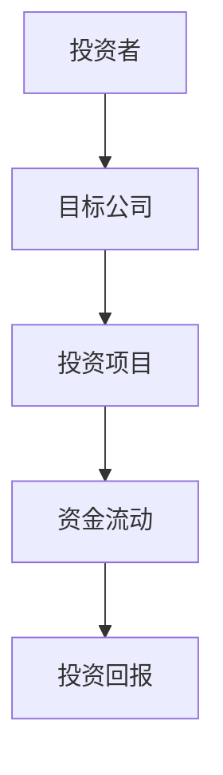
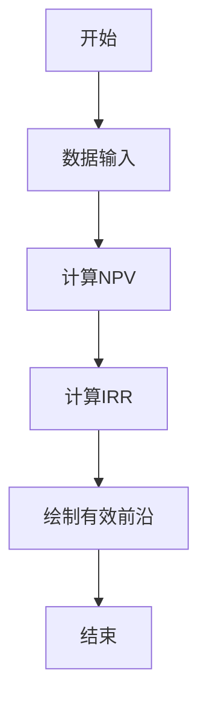

                 


# 大卫·艾伦·科恩的私募股权投资策略

## 关键词
- 私募股权、大卫·艾伦·科恩、投资策略、风险管理、财务分析

## 摘要
本文深入探讨了大卫·艾伦·科恩在私募股权投资领域的独特策略。通过分析其核心概念、数学模型、系统架构及实际案例，详细阐述了其在市场分析、投资决策和风险管理方面的卓越见解。结合理论与实践，为读者提供了从理论理解到实际操作的全面指导。

# 第一部分: 私募股权投资策略的背景与核心概念

## 第1章: 私募股权投资的基本概念与市场分析

### 1.1 私募股权的定义与特点
#### 1.1.1 私募股权的定义
私募股权是指通过非公开市场进行的私人资本投资，投资者直接持有公司股权，旨在通过长期增值实现收益。

#### 1.1.2 私募股权的核心特点
- **高回报潜力**：通过杠杆收购和公司重组实现资本增值。
- **高风险**：依赖于管理团队和市场环境，风险较高。
- **封闭性**：投资不公开，流动性较低。

#### 1.1.3 私募股权与传统投资的区别
| 特性 | 私募股权 | 传统投资 |
|------|----------|----------|
| 流动性 | 低       | 高       |
| 风险 | 高       | 中/低    |
| 投资期限 | 长期    | 短期/中期 |

### 1.2 大卫·艾伦·科恩的私募股权投资策略
#### 1.2.1 大卫·艾伦·科恩的背景介绍
大卫·艾伦·科恩是一位知名私募股权投资者，以其独特的策略和卓越的业绩著称。

#### 1.2.2 其私募股权投资的独特视角
- **价值发现**：专注于发现被低估的公司。
- **杠杆收购**：利用债务融资提高回报。

#### 1.2.3 科恩策略的核心要素
- **目标选择**：寻找具有增长潜力的中型企业。
- **杠杆使用**：合理运用杠杆提升收益。
- **团队建设**：注重管理团队的构建。

### 1.3 私募股权投资的市场分析
#### 1.3.1 全球私募股权市场的现状
- 市场规模持续增长，主要集中在北美和欧洲。

#### 1.3.2 私募股权市场的驱动因素
- 经济周期、利率水平、市场流动性。

#### 1.3.3 市场趋势与投资机会
- 技术创新、行业整合、政策变化带来的机会。

## 第2章: 私募股权投资的核心概念与联系

### 2.1 私募股权投资的原理
#### 2.1.1 投资决策的逻辑
- 分析公司基本面，评估行业地位和竞争优势。

#### 2.1.2 投资组合管理的策略
- 分散投资、风险控制、定期评估。

#### 2.1.3 风险与收益的平衡
- 高风险投资需要更高的潜在回报。

### 2.2 核心概念对比表
| 指标 | 传统投资 | 私募股权投资 |
|------|----------|--------------|
| 资本来源 | 公众资金 | 私人资本     |
| 投资期限 | 短期     | 长期         |
| 退出方式 | 股票出售 | 股权转让     |

### 2.3 ER实体关系图


## 第3章: 私募股权投资的数学模型与算法原理

### 3.1 投资评估的数学模型
#### 3.1.1 净现值（NPV）模型
$$ NPV = \sum_{t=0}^{n} \frac{C_t}{(1 + r)^t} $$
其中，\( C_t \) 是现金流，\( r \) 是折现率。

#### 3.1.2 内部收益率（IRR）模型
$$ IRR = r \text{ 使得 } \sum_{t=0}^{n} \frac{C_t}{(1 + r)^t} = 0 $$

### 3.2 投资组合优化的算法
#### 3.2.1 均值-方差优化模型
- 最优化投资组合的风险和收益。

### 3.3 算法流程图


# 第二部分: 私募股权投资的系统分析与架构设计

## 第4章: 私募股权投资的系统分析

### 4.1 问题场景介绍
- 分析一家公司的财务状况，评估其成长潜力。

### 4.2 项目介绍
- 项目目标：评估公司投资价值。
- 项目范围：财务分析、市场分析、管理团队评估。

### 4.3 系统功能设计
- 评估模块、分析模块、决策支持模块。

### 4.4 系统架构设计图


## 第5章: 私募股权投资的项目实战

### 5.1 环境安装
- 安装必要的工具和库，如Python、Pandas。

### 5.2 核心代码实现
```python
def calculate_npv(cash_flows, discount_rate):
    return sum(c / (1 + discount_rate)**t for t, c in enumerate(cash_flows))

cash_flows = [100, 200, 300]
discount_rate = 0.10
print(calculate_npv(cash_flows, discount_rate))
```

### 5.3 代码解读与分析
- 计算净现值，评估投资可行性。

### 5.4 实际案例分析
- 分析某公司，计算其NPV和IRR，评估投资价值。

## 第6章: 最佳实践与小结

### 6.1 最佳实践
- 风险控制、分散投资、关注管理团队。

### 6.2 小结
大卫·艾伦·科恩的成功策略在于其深入的分析和风险管理能力。

### 6.3 注意事项
- 合规性、流动性、退出策略。

### 6.4 拓展阅读
- 推荐书籍和资源，进一步深入学习。

# 作者

作者：AI天才研究院/AI Genius Institute & 禅与计算机程序设计艺术 /Zen And The Art of Computer Programming

