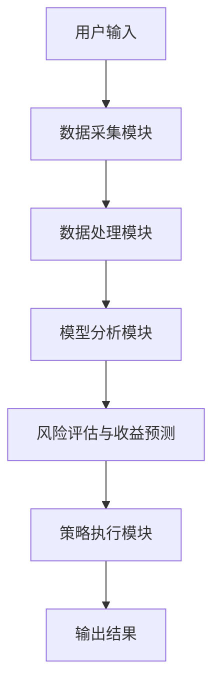

                 


# 大卫·艾因霍恩的做空策略：价值投资的另一面

**关键词**：大卫·艾因霍恩，做空策略，价值投资，风险管理，资产定价模型，投资决策系统

**摘要**：  
大卫·艾因霍恩是全球闻名的价值投资者，他以独特的做空策略闻名于世。本文将深入分析大卫·艾因霍恩的做空策略，探讨其与传统价值投资的联系与区别，从数学模型、系统架构、项目实战等多个维度进行详细阐述，揭示价值投资的另一面。通过本文，读者将能够全面理解大卫·艾因霍恩的做空策略，及其在现代投资实践中的应用。

---

## 第1章: 价值投资与做空策略的背景介绍

### 1.1 价值投资的起源与发展

#### 1.1.1 价值投资的核心理念  
价值投资是一种以基本面分析为核心的长期投资策略，强调以低于内在价值的价格买入优质资产。其核心理念包括：  
1. **安全边际**：买入价格远低于内在价值的资产，以降低风险。  
2. **长期视角**：关注企业的长期盈利能力，而非短期市场波动。  
3. **逆人性**：在市场恐慌时买入，在市场狂热时卖出。  

#### 1.1.2 做空策略在价值投资中的地位  
做空策略是价值投资的“另一面”。传统价值投资强调买入低估资产，而做空策略则强调卖出高估资产。大卫·艾因霍恩的独特之处在于，他通过基本面分析发现市场泡沫，并通过做空获利。  

#### 1.1.3 大卫·艾因霍恩的投资风格  
大卫·艾因霍恩是格林希尔资本（Greenlight Capital）的创始人，他的投资风格以“猎狗式”基本面分析著称。他善于发现市场中的错误定价，并通过做空策略获利。他的成功案例包括2008年次贷危机前做空抵押贷款债券。

---

## 第2章: 做空策略的核心概念与联系

### 2.1 价值投资与做空策略的定义

#### 2.1.1 价值投资的定义与特点  
- **定义**：价值投资是一种以低于市场价买入优质资产的投资策略。  
- **特点**：强调安全边际、长期视角、逆人性。  

#### 2.1.2 做空策略的定义与特点  
- **定义**：做空策略是通过借入高估资产并卖出，期望在价格下跌后以更低价格买回，从而获利的策略。  
- **特点**：高杠杆风险、逆市场情绪、短期收益潜力大。  

#### 2.1.3 两者之间的关系  
价值投资与做空策略看似对立，实则相辅相成。价值投资关注低估资产的买入机会，而做空策略则关注高估资产的卖出机会。大卫·艾因霍恩的策略是两者的结合，通过基本面分析找到错误定价的资产。

### 2.2 核心概念对比分析

#### 2.2.1 价值投资与做空策略的异同  
| **维度** | **价值投资** | **做空策略** |
|----------|---------------|--------------|
| 目标     | 买入低估资产 | 卖出高估资产 |
| 风险     | 中等           | 高           |
| 收益     | 长期稳定       | 短期高收益    |

#### 2.2.2 做空策略与传统投资策略的对比  
| **维度** | **做空策略** | **传统多头策略** |
|----------|--------------|-----------------|
| 风险     | 高           | 中等            |
| 收益     | 短期高收益    | 长期稳定收益    |
| 市场情绪 | 逆市场情绪    | 顺势而为         |

#### 2.2.3 做空策略的核心要素  
1. **基本面分析**：寻找错误定价的资产。  
2. **市场情绪分析**：判断市场是否高估资产。  
3. **风险管理**：严格控制杠杆和头寸。  

---

## 第3章: 做空策略的数学模型与公式

### 3.1 做空策略的风险评估模型

#### 3.1.1 风险调整后的收益计算公式  
$$ \text{风险调整后收益} = \text{预期收益} - \text{风险溢价} $$  

#### 3.1.2 夏普比率与索提诺比率  
- **夏普比率**：衡量单位风险超额收益。  
  $$ \text{夏普比率} = \frac{E(r) - r_f}{\sigma} $$  
- **索提诺比率**：衡量下行风险的超额收益。  
  $$ \text{索提诺比率} = \frac{E(r) - r_f}{\text{下行标准差}} $$  

#### 3.1.3 风险价值（VaR）模型  
VaR模型用于估计在给定置信水平下可能的最大损失。例如，95%置信水平下的VaR意味着在95%的概率下，损失不会超过该值。  

### 3.2 做空策略的收益预测模型

#### 3.2.1 资产定价模型（CAPM）  
CAPM用于评估资产的预期收益：  
$$ E(r_i) = r_f + \beta_i (E(r_m) - r_f) $$  
其中，$\beta_i$是资产的贝塔系数，衡量其相对于市场的波动性。  

#### 3.2.2 风险中性定价模型  
风险中性定价假设市场参与者对风险持中性态度。  
$$ E(r_i) = r_f + \alpha \times \text{风险溢价} $$  

---

## 第4章: 做空策略的系统分析与架构设计

### 4.1 投资决策系统的整体架构

#### 4.1.1 数据采集模块  
- 数据来源：股票价格、财务报表、市场情绪数据。  
- 数据处理：清洗、标准化、特征提取。  

#### 4.1.2 模型分析模块  
- 风险评估：夏普比率、VaR模型。  
- 收益预测：CAPM、风险中性定价模型。  

#### 4.1.3 策略执行模块  
- 系统交互：数据输入、模型分析、策略执行。  

### 4.2 系统交互流程图



---

## 第5章: 做空策略的项目实战

### 5.1 环境安装与数据准备

#### 5.1.1 投资分析工具安装  
- 工具：Python、Pandas、NumPy、Matplotlib。  

#### 5.1.2 数据源获取与处理  
- 数据源：Yahoo Finance、Alpha Vantage。  
- 数据处理：清洗、标准化、特征工程。  

### 5.2 核心算法实现

#### 5.2.1 风险评估代码  
```python
import numpy as np

def calculate_sharpe_ratio(returns, risk_free_rate):
    excess_returns = returns - risk_free_rate
    sharpe_ratio = np.mean(excess_returns) / np.std(excess_returns)
    return sharpe_ratio
```

#### 5.2.2 收益预测代码  
```python
import pandas as pd
from sklearn.linear_model import LinearRegression

def predict_returns(features, labels):
    model = LinearRegression()
    model.fit(features, labels)
    return model.predict(features)
```

---

## 第6章: 做空策略的最佳实践与小结

### 6.1 投资策略的注意事项

#### 6.1.1 做空策略的风险管理  
- 严格控制杠杆比例。  
- 设置止损点。  

#### 6.1.2 做空策略的适用场景  
- 市场出现明显泡沫时。  
- 个股基本面恶化时。  

#### 6.1.3 长期与短期结合  
做空策略适合短期获利，但长期投资仍需关注基本面。  

### 6.2 项目总结与未来展望

#### 6.2.1 本项目的核心收获  
- 理解了大卫·艾因霍恩的做空策略。  
- 掌握了相关的数学模型与系统架构。  

#### 6.2.2 未来研究方向与改进空间  
- 结合机器学习优化风险评估模型。  
- 开发实时监控系统。  

### 6.3 扩展阅读与参考资料

#### 6.3.1 相关书籍推荐  
1. 《价值投资：从格雷厄姆到巴菲特》  
2. 《投资之道：大卫·艾因霍恩的投资哲学》  

#### 6.3.2 在线资源  
- 大卫·艾因霍恩的演讲视频。  
- 专业投资论坛与社区。  

---

**作者：AI天才研究院 & 禅与计算机程序设计艺术**

