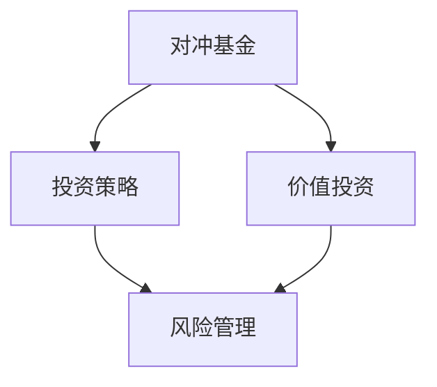
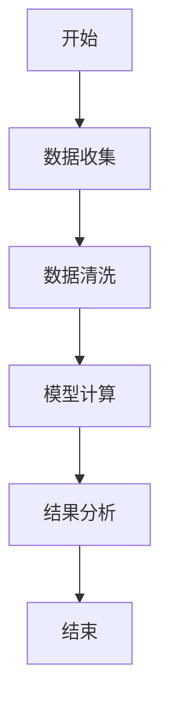
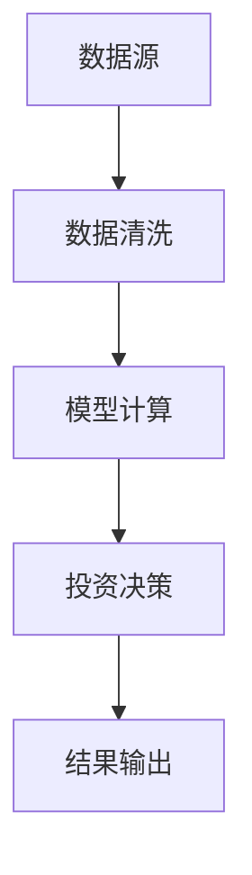
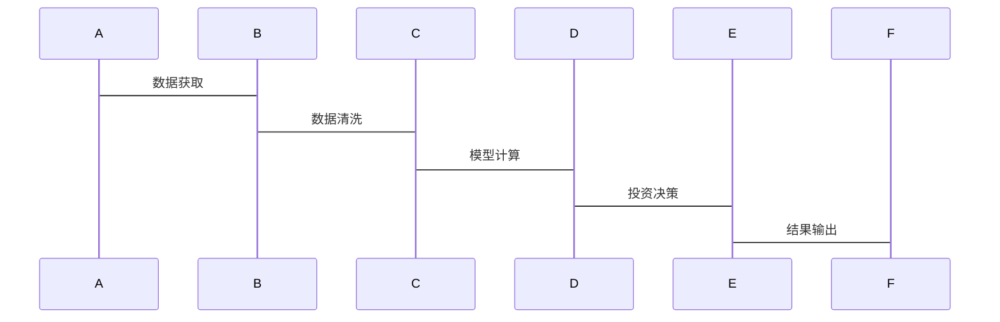

                 


# 大卫·艾因霍恩的对冲基金价值投资：机构投资者的视角

## 关键词：对冲基金，价值投资，大卫·艾因霍恩，机构投资者，投资策略

## 摘要：本文从机构投资者的视角，详细分析大卫·艾因霍恩的对冲基金价值投资理念，探讨其投资策略、数学模型和系统架构，结合实际案例进行深入剖析，为机构投资者提供实战指导和最佳实践建议。

---

# 第一部分: 对冲基金与价值投资的背景与基础

## 第1章: 对冲基金与价值投资的概述

### 1.1 对冲基金的基本概念
#### 1.1.1 对冲基金的定义与特点
对冲基金是一种通过多空头策略进行投资的金融工具，其核心在于利用市场波动进行套利和对冲风险。对冲基金的特点包括高度杠杆化、灵活的资产配置以及复杂的交易策略。

#### 1.1.2 对冲基金的历史发展
对冲基金起源于20世纪50年代，经历了从简单套利到复杂多策略的演变。近年来，随着量化交易和算法交易的兴起，对冲基金在金融市场的影响力日益增强。

#### 1.1.3 对冲基金的运作机制
对冲基金通过多空头策略、杠杆操作和高频交易等手段，追求绝对收益。其运作机制涉及复杂的金融模型和风险管理。

### 1.2 价值投资的核心理念
#### 1.2.1 价值投资的定义与特点
价值投资是一种长期投资策略，强调以低于内在价值的价格购买优质资产。其核心在于寻找市场中的低估资产，并长期持有。

#### 1.2.2 价值投资的核心原则
价值投资强调安全边际、长期视角和对公司的深入研究。投资者需要关注公司的基本面，如盈利能力、财务状况和行业地位。

#### 1.2.3 价值投资与对冲基金的结合
对冲基金将价值投资理念与量化分析相结合，利用市场波动和资产错配寻找投资机会。

### 1.3 大卫·艾因霍恩的对冲基金投资理念
#### 1.3.1 大卫·艾因霍恩的背景介绍
大卫·艾因霍恩是一位著名的价值投资者和对冲基金经理，以其独特的投资策略和卓越的业绩闻名。

#### 1.3.2 艾因霍恩的投资策略
艾因霍恩注重深度研究和风险控制，善于在市场波动中寻找低估资产。他对冲基金的核心策略是通过价值投资发现潜在收益机会。

#### 1.3.3 艾因霍恩对冲基金的成功案例
通过具体案例分析，展示艾因霍恩如何运用价值投资理念取得成功。

### 1.4 本章小结
本章介绍了对冲基金和价值投资的基本概念，并详细分析了大卫·艾因霍恩的投资理念和策略。

---

## 第2章: 对冲基金与价值投资的核心概念与联系

### 2.1 对冲基金的核心概念
#### 2.1.1 对冲基金的运作模式
对冲基金通过多空头策略、杠杆操作和高频交易等手段，追求绝对收益。

#### 2.1.2 对冲基金的风险管理
对冲基金通过严格的风险控制和对冲策略，降低市场波动带来的风险。

#### 2.1.3 对冲基金的绩效评估
对冲基金的绩效评估注重绝对收益和风险调整后收益。

### 2.2 价值投资的核心概念
#### 2.2.1 价值投资的选股标准
价值投资者注重公司的基本面，寻找被市场低估的资产。

#### 2.2.2 价值投资的长期视角
价值投资强调长期持有，关注公司内在价值的增长。

#### 2.2.3 价值投资的安全边际
安全边际是指购买价格低于内在价值的幅度，是价值投资的重要原则。

### 2.3 对冲基金与价值投资的结合
#### 2.3.1 对冲基金中的价值投资策略
对冲基金将价值投资理念与量化分析相结合，利用市场波动和资产错配寻找投资机会。

#### 2.3.2 价值投资在对冲基金中的应用
通过对冲基金的灵活策略，价值投资者可以在市场波动中捕捉低估资产。

#### 2.3.3 对冲基金与价值投资的优劣势对比
对比对冲基金和价值投资的优劣势，分析其在不同市场环境下的表现。

### 2.4 核心概念对比表格
| 比较维度 | 对冲基金 | 价值投资 |
|----------|----------|----------|
| 投资目标 | 绝对收益 | 相对收益 |
| 投资策略 | 多空头、杠杆 | 长期持有、低估资产 |
| 风险管理 | 严格对冲 | 依赖安全边际 |

### 2.5 系统架构图（Mermaid流程图）


### 2.6 本章小结
本章深入分析了对冲基金和价值投资的核心概念，并探讨了它们的结合与对比。

---

## 第3章: 对冲基金价值投资的算法原理

### 3.1 价值投资的数学模型
#### 3.1.1 贴现现金流模型（DCF）
贴现现金流模型是价值投资的重要工具，用于评估资产的内在价值。

公式：
$$ \text{DCF} = \sum_{t=1}^{n} \frac{\text{CF}_t}{(1 + r)^t} $$

#### 3.1.2 市盈率与市净率分析
市盈率（P/E）和市净率（P/B）是常用的估值指标。

#### 3.1.3 股息率与股息增长模型
股息率是衡量资产收益的重要指标，股息增长模型用于预测股息未来增长。

### 3.2 对冲基金中的算法应用
#### 3.2.1 算法原理概述
对冲基金通过算法交易和量化分析，优化投资策略。

#### 3.2.2 价值投资的量化模型
量化模型将价值投资理念转化为数学公式，用于指导投资决策。

#### 3.2.3 算法流程图（Mermaid）


### 3.3 算法实现代码
```python
# 示例代码：DCF模型计算
def discounted_cash_flow(cash_flows, discount_rate):
    return sum(cash_flow / (1 + discount_rate) ** t for t, cash_flow in enumerate(cash_flows))
```

### 3.4 本章小结
本章介绍了价值投资的数学模型，并展示了如何在对冲基金中应用算法进行投资决策。

---

## 第4章: 对冲基金价值投资的系统架构

### 4.1 项目介绍
对冲基金价值投资系统用于指导机构投资者进行投资决策。

### 4.2 系统功能设计
#### 4.2.1 数据获取与清洗
系统需要获取市场数据并进行清洗。

#### 4.2.2 模型计算
系统通过量化模型计算资产的内在价值。

#### 4.2.3 投资决策
系统根据计算结果生成投资策略。

### 4.3 系统架构设计（Mermaid）


### 4.4 系统交互（Mermaid序列图）


### 4.5 本章小结
本章设计了一个完整的对冲基金价值投资系统，展示了其架构和功能。

---

## 第5章: 项目实战与案例分析

### 5.1 环境安装
介绍如何搭建对冲基金价值投资系统的开发环境。

### 5.2 核心实现代码
展示价值投资模型的实现代码。

### 5.3 案例分析
以苹果公司为例，展示如何应用价值投资策略进行投资分析。

### 5.4 本章小结
本章通过实际案例，展示了如何应用对冲基金价值投资策略进行投资决策。

---

## 第6章: 总结与展望

### 6.1 本章总结
总结大卫·艾因霍恩的对冲基金价值投资理念及其在机构投资者中的应用。

### 6.2 最佳实践 tips
给出实际操作中的注意事项和建议。

### 6.3 未来展望
展望对冲基金价值投资的未来发展方向。

---

## 作者：AI天才研究院/AI Genius Institute & 禅与计算机程序设计艺术 /Zen And The Art of Computer Programming

