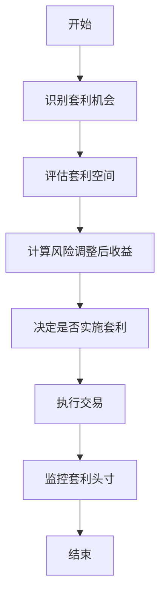
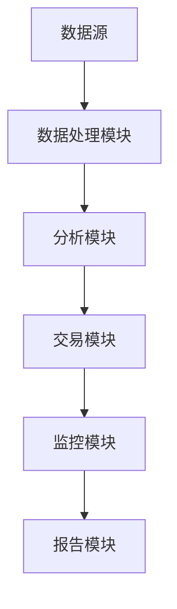
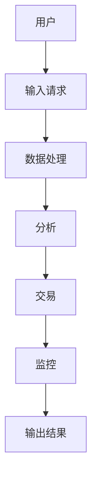

                 

# 大卫·艾因霍恩的短期价值投资：市场错误定价的套利

---

## 关键词：
- 短期价值投资、大卫·艾因霍恩、市场错误定价、套利策略、数学模型、系统架构、投资分析

---

## 摘要：
大卫·艾因霍恩是一位著名的短期价值投资者，专注于识别市场中被错误定价的投资机会，并通过套利策略获利。本文深入分析了艾因霍恩的投资理念、套利策略的核心概念、数学模型、系统架构，以及实际案例分析。通过详细的技术分析和系统设计，揭示了如何利用市场错误定价进行套利，并结合项目实战，展示了套利策略的实施过程。最后，本文总结了套利策略的优缺点，并提出了对投资者的启示。

---

## 正文：

### 第一部分：背景介绍

#### 第1章：短期价值投资的背景

##### 1.1 短期价值投资的定义与特点
- **1.1.1 价值投资的基本概念**
  - 价值投资是一种基于对公司内在价值评估的投资策略，寻找市场价格低于内在价值的证券。
  - 短期价值投资强调在较短的时间内，通过市场波动捕捉定价错误的机会。
- **1.1.2 短期投资与长期投资的差异**
  - 长期投资注重公司基本面的长期表现，而短期投资则关注短期市场波动和定价错误。
  - 短期投资需要更高的市场敏感性和快速决策能力。
- **1.1.3 短期价值投资的核心理念**
  - 寻找市场中被低估的资产，利用短期波动获利。
  - 强调对市场情绪和定价错误的敏锐洞察。

##### 1.2 大卫·艾因霍恩的投资理念
- **1.2.1 艾因霍恩的背景与投资风格**
  - 大卫·艾因霍恩是一位传奇的对冲基金经理，以其成功的短期价值投资策略闻名。
  - 他的投资策略注重市场定价错误，善于在市场波动中寻找套利机会。
- **1.2.2 艾因霍恩的成功案例**
  - 曾成功投资于辉瑞和默克等公司，在市场恐慌时期买入低估资产。
  - 通过精准的市场分析和快速决策，实现了超额收益。
- **1.2.3 艾因霍恩的投资策略**
  - 专注于寻找市场错误定价的资产，尤其是那些具有明确价值但被市场忽视的公司。
  - 利用短期市场波动，迅速获利并平仓。

##### 1.3 市场错误定价的概念
- **1.3.1 市场定价的波动性**
  - 市场价格受多种因素影响，包括市场情绪、宏观经济指标和公司基本面。
  - 价格波动为套利者提供了机会。
- **1.3.2 错误定价的产生原因**
  - 市场参与者的信息不对称、情绪化决策和短期波动导致价格偏离内在价值。
  - 市场参与者对信息的反应不完全理性。
- **1.3.3 错误定价的识别方法**
  - 通过基本面分析和市场数据对比，识别价格与价值的偏差。
  - 利用技术分析工具预测价格波动。

---

### 第二部分：套利策略的核心概念

#### 第2章：套利的基本原理

##### 2.1 套利的定义与类型
- **2.1.1 套利的定义**
  - 套利是指利用资产在不同市场或时间点的价格差异，以低买高卖的方式获利。
  - 套利者通过识别定价错误，利用市场机制获利。
- **2.1.2 常见的套利类型**
  - 股票套利：利用同一股票在不同市场的价格差异。
  - 事件套利：利用公司事件（如并购、重组）带来的股价波动。
  - 跨期套利：利用同一资产在不同时间点的价格差异。
- **2.1.3 套利与投机的区别**
  - 投机基于市场趋势的预测，风险较高。
  - 套利基于定价错误的识别，风险相对较低。

##### 2.2 市场错误定价的套利机会
- **2.2.1 错误定价的识别**
  - 通过对比市场价格与内在价值，识别定价错误。
  - 利用市场数据和分析工具，发现定价偏差。
- **2.2.2 套利机会的评估**
  - 评估套利空间：市场价格与内在价值的差异。
  - 评估套利风险：市场波动、交易成本和执行风险。
- **2.2.3 套利策略的实施步骤**
  - 确定套利目标：识别被低估的资产。
  - 制定交易策略：决定买入和卖出的时间点。
  - 执行交易：利用市场机制获利。

##### 2.3 套利与价值投资的关系
- **2.3.1 套利作为价值投资的补充**
  - 短期套利策略可以作为长期价值投资的补充，利用短期市场波动实现超额收益。
  - 套利策略注重市场定价错误，而价值投资注重长期价值。
- **2.3.2 套利策略的优势**
  - 快速获利：利用短期定价错误，迅速实现收益。
  - 风险可控：通过市场机制分散风险。

---

### 第三部分：套利策略的数学模型和算法

#### 第3章：套利的数学模型

##### 3.1 套利空间的计算
- **3.1.1 市场价格与内在价值的差异**
  - 套利空间 = 内在价值 - 市场价格
  - 公式：$$\text{套利空间} = V - P$$
    - 其中，\( V \) 是内在价值，\( P \) 是市场价格。
- **3.1.2 套利空间的评估**
  - 考虑交易成本和市场摩擦，确保套利空间足以覆盖成本和风险。

##### 3.2 套利策略的风险调整收益模型
- **3.2.1 风险调整后的收益**
  - 考虑市场风险和流动性风险，计算风险调整后的收益。
  - 使用夏普比率衡量收益与风险的关系。
  - 夏普比率公式：$$\text{夏普比率} = \frac{E[r_p - r_f]}{\sigma_p}$$
    - 其中，\( E[r_p - r_f] \) 是超额收益的期望值，\( \sigma_p \) 是组合收益的标准差。

##### 3.3 套利机会识别的流程图

---

### 第四部分：套利策略的系统分析与架构设计

#### 第4章：套利系统的架构设计

##### 4.1 系统功能设计
- **4.1.1 数据收集模块**
  - 收集市场数据，包括股票价格、财务数据和新闻信息。
- **4.1.2 数据分析模块**
  - 使用算法分析数据，识别套利机会。
  - 使用机器学习模型预测市场定价错误。
- **4.1.3 交易执行模块**
  - 根据分析结果，执行买入或卖出指令。
- **4.1.4 监控与报告模块**
  - 监控套利头寸，生成报告。

##### 4.2 系统架构设计

##### 4.3 系统交互流程

---

### 第五部分：套利策略的项目实战

#### 第5章：套利策略的实际案例分析

##### 5.1 案例背景
- **案例公司**：某上市科技公司，基本面良好，但股价因市场恐慌下跌。
- **套利机会**：股价远低于内在价值，存在套利空间。

##### 5.2 数据收集与分析
- 数据收集：收集公司过去三年的财务数据和股价数据。
- 数据分析：计算内在价值，发现股价被低估。

##### 5.3 交易策略
- 买入策略：在股价低于内在价值时买入。
- 卖出策略：在股价回归内在价值时卖出。

##### 5.4 交易执行与监控
- 执行交易：买入该股票。
- 监控股价：定期监控股价走势，及时平仓。

##### 5.5 结果分析
- 实现了预期收益，验证了套利策略的有效性。

---

### 第六部分：总结与反思

#### 第6章：套利策略的总结与反思

##### 6.1 大卫·艾因霍恩的成功经验
- 精准识别套利机会，快速决策，实现超额收益。

##### 6.2 套利策略的优缺点
- **优点**：快速获利，风险可控。
- **缺点**：依赖市场定价错误，需要较高的市场敏感性。

##### 6.3 对投资者的启示
- 短期套利策略可以作为投资组合的补充，但需谨慎管理风险。

---

## 附录

### A. 术语表
- **套利空间**：内在价值与市场价格的差异。
- **夏普比率**：衡量收益与风险的关系。

### B. 案例分析
- 某科技公司套利案例的详细分析。

### C. 工具推荐
- 数据分析工具：Python、Pandas、NumPy。
- 交易执行工具：Interactive Brokers、QuantInstinet。

### D. 参考文献
- 艾因霍恩的著作和其他相关投资书籍。

---

## 作者：AI天才研究院/AI Genius Institute & 禅与计算机程序设计艺术 /Zen And The Art of Computer Programming

---

这篇文章通过详细分析大卫·艾因霍恩的短期价值投资策略，结合数学模型和系统设计，为读者提供了全面的套利策略解读。

