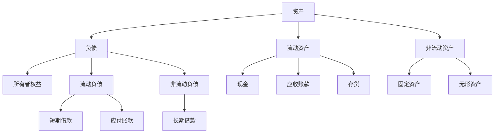
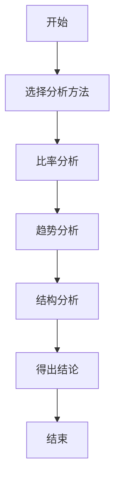
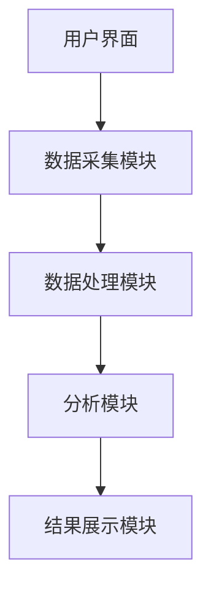

                 

# 《大卫德雷曼的资产负债表分析》

> 关键词：资产负债表分析、财务报表、比率分析、企业财务、财务健康评估

> 摘要：本文深入分析了大卫德雷曼的资产负债表分析方法，从基础概念到高级分析，结合数学模型、算法原理和系统架构设计，详细讲解了资产负债表的核心概念、分析方法和实际应用，帮助读者全面理解并掌握资产负债表分析的技巧和精髓。

---

## 第一部分：资产负债表分析背景与基础

### 第1章：资产负债表的基本概念与重要性

#### 1.1 资产负债表的定义与作用

资产负债表是企业财务报表的重要组成部分，反映了企业在特定时点的资产、负债和所有者权益的状况。它是企业财务健康状况的核心指标之一，能够帮助投资者、债权人和管理层评估企业的财务状况和经营成果。

#### 1.2 资产负债表的核心要素

资产、负债和所有者权益是资产负债表的三大核心要素。资产是企业拥有的资源，负债是企业需要偿还的债务，所有者权益是企业净资产的体现。三者之间的平衡关系为：资产=负债+所有者权益。

#### 1.3 资产负债表的编制与披露要求

资产负债表的编制需要遵循会计准则，确保数据的准确性和一致性。披露要求包括详细列示各项资产、负债和所有者权益的具体内容，以及提供必要的注释和说明。

---

### 第2章：资产负债表的核心概念与联系

#### 2.1 资产负债表的核心概念原理

资产可以分为流动资产和非流动资产，流动资产包括现金、应收账款、存货等，非流动资产包括固定资产、无形资产等。负债同样可以分为流动负债和非流动负债，流动负债包括短期借款、应付账款等，非流动负债包括长期借款等。

#### 2.2 资产负债表的核心概念对比表格

以下是资产、负债和所有者权益的核心概念对比：

| 比较维度 | 资产 | 负债 | 所有者权益 |
|----------|------|------|------------|
| 定义     | 企业拥有的资源 | 企业需要偿还的债务 | 企业的净资产 |
| 流动性   | 可能流动或非流动 | 可能流动或非流动 | 不流动 |
| 重要性   | 反映企业的经营能力 | 反映企业的偿债能力 | 反映企业的资本结构 |

#### 2.3 资产负债表的ER实体关系图

以下是资产负债表的实体关系图（ER图）：

---

### 第3章：资产负债表的分析方法与数学模型

#### 3.1 资产负债表分析的基本方法

资产负债表分析通常包括比率分析、趋势分析和结构分析三种方法。

1. **比率分析**：通过计算各种财务比率，如流动比率、速动比率和负债比率，评估企业的偿债能力和财务健康状况。
2. **趋势分析**：通过比较不同期间的资产负债表数据，分析企业的财务状况变化趋势。
3. **结构分析**：通过计算各项资产、负债和所有者权益占总资产、总负债和总所有者权益的比重，分析企业的资产结构和资本结构。

#### 3.2 资产负债表分析的数学模型与公式

以下是常用的资产负债表分析公式：

1. **流动比率**：$$\text{流动比率} = \frac{\text{流动资产}}{\text{流动负债}}$$

2. **速动比率**：$$\text{速动比率} = \frac{\text{流动资产} - \text{存货}}{\text{流动负债}}$$

3. **负债比率**：$$\text{负债比率} = \frac{\text{总负债}}{\text{总资产}}$$

#### 3.3 资产负债表分析的算法原理

以下是资产负债表分析的流程图：

---

## 第四部分：资产负债表的系统分析与架构设计

### 第4章：资产负债表分析的系统架构设计

#### 4.1 资产负债表分析的系统功能设计

以下是资产负债表分析系统的功能模块设计：

1. **数据采集模块**：采集企业的资产负债表数据，包括资产、负债和所有者权益的具体项目。
2. **数据处理模块**：对采集的数据进行清洗、转换和标准化处理。
3. **分析模块**：基于处理后的数据，计算各项财务比率和进行趋势分析。
4. **结果展示模块**：将分析结果以图表和报告的形式展示出来。

#### 4.2 资产负债表分析的系统架构设计

以下是资产负债表分析系统的架构图：

---

## 总结与展望

通过对大卫德雷曼的资产负债表分析的深入探讨，我们不仅掌握了资产负债表的核心概念和分析方法，还了解了如何利用系统架构设计和算法原理进行实际的财务分析。未来，随着人工智能和大数据技术的发展，资产负债表分析将更加智能化和自动化，为企业财务管理提供更加高效和精准的支持。

---

**作者：AI天才研究院/AI Genius Institute & 禅与计算机程序设计艺术 /Zen And The Art of Computer Programming**

