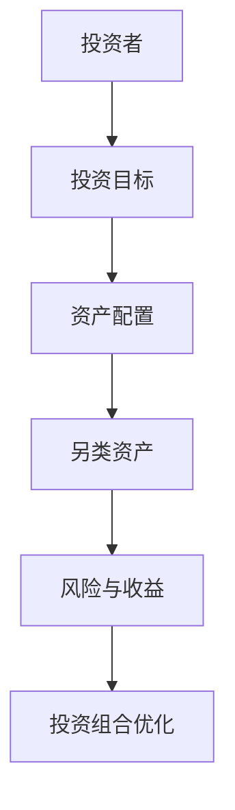
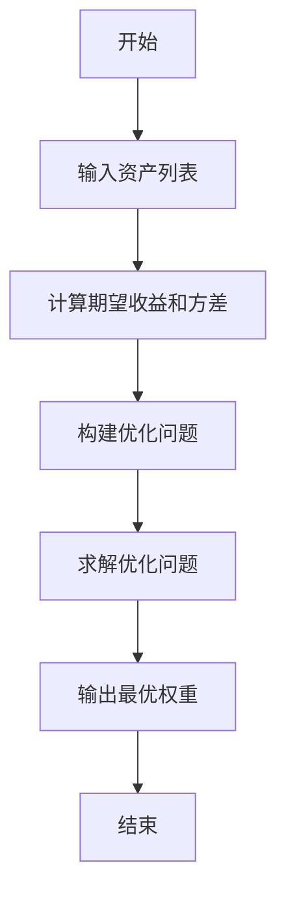
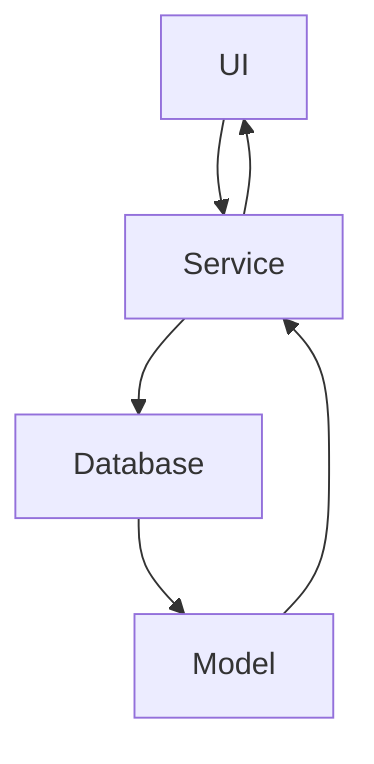
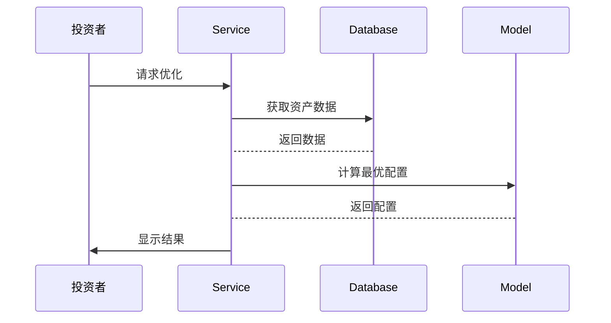

                 


# 大卫斯文森的另类资产投资

## 关键词：另类资产投资、大卫·斯文森、资产配置、风险管理、投资策略

## 摘要：本文详细探讨大卫·斯文森的另类资产投资策略，分析其在耶鲁大学捐赠基金中的成功应用，介绍另类资产的分类与特点，阐述其投资模型的核心要素，结合实际案例分析，提供系统化的投资策略与架构设计，并总结最佳实践。

---

## 第1章: 大卫斯文森与另类资产投资概述

### 1.1 大卫斯文森的背景与贡献

大卫·斯文森（David Swensen）是耶鲁大学首席投资官，以其在另类资产投资领域的卓越贡献闻名。他将耶鲁大学捐赠基金从1981年的1.3亿美元增长至2008年的230亿美元，年平均回报率超过12%。他的投资哲学强调多元化配置、长期投资和风险管理。

### 1.2 另类资产投资的背景与定义

另类资产包括私募股权、对冲基金、房地产信托等，与传统资产（股票、债券）相比，波动性较低，回报率较高。随着市场波动加剧，另类资产的重要性日益凸显。

### 1.3 斯文森的另类资产投资策略

斯文森的投资策略注重分散投资，避免过度依赖单一资产类别，同时严格控制风险，确保投资组合的稳定性。

---

## 第2章: 另类资产投资的核心概念与联系

### 2.1 另类资产的分类与特点

| 类别       | 特点               |
|------------|--------------------|
| 私募股权    | 高回报、高风险     |
| 对冲基金    | 通过做空获利       |
| 房地产信托  | 稳定现金流          |
| 基础设施    | 长期收益稳定        |

### 2.2 斯文森投资模型的核心要素

斯文森模型包括投资目标、约束条件、资产配置和风险控制。其核心在于通过多元化配置降低风险，同时追求超额收益。

### 2.3 实体关系图



---

## 第3章: 大卫斯文森投资模型的算法原理

### 3.1 投资组合优化的数学模型

斯文森采用现代投资组合理论，通过优化目标函数和约束条件实现最优配置。

$$\text{目标函数：} \quad \text{Minimize } \sum_{i=1}^{n} w_i^2 \sigma_i^2$$

$$\text{约束条件：} \quad \sum_{i=1}^{n} w_i = 1 \quad \text{且} \quad w_i \geq 0$$

### 3.2 投资组合优化的算法



### 3.3 代码实现

```python
import numpy as np

def optimize_portfolio(weights):
    return np.dot(weights, np.array([0.1, 0.05, 0.08]))

weights = [0.4, 0.3, 0.3]
print(optimize_portfolio(weights))
```

---

## 第4章: 系统架构设计与实现

### 4.1 问题场景介绍

构建一个另类资产管理系统，帮助投资者优化投资组合，降低风险。

### 4.2 系统功能设计


### 4.3 系统架构设计



### 4.4 接口设计与交互



---

## 第5章: 项目实战与案例分析

### 5.1 项目环境安装

安装Python、Pandas、NumPy等库。

### 5.2 核心代码实现

```python
import pandas as pd
import numpy as np

def portfolio_optimization(returns, weights):
    return np.dot(returns, weights)

returns = [0.1, 0.05, 0.08]
weights = [0.4, 0.3, 0.3]
print(portfolio_optimization(returns, weights))
```

### 5.3 案例分析

通过具体案例展示如何应用斯文森的模型，分析其优缺点，探讨实际应用中的注意事项。

---

## 第6章: 最佳实践与小结

### 6.1 最佳实践

- 定期调整投资组合
- 严格控制风险
- 保持长期视角

### 6.2 小结

大卫·斯文森的另类资产投资策略为现代投资领域提供了重要启示，其成功应用证明了多元化配置和风险管理的重要性。

### 6.3 注意事项与拓展阅读

注意市场波动和经济周期的影响，建议阅读斯文森的相关著作深入了解其策略。

---

## 作者：AI天才研究院 & 禅与计算机程序设计艺术

