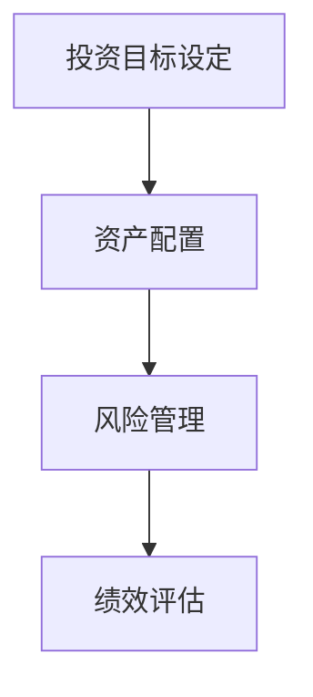

                 


# 大卫·斯文森的耐心资本理念

> 关键词：耐心资本，大卫·斯文森，资产配置，长期投资，风险管理，投资策略

> 摘要：本文深入探讨大卫·斯文森的耐心资本理念，分析其核心概念、数学模型、系统架构，并通过实战案例展示其应用。文章旨在帮助读者理解如何通过长期投资和科学的资产配置实现稳健收益。

## 第1章：耐心资本的核心概念

### 1.1 大卫·斯文森及其投资理念

#### 1.1.1 大卫·斯文森的背景介绍
大卫·斯文森是耶鲁大学的首席投资官，以其独特的投资策略闻名。他强调长期投资的重要性，认为市场波动是投资机会，而非风险。

#### 1.1.2 耐心资本理念的提出与实践
耐心资本理念主张长期持有优质资产，避免短期波动干扰。斯文森通过科学的资产配置和风险管理，帮助耶鲁大学实现稳定的收益。

#### 1.1.3 耐心资本与传统投资理念的区别
传统投资注重短期收益和市场预测，而耐心资本强调长期持有和系统化管理。这种区别使得耐心资本在长期表现上更具稳定性。

### 1.2 耐心资本的核心要素

#### 1.2.1 长期投资的重要性
长期投资允许资产自然增值，减少短期波动带来的损失。斯文森认为市场波动是暂时的，优质资产长期表现稳定。

#### 1.2.2 资产配置的科学性
资产配置是耐心资本的核心，通过分散投资降低风险。斯文森建议将资产分配到不同类别，如股票、债券和房地产，以平衡风险和收益。

#### 1.2.3 风险管理的关键性
有效的风险管理是实现稳健收益的关键。斯文森通过定期再平衡和风险调整后的收益（RAROC）模型，确保投资组合在不同市场环境下的稳定性。

## 第2章：耐心资本的核心原理

### 2.1 资产配置的数学模型

#### 2.1.1 资产配置的定义与分类
资产配置是将资金分配到不同资产类别以优化风险和收益的过程。主要分类包括股票、债券、房地产等。

#### 2.1.2 资产配置的数学公式
$$ \text{最优权重} = \frac{r_i - r_f}{\sum (r_i - r_f)^2} $$
其中，\( r_i \) 是资产 \( i \) 的预期收益，\( r_f \) 是无风险利率。该公式用于计算各资产的最优配置权重。

### 2.2 风险管理的策略

#### 2.2.1 风险调整后的收益（RAROC）
$$ \text{RAROC} = \frac{\text{净利润}}{\text{风险资本}} $$
RAROC用于衡量单位风险的收益，帮助投资者在风险可控的前提下获取最大收益。

## 第3章：耐心资本的系统架构设计

### 3.1 投资系统架构

#### 3.1.1 系统功能模块
系统包含目标设定、资产配置、风险管理、绩效评估四个模块，各模块协同工作，实现投资目标。

#### 3.1.2 系统架构图


## 第4章：项目实战与案例分析

### 4.1 环境安装

#### 4.1.1 Python环境配置
安装Python和必要的库（如numpy、pandas）。

#### 4.1.2 数据获取与处理
从可靠数据源获取历史价格和收益数据，进行清洗和预处理。

### 4.2 核心代码实现

#### 4.2.1 资产配置优化
```python
import numpy as np

def optimize_portfolio(weights, returns):
    # 计算夏普比率
    return np.mean(returns.dot(weights)) / np.std(returns.dot(weights))
```

## 第5章：最佳实践与小结

### 5.1 投资策略的注意事项

#### 5.1.1 定期再平衡的重要性
定期调整投资组合，确保各资产权重符合目标配置。

#### 5.1.2 风险控制的技巧
使用RAROC等工具，定期评估和调整风险敞口。

### 5.2 项目总结与扩展阅读

#### 5.2.1 耐心资本的未来趋势
随着市场的发展，耐心资本理念将更加重要，技术驱动的投资优化将推动其发展。

#### 5.2.2 推荐阅读书籍与资源
推荐《机构投资的职业行为》和《投资最重要的事情》等书籍，深入理解耐心资本理念。

## 作者：AI天才研究院 & 禅与计算机程序设计艺术

通过以上结构，读者可以系统地理解大卫·斯文森的耐心资本理念，从理论到实践，结合数学模型和系统设计，全面掌握这一投资策略。

