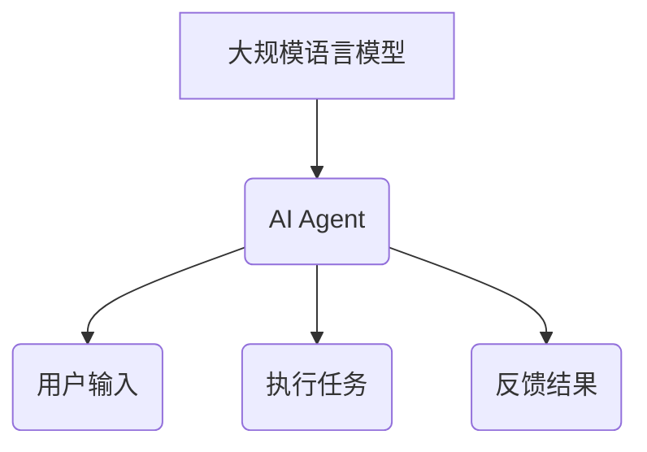
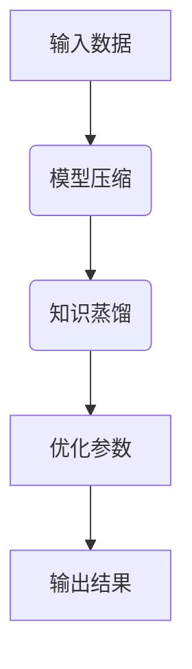
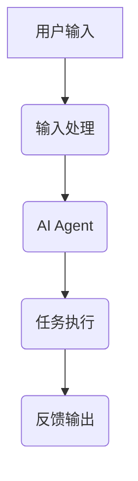
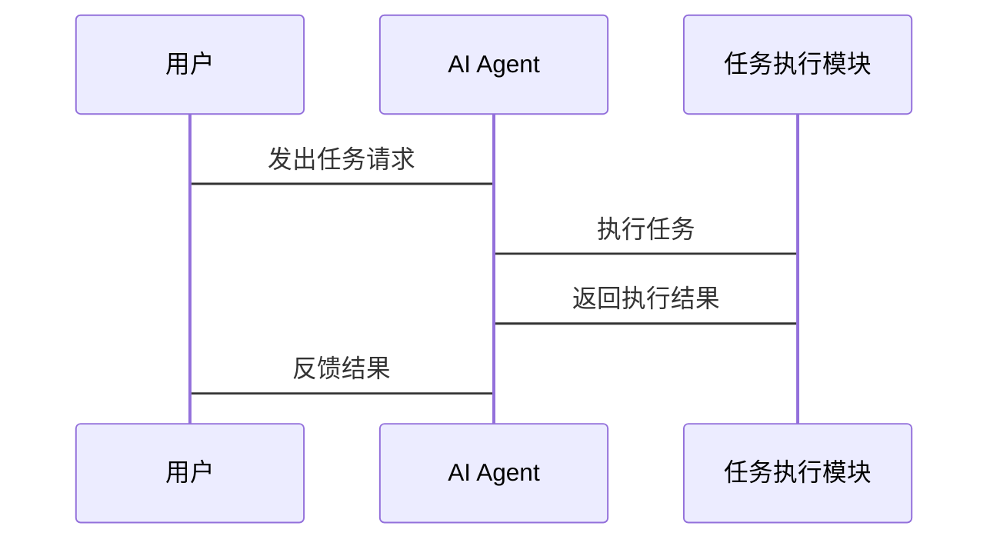

                 


# 大规模语言模型在AI Agent中的低资源适应

> **关键词**: 大规模语言模型、AI Agent、低资源适应、模型压缩、知识蒸馏、动态优化  
> **摘要**: 本文深入探讨了大规模语言模型在AI Agent中的低资源适应问题，分析了低资源环境下模型的优化策略，包括模型压缩、知识蒸馏和动态参数调整等方法，并结合实际案例，提出了系统化的解决方案。文章从背景介绍、核心概念、算法原理到系统设计和项目实战，全面阐述了如何在资源受限的环境中高效部署和应用大规模语言模型。

---

## 第一部分: 大规模语言模型在AI Agent中的低资源适应背景与核心概念

### 第1章: 问题背景与描述

#### 1.1 问题背景

随着人工智能技术的飞速发展，大规模语言模型（如GPT系列、BERT等）在自然语言处理领域取得了显著成果。然而，在实际应用中，尤其是在资源受限的环境中（如移动设备、边缘计算设备等），这些模型的计算资源需求和内存占用成为主要瓶颈。AI Agent作为一种能够执行复杂任务的智能体，通常需要依赖大规模语言模型提供强大的语言理解和生成能力。但在低资源环境下，直接部署大规模语言模型往往不可行，必须进行适应性优化。

#### 1.2 问题描述

大规模语言模型通常需要大量的计算资源和内存支持，这在低资源环境下难以满足实际需求。AI Agent在执行任务时，可能需要实时响应，而资源限制可能导致模型运行缓慢、响应延迟或无法正常工作。此外，不同场景下的资源需求也存在差异，如何在不同环境中动态调整模型参数，以适应资源变化，是当前面临的主要挑战。

#### 1.3 问题解决思路

为了解决上述问题，可以采取以下策略：

1. **模型压缩**：通过剪枝、量化等技术减少模型的参数数量，降低计算和存储需求。
2. **知识蒸馏**：将大模型的知识迁移到小模型中，保留核心功能的同时减少资源消耗。
3. **动态参数调整**：根据当前资源情况动态优化模型参数，平衡性能与资源消耗。

#### 1.4 边界与外延

- **低资源环境的定义**：包括计算能力有限、内存不足、网络带宽受限等场景。
- **大模型适应的适用范围**：适用于需要快速响应且资源受限的场景，如移动端应用、物联网设备等。
- **相关技术的边界**：模型压缩与优化技术需要在不影响模型性能的前提下进行。

#### 1.5 核心要素与概念结构

大规模语言模型和AI Agent之间的关系可以分为以下几个核心要素：

1. **模型压缩**：减少模型参数，降低计算需求。
2. **知识蒸馏**：将大模型的知识迁移到小模型。
3. **动态优化**：根据环境变化调整模型参数。

---

### 第2章: 核心概念与联系

#### 2.1 大规模语言模型与AI Agent的关系

1. **大模型作为知识库**：AI Agent依赖大模型提供语言理解和生成能力。
2. **AI Agent作为执行者**：AI Agent利用大模型的能力完成特定任务。
3. **协同工作机制**：AI Agent根据任务需求调用大模型的不同功能模块。

#### 2.2 核心概念原理

1. **模型压缩原理**：
   - **剪枝**：移除冗余参数，减少计算量。
   - **量化**：将模型参数从浮点数转换为更小的整数类型。
2. **知识蒸馏原理**：
   - **教师模型**：大模型作为教师，指导小模型学习。
   - **蒸馏过程**：小模型通过模仿教师模型的输出，逐步掌握知识。
3. **适应性优化原理**：
   - **动态调整**：根据资源情况实时优化模型参数。
   - **局部优化**：针对特定任务进行参数调整。

#### 2.3 概念属性特征对比

| 特征           | 大规模语言模型       | AI Agent         | 低资源适应       |
|----------------|----------------------|------------------|------------------|
| 核心功能       | 语言理解和生成       | 执行复杂任务     | 优化资源利用     |
| 资源需求       | 高                   | 中到高           | 低               |
| 适用场景       | 需大量计算资源       | 需实时响应       | 资源受限场景     |
| 优化策略       | 模型压缩             | 知识蒸馏         | 动态参数调整     |

#### 2.4 ER实体关系图



---

## 第二部分: 算法原理与数学模型

### 第3章: 算法原理讲解

#### 3.1 模型压缩算法

1. **参数剪枝原理**：
   - 移除模型中冗余的权重参数，减少计算量。
   - 通过L1/L2正则化方法确定冗余参数。

2. **矩阵低秩分解**：
   - 将权重矩阵分解为低秩矩阵，减少参数数量。
   - 使用奇异值分解（SVD）等方法实现。

3. **知识蒸馏流程**：
   - 教师模型（大模型）生成软目标标签。
   - 学生模型（小模型）通过最小化预测概率分布的差异进行学习。

#### 3.2 适应性优化算法

1. **动态参数调整**：
   - 根据当前资源利用率动态调整模型参数。
   - 使用反馈机制实时优化参数。

2. **现场适应策略**：
   - 在特定场景下微调模型，适应具体任务需求。
   - 通过少量数据快速调整模型参数。

3. **分布式优化方法**：
   - 利用分布式计算资源并行优化模型参数。
   - 使用分布式训练技术降低单点资源压力。

#### 3.3 算法流程图



#### 3.4 Python核心实现代码

```python
def model_compress(model):
    # 参数剪枝
    pruned_model = prune(model, method='L1')
    # 矩阵低秩分解
    decomposed_model = decompose(pruned_model, rank=100)
    return decomposed_model
```

#### 3.5 数学模型与公式

1. **损失函数**：
   $$ L = \text{cross\_entropy}(y_{\text{pred}}, y_{\text{true}}) + \lambda \cdot \text{regularization}(W) $$
   其中，$$ \lambda $$ 是正则化系数，$$ W $$ 是模型权重。

2. **优化目标**：
   $$ \min_{W} L $$

---

## 第三部分: 系统分析与架构设计

### 第4章: 系统分析与架构设计

#### 4.1 系统应用场景

- **移动设备**：在手机等移动设备上运行AI Agent，要求低资源消耗。
- **边缘计算**：在边缘设备上部署AI Agent，减少对云端的依赖。
- **嵌入式系统**：在嵌入式设备上部署，要求极低的资源消耗。

#### 4.2 系统功能设计

1. **领域模型设计**：
   - 用户输入处理模块。
   - 任务执行模块。
   - 反馈输出模块。

2. **系统架构设计**：



3. **系统交互序列图**：



#### 4.3 系统接口设计

1. **输入接口**：
   - 接收用户输入的自然语言指令。
   - 支持多种输入格式（文本、语音等）。

2. **输出接口**：
   - 返回任务执行结果。
   - 支持多种输出格式（文本、语音、动作等）。

---

## 第四部分: 项目实战

### 第5章: 项目实战

#### 5.1 环境安装

1. **Python环境**：安装Python 3.8及以上版本。
2. **框架安装**：安装TensorFlow、Keras等深度学习框架。
3. **依赖库安装**：安装必要的数学库（如NumPy）和可视化库（如Matplotlib）。

#### 5.2 核心代码实现

```python
def dynamic_optimize(model, resources):
    # 根据资源情况动态调整模型参数
    if resources['memory'] < 500:
        model.prune_parameters(0.5)
    if resources['compute'] < 100:
        model.quantize(8)
    return model
```

#### 5.3 代码解读与分析

- **动态优化函数**：根据当前资源情况调整模型参数。
  - **内存不足**：进行参数剪枝，减少模型大小。
  - **计算能力不足**：进行参数量化，降低计算复杂度。

#### 5.4 案例分析与详细解读

案例：在移动设备上部署AI Agent，优化模型以适应低资源环境。

1. **初始模型**：一个包含10亿参数的大模型。
2. **剪枝优化**：将参数减少至5亿。
3. **量化优化**：将参数从32位减少至8位，进一步降低内存占用。
4. **知识蒸馏**：使用小模型模仿大模型输出，进一步优化性能。

#### 5.5 项目小结

通过动态参数调整和知识蒸馏，成功将大模型压缩至适配低资源环境，同时保持了模型的性能。

---

## 第五部分: 最佳实践与总结

### 第6章: 最佳实践与总结

#### 6.1 小结

- **核心内容回顾**：探讨了大规模语言模型在AI Agent中的低资源适应问题，分析了模型压缩、知识蒸馏和动态优化的策略。
- **关键点总结**：在低资源环境下，动态调整模型参数和利用知识蒸馏技术是实现高效部署的关键。

#### 6.2 注意事项

1. **模型压缩**：需权衡性能与资源消耗，避免过度压缩导致性能下降。
2. **动态优化**：需实时监控资源状态，及时调整模型参数。
3. **知识蒸馏**：需选择合适的教师模型和蒸馏策略，确保学生模型性能。

#### 6.3 拓展阅读

1. 《深度学习》——Ian Goodfellow
2. 《神经网络与深度学习》——周志华
3. 《大模型与小模型的优化之道》——AI Genius Institute

---

## 作者信息

**作者：AI天才研究院（AI Genius Institute）**  
**简介**：专注于人工智能领域的研究与实践，致力于推动AI技术的创新与应用。

