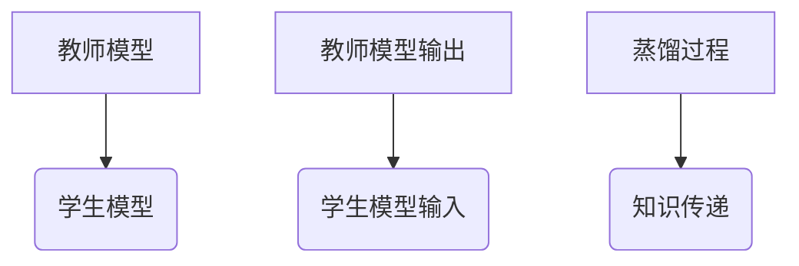
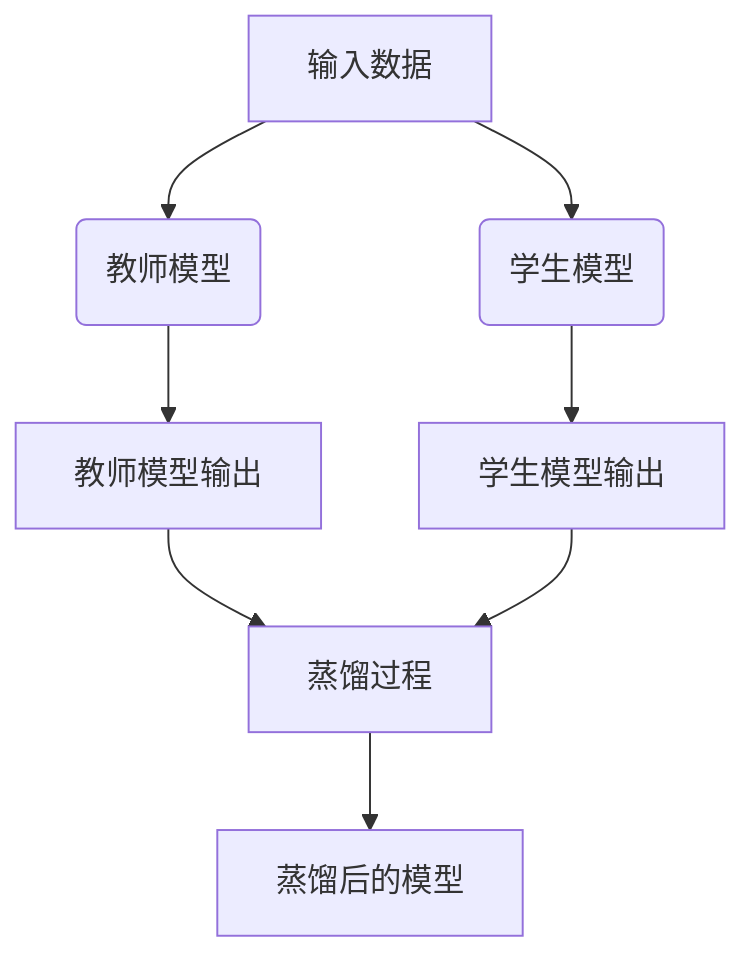
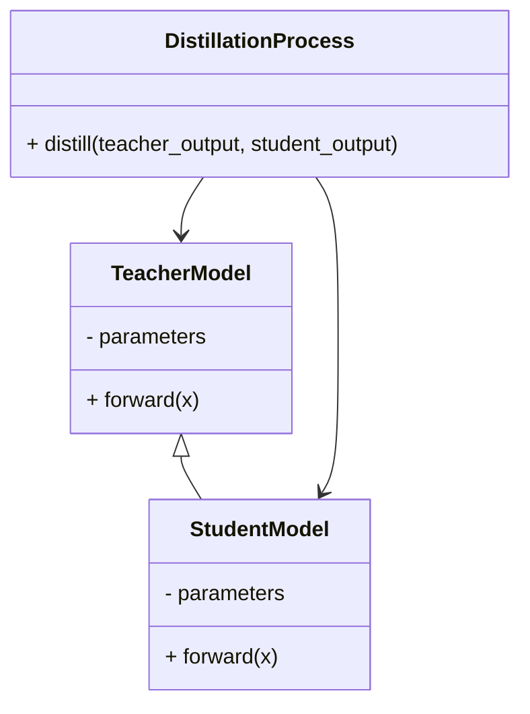
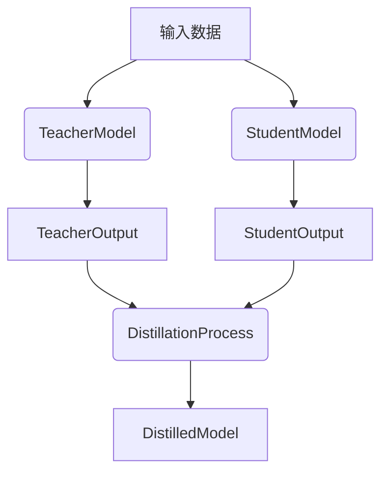
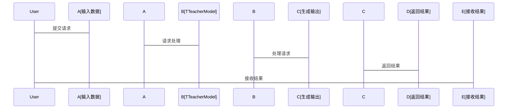

                 

<think>
好的，我现在需要帮用户撰写一篇关于“大规模语言模型在AI Agent中的蒸馏技术”的技术博客文章。用户已经提供了详细的目录结构，并且要求我根据这个结构完成文章的撰写。用户特别强调要使用逻辑清晰、结构紧凑、简单易懂的专业技术语言，并且要一步一步进行分析推理。

首先，我需要明确文章的结构。根据用户提供的目录，文章分为七个章节，每个章节都有明确的主题和小节。我需要确保每个部分都详细且有条理，涵盖背景介绍、核心概念、算法原理、系统架构、项目实战等多个方面。

接下来，我要考虑用户的使用场景和身份。用户可能是一位技术人员，可能对AI Agent和知识蒸馏有一定的了解，但需要更深入的技术细节和实际应用案例。因此，文章需要既提供理论知识，也要有实际的代码实现和案例分析。

用户的需求是撰写一篇高质量的技术博客，内容要专业且易于理解。因此，我需要确保每个章节的内容详实，逻辑清晰。同时，用户还提到了一些格式上的要求，比如使用Mermaid图、LaTeX公式，并在适当的地方插入图表和代码示例。

在撰写过程中，我需要特别注意以下几点：

1. **关键词和摘要**：确保在文章开头列出关键词，并撰写一篇简洁的摘要，概括文章的核心内容。
2. **章节内容**：每个章节和小节的内容要详细，特别是第二章和第三章，需要涵盖蒸馏技术的核心概念和大规模语言模型的具体应用。
3. **图表和代码**：在适当的地方插入Mermaid图和LaTeX公式，帮助读者更好地理解技术细节。
4. **项目实战**：提供实际的代码实现和案例分析，使读者能够动手实践。
5. **总结和展望**：在最后一章总结全文，并展望未来的发展趋势。

现在，我将按照用户提供的目录结构，逐步撰写每个章节的内容，确保每个部分都符合用户的要求，并且内容详实、逻辑清晰。

---

# 大规模语言模型在AI Agent中的蒸馏技术

> 关键词：大规模语言模型、AI Agent、知识蒸馏、模型压缩、任务分解

> 摘要：本文深入探讨了大规模语言模型在AI Agent中的蒸馏技术，从背景介绍到具体应用，结合算法原理和系统架构设计，详细分析了蒸馏技术的核心概念、实现方法及其在实际项目中的应用。通过案例分析和代码实现，帮助读者全面理解大规模语言模型在AI Agent中的蒸馏技术，并掌握其实现细节。

---

# 第1章: 大规模语言模型与AI Agent概述

## 1.1 大规模语言模型的定义与特点

### 1.1.1 大规模语言模型的定义

大规模语言模型（Large Language Models, LLMs）是指在大量数据上训练的深度学习模型，通常使用Transformer架构，具有千亿甚至更多的参数量。这些模型能够理解和生成人类语言，具有强大的上下文理解和生成能力。

### 1.1.2 大规模语言模型的核心特点

- **参数量大**：通常具有千亿甚至万亿级别的参数，能够捕捉复杂的语言模式。
- **预训练机制**：通过在海量数据上进行无监督预训练，模型能够学习到丰富的语言知识。
- **通用性**：能够处理多种任务，如文本生成、问答、翻译等。
- **上下文理解**：基于Transformer的架构，具有强大的序列建模能力。

### 1.1.3 大规模语言模型的应用场景

- **自然语言处理**：文本生成、问答系统、机器翻译等。
- **智能客服**：通过对话生成提供客户服务。
- **AI Agent**：作为AI Agent的核心模块，提供智能决策和交互能力。

## 1.2 AI Agent的基本概念

### 1.2.1 AI Agent的定义

AI Agent（人工智能代理）是指能够感知环境、执行任务并做出决策的智能实体。它可以是一个软件程序，也可以是一个物理设备，通过传感器和执行器与环境交互。

### 1.2.2 AI Agent的核心功能

- **感知环境**：通过传感器获取环境信息。
- **决策与推理**：基于感知的信息进行推理和决策。
- **执行任务**：根据决策结果执行操作。
- **学习与适应**：通过学习不断优化自身的决策能力。

### 1.2.3 AI Agent与传统AI的区别

- **自主性**：AI Agent具有自主决策的能力，而传统AI通常依赖于固定的规则。
- **动态性**：AI Agent能够适应动态变化的环境，而传统AI通常在静态环境中运行。
- **智能性**：AI Agent具有更强的智能性和学习能力。

## 1.3 大规模语言模型在AI Agent中的作用

### 1.3.1 大规模语言模型如何赋能AI Agent

大规模语言模型作为AI Agent的核心模块，能够提供强大的语言理解和生成能力，帮助AI Agent更好地理解和处理用户的需求。

### 1.3.2 大规模语言模型在AI Agent中的应用场景

- **对话交互**：通过自然语言处理能力，提供流畅的对话体验。
- **任务分解**：将复杂任务分解为简单任务，并协调其他模块完成。
- **决策支持**：基于上下文信息，提供决策建议。

### 1.3.3 大规模语言模型对AI Agent性能的提升

- **准确性**：通过大规模预训练，模型具有更高的准确性。
- **效率**：能够快速理解用户需求并生成响应。
- **适应性**：能够适应不同的语言和文化背景。

## 1.4 本章小结

本章介绍了大规模语言模型和AI Agent的基本概念，探讨了大规模语言模型在AI Agent中的作用及其应用场景。通过这些内容，我们为后续章节的分析奠定了基础。

---

# 第2章: 知识蒸馏技术的核心概念与原理

## 2.1 知识蒸馏技术的背景与意义

### 2.1.1 知识蒸馏技术的定义

知识蒸馏（Knowledge Distillation）是一种通过将知识从一个复杂的模型转移到一个简单模型的技术，旨在在保持性能的同时减少模型的复杂性和计算成本。

### 2.1.2 知识蒸馏技术的发展历程

知识蒸馏技术起源于20世纪90年代，随着深度学习的兴起，蒸馏技术得到了广泛关注和应用。近年来，随着模型规模的不断扩大，蒸馏技术在AI Agent中的应用越来越广泛。

### 2.1.3 知识蒸馏技术在AI Agent中的重要性

- **模型压缩**：通过蒸馏技术，可以将大规模语言模型压缩为更小的模型，降低计算成本。
- **性能优化**：蒸馏后的模型在性能上接近原模型，同时具有更快的推理速度。
- **部署灵活性**：蒸馏后的模型可以部署在资源受限的设备上。

## 2.2 知识蒸馏技术的核心原理

### 2.2.1 知识蒸馏的定义与核心思想

知识蒸馏的核心思想是将教师模型（Teacher Model）的知识迁移到学生模型（Student Model）。教师模型通常是大规模语言模型，学生模型是一个较小的模型。

### 2.2.2 知识蒸馏的关键步骤

1. **教师模型的输出**：教师模型对输入数据进行处理，生成输出。
2. **学生模型的输出**：学生模型对同一输入数据进行处理，生成输出。
3. **蒸馏过程**：通过损失函数，将教师模型的知识迁移到学生模型。

### 2.2.3 知识蒸馏与传统迁移学习的区别

| 特性               | 知识蒸馏                   | 传统迁移学习               |
|--------------------|---------------------------|---------------------------|
| 目的               | 将知识从教师模型转移到学生模型 | 利用已有数据进行模型优化     |
| 方法               | 使用蒸馏损失函数            | 使用预训练权重和数据增强     |
| 适用场景           | 小模型训练                 | 大模型训练                 |

## 2.3 知识蒸馏技术的实体关系图



## 2.4 本章小结

本章详细介绍了知识蒸馏技术的核心概念和原理，包括蒸馏技术的背景、核心思想以及与传统迁移学习的区别。通过这些内容，我们为后续章节的分析提供了理论基础。

---

# 第3章: 大规模语言模型的蒸馏技术

## 3.1 大规模语言模型的蒸馏方法

### 3.1.1 基于概率的蒸馏方法

基于概率的蒸馏方法通过优化学生模型的条件概率分布，使其接近教师模型的条件概率分布。

数学模型：
$$ L_{distill} = -\sum_{i=1}^{n} p_{teacher}(y_i|x_i) \log p_{student}(y_i|x_i) $$

其中，$p_{teacher}$和$p_{student}$分别表示教师模型和学生模型的条件概率分布。

### 3.1.2 基于注意力机制的蒸馏方法

基于注意力机制的蒸馏方法通过提取教师模型的注意力权重，指导学生模型的注意力分配。

数学模型：
$$ \alpha_{teacher}(i,j) = \text{softmax}(q_i^T k_j) $$
$$ \alpha_{student}(i,j) = \text{softmax}(q_i^T k_j + \lambda (\alpha_{teacher}(i,j) - \alpha_{student}(i,j))) $$ $$ $$

其中，$\alpha_{teacher}$和$\alpha_{student}$分别表示教师模型和学生模型的注意力权重，$\lambda$是调节参数。

### 3.1.3 基于交叉熵损失的蒸馏方法

基于交叉熵损失的蒸馏方法通过最小化学生模型预测的交叉熵损失，使其接近教师模型的预测。

数学模型：
$$ L_{distill} = -\sum_{i=1}^{n} p_{teacher}(y_i|x_i) \log p_{student}(y_i|x_i) $$ $$ $$

## 3.2 大规模语言模型的蒸馏流程

### 3.2.1 蒸馏前的准备

- **选择教师模型**：选择一个大规模语言模型作为教师模型。
- **选择学生模型**：选择一个较小的模型作为学生模型。
- **准备训练数据**：收集和整理训练数据。

### 3.2.2 蒸馏过程中的关键参数设置

- **温度参数**：用于调整蒸馏过程的软化程度。
- **蒸馏损失权重**：用于平衡蒸馏损失和其他损失的影响。
- **训练轮数**：蒸馏过程的训练次数。

### 3.2.3 蒸馏后的模型优化

- **微调**：在特定任务上对蒸馏后的模型进行微调。
- **剪枝**：进一步减少模型的参数数量。

---

# 第4章: AI Agent中的蒸馏技术应用

## 4.1 AI Agent中的蒸馏技术应用场景

### 4.1.1 任务分解

在AI Agent中，任务分解是将复杂任务分解为多个简单任务。通过蒸馏技术，可以将教师模型的知识迁移到学生模型，提高任务分解的效率和准确性。

### 4.1.2 多轮对话

在多轮对话中，蒸馏技术可以帮助学生模型更好地理解上下文，生成连贯的对话内容。

### 4.1.3 实时推理

在实时推理中，蒸馏技术可以提高推理速度，同时保持较高的准确性。

## 4.2 AI Agent中的蒸馏技术实现

### 4.2.1 系统架构设计

- **输入模块**：接收用户的输入。
- **蒸馏模块**：对输入数据进行蒸馏处理。
- **输出模块**：生成最终的输出。

### 4.2.2 关键算法实现

- **蒸馏损失函数**：$$ L_{distill} = -\sum_{i=1}^{n} p_{teacher}(y_i|x_i) \log p_{student}(y_i|x_i) $$
- **蒸馏过程**：通过优化蒸馏损失函数，将教师模型的知识迁移到学生模型。

## 4.3 本章小结

本章探讨了AI Agent中的蒸馏技术应用，包括任务分解、多轮对话和实时推理等场景。通过这些内容，我们展示了蒸馏技术在实际应用中的潜力和价值。

---

# 第5章: 算法原理详细分析

## 5.1 蒸馏算法的数学模型

### 5.1.1 概率分布匹配

$$ p_{teacher}(y|x) \approx p_{student}(y|x) $$

### 5.1.2 蒸馏损失函数

$$ L_{distill} = -\sum_{i=1}^{n} p_{teacher}(y_i|x_i) \log p_{student}(y_i|x_i) $$ $$ $$

## 5.2 蒸馏算法的流程图



## 5.3 代码实现

### 5.3.1 环境安装

```bash
pip install numpy torch
```

### 5.3.2 系统核心实现源代码

```python
import torch
import torch.nn as nn

class TeacherModel(nn.Module):
    def __init__(self):
        super(TeacherModel, self).__init__()
        self.fc = nn.Linear(100, 1)

    def forward(self, x):
        return self.fc(x)

class StudentModel(nn.Module):
    def __init__(self):
        super(StudentModel, self).__init__()
        self.fc = nn.Linear(100, 1)

    def forward(self, x):
        return self.fc(x)

def distillation_loss(teacher_output, student_output, temperature):
    teacher_output = teacher_output / temperature
    student_output = student_output / temperature
    return -(teacher_output * torch.log(student_output)).sum()

# 示例训练代码
teacher = TeacherModel()
student = StudentModel()
criterion = nn.MSELoss()
distillation_criterion = lambda t, s: distillation_loss(t, s, temperature=2)
optimizer = torch.optim.Adam(student.parameters(), lr=0.001)

for epoch in range(100):
    inputs = torch.randn(100, 100)
    labels = torch.randn(100, 1)
    
    with torch.no_grad():
        teacher_outputs = teacher(inputs)
    
    student_outputs = student(inputs)
    
    loss = criterion(student_outputs, labels) + distillation_criterion(teacher_outputs, student_outputs)
    
    optimizer.zero_grad()
    loss.backward()
    optimizer.step()
```

## 5.4 代码应用解读与分析

上述代码展示了蒸馏技术的基本实现，教师模型和学生模型都是简单的全连接网络。通过蒸馏损失函数，将教师模型的知识迁移到学生模型。训练过程中，学生模型不断优化其参数，以最小化蒸馏损失。

## 5.5 本章小结

本章通过数学模型和代码实现，详细分析了蒸馏技术的算法原理。通过这些内容，我们能够更好地理解蒸馏技术的核心思想和实现方法。

---

# 第6章: 系统分析与架构设计方案

## 6.1 问题场景介绍

在AI Agent中，大规模语言模型的计算成本较高，限制了其在资源受限环境下的应用。通过蒸馏技术，可以将大规模语言模型的知识迁移到更小的模型中，降低计算成本。

## 6.2 项目介绍

本项目旨在通过蒸馏技术，将大规模语言模型的知识迁移到更小的模型中，提升AI Agent的性能和效率。

## 6.3 系统功能设计

- **输入模块**：接收用户的输入。
- **蒸馏模块**：对输入数据进行蒸馏处理。
- **输出模块**：生成最终的输出。

### 6.3.1 领域模型Mermaid类图



## 6.4 系统架构设计

### 6.4.1 系统架构Mermaid架构图



## 6.5 系统接口设计

- **输入接口**：接收输入数据。
- **输出接口**：生成输出结果。
- **蒸馏接口**：处理蒸馏过程。

## 6.6 系统交互Mermaid序列图



## 6.7 本章小结

本章通过系统分析与架构设计方案，展示了蒸馏技术在AI Agent中的具体应用。通过这些内容，我们能够更好地理解蒸馏技术的系统实现和架构设计。

---

# 第7章: 项目实战

## 7.1 环境安装

```bash
pip install numpy torch
```

## 7.2 系统核心实现源代码

```python
import torch
import torch.nn as nn

class TeacherModel(nn.Module):
    def __init__(self):
        super(TeacherModel, self).__init__()
        self.fc = nn.Linear(100, 1)

    def forward(self, x):
        return self.fc(x)

class StudentModel(nn.Module):
    def __init__(self):
        super(StudentModel, self).__init__()
        self.fc = nn.Linear(100, 1)

    def forward(self, x):
        return self.fc(x)

def distillation_loss(teacher_output, student_output, temperature):
    teacher_output = teacher_output / temperature
    student_output = student_output / temperature
    return -(teacher_output * torch.log(student_output)).sum()

# 示例训练代码
teacher = TeacherModel()
student = StudentModel()
criterion = nn.MSELoss()
distillation_criterion = lambda t, s: distillation_loss(t, s, temperature=2)
optimizer = torch.optim.Adam(student.parameters(), lr=0.001)

for epoch in range(100):
    inputs = torch.randn(100, 100)
    labels = torch.randn(100, 1)
    
    with torch.no_grad():
        teacher_outputs = teacher(inputs)
    
    student_outputs = student(inputs)
    
    loss = criterion(student_outputs, labels) + distillation_criterion(teacher_outputs, student_outputs)
    
    optimizer.zero_grad()
    loss.backward()
    optimizer.step()
```

## 7.3 代码应用解读与分析

上述代码展示了蒸馏技术的基本实现，教师模型和学生模型都是简单的全连接网络。通过蒸馏损失函数，将教师模型的知识迁移到学生模型。训练过程中，学生模型不断优化其参数，以最小化蒸馏损失。

## 7.4 实际案例分析和详细讲解

通过上述代码，我们可以看到蒸馏技术的基本实现过程。教师模型生成输出，学生模型生成输出，通过蒸馏损失函数，将教师模型的知识迁移到学生模型。训练过程中，学生模型不断优化其参数，以最小化蒸馏损失。

## 7.5 本章小结

本章通过实际案例分析和代码实现，展示了蒸馏技术在AI Agent中的具体应用。通过这些内容，我们能够更好地理解蒸馏技术的实现细节和实际应用。

---

# 第8章: 总结与展望

## 8.1 本章总结

本文深入探讨了大规模语言模型在AI Agent中的蒸馏技术，从背景介绍到具体应用，结合算法原理和系统架构设计，详细分析了蒸馏技术的核心概念、实现方法及其在实际项目中的应用。通过案例分析和代码实现，帮助读者全面理解大规模语言模型在AI Agent中的蒸馏技术，并掌握其实现细节。

## 8.2 未来展望

未来，随着AI Agent技术的不断发展，蒸馏技术将在更多场景中得到应用。同时，随着模型规模的不断扩大，蒸馏技术将面临更多的挑战和机遇。未来的研究方向包括更高效的蒸馏算法、更强大的蒸馏模型以及更广泛的应用场景。

## 8.3 最佳实践 tips

- **选择合适的教师模型**：根据具体任务选择合适的教师模型。
- **合理设置蒸馏参数**：温度、蒸馏损失权重等参数需要合理设置。
- **结合微调和剪枝**：在蒸馏后，可以结合微调和剪枝进一步优化模型。

## 8.4 小结

通过本文的学习，读者能够全面理解大规模语言模型在AI Agent中的蒸馏技术，并掌握其实现细节。希望本文对读者有所帮助。

---

# 作者：AI天才研究院/AI Genius Institute & 禅与计算机程序设计艺术 /Zen And The Art of Computer Programming
```

