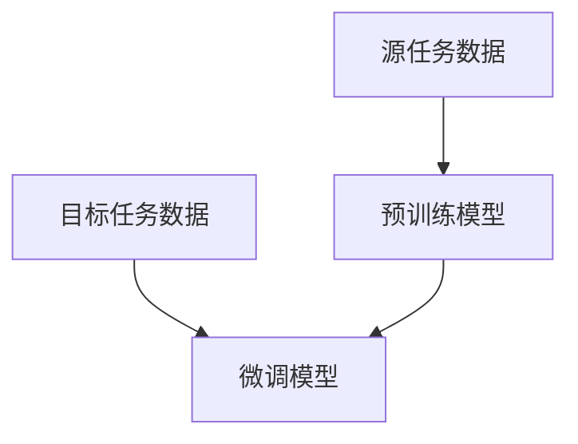
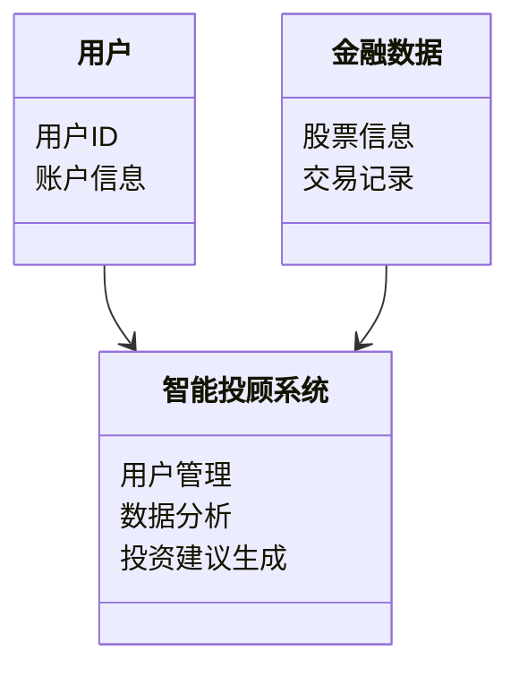
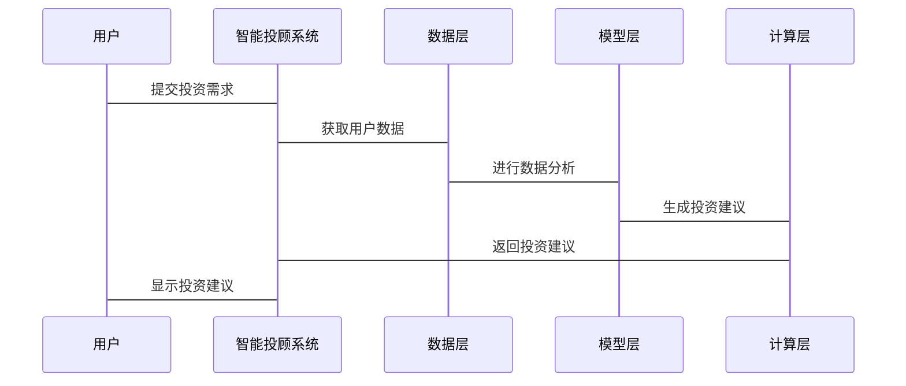

                 


# 大规模预训练模型在金融场景中的迁移学习实践

## 关键词：
- 大规模预训练模型
- 迁移学习
- 金融场景
- 自然语言处理
- 深度学习

## 摘要：
随着人工智能技术的迅速发展，大规模预训练模型（如BERT、GPT）在金融领域的应用越来越广泛。迁移学习作为连接通用预训练模型与具体金融任务的桥梁，能够有效提升金融场景中的模型性能。本文将系统地探讨大规模预训练模型在金融场景中的迁移学习实践，从理论基础到实际应用，详细分析迁移学习的核心概念、算法原理、系统设计以及项目实战，为金融领域的技术实践者提供全面的指导和参考。

---

## 第一部分：大规模预训练模型与金融场景的结合

### 第1章：大规模预训练模型与金融场景的背景介绍

#### 1.1 大规模预训练模型的定义与特点
大规模预训练模型是指通过在海量数据上进行预训练的深度学习模型，具有以下特点：
- **通用性**：模型在广泛领域上进行预训练，能够适应多种任务。
- **大规模**：模型参数量大，通常需要大量计算资源进行训练。
- **上下文理解**：模型通过上下文理解能力，能够处理复杂的语言和语义信息。

#### 1.2 金融场景中的特殊需求
金融场景对模型的要求具有特殊性：
- **数据稀疏性**：金融数据往往较为稀疏，需要通过迁移学习进行数据增强。
- **领域特定性**：金融领域的术语和场景具有特殊性，需要模型进行领域适配。
- **实时性与准确性**：金融决策需要高精度和实时性，这对模型的迁移能力提出了更高要求。

#### 1.3 迁移学习的必要性
在金融场景中，直接使用通用预训练模型难以满足特定需求。迁移学习通过将预训练模型适应特定领域，能够有效提升模型在金融任务中的表现。

---

### 第2章：迁移学习的核心概念与原理

#### 2.1 迁移学习的理论基础
迁移学习的理论基础包括以下几个方面：
- **领域适配**：通过调整模型参数或特征提取器，使得模型适应目标领域。
- **数据增强**：通过生成更多与目标领域相关的数据，提升模型的泛化能力。
- **特征重用**：利用源任务的特征表示，提升目标任务的性能。

#### 2.2 迁移学习的算法原理
##### 2.2.1 迁移学习的数学模型
迁移学习的数学模型可以表示为：
$$ P(y|x) = f_{\theta}(x) $$
其中，$f_{\theta}$是通过迁移学习优化的模型函数，$\theta$表示模型参数。

##### 2.2.2 迁移学习的算法流程图（Mermaid）


##### 2.2.3 参数调整策略
在迁移学习中，通常会对模型的某些参数进行微调，以适应目标领域。例如，在自然语言处理任务中，可以对模型的输出层进行重新训练。

#### 2.3 金融场景中的迁移学习应用
##### 2.3.1 领域适配
通过调整模型参数，使得模型能够适应金融领域的特定术语和场景。
##### 2.3.2 数据增强
利用生成对抗网络（GAN）等技术，生成与金融领域相关的虚拟数据，提升模型的泛化能力。

---

## 第二部分：大规模预训练模型的架构与训练策略

### 第3章：大规模预训练模型的架构与训练策略

#### 3.1 主流大规模预训练模型简介
##### 3.1.1 BERT模型
BERT（Bidirectional Encoder Representations from Transformers）是一种基于Transformer的预训练模型，广泛应用于文本理解任务。

##### 3.1.2 GPT系列模型
GPT（Generative Pre-trained Transformer）是一种生成式预训练模型，能够生成连贯的文本内容。

##### 3.1.3 其他金融领域优化的模型
一些针对金融领域的优化模型，如FNet，专为金融文本分析设计。

#### 3.2 预训练与微调策略
##### 3.2.1 预训练的目标函数
预训练的目标函数通常包括掩码语言模型任务和下一个句子预测任务。

##### 3.2.2 微调的数学模型
在微调阶段，模型的目标函数通常保持不变，但会对模型的输出层进行重新训练。

##### 3.2.3 参数初始化策略
在微调过程中，通常只对模型的输出层进行参数更新，而保持其他层的参数不变。

#### 3.3 金融场景中的模型优化
##### 3.3.1 预训练模型的领域适配
通过在金融领域数据上进行微调，使得模型能够更好地理解金融术语和场景。
##### 3.3.2 模型压缩与优化
通过模型压缩技术，降低模型的计算成本，提升推理速度。

---

## 第三部分：系统分析与架构设计

### 第4章：系统分析与架构设计

#### 4.1 问题场景介绍
以智能投顾系统为例，分析大规模预训练模型在金融场景中的应用。

#### 4.2 系统功能设计
##### 4.2.1 领域模型类图（Mermaid）


##### 4.2.2 系统架构图（Mermaid）


##### 4.2.3 系统交互序列图（Mermaid）


#### 4.3 接口设计
##### 4.3.1 API接口定义
```python
class InvestmentAdvisor:
    def get_recommendation(self, user_id):
        pass
```

---

## 第四部分：项目实战

### 第5章：项目实战

#### 5.1 环境配置
##### 5.1.1 安装依赖
```bash
pip install transformers pandas numpy
```

#### 5.2 核心实现
##### 5.2.1 数据预处理
```python
import pandas as pd
data = pd.read_csv('financial_data.csv')
```

##### 5.2.2 模型微调
```python
from transformers import BertForSequenceClassification
model = BertForSequenceClassification.from_pretrained('bert-base-uncased')
model.train()
```

#### 5.3 实验结果与分析
##### 5.3.1 模型性能
通过实验验证迁移学习在金融场景中的有效性，比较不同迁移策略下的模型性能。

---

## 第五部分：深入分析与案例

### 第6章：深入分析与案例

#### 6.1 智能投顾案例
分析迁移学习在智能投顾中的应用，包括模型选择、数据处理和结果解读。

#### 6.2 反欺诈检测案例
探讨迁移学习在金融反欺诈中的应用，展示如何通过迁移学习提升模型的检测能力。

---

## 第六部分：总结与展望

### 第7章：总结与展望

#### 7.1 总结
回顾全文，总结迁移学习在金融场景中的应用价值和实践经验。

#### 7.2 展望
展望未来，迁移学习在金融领域的潜在发展方向，包括模型优化、多模态数据处理等方面。

---

## 作者信息

作者：AI天才研究院/AI Genius Institute  
禅与计算机程序设计艺术/Zen And The Art of Computer Programming

