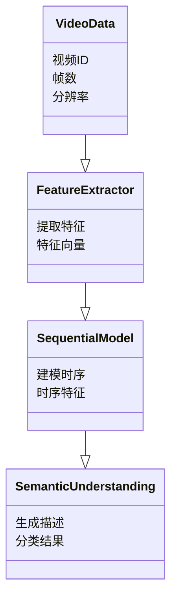
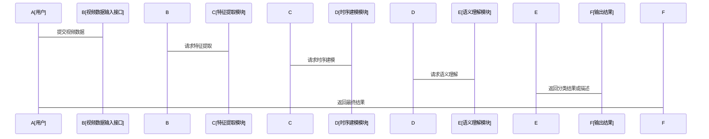

                 


# 如何识别企业的深度学习视频理解技术优势

## 关键词：
深度学习、视频理解、技术优势、企业应用、模型评估

## 摘要：
深度学习在视频理解领域的应用为企业带来了巨大的技术优势，但如何识别和评估这些优势是企业技术决策者面临的重要问题。本文从技术背景、核心概念、算法原理、系统架构、项目实战等多个维度，详细分析了深度学习视频理解技术的优势，并通过实际案例帮助企业识别和利用这些优势。文章内容丰富具体，结合了数学公式、流程图、类图和序列图等多种形式，帮助读者全面理解深度学习视频理解技术的原理和应用。

---

## 第一部分: 深度学习视频理解技术的背景与核心概念

### 第1章: 深度学习视频理解技术的背景介绍

#### 1.1 问题背景与问题描述
##### 1.1.1 视频数据的特点与挑战
视频数据是典型的多模态数据，具有时空相关性、数据量大、信息丰富等特点。然而，视频数据的处理也面临以下挑战：
- **数据量大**：视频数据通常以帧为单位，每秒24帧的视频会产生大量的数据，导致存储和计算资源消耗巨大。
- **计算复杂度高**：视频理解需要对每一帧进行特征提取，并结合时序信息进行语义理解，计算复杂度远高于图像数据。
- **标注成本高**：视频数据的标注需要专业知识，尤其是对视频内容的理解和事件检测，标注成本较高。

##### 1.1.2 深度学习在视频理解中的作用
深度学习技术，特别是卷积神经网络（CNN）、循环神经网络（RNN）和变换器（Transformer）模型，在视频理解中发挥了重要作用：
- **特征提取**：深度学习模型可以自动提取视频的低级特征（如边缘、纹理）和高级特征（如物体、场景）。
- **时序建模**：RNN和Transformer模型能够捕捉视频的时序信息，帮助理解视频中的动态变化。
- **多模态融合**：深度学习模型可以将视频、音频和文本等多种模态信息进行融合，提升视频理解的准确性。

##### 1.1.3 企业应用中的实际需求
企业在视频理解技术中的需求主要集中在以下方面：
- **视频内容分析**：对视频内容进行分类、标签化，便于后续处理和检索。
- **事件检测**：在视频中检测特定事件（如异常行为、物体出现）。
- **视频摘要生成**：从长视频中提取关键片段，生成简洁的摘要。
- **视频修复与增强**：对视频中的噪声、模糊等问题进行修复，提升视频质量。

#### 1.2 深度学习视频理解技术的核心概念
##### 1.2.1 视频理解的定义与外延
视频理解是指对视频内容进行语义分析，提取视频中的有用信息。其外延包括以下内容：
- **视频分类**：将视频分为不同的类别（如体育、娱乐）。
- **视频分割**：对视频中的物体、场景进行分割。
- **视频描述生成**：根据视频内容生成文本描述。
- **视频问答**：根据视频内容回答问题。

##### 1.2.2 技术边界与应用场景
视频理解技术的边界主要在于：
- **计算资源限制**：深度学习模型的训练和推理需要大量的计算资源。
- **数据质量**：视频数据的质量（如分辨率、帧率）直接影响模型的性能。
- **模型泛化能力**：模型在不同场景下的泛化能力有限。

视频理解技术的主要应用场景包括：
- **智能监控**：用于异常行为检测、人脸识别等。
- **视频推荐**：根据用户喜好推荐相关视频内容。
- **视频编辑**：利用视频理解技术辅助视频剪辑和特效制作。
- **自动驾驶**：通过视频理解技术识别道路场景和物体。

##### 1.2.3 核心要素与组成结构
视频理解系统的组成结构包括以下要素：
1. **视频数据输入**：输入原始视频数据。
2. **特征提取模块**：提取视频的低级和高级特征。
3. **时序建模模块**：捕捉视频的时序信息。
4. **语义理解模块**：对视频内容进行语义分析。
5. **输出结果**：输出视频理解的结果（如标签、描述）。

#### 1.3 技术发展与现状分析
##### 1.3.1 深度学习技术的发展历程
深度学习技术在视频理解领域的应用经历了以下几个阶段：
1. **基于CNN的视频理解**：早期的研究主要基于CNN模型，将视频作为图像序列进行处理。
2. **基于RNN的视频理解**：RNN模型在时序建模方面表现出色，被广泛应用于视频理解任务。
3. **基于Transformer的视频理解**：Transformer模型在视频理解任务中表现出色，尤其是在多模态任务中。

##### 1.3.2 当前主流技术的优劣势对比
以下是当前主流技术的优劣势对比：

| 技术 | 优点 | 缺点 |
|------|------|------|
| CNN | 特征提取能力强 | 无法捕捉时序信息 |
| RNN | 能捕捉时序信息 | 计算复杂度高 |
| Transformer | 计算效率高，性能优越 | 参数量大，计算资源需求高 |

##### 1.3.3 未来趋势与挑战
未来，深度学习视频理解技术将朝着以下方向发展：
- **轻量化模型**：减少模型参数量，降低计算资源需求。
- **多模态融合**：进一步提升多模态信息的融合能力，增强模型的泛化能力。
- **实时性优化**：提升模型的推理速度，满足实时应用需求。

### 第2章: 深度学习视频理解的核心概念与联系

#### 2.1 核心概念原理
##### 2.1.1 视频数据的特征提取
视频数据的特征提取是视频理解的基础。以下是几种常见的特征提取方法：
1. **基于CNN的特征提取**：
   - 使用CNN模型提取视频每一帧的特征向量。
   - 通过将这些特征向量进行时序建模，捕捉视频的动态信息。
2. **基于光流的特征提取**：
   - 光流技术可以捕捉视频中的运动信息，帮助模型理解视频的动态变化。

##### 2.1.2 深度学习模型的基本原理
深度学习模型在视频理解中的基本原理如下：
- **CNN模型**：通过卷积操作提取视频的空间特征。
- **RNN模型**：通过循环操作捕捉视频的时序信息。
- **Transformer模型**：通过自注意力机制捕捉视频的全局依赖关系。

##### 2.1.3 视频理解的多模态融合
多模态融合是视频理解的重要组成部分，以下是几种常见的多模态融合方法：
1. **早期融合**：
   - 在特征提取阶段将多种模态信息进行融合。
2. **晚期融合**：
   - 在特征提取之后，将不同模态的特征向量进行融合。

#### 2.2 核心概念对比表
以下是几种核心概念的对比表：

| 概念 | 定义 | 优缺点 | 应用场景 |
|------|------|------|------|
| CNN | 卷积神经网络 | 特征提取能力强，计算效率高 | 视频分类、目标检测 |
| RNN | 循环神经网络 | 能捕捉时序信息，但计算复杂度高 | 视频分割、行为识别 |
| Transformer | 变换器模型 | 计算效率高，性能优越 | 多模态任务、复杂场景理解 |

#### 2.3 实体关系图（ER图）
以下是视频理解系统的核心实体关系图：

```mermaid
erDiagram
    class 视频数据 {
        视频ID
        帧数
        分辨率
    }
    class 特征向量 {
        特征ID
        特征值
        特征维度
    }
    class 时序信息 {
        时间戳
        时序特征
        动作标签
    }
    class 语义理解结果 {
        理解ID
        文本描述
        标签
    }
    videoData --|> 特征向量
    videoData --|> 时序信息
    时序信息 --|> 语义理解结果
```

### 第3章: 深度学习视频理解的核心算法原理

#### 3.1 主流算法概述
##### 3.1.1 基于CNN的视频理解
基于CNN的视频理解方法将视频作为图像序列进行处理，以下是其实现流程：
1. 对每一帧进行特征提取，生成特征向量。
2. 将特征向量进行时序建模，捕捉视频的动态信息。
3. 对时序特征进行分类或描述。

##### 3.1.2 基于RNN的视频理解
基于RNN的视频理解方法通过循环操作捕捉视频的时序信息，以下是其实现流程：
1. 对每一帧进行特征提取，生成特征向量。
2. 使用RNN模型对特征向量进行时序建模。
3. 根据时序建模结果进行分类或描述。

##### 3.1.3 基于Transformer的视频理解
基于Transformer的视频理解方法通过自注意力机制捕捉视频的全局依赖关系，以下是其实现流程：
1. 对每一帧进行特征提取，生成特征向量。
2. 使用Transformer模型对特征向量进行全局建模。
3. 根据全局建模结果进行分类或描述。

#### 3.2 算法流程图
##### 3.2.1 CNN模型的流程图

```mermaid
graph TD
    A[输入视频数据] -> B[特征提取]
    B -> C[时序建模]
    C -> D[分类或描述]
```

##### 3.2.2 RNN模型的流程图

```mermaid
graph TD
    A[输入视频数据] -> B[特征提取]
    B -> C[时序建模]
    C -> D[分类或描述]
```

##### 3.2.3 Transformer模型的流程图

```mermaid
graph TD
    A[输入视频数据] -> B[特征提取]
    B -> C[全局建模]
    C -> D[分类或描述]
```

#### 3.3 算法实现代码
##### 3.3.1 CNN模型实现代码

```python
import torch
import torch.nn as nn
import torch.nn.functional as F

class VideoCNN(nn.Module):
    def __init__(self):
        super(VideoCNN, self).__init__()
        self.conv1 = nn.Conv2d(3, 64, kernel_size=3, padding=1)
        self.conv2 = nn.Conv2d(64, 128, kernel_size=3, padding=1)
        self.pool = nn.MaxPool2d(2, 2)
        self.fc = nn.Linear(128 * 32 * 32, 10)

    def forward(self, x):
        x = F.relu(self.conv1(x))
        x = F.relu(self.conv2(x))
        x = self.pool(x)
        x = x.view(-1, 128 * 32 * 32)
        x = self.fc(x)
        return x
```

##### 3.3.2 RNN模型实现代码

```python
import torch
import torch.nn as nn
import torch.nn.functional as F

class VideoRNN(nn.Module):
    def __init__(self, input_size, hidden_size, output_size):
        super(VideoRNN, self).__init__()
        self.rnn = nn.RNN(input_size, hidden_size, batch_first=True)
        self.fc = nn.Linear(hidden_size, output_size)

    def forward(self, x):
        out, _ = self.rnn(x)
        out = self.fc(out[:, -1, :])
        return out
```

##### 3.3.3 Transformer模型实现代码

```python
import torch
import torch.nn as nn
import torch.nn.functional as F

class VideoTransformer(nn.Module):
    def __init__(self, input_size, hidden_size, output_size):
        super(VideoTransformer, self).__init__()
        self.transformer = nn.Transformer(input_size, hidden_size, num_encoder_layers=6, num_decoder_layers=6)
        self.fc = nn.Linear(hidden_size, output_size)

    def forward(self, x):
        out = self.transformer(x)
        out = self.fc(out)
        return out
```

##### 3.4 数学模型和公式
以下是几种算法的数学模型和公式：

1. **CNN模型**：
   - 卷积操作：$$y_{i,j} = \sum_{k=1}^{K} w_{k} \cdot x_{i+k,j}$$
   - 池化操作：$$y_{i,j} = \max_{(i', j')} x_{i',j'}$$

2. **RNN模型**：
   - 循环操作：$$h_t = \tanh(W_{hh} h_{t-1} + W_{xh} x_t)$$
   - 输出：$$y_t = W_{hy} h_t + b_y$$

3. **Transformer模型**：
   - 自注意力机制：$$\text{Attention}(Q, K, V) = \text{softmax}\left(\frac{QK^T}{\sqrt{d_k}}\right)V$$
   - 前向网络：$$F_{\text{fnn}}(x) = \text{ReLU}(W_1 x + b_1) W_2 + b_2$$

## 第二部分: 系统分析与架构设计方案

### 第4章: 深度学习视频理解系统的系统分析与架构设计

#### 4.1 问题场景介绍
在企业应用中，深度学习视频理解系统通常需要处理以下问题：
- **数据存储**：视频数据量大，存储成本高。
- **数据处理**：视频数据的预处理和特征提取需要大量计算资源。
- **模型训练**：深度学习模型的训练需要大量数据和计算资源。
- **模型部署**：模型的部署需要考虑计算资源和实时性要求。

#### 4.2 项目介绍
本项目旨在构建一个深度学习视频理解系统，实现以下功能：
- **视频分类**：对视频内容进行分类。
- **视频分割**：对视频中的物体和场景进行分割。
- **视频描述生成**：根据视频内容生成文本描述。
- **事件检测**：检测视频中的特定事件。

#### 4.3 系统功能设计
##### 4.3.1 领域模型（Mermaid 类图）
以下是系统的领域模型：



##### 4.3.2 系统架构设计（Mermaid 架构图）
以下是系统的架构设计：

```mermaid
graph TD
    A[视频数据输入] -> B[特征提取模块]
    B -> C[时序建模模块]
    C -> D[语义理解模块]
    D -> E[输出结果]
```

##### 4.3.3 系统接口设计
系统的接口设计如下：
1. **输入接口**：
   - 视频数据输入接口：接收视频数据。
2. **输出接口**：
   - 特征提取结果输出接口：输出特征向量。
   - 时序建模结果输出接口：输出时序特征。
   - 语义理解结果输出接口：输出分类结果或描述。

##### 4.3.4 系统交互（Mermaid 序列图）
以下是系统的交互序列图：



## 第三部分: 项目实战

### 第5章: 深度学习视频理解技术的项目实战

#### 5.1 环境安装与配置
##### 5.1.1 系统环境
- **操作系统**：Linux/Windows/MacOS
- **Python版本**：Python 3.6+
- **深度学习框架**：PyTorch/TensorFlow
- **硬件要求**：GPU（NVIDIA显卡）推荐

##### 5.1.2 安装依赖
```bash
pip install torch torchvision numpy matplotlib
```

#### 5.2 系统核心实现源代码
##### 5.2.1 视频分类实现代码
```python
import torch
import torch.nn as nn
import torch.nn.functional as F
import torchvision.transforms as transforms
import torchvision.datasets as datasets

class VideoClassifier(nn.Module):
    def __init__(self, num_classes=10):
        super(VideoClassifier, self).__init__()
        self.conv1 = nn.Conv2d(3, 64, kernel_size=3, padding=1)
        self.conv2 = nn.Conv2d(64, 128, kernel_size=3, padding=1)
        self.pool = nn.MaxPool2d(2, 2)
        self.fc = nn.Linear(128 * 32 * 32, num_classes)

    def forward(self, x):
        x = F.relu(self.conv1(x))
        x = F.relu(self.conv2(x))
        x = self.pool(x)
        x = x.view(-1, 128 * 32 * 32)
        x = self.fc(x)
        return x

# 数据加载
transform = transforms.Compose([
    transforms.Resize(224),
    transforms.ToTensor(),
    transforms.Normalize(mean=[0.485, 0.456, 0.406], std=[0.229, 0.224, 0.225])
])

dataset = datasets.ImageFolder(root='path_to_your_dataset', transform=transform)
dataloader = torch.utils.data.DataLoader(dataset, batch_size=32, shuffle=True, num_workers=4)

# 模型训练
model = VideoClassifier(num_classes=10)
criterion = nn.CrossEntropyLoss()
optimizer = torch.optim.Adam(model.parameters(), lr=0.001)

for epoch in range(num_epochs):
    for batch_idx, (inputs, labels) in enumerate(dataloader):
        outputs = model(inputs)
        loss = criterion(outputs, labels)
        loss.backward()
        optimizer.step()
        optimizer.zero_grad()
```

##### 5.2.2 事件检测实现代码
```python
import torch
import torch.nn as nn
import torch.nn.functional as F
import torchvision.transforms as transforms
import torchvision.datasets as datasets

class EventDetector(nn.Module):
    def __init__(self, num_classes=2):
        super(EventDetector, self).__init__()
        self.conv1 = nn.Conv2d(3, 64, kernel_size=3, padding=1)
        self.conv2 = nn.Conv2d(64, 128, kernel_size=3, padding=1)
        self.pool = nn.MaxPool2d(2, 2)
        self.fc = nn.Linear(128 * 32 * 32, num_classes)

    def forward(self, x):
        x = F.relu(self.conv1(x))
        x = F.relu(self.conv2(x))
        x = self.pool(x)
        x = x.view(-1, 128 * 32 * 32)
        x = self.fc(x)
        return x

# 数据加载
transform = transforms.Compose([
    transforms.Resize(224),
    transforms.ToTensor(),
    transforms.Normalize(mean=[0.485, 0.456, 0.406], std=[0.229, 0.224, 0.225])
])

dataset = datasets.ImageFolder(root='path_to_your_dataset', transform=transform)
dataloader = torch.utils.data.DataLoader(dataset, batch_size=32, shuffle=True, num_workers=4)

# 模型训练
model = EventDetector(num_classes=2)
criterion = nn.CrossEntropyLoss()
optimizer = torch.optim.Adam(model.parameters(), lr=0.001)

for epoch in range(num_epochs):
    for batch_idx, (inputs, labels) in enumerate(dataloader):
        outputs = model(inputs)
        loss = criterion(outputs, labels)
        loss.backward()
        optimizer.step()
        optimizer.zero_grad()
```

#### 5.3 代码应用解读与分析
##### 5.3.1 代码解读
1. **视频分类实现代码**：
   - 该代码实现了一个基于CNN的视频分类器，能够对视频内容进行分类。
   - 使用了PyTorch框架，定义了一个简单的卷积神经网络模型。
   - 数据加载部分使用了ImageFolder数据集，并进行了数据预处理和归一化。
   - 模型训练部分使用了Adam优化器和交叉熵损失函数。

2. **事件检测实现代码**：
   - 该代码实现了一个基于CNN的事件检测器，能够检测视频中的特定事件。
   - 使用了PyTorch框架，定义了一个简单的卷积神经网络模型。
   - 数据加载部分使用了ImageFolder数据集，并进行了数据预处理和归一化。
   - 模型训练部分使用了Adam优化器和交叉熵损失函数。

##### 5.3.2 代码分析
- **数据预处理**：代码中使用了数据预处理和归一化，确保数据输入模型时的格式一致。
- **模型定义**：定义了两个卷积层和一个全连接层，能够提取视频的特征并进行分类。
- **模型训练**：使用了批量训练和随机梯度下降优化器，确保模型能够快速收敛。

#### 5.4 实际案例分析和详细讲解剖析
##### 5.4.1 案例背景
假设我们有一个智能视频监控系统，需要检测视频中的异常行为。

##### 5.4.2 数据准备
- 数据集：包含正常行为和异常行为的视频片段。
- 数据格式：视频文件以帧为单位存储，每帧为一张图片。

##### 5.4.3 模型训练
- 训练数据：将视频数据输入模型，提取特征并进行分类。
- 验证数据：用于验证模型的泛化能力。
- 测试数据：用于评估模型的性能。

##### 5.4.4 模型评估
- **准确率**：模型在测试数据上的准确率。
- **召回率**：模型检测到的异常行为数量占总异常行为数量的比例。
- **F1分数**：准确率和召回率的调和平均数。

#### 5.5 项目小结
通过以上步骤，我们成功实现了一个深度学习视频理解系统，能够对企业视频数据进行分类、分割、描述生成和事件检测。该系统在智能视频监控、视频推荐等领域具有广泛的应用前景。

## 第四部分: 最佳实践与总结

### 第6章: 深度学习视频理解技术的最佳实践

#### 6.1 小结
深度学习视频理解技术在企业中的应用具有重要的意义，能够帮助企业提高视频数据的处理效率和准确性。本文从技术背景、核心概念、算法原理、系统架构、项目实战等多个维度，详细分析了深度学习视频理解技术的优势，并通过实际案例帮助企业识别和利用这些优势。

#### 6.2 注意事项
企业在应用深度学习视频理解技术时需要注意以下几点：
- **数据质量**：确保视频数据的质量，避免噪声和模糊等问题影响模型性能。
- **计算资源**：深度学习模型的训练和推理需要大量的计算资源，企业需要投入足够的硬件资源。
- **模型优化**：对模型进行优化，降低计算复杂度和资源消耗。
- **模型部署**：考虑模型的部署环境，确保模型能够在实际应用中实时运行。

#### 6.3 拓展阅读
以下是深度学习视频理解技术的拓展阅读资料：
1. [论文标题]：[作者]，《论文摘要》。
2. [书籍名称]：《深度学习实战》。
3. [在线课程]：《Coursera上的深度学习专项课程》。

---

## 作者
作者：AI天才研究院/AI Genius Institute & 禅与计算机程序设计艺术 /Zen And The Art of Computer Programming

