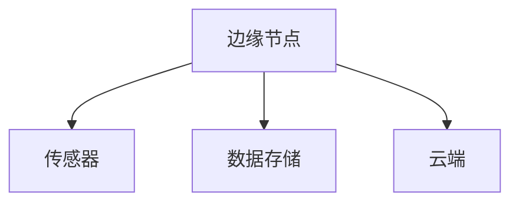
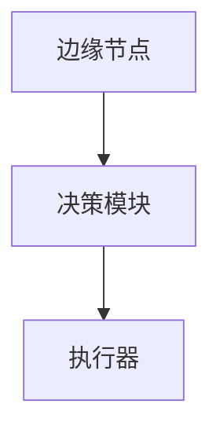
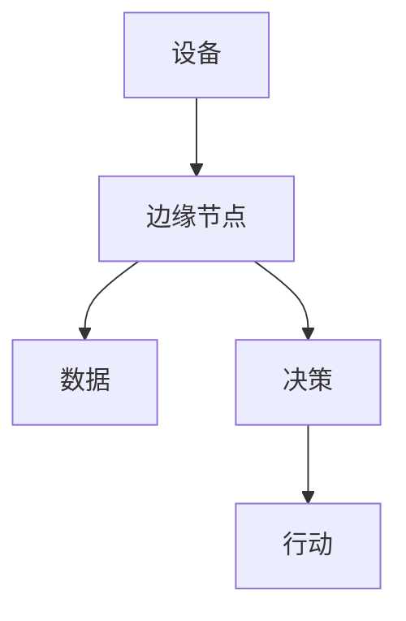
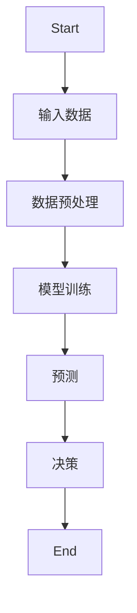
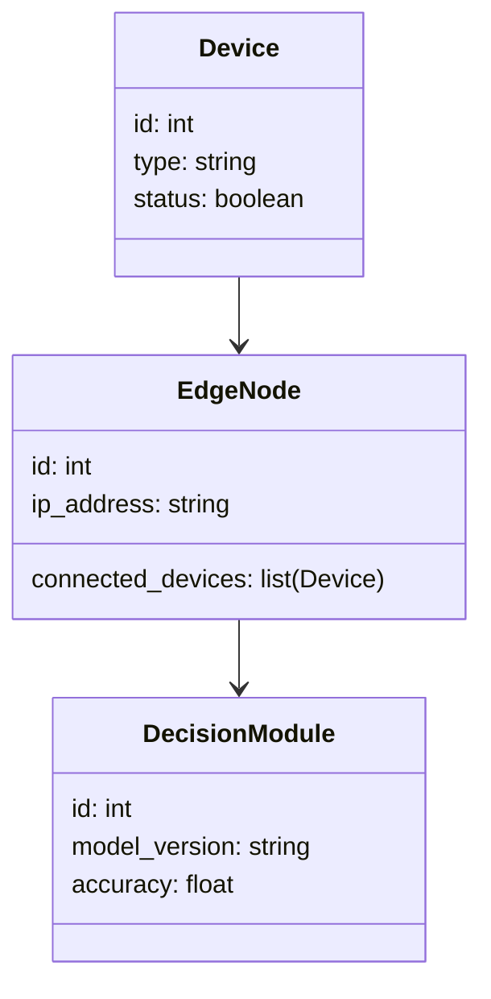
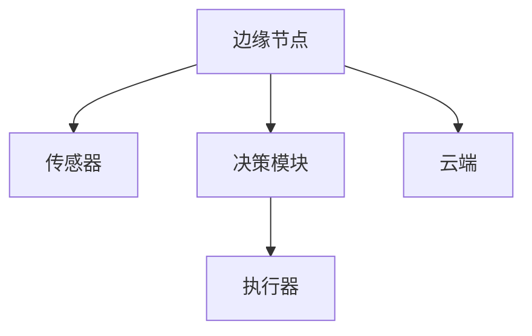
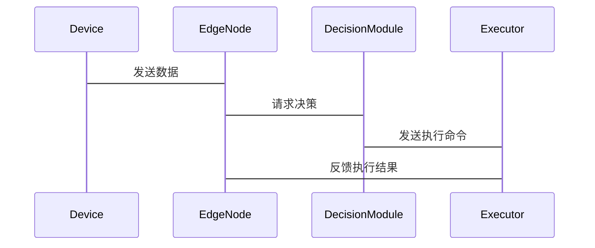

                 


# 如何识别企业的边缘计算实时决策系统优势

> 关键词：边缘计算，实时决策系统，企业优势，系统架构，算法原理，项目实战，技术博客

> 摘要：本文将深入探讨如何识别和评估企业的边缘计算实时决策系统的优势。通过从技术原理到项目实战的全面分析，揭示边缘计算在实时决策中的独特优势，帮助企业更好地利用这一技术提升竞争力。

---

# 第一部分: 边缘计算实时决策系统背景与概念

## 第1章: 边缘计算实时决策系统概述

### 1.1 边缘计算的基本概念

#### 1.1.1 边缘计算的定义
边缘计算是一种分布式计算范式，将计算能力从云端扩展到数据源的附近，减少延迟并提高实时响应能力。

#### 1.1.2 边缘计算的特点
- **低延迟**：数据在生成地进行处理，减少传输到云端的时间。
- **高实时性**：实时处理数据，快速做出决策。
- **数据隐私**：在边缘处理数据，减少敏感数据的传输和存储需求。
- **分布式架构**：计算资源分布在多个边缘节点，提高系统的容错性和可靠性。

#### 1.1.3 边缘计算与云计算的区别
| 特性 | 边缘计算 | 云计算 |
|------|----------|--------|
| 数据处理位置 | 边缘节点 | 云端 |
| 延迟 | 低延迟 | 较高延迟 |
| 网络依赖 | 较低依赖 | 高依赖 |
| 适用场景 | 实时性要求高 | 数据存储和分析 |

### 1.2 实时决策系统的定义与特点

#### 1.2.1 实时决策系统的定义
实时决策系统是一种能够在数据生成后，迅速处理数据并做出决策的系统。

#### 1.2.2 实时决策系统的应用场景
- **智能制造**：实时监控生产线，快速调整生产参数。
- **智慧城市**：实时处理交通数据，优化交通流量。
- **金融行业**：实时监控交易数据，防范金融风险。

#### 1.2.3 实时决策系统的优势
- **快速响应**：能够在极短时间内做出决策。
- **高准确性**：通过实时数据分析，提高决策的准确性。
- **资源优化**：通过实时监控和调整，优化资源配置。

### 1.3 边缘计算在企业中的应用前景

#### 1.3.1 边缘计算在企业中的潜在应用领域
- **工业自动化**：实时监控和调整生产设备。
- **零售业**：实时分析顾客行为，优化销售策略。
- **医疗健康**：实时监测患者数据，提供即时医疗建议。

#### 1.3.2 企业采用边缘计算的优势
- **提高效率**：通过边缘计算实时处理数据，减少数据传输和云端处理的时间。
- **降低成本**：通过边缘节点处理数据，减少云端资源的使用，降低成本。
- **增强隐私**：通过在边缘处理数据，保护敏感数据不被传输到云端。

#### 1.3.3 边缘计算应用的挑战与机遇
- **挑战**：边缘设备的计算能力有限，网络带宽受限，边缘节点的维护和管理难度大。
- **机遇**：边缘计算能够提升企业的实时决策能力，增强企业的竞争力。

### 1.4 本章小结
本章介绍了边缘计算和实时决策系统的定义、特点以及在企业中的应用前景。通过对比边缘计算和云计算的区别，分析了边缘计算在企业中的潜在应用领域及其优势和挑战。

---

# 第二部分: 边缘计算实时决策系统的核心概念与联系

## 第2章: 边缘计算实时决策系统的原理与架构

### 2.1 边缘计算实时决策系统的原理

#### 2.1.1 数据采集与处理
边缘节点通过传感器或其他设备采集数据，并对数据进行预处理（如去噪、归一化等）。

#### 2.1.2 数据分析与建模
在边缘节点上运行机器学习模型，对数据进行实时分析和建模。

#### 2.1.3 实时决策生成
基于分析结果，生成实时决策并执行。

### 2.2 边缘计算与实时决策系统的架构

#### 2.2.1 边缘计算架构


#### 2.2.2 实时决策系统架构


#### 2.2.3 两者的结合与优化
边缘节点同时承担数据采集、处理和决策生成的任务，云端负责数据的长期存储和分析。

### 2.3 边缘计算实时决策系统的实体关系图


### 2.4 本章小结
本章详细介绍了边缘计算实时决策系统的原理和架构，通过实体关系图展示了系统内部的联系。边缘节点作为数据处理和决策生成的核心，与传感器、云端和其他设备协同工作，形成了高效的实时决策系统。

---

# 第三部分: 边缘计算实时决策系统的算法原理

## 第3章: 基于边缘计算的实时决策算法

### 3.1 算法原理概述

#### 3.1.1 数据流处理
数据流处理包括数据的采集、预处理和特征提取。

#### 3.1.2 实时分析与预测
通过机器学习算法对数据进行实时分析和预测，生成决策建议。

#### 3.1.3 决策生成与反馈
根据分析结果生成决策，并将决策反馈到系统中执行。

### 3.2 基于时间序列的预测算法

#### 3.2.1 时间序列预测算法流程


#### 3.2.2 时间序列预测算法实现
```python
import pandas as pd
import numpy as np
from sklearn.metrics import mean_squared_error
from statsmodels.tsa.arima_model import ARIMA

def predict_next_value(data, order=(5,1,0)):
    model = ARIMA(data, order=order)
    model_fit = model.fit(disp=0)
    forecast = model_fit.forecast(steps=1)
    return forecast[0][0]

# 示例数据
data = pd.Series([1, 2, 3, 4, 5], index=range(5))
predicted_value = predict_next_value(data)
print(f"预测值: {predicted_value}")
```

#### 3.2.3 时间序列预测的数学模型
时间序列预测模型通常使用ARIMA（自回归积分滑动平均）模型，其数学表达式为：
$$ARIMA(p, d, q)$$
其中：
- $p$ 是自回归的阶数
- $d$ 是差分的阶数
- $q$ 是移动平均的阶数

### 3.3 本章小结
本章详细讲解了基于边缘计算的实时决策算法，重点介绍了时间序列预测算法的原理、实现和数学模型。通过Python代码示例，读者可以更好地理解和应用这些算法。

---

# 第四部分: 边缘计算实时决策系统的系统分析与架构设计

## 第4章: 边缘计算实时决策系统的系统分析与架构设计

### 4.1 问题场景介绍

#### 4.1.1 项目背景
假设某制造企业希望利用边缘计算实时监控生产线，快速调整生产参数，减少生产浪费。

### 4.2 系统功能设计

#### 4.2.1 领域模型设计


#### 4.2.2 系统架构设计


#### 4.2.3 系统接口设计
- **设备与边缘节点接口**：设备向边缘节点发送数据。
- **边缘节点与决策模块接口**：边缘节点向决策模块提供数据，获取决策结果。
- **决策模块与执行器接口**：决策模块向执行器发送执行命令。

#### 4.2.4 系统交互流程图


### 4.3 本章小结
本章通过实际项目背景，详细设计了边缘计算实时决策系统的领域模型、架构设计和系统接口。通过Mermaid图展示了系统内部的交互流程，帮助读者更好地理解系统设计的细节。

---

# 第五部分: 边缘计算实时决策系统的项目实战

## 第5章: 边缘计算实时决策系统项目实战

### 5.1 环境搭建

#### 5.1.1 系统环境
- 操作系统：Linux
- Python版本：3.8+
- 依赖库：pandas、numpy、statsmodels

### 5.2 系统核心实现源代码

#### 5.2.1 数据采集模块
```python
import serial

ser = serial.Serial('COM3', 9600)
data = ser.readline().decode().strip()
print("接收到的数据:", data)
```

#### 5.2.2 数据处理模块
```python
import pandas as pd

data = pd.Series([1, 2, 3, 4, 5], index=range(5))
print("原始数据:", data)
processed_data = data.rolling(2).mean()
print("处理后的数据:", processed_data)
```

#### 5.2.3 决策模块
```python
from statsmodels.tsa.arima_model import ARIMA

def predict_next_value(data, order=(5,1,0)):
    model = ARIMA(data, order=order)
    model_fit = model.fit(disp=0)
    forecast = model_fit.forecast(steps=1)
    return forecast[0][0]

predicted_value = predict_next_value(data)
print("预测值:", predicted_value)
```

### 5.3 代码应用解读与分析

#### 5.3.1 数据采集模块解读
通过串口接收传感器数据，将其转换为可处理的字符串格式。

#### 5.3.2 数据处理模块解读
对原始数据进行滑动平均处理，去除噪声，提高数据的准确性。

#### 5.3.3 决策模块解读
使用ARIMA模型对处理后的数据进行预测，生成实时决策。

### 5.4 实际案例分析和详细讲解剖析

#### 5.4.1 案例背景
假设某制造企业希望实时监控生产线的温度数据，避免设备过热。

#### 5.4.2 数据采集与处理
通过传感器采集温度数据，利用滑动平均法处理数据，消除噪声。

#### 5.4.3 决策生成
使用ARIMA模型预测未来温度，当预测温度超过阈值时，触发冷却系统。

### 5.5 项目小结
本章通过实际案例，详细讲解了边缘计算实时决策系统的项目实战过程，从环境搭建到代码实现，再到案例分析，帮助读者更好地理解和应用相关技术。

---

# 第六部分: 边缘计算实时决策系统的总结与展望

## 第6章: 总结与展望

### 6.1 本章总结
本文详细探讨了如何识别和评估企业的边缘计算实时决策系统的优势，从技术原理到项目实战，全面分析了边缘计算在实时决策中的独特优势。

### 6.2 最佳实践 tips
- **数据质量管理**：确保数据的准确性和完整性。
- **算法优化**：根据不同场景选择合适的算法，优化模型性能。
- **系统维护**：定期检查和维护边缘节点和决策模块，确保系统的稳定运行。

### 6.3 本章小结
本章总结了全文的主要内容，并给出了实际应用中的注意事项和建议。通过本文的分析，读者可以更好地理解边缘计算实时决策系统的优势，并在实际项目中加以应用。

---

# 作者：AI天才研究院/AI Genius Institute & 禅与计算机程序设计艺术 /Zen And The Art of Computer Programming

