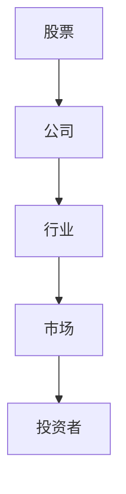
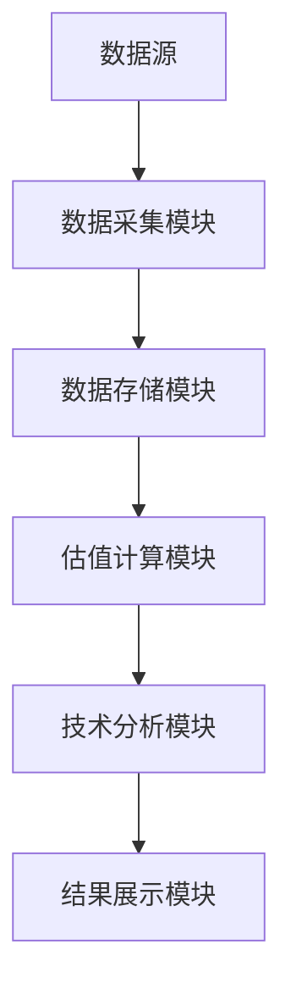
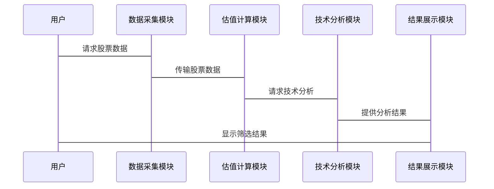

                 

<think>
好的，我需要根据用户的要求，逐步撰写一篇关于如何识别被低估股票的技术博客文章。首先，我会从目录大纲开始，逐步填充每个部分的内容，确保逻辑清晰、结构紧凑，并且语言简洁易懂。

### 第一部分：背景介绍

#### 第1章：股票市场的基本概念

##### 1.1 股票市场的基本概念

- **1.1.1 什么是股票**
  股票是股份有限公司发行的，证明投资者对该公司部分资产的所有权和相应权益的凭证。简单来说，购买股票意味着成为公司的部分所有者。

- **1.1.2 股票市场的分类**
  股票市场可以分为一级市场和二级市场。一级市场是公司首次公开发行（IPO）股票的地方，二级市场是投资者之间买卖已发行股票的场所。

- **1.1.3 股票市场的基本功能**
  股票市场为公司提供融资渠道，同时为投资者提供投资机会，促进资本流动和企业成长。

##### 1.2 什么是低估股票

- **1.2.1 低估股票的定义**
  低估股票是指市场价格低于其内在价值的股票。当市场价格低于内在价值时，股票被认为被低估。

- **1.2.2 低估股票的特征**
  低估股票通常具有较低的市盈率（P/E）或市净率（P/B），相对于其盈利能力或资产价值而言，市场价格较低。

- **1.2.3 低估股票的分类**
  根据低估的原因不同，低估股票可以分为暂时性低估和长期低估。暂时性低估可能是由于市场短期波动，而长期低估可能是由于公司基本面长期被市场忽视。

##### 1.3 识别低估股票的重要性

- **1.3.1 为什么需要识别低估股票**
  识别低估股票可以帮助投资者找到潜在的高回报投资机会。当股票价格回归其内在价值时，投资者可以获得资本增值。

- **1.3.2 低估股票的投资价值**
  低估股票通常具有较高的安全边际，即市场价格远低于内在价值，使得投资风险较低，回报潜力较高。

- **1.3.3 识别低估股票的挑战与机遇**
  识别低估股票需要深入分析公司基本面和市场情况，同时也需要耐心等待股价回升。虽然过程可能漫长，但成功的投资往往源于对低估股票的正确识别。

---

### 第二部分：核心概念与联系

#### 第2章：低估股票的核心概念

##### 2.1 低估股票的核心要素

- **2.1.1 市场价值与内在价值的对比**
  市场价值是股票在市场上的价格，内在价值是股票基于公司基本面的真实价值。当市场价值低于内在价值时，股票被认为被低估。

- **2.1.2 影响股票价值的因素**
  影响股票价值的因素包括公司的盈利能力、财务状况、行业地位、管理团队、宏观经济环境等。

- **2.1.3 股票估值的基本原理**
  股票估值是通过分析公司基本面和市场情况，确定股票的内在价值。常用的估值方法包括市盈率、市净率、股息率等。

##### 2.2 低估股票的分析框架

- **2.2.1 基本面分析与技术分析的对比**
  基本面分析关注公司的财务状况和行业地位，技术分析关注股票价格和交易量的变化趋势。

- **2.2.2 基本面分析的核心要素**
  基本面分析的核心要素包括收入、利润、资产、负债、现金流等财务指标，以及行业前景和管理团队。

- **2.2.3 技术分析的核心要素**
  技术分析的核心要素包括价格走势、交易量、技术指标（如MACD、RSI）等。

##### 2.3 低估股票的实体关系图



---

### 第三部分：估值方法

#### 第3章：股票估值指标

##### 3.1 常见股票估值指标

- **3.1.1 市盈率（P/E）**
  市盈率是股票价格除以每股收益（EPS）。市盈率低的股票可能被视为低估。

- **3.1.2 市净率（P/B）**
  市净率是股票价格除以每股净资产（BPS）。市净率低的股票可能被视为低估。

- **3.1.3 市销率（P/S）**
  市销率是股票价格除以每股销售额（ revenue per share）。市销率低的股票可能被视为低估。

- **3.1.4 股息率**
  股息率是每股股息（DPS）除以股票价格。高股息率的股票可能被视为低估。

##### 3.2 估值指标的比较与选择

- **3.2.1 各种估值指标的优缺点**
  - 市盈率：优点是容易计算，缺点是受利润波动影响大。
  - 市净率：优点是适用于资产密集型行业，缺点是不适用于成长型企业。
  - 市销率：优点是适用于收入稳定的企业，缺点是不适用于亏损企业。
  - 股息率：优点是适用于成熟企业，缺点是不适用于成长型企业。

- **3.2.2 不同行业适用的估值指标**
  不同行业的企业有不同的财务特征，因此应选择适合行业的估值指标。例如，银行行业适合使用市净率，而科技行业适合使用市销率。

- **3.2.3 估值指标的综合运用**
  综合运用多种估值指标可以更全面地评估股票的价值。例如，同时考虑市盈率和市净率，可以更准确地判断股票是否被低估。

##### 3.3 实际案例分析

假设我们有一家公司的股票，当前股价为10元，每股收益为2元，每股净资产为5元，每股销售额为4元，股息率为4%。

- **市盈率（P/E）= 10 / 2 = 5**
- **市净率（P/B）= 10 / 5 = 2**
- **市销率（P/S）= 10 / 4 = 2.5**
- **股息率 = (股息/股价) = 4%**

如果这些指标均低于行业平均水平，那么该股票可能被视为低估。

---

### 第四部分：技术分析

#### 第4章：技术分析方法

##### 4.1 技术分析的核心指标

- **4.1.1 移动平均线（MA）**
  移动平均线是一定时期内股票价格的平均值，用于判断价格趋势。

- **4.1.2 相对强弱指数（RSI）**
  RSI用于衡量股票的超买或超卖状态，通常在0-100之间。

- **4.1.3 MACD指标**
  MACD指标由两条移动平均线组成，用于判断价格趋势和力量。

##### 4.2 技术分析的步骤

1. **绘制K线图**：通过K线图观察股票价格的波动情况。
2. **计算技术指标**：计算移动平均线、RSI、MACD等指标。
3. **识别趋势和形态**：通过技术指标判断价格趋势和形态。
4. **制定交易策略**：根据技术分析结果制定买入或卖出策略。

##### 4.3 技术分析的优缺点

- **优点**：技术分析可以帮助投资者快速判断市场趋势，适用于短期交易。
- **缺点**：技术分析依赖于价格和交易量数据，不考虑公司基本面因素。

---

### 第五部分：系统分析与架构设计

#### 第5章：股票筛选系统设计

##### 5.1 系统功能设计

- **数据采集模块**：采集股票的市场数据和公司基本面数据。
- **估值计算模块**：计算股票的市盈率、市净率等估值指标。
- **技术分析模块**：计算技术指标并生成交易信号。
- **结果展示模块**：将筛选结果以图表形式展示。

##### 5.2 系统架构设计



##### 5.3 系统接口设计

- **数据接口**：与数据源（如Yahoo Finance）对接，获取股票数据。
- **用户界面**：提供友好的用户界面，方便用户输入参数和查看结果。

##### 5.4 系统交互设计



---

### 第六部分：项目实战

#### 第6章：项目实战

##### 6.1 项目环境安装

- **安装Python**：下载并安装Python 3.x。
- **安装必要的库**：使用pip安装pandas、numpy、matplotlib、yfinance等库。

##### 6.2 核心代码实现

```python
import pandas as pd
import yfinance as yf

# 下载股票数据
def get_stock_data(ticker):
    data = yf.download(ticker, start='2020-01-01', end='2023-12-31')
    return data

# 计算估值指标
def calculate_valuation_metrics(data):
    pe_ratio = data['Close'] / data['EPS']
    pb_ratio = data['Close'] / data['BPS']
    ps_ratio = data['Close'] / data['Revenue PS']
    dividend_yield = data['Dividends'] / data['Close']
    return pe_ratio, pb_ratio, ps_ratio, dividend_yield

# 技术分析
def technical_analysis(data):
    # 计算移动平均线
    data['MA_50'] = data['Close'].rolling(50).mean()
    data['MA_200'] = data['Close'].rolling(200).mean()
    # 计算RSI
    def calculate_rsi(data, period=14):
        delta = data['Close'].diff()
        up = delta.where(delta > 0, 0)
        down = delta.where(delta < 0, 0)
        rs = up.rolling(period).sum() / down.rolling(period).sum()
        rsi = 100 - (100 - rs.rolling(period).mean())
        return rsi
    data['RSI'] = calculate_rsi(data)
    return data

# 屏幕输出
if __name__ == "__main__":
    ticker = 'AAPL'
    data = get_stock_data(ticker)
    data = data.dropna()
    pe, pb, ps, dy = calculate_valuation_metrics(data)
    data_technical = technical_analysis(data)
    print("市盈率:", pe[-1])
    print("市净率:", pb[-1])
    print("市销率:", ps[-1])
    print("股息率:", dy[-1])
    print("RSI:", data_technical['RSI'][-1])
```

##### 6.3 代码解读与分析

- **数据获取**：使用yfinance库获取股票的历史数据。
- **估值指标计算**：计算市盈率、市净率、市销率和股息率。
- **技术分析**：计算移动平均线和RSI指标。
- **结果展示**：将计算结果打印出来。

##### 6.4 实际案例分析

以苹果公司（AAPL）为例，运行上述代码，输出其估值指标和技术分析结果。通过分析结果，判断AAPL是否为低估股票。

##### 6.5 项目小结

通过本项目，我们学习了如何使用Python和相关库进行股票数据分析，掌握了常用的估值指标和技术分析方法。通过实际案例分析，我们能够识别出潜在的低估股票。

---

### 第七部分：最佳实践与总结

#### 第7章：最佳实践

##### 7.1 投资策略

- **长期投资**：选择基本面良好、估值合理的股票，长期持有。
- **分散投资**：不要将所有资金投入到一只股票中，分散投资可以降低风险。

##### 7.2 风险管理

- **设定止损点**：在技术分析中设定止损点，避免亏损过大。
- **定期调整投资组合**：根据市场变化和个人财务状况，定期调整投资组合。

##### 7.3 持续学习

- **关注行业动态**：了解行业发展趋势和公司基本面变化。
- **学习新知识**：不断学习新的投资理念和技术分析方法，提升自己的投资能力。

#### 第8章：小结

识别被低估股票需要综合运用基本面分析和技术分析方法。通过选择合适的估值指标和分析工具，可以有效识别低估股票，抓住投资机会。

#### 第9章：注意事项

- **市场风险**：股市有风险，投资需谨慎。市场波动可能导致股价大幅波动。
- **数据准确性**：确保数据来源可靠，避免因数据错误导致投资决策失误。
- **时间因素**：识别低估股票后，需要耐心等待股价回升，避免短期波动影响判断。

#### 第10章：拓展阅读

- **书籍推荐**：《巴菲特的选股之道》、《价值投资实战手册》
- **网站推荐**：Yahoo Finance、Google Finance、Morningstar
- **工具推荐**：TradingView、MetaTrader、AmiBroker

---

### 作者

作者：AI天才研究院 & 禅与计算机程序设计艺术

