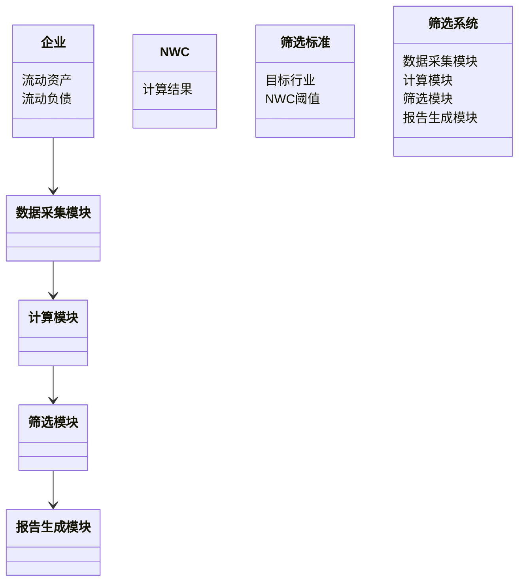

                 


# 如何运用格雷厄姆的净净营运资本策略

> 关键词：净净营运资本（NWC）、价值投资、企业估值、格雷厄姆、安全边际

> 摘要：本文深入探讨了格雷厄姆的净净营运资本（NWC）策略在投资分析中的应用，从理论基础到实际操作，结合数学模型和算法，详细讲解了如何通过NWC评估企业价值、制定投资决策，并提供了具体的实战案例和系统设计方案。

---

## 第1章 净净营运资本（NWC）的核心概念

### 1.1 净净营运资本的定义与计算方法

#### 1.1.1 净净营运资本的定义
净净营运资本（Net Net Working Capital，简称NWC）是指企业的流动资产减去流动负债后的净值。它是企业短期内可变现的资产净值，反映了企业的短期偿债能力和运营效率。

公式表示为：
$$
\text{NWC} = \text{流动资产} - \text{流动负债}
$$

其中，流动资产包括现金、应收账款、存货等；流动负债包括应付账款、短期借款、应交税费等。

#### 1.1.2 净净营运资本的计算公式
NWC的具体计算步骤如下：

1. 收集企业的财务报表，提取流动资产和流动负债的数值。
2. 使用公式计算NWC：
$$
\text{NWC} = \text{流动资产} - \text{流动负债}
$$

3. 分析NWC的正负：
   - 当NWC为正时，表示企业有足够的流动资产覆盖流动负债。
   - 当NWC为负时，表示企业流动负债超过流动资产，可能面临短期偿债压力。

#### 1.1.3 净净营运资本与企业价值的关系
NWC是企业价值的重要组成部分，尤其在初创期和成长期企业中，NWC的合理性是评估企业是否具备投资价值的关键指标。

---

### 1.2 格雷厄姆的价值投资理念

#### 1.2.1 格雷厄姆的投资哲学概述
本杰明·格雷厄姆是价值投资的鼻祖，他主张以低于内在价值的价格买入股票，长期持有，以获得稳定的收益。他认为市场短期是投票器，长期是称重机。

#### 1.2.2 净净营运资本在格雷厄姆投资策略中的地位
格雷厄姆在《证券分析》中提出了“净值法”（Net Net Method），即通过评估企业的NWC来判断其内在价值。他认为，如果企业的NWC显著低于其市场价值，那么该企业具有投资价值。

#### 1.2.3 格雷厄姆的“安全边际”概念
安全边际是指投资价格与内在价值之间的差额。通过投资那些市场价格远低于内在价值的企业，投资者可以降低投资风险。

---

## 第2章 净净营运资本在投资分析中的应用

### 2.1 净净营运资本的财务分析意义

#### 2.1.1 净净营运资本与企业偿债能力
NWC为正时，企业有能力偿还短期负债；为负时，企业可能需要外部融资。

#### 2.1.2 净净营运资本与企业运营效率
较高的NWC表明企业可能有过多的流动资产，导致资金使用效率低下；较低的NWC则可能意味着企业运营效率较高。

#### 2.1.3 净净营运资本与企业盈利能力的关联
NWC与企业的盈利能力密切相关。例如，存货周转率高意味着NWC效率高，企业盈利能力强。

---

### 2.2 净净营运资本与企业估值

#### 2.2.1 净净营运资本在企业价值评估中的应用
通过计算NWC，投资者可以评估企业的短期偿债能力和运营效率。格雷厄姆认为，如果企业的NWC显著低于其市场价值，则该企业具有投资价值。

#### 2.2.2 净值法（Net Net Method）的定义与公式
净值法是通过比较企业的NWC与市场价值，判断其是否具有投资价值。公式为：
$$
\text{内在价值} = \text{NWC} + \text{股东权益} - \text{负债}
$$

#### 2.2.3 格雷厄姆的“清算价值”概念
格雷厄姆认为，企业的清算价值是其内在价值的最低保障。通过评估企业清算时的NWC，投资者可以判断其是否具有投资价值。

---

## 第3章 净净营运资本策略的核心要素

### 3.1 净净营运资本的构成要素

#### 3.1.1 流动资产与流动负债的定义与分类
- 流动资产：现金、应收账款、存货等。
- 流动负债：应付账款、短期借款、应交税费等。

#### 3.1.2 净净营运资本的计算公式
$$
\text{NWC} = \text{流动资产} - \text{流动负债}
$$

#### 3.1.3 净净营运资本的正负意义
- NWC为正：企业短期偿债能力较强。
- NWC为负：企业短期偿债能力较弱。

---

### 3.2 净净营运资本与企业生命周期

#### 3.2.1 初创期企业的NWC特征
初创期企业通常NWC为负，因为流动负债（如应付账款）可能大于流动资产（如存货）。

#### 3.2.2 成长期企业的NWC特征
成长期企业NWC逐渐转为正，但可能增长缓慢。

#### 3.2.3 成熟期与衰退期企业的NWC特征
成熟期企业NWC趋于稳定，衰退期企业可能NWC为负。

---

## 第4章 净净营运资本策略的实施步骤

### 4.1 确定投资目标与筛选标准

#### 4.1.1 确定目标行业的NWC标准
不同行业对NWC的需求不同。例如，零售业需要较高的NWC，而制造业则需要较低的NWC。

#### 4.1.2 筛选低估值企业的具体步骤
1. 收集企业的财务报表，计算NWC。
2. 比较NWC与市场价值，筛选NWC显著低于市场价值的企业。

#### 4.1.3 净净营运资本与市盈率的对比分析
市盈率衡量企业的盈利能力，而NWC衡量企业的短期偿债能力。两者结合使用，可以更全面地评估企业的投资价值。

---

### 4.2 数据收集与财务报表分析

#### 4.2.1 如何获取企业的财务报表
可以通过企业公开披露的财报、财经网站或金融数据库获取。

#### 4.2.2 净净营运资本的计算与验证
使用公式计算NWC，并与行业平均水平或同类型企业进行对比。

#### 4.2.3 财务报表分析的注意事项
- 数据的准确性：确保数据来源可靠。
- 时间跨度：分析多个会计期间的NWC变化趋势。

---

### 4.3 投资决策与风险管理

#### 4.3.1 基于NWC的投资决策模型
- 计算NWC，判断企业是否具有投资价值。
- 结合其他指标（如市盈率、ROE）进行综合评估。

#### 4.3.2 风险管理的必要性与具体措施
- 分散投资：降低单一投资的风险。
- 设置止损点：避免过度亏损。

#### 4.3.3 净净营运资本策略的优缺点分析
- 优点：简单易懂，易于计算。
- 缺点：只考虑短期偿债能力，忽视长期发展潜力。

---

## 第5章 净净营运资本策略的数学模型与算法

### 5.1 净净营运资本的数学公式

公式表示为：
$$
\text{NWC} = \text{流动资产} - \text{流动负债}
$$

其中，流动资产包括现金、应收账款、存货等；流动负债包括应付账款、短期借款、应交税费等。

### 5.2 净值法（Net Net Method）的数学模型

公式表示为：
$$
\text{内在价值} = \text{NWC} + \text{股东权益} - \text{负债}
$$

---

## 第6章 净净营运资本策略的系统分析与架构设计

### 6.1 问题场景介绍

#### 6.1.1 问题背景
假设我们是一家投资机构，希望通过NWC策略筛选低估值企业。

#### 6.1.2 项目目标
开发一个基于NWC的股票筛选系统。

---

### 6.2 系统功能设计

#### 6.2.1 系统功能模块
- 数据采集模块：收集企业的财务报表。
- 计算模块：计算NWC。
- 筛选模块：筛选低估值企业。
- 报告生成模块：生成投资报告。

#### 6.2.2 领域模型（Mermaid 类图）



---

### 6.3 系统架构设计

#### 6.3.1 系统架构图（Mermaid 架构图）


---

## 第7章 净净营运资本策略的项目实战

### 7.1 环境安装

#### 7.1.1 安装必要的库
- Python：3.8+
- pandas：用于数据处理
- numpy：用于数值计算
- matplotlib：用于数据可视化

安装命令：
```bash
pip install pandas numpy matplotlib
```

### 7.2 核心实现源代码

#### 7.2.1 计算NWC的Python代码

```python
import pandas as pd
import numpy as np

# 假设我们有一个包含企业财务数据的DataFrame
df = pd.DataFrame({
    '流动资产': [100, 200, 300],
    '流动负债': [80, 120, 150]
})

# 计算NWC
df['NWC'] = df['流动资产'] - df['流动负债']

print(df)
```

#### 7.2.2 NWC筛选代码

```python
# 筛选NWC小于行业平均水平的企业
industry_avg = df['NWC'].mean()
selected = df[df['NWC'] < industry_avg]

print(selected)
```

---

### 7.3 实际案例分析

#### 7.3.1 案例背景
以微软为例，计算其NWC，判断其是否具有投资价值。

#### 7.3.2 数据获取与计算
1. 获取微软的财务报表。
2. 计算NWC。

假设微软的流动资产为500亿美元，流动负债为400亿美元，则：
$$
\text{NWC} = 500 - 400 = 100 \text{亿美元}
$$

---

## 第8章 净净营运资本策略的最佳实践与小结

### 8.1 最佳实践 tips

#### 8.1.1 数据准确性
确保财务数据的准确性。

#### 8.1.2 多指标结合
结合其他指标（如市盈率、ROE）进行综合评估。

#### 8.1.3 定期复盘
定期复盘投资组合的表现，及时调整策略。

---

### 8.2 小结

通过本文的详细讲解，读者可以全面了解格雷厄姆的净净营运资本策略，并能够将其应用于实际投资中。从理论到实践，从数据分析到系统设计，本文提供了完整的解决方案。

---

## 作者：AI天才研究院/AI Genius Institute & 禅与计算机程序设计艺术 /Zen And The Art of Computer Programming

