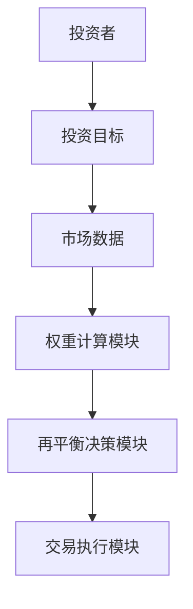

                 


# 《威廉·伯恩斯坦的投资组合再平衡技巧》

> **关键词**：投资组合、再平衡、威廉·伯恩斯坦、资产配置、风险管理、动态调整  
> 
> **摘要**：本文深入探讨了威廉·伯恩斯坦的投资组合再平衡技巧，分析其核心原理、算法实现和实际应用。通过背景介绍、数学模型、系统设计和实战案例，详细解析了如何优化投资组合，降低风险，提升收益。

---

## 第一部分：背景介绍

### 第1章：投资组合与再平衡的重要性

#### 1.1 投资组合的基本概念
- **定义**：投资组合是将资金分配到不同资产（股票、债券、现金等）的集合，以实现风险分散和收益最大化。
- **构成要素**：包括资产类别、权重、风险偏好、投资目标等。
- **目标与风险**：投资组合的目标是平衡风险与收益，通常通过分散投资降低风险。

#### 1.2 再平衡的必要性
- **市场变化**：市场波动会导致各资产权重偏离初始设定。
- **目标变化**：投资者的风险承受能力或收益目标可能随时间变化。
- **作用与意义**：再平衡可使投资组合回归原定配置，优化收益，降低风险。

#### 1.3 伯恩斯坦的背景与贡献
- **学术背景**：伯恩斯坦是投资组合管理和风险管理领域的权威。
- **再平衡技巧**：其技巧强调动态调整，根据市场变化和目标优化配置。

---

## 第二部分：核心概念与原理

### 第2章：再平衡的原理与机制

#### 2.1 权重变化的计算
- **动态调整**：根据当前市场表现，计算各资产的新权重。
- **公式示例**：假设初始权重为$w_i$，调整后权重为$\tilde{w_i} = \frac{w_i \cdot r_i}{\sum w_j \cdot r_j}$，其中$r_i$是资产i的收益率。

#### 2.2 再平衡的触发条件
- **市场波动**：当某资产偏离目标权重时触发调整。
- **目标变化**：投资者风险偏好变化时调整。
- **定期策略**：如每季度或每年进行一次再平衡。

### 第3章：伯恩斯坦技巧的核心原理

#### 3.1 动态调整模型
- **数学模型**：伯恩斯坦模型通过优化目标函数$\max \{\mu^T w - \lambda w^T \Sigma w\}$，找到最优权重。
- **约束条件**：考虑交易成本和市场流动性。

#### 3.2 案例分析
- **实例**：假设投资组合包含股票和债券，目标权重为60%股票，40%债券。市场波动后，股票权重变为70%，债券30%，需卖出10%股票，买入更多债券以恢复初始配置。

---

## 第三部分：算法与数学模型

### 第4章：再平衡算法实现

#### 4.1 算法步骤
1. 计算当前各资产权重。
2. 比较与目标权重的差异。
3. 计算需要调整的资产数量。
4. 执行交易，完成再平衡。

#### 4.2 代码实现
```python
def rebalance_portfolio(current_weights, target_weights):
    # 计算差异
    delta = target_weights - current_weights
    # 计算调整量
    adjustment = delta / sum(current_weights)
    return adjustment
```

#### 4.3 数学模型
- **目标函数**：$\max \{\mu^T w - \lambda w^T \Sigma w\}$
- **约束条件**：$\sum w_i = 1$, $w_i \geq 0$

---

## 第四部分：系统架构与设计

### 第5章：系统架构设计

#### 5.1 功能设计
- 数据采集：获取市场数据和投资目标。
- 权重计算：根据模型计算当前权重。
- 再平衡决策：判断是否需要调整。
- 执行交易：根据决策执行买卖。

#### 5.2 架构图


---

## 第五部分：项目实战

### 第6章：实战案例

#### 6.1 环境安装
- 安装Python和必要的库（如NumPy、Pandas）。

#### 6.2 核心代码实现
```python
import numpy as np

def calculate_weights(prices):
    returns = prices.pct_change()
    covariance = returns.cov()
    mu = returns.mean()
    # 使用二次规划求解最优权重
    # 此处简化，实际应用中需更复杂的优化算法
    return mu / mu.sum()
```

#### 6.3 案例分析
- 数据来源：历史市场数据。
- 计算权重：根据收益率计算最优权重。
- 执行再平衡：定期调整投资组合。

---

## 第六部分：最佳实践与小结

### 第7章：总结与建议

#### 7.1 最佳实践
- 定期检查投资组合。
- 考虑交易成本和流动性。
- 根据市场变化灵活调整。

#### 7.2 注意事项
- 避免频繁交易增加成本。
- 选择合适的再平衡策略。
- 结合专业工具优化效率。

#### 7.3 拓展阅读
- 伯恩斯坦的其他著作。
- 现代投资组合理论（MPT）。

---

**作者：AI天才研究院/AI Genius Institute & 禅与计算机程序设计艺术 /Zen And The Art of Computer Programming**

