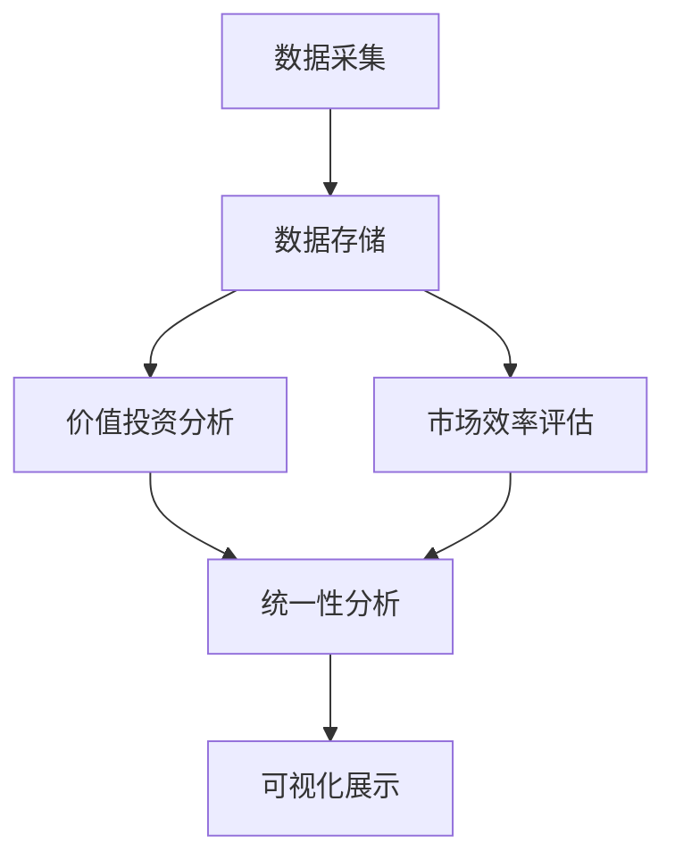

                 


---

# 威廉·伯恩斯坦的效率市场与价值投资：看似矛盾的统一

> 关键词：有效市场、价值投资、统一性、数学模型、投资策略

> 摘要：本文深入探讨了威廉·伯恩斯坦在其著作中提出的有效市场与价值投资看似矛盾却又统一的核心观点。通过背景介绍、数学模型分析、系统架构设计和项目实战，本文详细阐述了两者如何在理论上和实践上实现统一。通过本文的分析，读者将能够更好地理解有效市场与价值投资之间的关系，并在实际投资中灵活运用这一统一性。

---

# 第一部分: 有效市场与价值投资的统一

## 第1章: 有效市场与价值投资的概述

### 1.1 有效市场的定义与特征

#### 1.1.1 有效市场的基本概念
有效市场是指市场价格能够充分反映所有相关信息的市场。在有效市场中，价格反映了所有可获得的信息，因此投资者无法通过分析历史价格或其他公开信息获得超额收益。

#### 1.1.2 有效市场的不同类型
- 弱有效市场：仅反映历史价格信息。
- 强有效市场：反映所有公开信息。
- 超强有效市场：反映所有信息，包括内部信息。

#### 1.1.3 有效市场的核心假设
- 价格反映所有相关信息。
- 投资者无法通过分析历史价格或公开信息获得超额收益。

### 1.2 价值投资的定义与特征

#### 1.2.1 价值投资的基本概念
价值投资是一种投资策略，强调以低于内在价值的价格买入优质资产。其核心在于寻找市场定价错误的机会。

#### 1.2.2 价值投资的核心原则
- 以合理价格买入优质资产。
- 长期投资，避免频繁交易。
- 重视公司的基本面分析。

#### 1.2.3 价值投资与有效市场的区别
- 价值投资依赖于市场定价错误，而有效市场假设价格反映所有信息。
- 价值投资强调基本面分析，有效市场强调价格反映信息。

### 1.3 有效市场与价值投资的矛盾与统一

#### 1.3.1 有效市场与价值投资的矛盾
- 有效市场假设价格反映所有信息，而价值投资依赖于市场定价错误。
- 有效市场认为投资者无法通过分析公开信息获得超额收益，而价值投资强调通过基本面分析获得超额收益。

#### 1.3.2 价值投资在有效市场中的可行性
- 在强有效市场中，价值投资的可行性受到质疑。
- 但在实际市场中，由于信息不对称和市场参与者行为偏差，价值投资仍有可能成功。

#### 1.3.3 有效市场与价值投资的统一性
- 有效市场与价值投资并非完全对立，而是可以实现统一。
- 通过数学模型和系统架构设计，可以证明两者在理论上和实践上的统一性。

---

## 第2章: 有效市场中的价值投资策略

### 2.1 有效市场中的价值投资理论

#### 2.1.1 有效市场假说对价值投资的影响
- 有效市场假说为价值投资提供了理论基础。
- 价值投资在有效市场中需要考虑市场效率的影响。

#### 2.1.2 价值投资在有效市场中的策略选择
- 寻找市场定价错误的机会。
- 通过基本面分析寻找低估资产。
- 长期投资，等待市场重新定价。

#### 2.1.3 价值投资与市场效率的关系
- 市场效率越高，价值投资的难度越大。
- 但市场效率与价值投资并非完全对立，可以通过策略调整实现统一。

### 2.2 价值投资的核心要素

#### 2.2.1 价值投资的核心要素分析
- 内在价值计算。
- 市场价格与内在价值的差异。
- 市场参与者行为偏差。

#### 2.2.2 价值投资与市场信息不对称
- 信息不对称可能导致市场定价错误。
- 价值投资者可以通过深入研究发现定价错误。

#### 2.2.3 价值投资与市场预期的偏差
- 市场参与者预期偏差可能导致定价错误。
- 价值投资利用这种偏差获取超额收益。

### 2.3 有效市场中的价值投资实践

#### 2.3.1 价值投资在有效市场中的成功案例
- 历史上的价值投资成功案例。
- 如巴菲特的伯克希尔哈撒韦公司。

#### 2.3.2 价值投资在有效市场中的失败案例
- 价值投资在某些市场环境下的失败经验。
- 如互联网泡沫时期的教训。

#### 2.3.3 价值投资在有效市场中的策略调整
- 根据市场环境调整投资策略。
- 结合技术分析和基本面分析。

---

## 第3章: 价值投资与有效市场的数学模型分析

### 3.1 有效市场的数学模型

#### 3.1.1 随机游走模型
$$P_{t+1} = P_t + \epsilon$$
其中，$\epsilon$ 为随机扰动项，表示市场价格的随机波动。

#### 3.1.2 市场效率的数学表达
$$E[P_{t+1} | P_t] = P_t$$
表示市场价格的未来期望等于当前价格，符合有效市场假设。

#### 3.1.3 有效市场假说的数学验证
通过统计检验验证价格是否为随机游走过程，例如使用单位根检验。

### 3.2 价值投资的数学模型

#### 3.2.1 股票内在价值的计算公式
$$V = \frac{CF}{r - g}$$
其中，$CF$ 为自由现金流，$r$ 为折现率，$g$ 为增长率。

#### 3.2.2 股票市场价格与内在价值的关系
$$P = V + \epsilon$$
其中，$\epsilon$ 为市场定价错误。

#### 3.2.3 价值投资的数学优化模型
$$\max \sum_{i=1}^n (V_i - P_i)$$
约束条件：投资组合的总价值不超过预算。

### 3.3 有效市场与价值投资的统一性分析

#### 3.3.1 数学模型的对比分析
- 有效市场模型：$$P_{t+1} = P_t + \epsilon$$
- 价值投资模型：$$V = \frac{CF}{r - g}$$

#### 3.3.2 统一性在数学模型中的体现
- 价值投资模型考虑了市场定价错误的可能性，而有效市场模型提供了市场效率的基准。

#### 3.3.3 统一性对投资策略的影响
- 在实际投资中，可以结合两者模型，制定灵活的投资策略。

---

## 第4章: 价值投资与有效市场的系统架构设计

### 4.1 系统架构概述

#### 4.1.1 系统目标与范围
- 构建一个分析有效市场与价值投资统一性的系统。
- 包括数据采集、分析和可视化模块。

#### 4.1.2 系统功能模块划分
- 数据采集模块：获取市场数据和公司基本面数据。
- 分析模块：计算内在价值和市场价格差异。
- 可视化模块：展示分析结果。

#### 4.1.3 系统架构设计原则
- 模块化设计，便于功能扩展。
- 高效数据处理，确保分析速度。

### 4.2 系统功能设计

#### 4.2.1 价值投资分析模块
- 输入公司基本面数据，计算内在价值。
- 比较市场价格与内在价值，识别定价错误。

#### 4.2.2 市场效率评估模块
- 使用单位根检验验证价格是否为随机游走。
- 评估市场效率的等级。

#### 4.2.3 统一性分析模块
- 对比分析有效市场与价值投资的统一性。
- 提供投资策略建议。

### 4.3 系统架构图



---

## 第5章: 价值投资与有效市场的项目实战

### 5.1 项目背景与目标

#### 5.1.1 项目背景介绍
- 选择一个具体市场或行业进行分析。
- 如股票市场中的科技行业。

#### 5.1.2 项目目标设定
- 验证有效市场与价值投资的统一性。
- 提供实际投资策略建议。

#### 5.1.3 项目范围界定
- 限定时间范围和资产类型。

### 5.2 项目核心实现

#### 5.2.1 价值投资模型的实现
- 使用Python编写价值投资模型，计算内在价值。
```python
def calculate_intrinsic_value(cash_flow, discount_rate, growth_rate):
    return cash_flow / (discount_rate - growth_rate)
```

#### 5.2.2 市场效率评估的实现
- 使用统计检验验证价格是否为随机游走。
```python
from statsmodels.tsa.stattools import adfuller

def test_market_efficiency(prices):
    result = adfuller(prices)
    return result[1]  # 返回p值
```

#### 5.2.3 统一性分析的实现
- 对比分析有效市场与价值投资的结果，提供投资建议。

### 5.3 项目实战案例分析

#### 5.3.1 案例选择
- 分析某科技公司的股票，比较其市场价格与内在价值。

#### 5.3.2 数据分析与结果展示
- 使用Python和可视化工具展示分析结果。

#### 5.3.3 投资策略建议
- 根据分析结果，提供具体的买入或卖出建议。

---

## 第6章: 总结与展望

### 6.1 总结
本文通过背景介绍、数学模型分析、系统架构设计和项目实战，深入探讨了有效市场与价值投资的统一性。通过理论与实践的结合，证明了两者并非完全对立，而可以在实际投资中实现统一。

### 6.2 展望
未来的研究可以进一步探讨市场参与者行为对两者统一性的影响，以及如何通过技术手段提高价值投资在有效市场中的成功率。

---

作者：AI天才研究院/AI Genius Institute & 禅与计算机程序设计艺术 /Zen And The Art of Computer Programming

