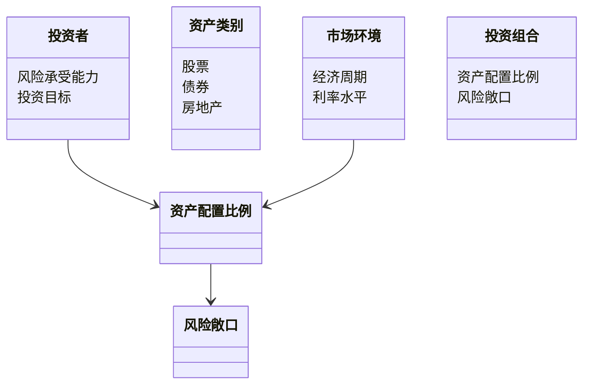
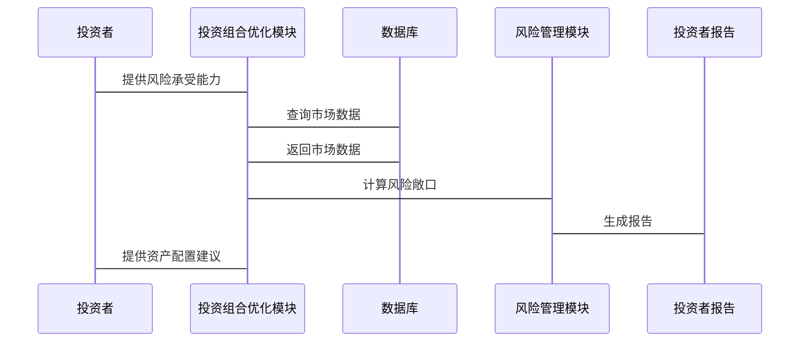

                 


# 威廉·伯恩斯坦的跨资产价值投资：多元化的重要性

## 关键词：威廉·伯恩斯坦，跨资产投资，价值投资，多元化，风险管理

## 摘要：威廉·伯恩斯坦是投资领域的重要人物，其跨资产价值投资理论强调通过多元化投资来分散风险，提高长期回报。本文将深入探讨伯恩斯坦的理论，分析其在现代投资组合中的应用，并结合实际案例，讲解如何通过跨资产配置优化投资组合。

---

## 正文

### 第一部分：跨资产投资的背景与基础

#### 第1章：跨资产投资的起源与发展

##### 1.1 跨资产投资的起源
- 1.1.1 传统投资的局限性  
传统的单一资产投资方式在面对市场波动时，风险集中，难以应对不同经济周期下的挑战。  
- 1.1.2 跨资产投资的兴起  
随着金融市场的复杂化，投资者开始意识到通过配置不同资产类别来分散风险的重要性。  
- 1.1.3 伯恩斯坦的贡献与影响  
伯恩斯坦通过研究和实践，提出了一套系统的跨资产价值投资方法，成为投资领域的重要里程碑。

##### 1.2 价值投资的基本原理
- 1.2.1 价值投资的核心理念  
寻找市场价格低于内在价值的资产进行投资，强调长期持有和风险控制。  
- 1.2.2 资产的价值评估方法  
通过基本面分析，包括市盈率、股息率等指标，评估资产的内在价值。  
- 1.2.3 投资者心理与市场行为  
分析投资者心理偏差（如恐惧和贪婪）对市场的影响，避免情绪化决策。

#### 第2章：跨资产投资的必要性

##### 2.1 多样化投资的重要性
- 2.1.1 单一资产的风险与局限  
集中投资于单一资产类别在市场下跌时，可能导致重大损失。  
- 2.1.2 多样化投资的分散风险机制  
通过配置不同资产类别，降低特定资产波动对整体投资组合的影响。  
- 2.1.3 不同资产类别的风险收益特征  
股票、债券、房地产等资产在不同经济周期下的表现差异。

##### 2.2 资产配置的核心作用
- 2.2.1 资产配置的定义与目标  
确定各类资产在投资组合中的比例，以实现风险与收益的最佳平衡。  
- 2.2.2 不同经济周期下的资产表现  
分析股票、债券等资产在经济增长、衰退等周期中的表现差异。  
- 2.2.3 资产配置与长期投资回报的关系  
合理的资产配置是实现长期稳定收益的关键。

---

### 第二部分：跨资产价值投资的核心概念与策略

#### 第3章：资产配置的原理与实践

##### 3.1 资产配置的原理
- 3.1.1 现代投资组合理论（MPT）的概述  
MPT强调通过分散投资降低风险，核心是通过优化资产配置实现收益最大化。  
- 3.1.2 资产配置的数学模型  
使用方差-协方差矩阵计算各类资产的波动性和相关性，构建最优投资组合。  
- 3.1.3 风险与收益的平衡  
通过调整各类资产的权重，找到风险与收益的最佳平衡点。

##### 3.2 资产类别分析
- 3.2.1 股票：不同行业的风险与收益  
分析科技、金融、消费等行业的股票在不同市场环境下的表现。  
- 3.2.2 债券：不同期限与信用等级的分析  
短期与长期债券在利率变化中的表现差异，高评级与低评级债券的风险收益特征。  
- 3.2.3 房地产：区域与市场周期的影响  
房地产市场的周期性波动及其在资产配置中的作用。  
- 3.2.4 其他资产：商品、货币市场等的特性  
黄金、原油等商品资产在通货膨胀中的对冲作用。

#### 第4章：价值评估与投资决策

##### 4.1 资产价值的评估方法
- 4.1.1 基本面分析的核心步骤  
分析公司的财务报表，评估盈利能力、成长性和财务健康状况。  
- 4.1.2 股息率与市盈率的计算  
股息率（Dividend Yield）= 每股股息 / 每股价格  
市盈率（P/E Ratio）= 股价 / 每股收益  
- 4.1.3 内在价值的估算公式  
内在价值 = 股息率 / （贴现率 - 增长率）  

##### 4.2 投资组合的构建策略
- 4.2.1 根据风险承受能力确定资产比例  
通过评估投资者的风险承受能力，调整各类资产的权重。  
- 4.2.2 基于市场预测的动态调整  
根据市场变化，定期审查并调整投资组合。  
- 4.2.3 伯恩斯坦的资产配置建议  
建议根据经济周期和市场环境，动态调整股票、债券等资产的比例。

---

### 第三部分：系统分析与架构设计方案

#### 第5章：跨资产投资的系统架构

##### 5.1 系统功能设计
- 5.1.1 问题场景介绍  
投资者需要根据市场变化和风险偏好，动态调整投资组合。  
- 5.1.2 领域模型（Mermaid 类图）  

- 5.1.3 系统架构设计（Mermaid 架构图）  

- 5.1.4 系统接口设计  
投资者输入：风险承受能力、投资目标  
系统输出：资产配置建议、定期报告  
- 5.1.5 系统交互（Mermaid 序列图）  


---

### 第四部分：项目实战

#### 第6章：跨资产投资的实战应用

##### 6.1 环境安装
- 安装Python和必要的库（Pandas、NumPy、Plotly等）  
代码示例：  
```python
import pandas as pd
import numpy as np
```

##### 6.2 核心实现（资产配置优化算法）
```python
def optimize_portfolio(weights, returns, risk_free_rate):
    # 计算投资组合的收益
    portfolio_return = np.dot(weights.T, returns)
    # 计算投资组合的风险
    covariance_matrix = np.cov(returns)
    portfolio_risk = np.sqrt(np.dot(weights.T, covariance_matrix).dot(weights))
    # 计算夏普比率
    sharpe_ratio = (portfolio_return - risk_free_rate) / portfolio_risk
    return portfolio_return, portfolio_risk, sharpe_ratio

# 示例：假设3种资产，权重分别为0.4, 0.3, 0.3
weights = [0.4, 0.3, 0.3]
returns = [0.1, 0.08, 0.12]
risk_free_rate = 0.05

portfolio_return, portfolio_risk, sharpe_ratio = optimize_portfolio(weights, returns, risk_free_rate)
print(f"投资组合收益：{portfolio_return:.2%}")
print(f"投资组合风险：{portfolio_risk:.2%}")
print(f"夏普比率：{sharpe_ratio:.2f}")
```

##### 6.3 实际案例分析
- 假设市场进入经济衰退期，股票表现不佳，债券和房地产相对稳定。  
调整资产配置，增加债券和房地产的比例，减少股票比例。

##### 6.4 代码应用解读  
通过代码实现资产配置优化，分析不同权重下的投资组合收益与风险。

---

### 第五部分：总结与展望

#### 第7章：总结与最佳实践

##### 7.1 总结
- 跨资产投资是分散风险、提高收益的有效方法。  
- 伯恩斯坦的理论为投资者提供了科学的资产配置框架。  

##### 7.2 最佳实践
- 定期审查投资组合，根据市场变化进行调整。  
- 避免过度集中于某一种资产类别。  
- 关注宏观经济指标和政策变化，及时调整投资策略。  

##### 7.3 小结
- 通过跨资产配置，投资者可以在不同市场环境下实现更稳定的投资回报。  
- 伯恩斯坦的理论不仅适用于个人投资者，也为企业和机构提供了重要的投资策略。

---

### 作者

作者：AI天才研究院/AI Genius Institute & 禅与计算机程序设计艺术 /Zen And The Art of Computer Programming

---

本文通过详细分析威廉·伯恩斯坦的跨资产价值投资理论，结合系统架构设计和实际案例，为投资者提供了科学的投资策略和实践指导。希望本文能帮助读者更好地理解和应用跨资产投资的方法，实现更优的投资回报。

