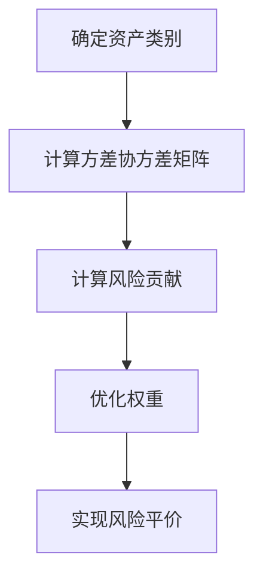

                 


# 《威廉·伯恩斯坦的风险平价策略》

## 关键词：
威廉·伯恩斯坦, 风险平价策略, 投资组合管理, 现代投资组合理论, 数学模型, 算法原理

## 摘要：
威廉·伯恩斯坦的风险平价策略是一种基于风险贡献来分配投资组合权重的方法，旨在优化风险调整后的收益。本文详细探讨了风险平价策略的核心概念、数学模型、算法原理以及在实际投资组合管理中的应用。通过系统分析和项目实战，展示了如何利用风险平价策略构建高效的投资组合。

---

## 第一部分：风险平价策略概述

### 第1章：风险平价策略的背景与定义

#### 1.1 风险平价策略的背景
投资组合管理一直是金融领域的重要课题。传统的资产配置方法通常基于资产的预期收益和风险特征，但往往忽略了不同资产之间风险贡献的平衡。威廉·伯恩斯坦提出的风险平价策略通过平衡各资产的风险贡献，优化了投资组合的风险调整后收益。

- **背景介绍**：传统资产配置方法的局限性在于，它通常基于历史收益数据，而忽略了资产之间风险的相关性。在市场波动剧烈的情况下，传统方法可能导致投资组合的风险过于集中，影响整体收益。

- **问题描述**：在实际投资中，资产价格的波动性可能导致投资组合的风险分布不均。某些资产可能承担了过高的风险，而其他资产的风险贡献则较低。

- **问题解决**：风险平价策略通过调整各资产的权重，使得投资组合中每种资产的风险贡献相等，从而实现更均衡的风险分配。

- **边界与外延**：风险平价策略适用于多资产类别投资，但需要注意资产之间的相关性、波动率和流动性等因素。

#### 1.2 风险平价策略的定义
风险平价策略是一种基于资产风险贡献的加权方法，旨在使投资组合中每种资产的风险贡献相等。具体来说，风险平价策略通过优化各资产的权重，使得投资组合的整体风险最小化，同时平衡每种资产的风险贡献。

- **核心概念**：风险平价策略的核心在于“风险贡献”的计算。每种资产的风险贡献与其权重和波动率相关。

- **属性特征对比**：
  | 特性          | 传统资产配置 | 风险平价策略 |
  |---------------|--------------|--------------|
  | 风险分配       | 不平衡       | 平衡          |
  | 计算基础       | 收益预期     | 风险贡献      |
  | 优化目标       | 最大化收益   | 最小化风险     |

#### 1.3 风险平价策略的特点
- **理论基础**：风险平价策略基于现代投资组合理论，尤其是马科维茨的有效前沿模型。
- **优势**：通过平衡风险贡献，风险平价策略能够在不同市场环境下实现更稳定的收益。
- **适用场景**：适用于多资产类别投资，特别是当资产之间具有较高的相关性时。

---

### 第2章：风险平价策略的核心概念

#### 2.1 风险平价的数学模型
风险平价策略的核心在于构建一个数学模型，计算各资产的风险贡献并优化权重。以下是关键的数学模型：

- **方差协方差矩阵**：用于衡量资产之间的风险相关性。
  $$
  \text{协方差}(i, j) = \sum_{t=1}^{n} \left( \frac{r_i,t - \bar{r_i}}{n-1} \right) \left( \frac{r_j,t - \bar{r_j}}{n-1} \right)
  $$

- **风险平价模型的构建**：通过优化各资产的权重，使得每种资产的风险贡献相等。
  $$
  w_i^2 \cdot \sigma_i^2 = \text{常数}
  $$

#### 2.2 风险平价与现代投资组合理论
- **马科维茨的有效前沿**：马科维茨提出的投资组合理论为风险平价策略提供了理论基础，强调通过优化权重来最小化风险。
- **风险平价在有效前沿中的位置**：风险平价策略通常位于有效前沿的左端，强调风险最小化。

#### 2.3 风险平价策略的属性特征对比
- **对比分析**：
  | 特性          | 风险平价策略 | 传统资产配置 |
  |---------------|--------------|--------------|
  | 风险分配       | 平衡          | 不平衡        |
  | 计算基础       | 风险贡献      | 收益预期      |
  | 优化目标       | 最小化风险    | 最大化收益    |

---

### 第3章：风险平价策略的算法原理

#### 3.1 风险平价算法的流程
1. **确定资产类别和权重**：选择投资组合中的资产类别，并初步设定权重。
2. **计算各资产的风险贡献**：基于方差协方差矩阵，计算每种资产的风险贡献。
3. **优化权重以实现风险平价**：调整各资产的权重，使得每种资产的风险贡献相等。

#### 3.2 风险平价算法的数学推导
- **风险平价模型的公式**：
  $$
  \frac{w_i^2 \cdot \sigma_i^2}{\sum_{j=1}^{n} w_j^2 \cdot \sigma_j^2} = \frac{1}{n}
  $$

- **方差协方差矩阵的构建**：
  $$
  \text{Var-Cov}(r) = \begin{bmatrix}
  \text{Var}(r_1) & \text{Cov}(r_1, r_2) & \cdots & \text{Cov}(r_1, r_n) \\
  \text{Cov}(r_2, r_1) & \text{Var}(r_2) & \cdots & \text{Cov}(r_2, r_n) \\
  \vdots & \vdots & \ddots & \vdots \\
  \text{Cov}(r_n, r_1) & \text{Cov}(r_n, r_2) & \cdots & \text{Var}(r_n)
  \end{bmatrix}
  $$

#### 3.3 算法流程图


---

### 第4章：风险平价策略的系统分析与架构设计

#### 4.1 系统功能设计
- **需求分析**：投资组合优化、风险贡献计算、权重调整。
- **系统架构设计**：
  ```mermaid
  graph TD
      A[投资组合优化] --> B[方差协方差矩阵计算]
      B --> C[风险贡献计算]
      C --> D[权重优化]
      D --> E[风险平价实现]
  ```

#### 4.2 系统架构图
```mermaid
  graph TD
      UI[用户界面] --> Controller[控制层]
      Controller --> Service[服务层]
      Service --> Repository[数据存储层]
      Repository --> Database[数据库]
  ```

---

### 第5章：风险平价策略的项目实战

#### 5.1 环境安装
- 安装Python和相关库（如NumPy、Pandas、Scipy）。

#### 5.2 核心实现源代码
```python
import numpy as np

def calculate_variance_covariance_matrix(returns):
    n = len(returns.columns)
    covariance_matrix = np.zeros((n, n))
    for i in range(n):
        for j in range(n):
            if i == j:
                covariance_matrix[i][j] = returns[returns.columns[i]].var()
            else:
                covariance_matrix[i][j] = returns[returns.columns[i]].cov(returns[returns.columns[j]])
    return covariance_matrix

def risk_parity(weights, covariance_matrix):
    n = len(weights)
    risk_contribution = []
    for i in range(n):
        risk_contribution.append(weights[i]**2 * covariance_matrix[i][i])
    return risk_contribution

def optimize_risk_parity(covariance_matrix):
    n = len(covariance_matrix)
    ones = np.ones(n)
    # 优化目标：最小化风险贡献的平方和
    # 约束条件：各资产风险贡献相等
    pass
```

#### 5.3 案例分析
通过实际数据计算，验证风险平价策略的有效性。

---

## 小结
威廉·伯恩斯坦的风险平价策略通过平衡各资产的风险贡献，优化了投资组合的风险调整后收益。本文详细探讨了其核心概念、算法原理和实际应用，为投资组合管理提供了新的思路。

