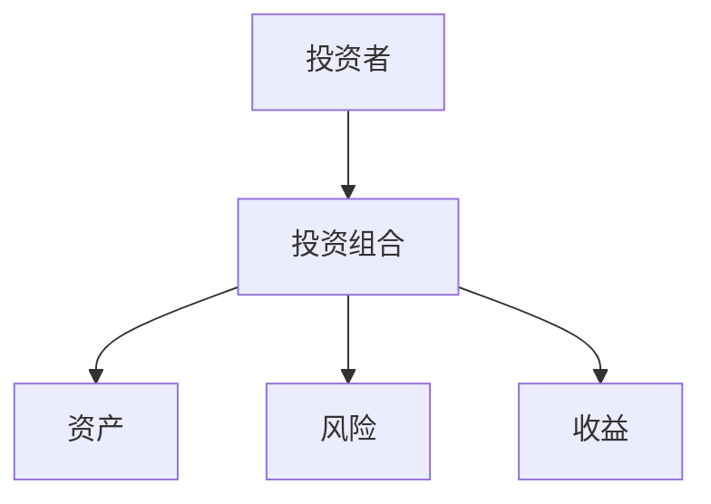
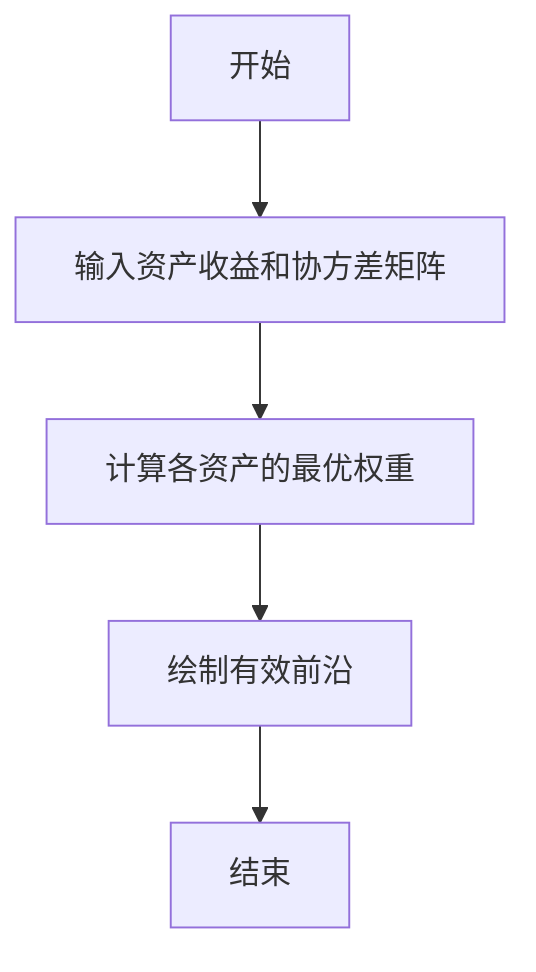
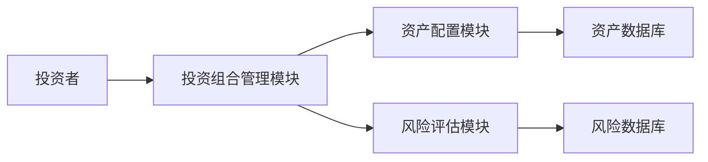
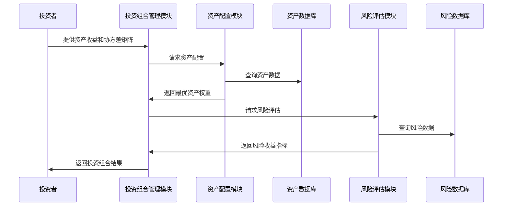

                 


# 威廉·伯恩斯坦的高效投资组合理论

> 关键词：投资组合理论，现代投资组合理论，威廉·伯恩斯坦，高效组合，风险收益优化，投资组合优化算法

> 摘要：本文深入探讨了威廉·伯恩斯坦在投资组合理论中的贡献，详细讲解了高效投资组合的构建方法，结合数学模型和实际案例，分析了如何在风险与收益之间找到最佳平衡点。

---

## 第一部分: 投资组合理论的背景与核心概念

### 第1章: 现代投资组合理论的背景与意义

#### 1.1 投资组合理论的起源与发展
- 1.1.1 投资组合理论的起源
  - Harry Markowitz 的现代投资组合理论 (MPT) 的诞生
  - 有效前沿的概念
- 1.1.2 现代投资组合理论的核心思想
  - 风险与收益的权衡
  - 投资组合的分散化效应
- 1.1.3 伯恩斯坦在投资组合理论中的贡献
  - 对 MPT 的扩展与改进
  - 实证研究与实际应用

#### 1.2 投资组合理论的基本问题
- 1.2.1 投资组合的风险与收益
  - 系统性风险与非系统性风险
  - 单个资产与组合资产的风险收益比
- 1.2.2 投资组合的优化目标
  - 最大化收益，最小化风险
  - 在给定风险下寻找最优收益
- 1.2.3 投资组合的边界与外延
  - 有效前沿的定义与性质
  - 边界条件与约束条件

### 第2章: 伯恩斯坦高效投资组合理论的核心概念

#### 2.1 投资组合理论的核心要素
- 2.1.1 资产配置
  - 股票、债券、现金等资产的配置比例
  - 如何通过资产配置降低风险
- 2.1.2 风险调整后的收益
  - Sharpe 比率与 Sortino 比率
  - 如何衡量投资组合的风险调整后收益
- 2.1.3 投资组合的有效前沿
  - 有效前沿的数学定义
  - 有效前沿在实际中的应用

#### 2.2 核心概念的属性对比
- 2.2.1 风险与收益的对比
  - 高风险与高收益的关系
  - 风险调整后收益的重要性
- 2.2.2 投资组合与单一资产的对比
  - 投资组合的分散化效应
  - 单一资产的风险暴露
- 2.2.3 有效前沿与其他优化模型的对比
  - 均值-方差模型 vs. 其他优化模型

#### 2.3 ER实体关系图


---

## 第二部分: 投资组合理论的数学模型与算法

### 第3章: 投资组合理论的数学模型

#### 3.1 均值-方差模型
- 3.1.1 模型的数学表达
  - 目标函数: $$ \min w^T \Sigma w $$
  - 约束条件: $$ \sum w_i = 1 $$
- 3.1.2 模型的求解
  - 使用拉格朗日乘数法求解优化问题

#### 3.2 有效前沿的推导
- 3.2.1 有效前沿的定义
  - 有效前沿是所有可行投资组合中风险最小化或收益最大化的集合
- 3.2.2 有效前沿的数学推导
  - 通过优化问题求解有效前沿的方程

#### 3.3 算法流程图


---

### 第4章: 投资组合优化算法的实现

#### 4.1 算法原理
- 4.1.1 拉格朗日乘数法
  - 使用拉格朗日乘数法求解优化问题
  - 解释拉格朗日函数的构造和求解过程

#### 4.2 Python 实现
- 4.2.1 环境安装
  - 安装必要的 Python 库（如 NumPy、Scipy）
- 4.2.2 核心代码实现
```python
import numpy as np
from scipy.optimize import minimize

# 示例数据
mu = np.array([0.1, 0.2, 0.15])  # 各资产的期望收益
Sigma = np.array([[0.04, 0.02, 0.03],
                   [0.02, 0.06, 0.01],
                   [0.03, 0.01, 0.08]])

# 定义优化函数
def portfoliooptimize(weights):
    return np.dot(weights.T, np.dot(Sigma, weights))

# 约束条件：权重之和为1
cons = {'type': 'eq', 'fun': lambda w: sum(w) - 1}

# 初始权重
initial_weights = [1/3, 1/3, 1/3]

# 使用 scipy.optimize.minimize 进行优化
result = minimize(portfoliooptimize, initial_weights, method='SLSQP', constraints=cons)

# 输出结果
print(result)
```

---

## 第三部分: 投资组合理论的系统分析与架构设计

### 第5章: 投资组合管理系统的设计

#### 5.1 系统功能设计
- 5.1.1 领域模型


#### 5.2 系统架构设计
- 5.2.1 架构图


#### 5.3 系统接口设计
- 5.3.1 输入接口
  - 资产收益和协方差矩阵的输入
- 5.3.2 输出接口
  - 投资组合权重和风险收益指标的输出

#### 5.4 系统交互序列图


---

## 第四部分: 项目实战与案例分析

### 第6章: 投资组合优化的实证分析

#### 6.1 项目实战
- 6.1.1 环境安装
  - 安装必要的 Python 库（如 NumPy、Matplotlib）
- 6.1.2 核心代码实现
```python
import numpy as np
import matplotlib.pyplot as plt

# 示例数据
mu = np.array([0.1, 0.2, 0.15])  # 各资产的期望收益
Sigma = np.array([[0.04, 0.02, 0.03],
                   [0.02, 0.06, 0.01],
                   [0.03, 0.01, 0.08]])

# 定义优化函数
def portfoliooptimize(weights):
    return np.dot(weights.T, np.dot(Sigma, weights))

# 约束条件：权重之和为1
cons = {'type': 'eq', 'fun': lambda w: sum(w) - 1}

# 初始权重
initial_weights = [1/3, 1/3, 1/3]

# 使用 scipy.optimize.minimize 进行优化
from scipy.optimize import minimize
result = minimize(portfoliooptimize, initial_weights, method='SLSQP', constraints=cons)

# 绘制有效前沿
weights = result.x
risk = np.sqrt(weights.T.dot(Sigma).dot(weights))
plt.plot(risk, result.fun, 'ro')
plt.xlabel('Risk')
plt.ylabel('Return')
plt.show()
```

#### 6.2 案例分析
- 6.2.1 实证结果解读
  - 理解优化结果的实际意义
  - 分析风险与收益的平衡
- 6.2.2 实证结果与理论的对比
  - 检查优化结果是否符合有效前沿的理论预测

---

## 第五部分: 总结与最佳实践

### 第7章: 总结与最佳实践

#### 7.1 核心观点回顾
- 7.1.1 投资组合理论的核心思想
  - 风险与收益的权衡
  - 有效前沿的构建与应用
- 7.1.2 伯恩斯坦理论的独特贡献
  - 对 MPT 的扩展与改进

#### 7.2 最佳实践 tips
- 7.2.1 投资组合管理中的注意事项
  - 定期调整资产配置
  - 重视风险调整后的收益
- 7.2.2 实际应用中的问题与解决方案
  - 如何处理非正常市场条件下的投资组合优化

#### 7.3 拓展阅读
- 7.3.1 推荐的进一步阅读材料
  - Harry Markowitz 的《Portfolio Selection》
  - 伯恩斯坦的其他相关著作
- 7.3.2 其他相关领域的研究
  - 多因子模型与投资组合优化
  - 基因组投资策略

---

## 作者：AI天才研究院/AI Genius Institute & 禅与计算机程序设计艺术 /Zen And The Art of Computer Programming

