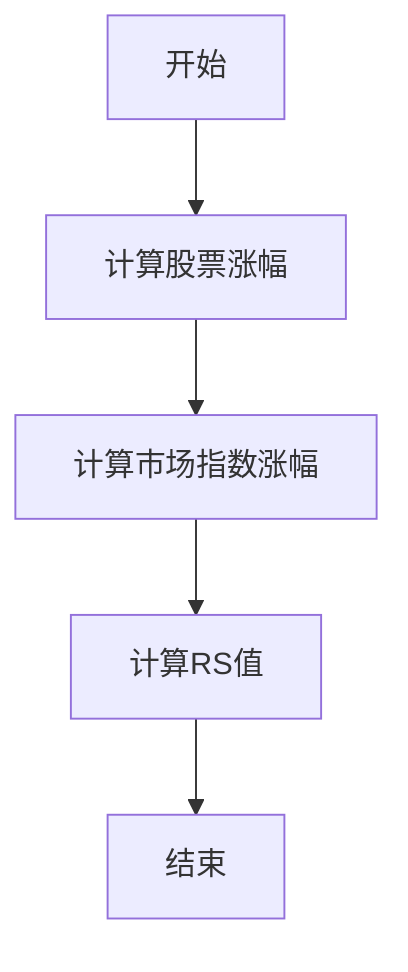
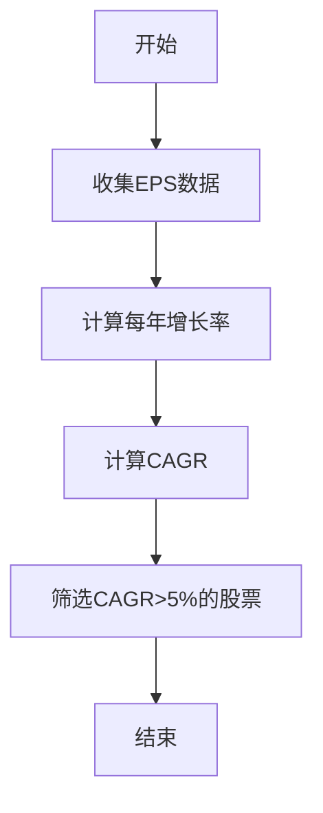
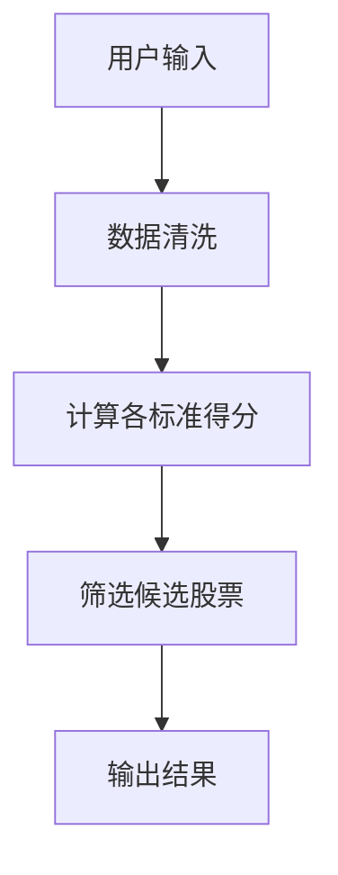
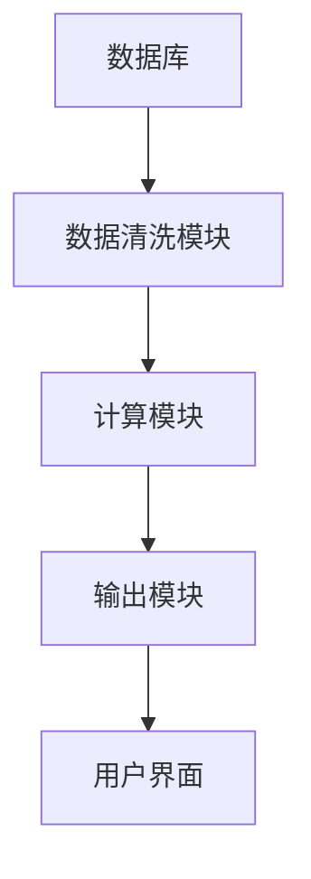
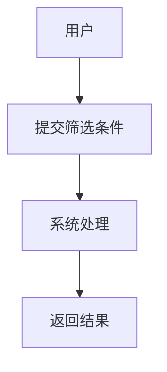

                 


# 《威廉·欧奈尔的CANSLIM选股系统》

> **关键词**: CANSLIM选股系统, 威廉·欧奈尔, 股票筛选标准, 股票投资策略, 技术分析, 股票市场

> **摘要**:  
威廉·欧奈尔的CANSLIM选股系统是一种经典的股票筛选方法，通过七个关键标准（C、A、N、S、L、I、M）帮助投资者选择具有长期增长潜力的股票。本文详细解析CANSLIM的背景、核心概念、数学模型、算法原理，以及其在实际投资中的应用，结合技术分析和系统设计，为投资者提供深度的分析和实践指导。

---

## 目录

### 第一部分: 威廉·欧奈尔CANSLIM选股系统的背景与核心概念

### 第2章: CANSLIM选股系统的七个核心标准

#### 2.1 C - Current Strength（当前强度）

**2.1.1 当前强度的定义与计算方法**

当前强度（Current Strength）是CANSLIM系统中的第一个标准，用于衡量股票相对于市场的表现。其定义为股票在过去52周内的相对强度（RS）与其在当前周期内的表现的结合。

**公式：**

$$
\text{RS} = \frac{\text{股票价格涨幅}}{\text{市场指数涨幅}}
$$

**当前强度的计算步骤：**

1. 计算股票在过去52周内的价格涨幅。
2. 计算同期市场指数（如标普500）的价格涨幅。
3. 将股票涨幅除以市场指数涨幅，得到相对强度（RS）。
4. 根据RS值对股票进行排序，RS值越高，当前强度越强。

**图2-1：相对强度计算流程图**



**2.1.2 当前强度在选股中的作用**

当前强度用于筛选出那些表现优于市场的股票。RS值超过市场指数的股票通常被认为具有更强的上涨潜力。

**2.1.3 当前强度与其他指标的关系**

当前强度与后续的标准（如市场动量、交易量水平等）密切相关。例如，较高的RS值通常伴随着较高的交易量，这表明股票的强势表现得到市场的认可。

---

#### 2.2 A - Annual Earnings（年度收益）

**2.2.1 年度收益的定义与计算**

年度收益（Annual Earnings）指公司过去几年的每股收益（EPS）的年复合增长率。EPS的计算公式为：

$$
\text{EPS} = \frac{\text{净利润}}{\text{流通股数}}
$$

**步骤：**

1. 收集过去5年的EPS数据。
2. 计算每年的EPS增长率。
3. 计算5年EPS的年复合增长率（CAGR）。
4. 保留年复合增长率大于5%的股票。

**图2-2：年度收益计算流程**



**2.2.2 年度收益在选股中的重要性**

年复合增长率高的股票通常具有更强的盈利能力，且公司处于成长阶段，未来可能继续增长。

---

#### 2.3 N - Number of Stocks（数量）

**2.3.1 数量的定义与意义**

数量（Number of Stocks）指在当前市场环境下，符合其他六个标准（C、A、S、L、I、M）的股票数量。通常，数量应控制在市场前1/3的范围内，以避免过于拥挤。

**步骤：**

1. 根据其他标准筛选出候选股票。
2. 统计候选股票的数量。
3. 确保数量在市场前1/3范围内。

**2.3.2 数量在选股中的应用**

数量过多可能导致竞争加剧，而数量过少可能无法找到合适的标的。因此，数量是平衡风险和收益的重要指标。

---

#### 2.4 S - Supply Line（供应线）

**2.4.1 供应线的定义与作用**

供应线（Supply Line）是指在特定价格水平上，股票的供给量与需求量达到平衡的点。通过分析供应线，投资者可以判断股价的支撑位或阻力位。

**步骤：**

1. 通过技术图表识别关键的价格水平（如历史高点、低点等）。
2. 确定这些价格水平上的交易量变化。
3. 判断这些价格水平是否为支撑位或阻力位。

**2.4.2 供应线在技术分析中的应用**

供应线帮助投资者识别股价可能的转折点，从而做出买卖决策。

---

#### 2.5 L - Level of Trading Volume（交易量水平）

**2.5.1 交易量的定义与计算**

交易量（Level of Trading Volume）指股票在一定时间段内的成交量。成交量的计算公式为：

$$
\text{交易量} = \text{成交量} = \sum (\text{成交价} \times \text{成交量})
$$

**步骤：**

1. 收集股票的历史成交量数据。
2. 计算平均成交量。
3. 筛选出成交量高于平均水平的股票。

**2.5.2 交易量在选股中的重要性**

高成交量表明股票的活跃度高，市场关注度高，通常预示着股价的波动性较大。

---

#### 2.6 I - Integrity of Earnings（收益的连续性）

**2.6.1 收益连续性的定义与衡量标准**

收益连续性（Integrity of Earnings）指公司过去几年的EPS是否持续增长且无重大波动。

**步骤：**

1. 收集过去5年的EPS数据。
2. 检查每年的EPS是否连续增长。
3. 筛选出连续增长的股票。

**2.6.2 收益连续性对投资决策的影响**

收益连续性高的股票通常具有稳定的盈利能力，风险较低。

---

#### 2.7 M - Market Momentum（市场动量）

**2.7.1 市场动量的定义与计算方法**

市场动量（Market Momentum）指股票价格的近期趋势。其计算公式为：

$$
\text{动量} = \frac{\text{当前价格} - \text{N周前价格}}{\text{N周前价格}}
$$

**步骤：**

1. 选择一个周期（如12周）。
2. 计算股票在该周期内的价格变化率。
3. 筛选出动量为正的股票。

**2.7.2 市场动量在选股中的应用**

市场动量帮助投资者识别近期表现强劲的股票，通常预示着未来的继续上涨。

---

### 第3章: CANSLIM选股系统的数学模型与算法原理

#### 3.1 CANSLIM选股系统的数学模型

**3.1.1 选股标准的量化公式**

综合考虑七个标准，每个标准赋予不同的权重，计算总得分：

$$
\text{总得分} = w_C \times C + w_A \times A + w_N \times N + w_S \times S + w_L \times L + w_I \times I + w_M \times M
$$

其中，$w$为各标准的权重系数。

**3.1.2 股票评分的计算方法**

根据总得分对股票进行排序，得分越高，优先级越高。

---

#### 3.2 CANSLIM选股算法的实现

**3.2.1 算法的输入与输出**

- **输入**: 股票数据（包括价格、成交量、EPS等）。
- **输出**: 符合CANSLIM标准的候选股票列表。

**3.2.2 算法的实现步骤**

1. 数据预处理：清洗和标准化股票数据。
2. 计算各标准的得分。
3. 综合得分并排序。
4. 筛选出符合条件的股票。

**3.2.3 算法的优化**

通过调整权重系数和优化计算方法，提高筛选效率和准确性。

---

### 第4章: 基于CANSLIM的股票筛选系统设计

#### 4.1 系统功能设计

- 用户输入：股票数据输入。
- 数据处理：清洗、计算各标准得分。
- 筛选输出：符合条件的股票列表。

**图4-1：系统功能设计流程图**



---

#### 4.2 系统架构设计

- 数据源：股票数据库。
- 处理层：数据清洗、计算模块。
- 输出层：结果展示。

**图4-2：系统架构图**



---

#### 4.3 系统交互设计

- 用户提交筛选条件。
- 系统处理并返回结果。

**图4-3：系统交互流程图**



---

### 第5章: 项目实战与案例分析

#### 5.1 环境安装与数据准备

- 安装Python和相关库（Pandas、NumPy、Matplotlib）。
- 下载股票数据（如Yahoo Finance）。

#### 5.2 核心实现代码

```python
import pandas as pd
import numpy as np

def calculate_rs(stock_price, market_price):
    rs = (stock_price[-1] / market_price[-1]) * 100
    return rs

def calculate_cagr(eplist):
    n = len(eplist)
    cagr = (eplist[-1] / eplist[0]) ** (1/n) - 1
    return cagr

# 示例数据
stock_data = pd.read_csv('stock.csv')
market_data = pd.read_csv('market.csv')

stock_prices = stock_data['Close'].tolist()
market_prices = market_data['Close'].tolist()

rs = calculate_rs(stock_prices, market_prices)
cagr = calculate_cagr(stock_data['EPS'].tolist())

print(f"相对强度: {rs}%")
print(f"年复合增长率: {cagr:.2f}%")
```

---

#### 5.3 实际案例分析

以苹果公司为例，计算其RS和CAGR，并判断是否符合CANSLIM标准。

---

### 第6章: 最佳实践与小结

#### 6.1 投资策略与风险管理

- 定期复盘和调整投资组合。
- 结合其他指标（如技术指标）进行综合判断。

#### 6.2 小结与展望

CANSLIM系统提供了一套科学的选股方法，但实际投资中需结合市场环境和公司基本面进行综合判断。

---

### 作者

**作者：AI天才研究院/AI Genius Institute & 禅与计算机程序设计艺术 /Zen And The Art of Computer Programming**

---

**注**: 由于篇幅限制，上述内容为简要示例，实际文章需要详细展开每个部分的内容，并加入更多数据、图表和案例支持。

