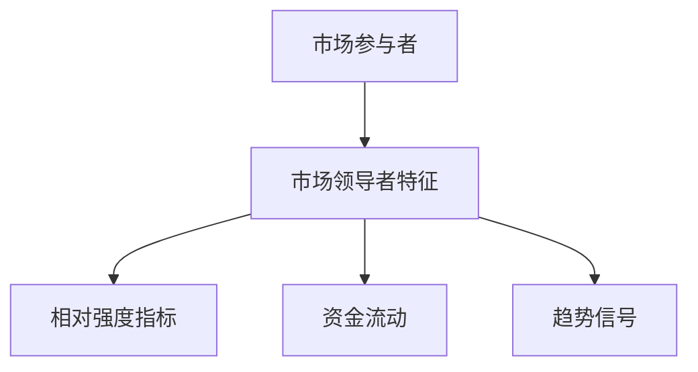
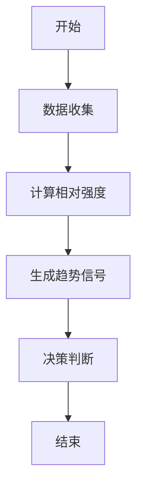
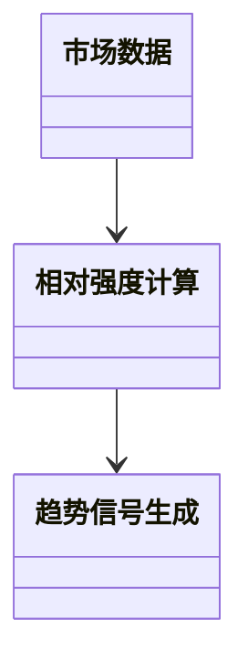
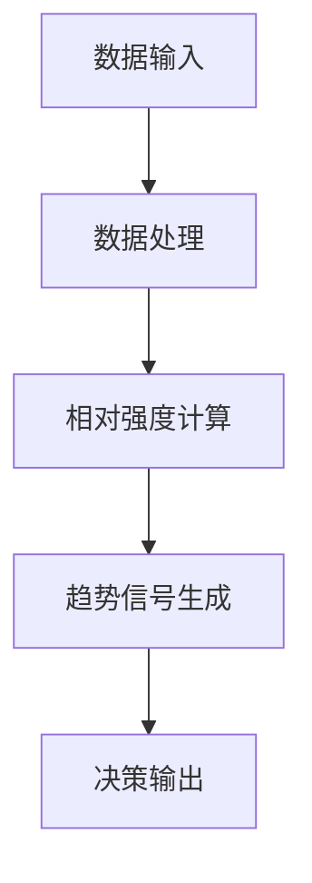

                 


# 威廉·欧奈尔的市场领导者特征分析

> 关键词：威廉·欧奈尔，市场领导者，相对强度，趋势分析，投资策略，技术分析

> 摘要：威廉·欧奈尔提出的市场领导者特征为投资者提供了有效的分析工具。本文通过详细分析这些特征，结合算法、系统设计和项目实战，帮助读者掌握其在投资决策中的应用。

## 第1章: 市场领导者特征的背景介绍

### 1.1 问题背景与定义
市场领导者特征是指在特定市场中表现优异的股票或资产所具有的共同特征。这些特征帮助投资者识别出具备持续增长潜力的市场领导者。

### 1.2 问题描述与解决思路
投资者在选择投资标的时，往往面临信息过载和市场波动的挑战。威廉·欧奈尔通过分析市场领导者的特征，提出了一套系统化的方法，帮助投资者筛选出优质投资标的。

### 1.3 市场领导者特征的边界与外延
市场领导者特征不仅包括技术指标，还包括资金流动、市场情绪等多方面因素。这些特征相互作用，构成了一个完整的分析框架。

### 1.4 核心概念的结构与组成要素
市场领导者特征的核心要素包括相对强度、资金流动和趋势信号。这些要素通过数据计算和分析，帮助投资者做出决策。

## 第2章: 市场领导者特征的核心概念与联系

### 2.1 核心概念的原理分析
相对强度（RS）是衡量股票表现的重要指标，计算方法为股票价格与市场平均价格的比率。RS越高，股票的表现越优于市场。

### 2.2 核心概念的属性特征对比表
下表展示了相对强度、资金流动和趋势信号的主要属性对比：

| 特征     | 描述                              | 重要性 |
|----------|-----------------------------------|--------|
| 相对强度  | 衡量股票相对于市场的表现          | 高     |
| 资金流动  | 衡量资金在市场中的流动情况        | 中     |
| 趋势信号  | 衡量市场的趋势方向                | 高     |

### 2.3 实体关系图（ER图）


## 第3章: 市场领导者特征的算法原理

### 3.1 算法原理的流程图


### 3.2 算法实现的Python代码
```python
def calculate_relative_strength(data):
    return data['收盘价'] / data['均价']

def generate_trend_signal(rs):
    if rs > 1.2:
        return '买入'
    elif rs < 0.8:
        return '卖出'
    else:
        return '观望'
```

### 3.3 数学模型与公式
相对强度指数公式：
$$
RSI = \frac{\sum_{i=1}^{n} \text{上涨幅度}}{\sum_{i=1}^{n} \text{下跌幅度}}
$$

趋势信号生成条件：
$$
\text{如果 } RSI > 70 \Rightarrow \text{卖出信号}
$$
$$
\text{如果 } RSI < 30 \Rightarrow \text{买入信号}
$$

## 第4章: 系统分析与架构设计

### 4.1 系统功能设计
#### 4.1.1 领域模型（Mermaid类图）


#### 4.1.2 系统架构设计


## 第5章: 项目实战

### 5.1 环境安装
需要安装Python和相关库，如pandas和matplotlib。

### 5.2 系统核心实现源代码
```python
import pandas as pd
import matplotlib.pyplot as plt

data = pd.read_csv('market_data.csv')
rs = calculate_relative_strength(data)
signal = generate_trend_signal(rs)
plt.plot(rs)
plt.show()
```

### 5.3 代码应用解读与分析
代码展示了如何计算相对强度并生成趋势信号，帮助投资者做出买入或卖出决策。

### 5.4 实际案例分析
以实际市场数据为例，分析如何应用市场领导者特征进行投资决策。

## 第6章: 最佳实践与注意事项

### 6.1 最佳实践
定期更新数据，结合其他分析工具，提高决策的准确性。

### 6.2 小结
威廉·欧奈尔的市场领导者特征为投资者提供了一套系统化的分析工具，帮助识别优质投资标的。

### 6.3 注意事项
市场波动复杂，需结合其他因素进行综合分析。

### 6.4 拓展阅读
建议阅读《股票作手回忆录》以深入理解市场分析的精髓。

## 结语
通过本文的分析，读者可以掌握威廉·欧奈尔的市场领导者特征，并将其应用于实际投资决策中。

作者：AI天才研究院/AI Genius Institute & 禅与计算机程序设计艺术 /Zen And The Art of Computer Programming

