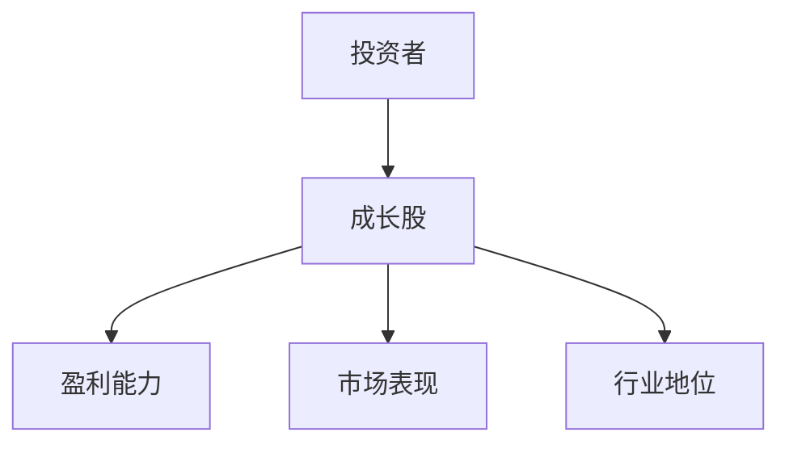
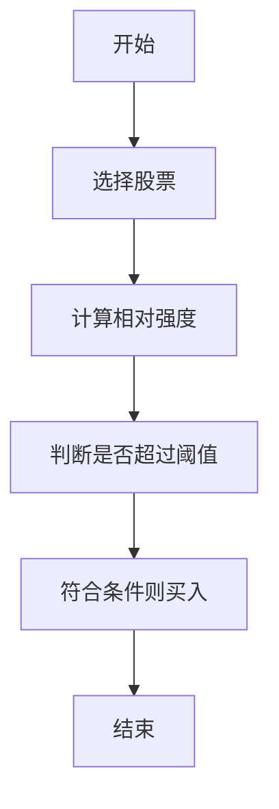
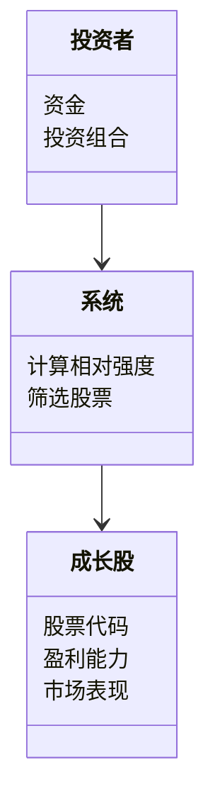
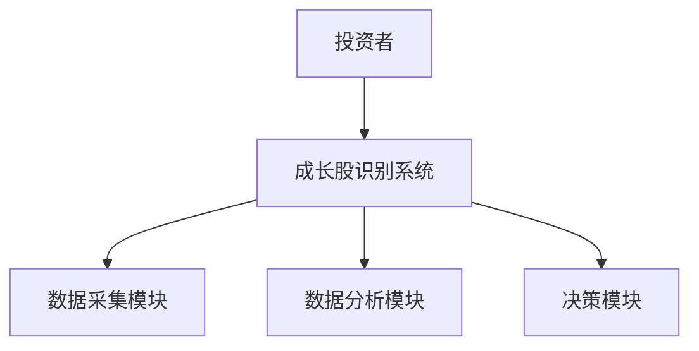
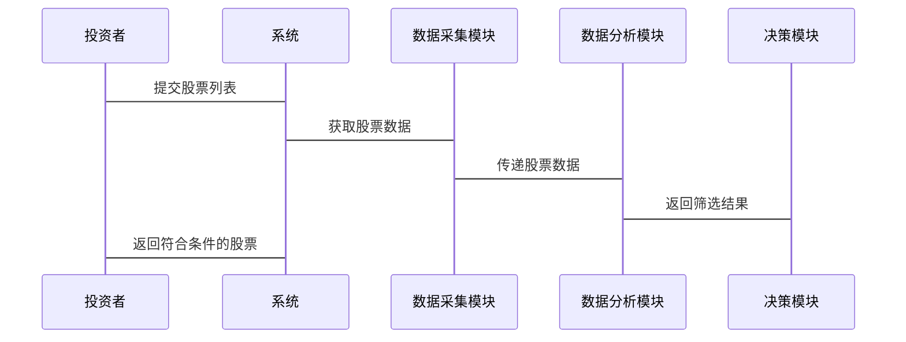

                 


# 威廉·欧奈尔的成长股识别方法

> 关键词：威廉·欧奈尔，成长股，投资策略，相对强度指数，CAN SLIM模型，投资系统架构

> 摘要：本文深入探讨了威廉·欧奈尔的成长股识别方法，从其核心理念、选股标准、数学模型到系统架构和项目实战，结合实例分析，全面解析了该方法的理论基础和实际应用。文章旨在帮助投资者理解并掌握这一经典投资策略。

---

# 第一部分：威廉·欧奈尔的成长股识别方法概述

## 第1章：成长股的基本概念与背景介绍

### 1.1 成长股的定义与特点
#### 1.1.1 成长股的定义
成长股是指那些具备高成长潜力，且未来盈利预期显著高于行业平均水平的股票。这类股票通常属于快速发展的行业，公司营业收入和净利润持续增长。

#### 1.1.2 成长股的核心特点
- **高增长率**：公司收入和利润增速快。
- **高市盈率**：由于高增长预期，股票估值通常较高。
- **行业领先地位**：公司往往在行业内占据优势地位。

#### 1.1.3 成长股与价值股的区别
| 指标       | 成长股          | 价值股          |
|------------|----------------|----------------|
| 盈利能力   | 高增长         | 稳定            |
| 市盈率     | 高             | 低              |
| 行业地位   | 新兴行业       | 成熟行业        |

### 1.2 威廉·欧奈尔的成长股投资方法
#### 1.2.1 威廉·欧奈尔的背景与投资哲学
威廉·欧奈尔是美国著名投资大师，其成长股投资理论强调通过基本面分析和市场趋势判断来选择优质成长股。

#### 1.2.2 成长股投资的核心理念
- 选择具备持续盈利能力和市场领导地位的公司。
- 通过相对强度指数（RSI）和资金流动情况筛选股票。

#### 1.2.3 成长股投资的适用场景与边界
- 适用于成长型企业扎堆的新兴行业。
- 需要警惕高估值风险和市场波动。

---

## 第2章：威廉·欧奈尔的成长股选股标准

### 2.1 成长股的核心要素
#### 2.1.1 盈利能力分析
- 净利润增长率：$$\text{净利润增长率} = \frac{\text{当年净利润} - \text{上年净利润}}{\text{上年净利润}} \times 100\%$$
- 营业收入增长率：$$\text{营业收入增长率} = \frac{\text{当年营业收入} - \text{上年营业收入}}{\text{上年营业收入}} \times 100\%$$

#### 2.1.2 市场表现分析
- 相对强度指数（RSI）：$$\text{RSI} = \frac{\text{上涨天数}}{\text{交易天数}} \times 100$$
- 股价走势：关注股价是否创历史新高。

#### 2.1.3 行业地位分析
- 市场占有率：公司是否在行业内占据领先地位。
- 行业发展趋势：行业是否具备成长空间。

### 2.2 威廉·欧奈尔的CAN SLIM选股策略
#### 2.2.1 C - 行业领导地位
- 公司是否在行业中占据领先地位。
- 是否具备强大的竞争优势。

#### 2.2.2 A - 年度收益
- 公司是否连续多年实现盈利增长。
- 是否具备稳定的收益能力。

#### 2.2.3 N - 新高
- 股价是否创出历史新高。
- 是否具备持续上涨潜力。

#### 2.2.4 S - 相对强度
- 股价走势是否强于市场平均水平。
- RSI指标是否高于70。

#### 2.2.5 L - 机构资金流入
- 是否有大量机构资金流入。
- 机构投资者是否看好公司前景。

#### 2.2.6 M - 市场宽度
- 是否有多只股票同步创出新高。
- 市场宽度指标是否超过70。

---

## 第3章：成长股投资的核心概念与联系

### 3.1 成长股投资的数学模型
#### 3.1.1 相对强度公式
$$\text{相对强度} = \frac{\text{当前股价}}{\text{历史最高股价}}$$

#### 3.1.2 市盈率与成长性评估
$$\text{市盈率} = \frac{\text{股价}}{\text{每股收益}}$$

### 3.2 成长股与价值股的对比分析
| 指标       | 成长股          | 价值股          |
|------------|----------------|----------------|
| 盈利能力   | 高增长         | 稳定            |
| 市盈率     | 高             | 低              |
| 行业地位   | 新兴行业       | 成熟行业        |

### 3.3 成长股投资的ER实体关系图


---

## 第4章：威廉·欧奈尔成长股识别的算法原理

### 4.1 相对强度指数算法
#### 4.1.1 算法流程图


#### 4.1.2 算法实现代码
```python
def calculate_relative_strength(stock_price, historical_high):
    relative_strength = stock_price / historical_high
    return relative_strength
```

---

## 第5章：成长股投资的系统分析与架构设计

### 5.1 系统功能设计
#### 5.1.1 领域模型


### 5.2 系统架构设计


### 5.3 系统接口设计
- 输入接口：股票数据接口。
- 输出接口：筛选结果接口。

### 5.4 系统交互流程图


---

## 第6章：成长股投资的项目实战

### 6.1 环境安装
- 数据源：选择金融数据服务提供商（如Yahoo Finance）。
- 工具：Python编程环境，Pandas库。

### 6.2 核心代码实现
```python
import pandas as pd

def calculate_relative_strength(data):
    relative_strength = data['Close'] / data['High']
    return relative_strength

# 示例数据
data = {
    'Close': [100, 105, 110, 115],
    'High': [120, 125, 130, 135]
}
df = pd.DataFrame(data)
rs = calculate_relative_strength(df)
print(rs)
```

### 6.3 案例分析
- 选择一家新兴行业的公司，计算其相对强度和市盈率。
- 判断是否符合CAN SLIM选股标准。

---

## 第7章：成长股投资的最佳实践

### 7.1 风险管理
- 设定止损位：通常设为买入价的5%~10%。
- 分批建仓：分散投资风险。

### 7.2 持续学习
- 关注行业动态。
- 定期复盘投资组合。

### 7.3 投资纪律
- 遵循投资策略，避免情绪化交易。

---

## 第8章：总结与展望

### 8.1 全文总结
本文系统地介绍了威廉·欧奈尔的成长股识别方法，从理论到实践，结合数学模型和系统架构，帮助投资者掌握这一经典策略。

### 8.2 未来展望
随着大数据和人工智能技术的发展，成长股识别方法将更加精准和高效。

---

## 参考文献

（此处列出相关的书籍、论文和网站资源）

---

## 作者信息

作者：AI天才研究院/AI Genius Institute & 禅与计算机程序设计艺术 /Zen And The Art of Computer Programming

