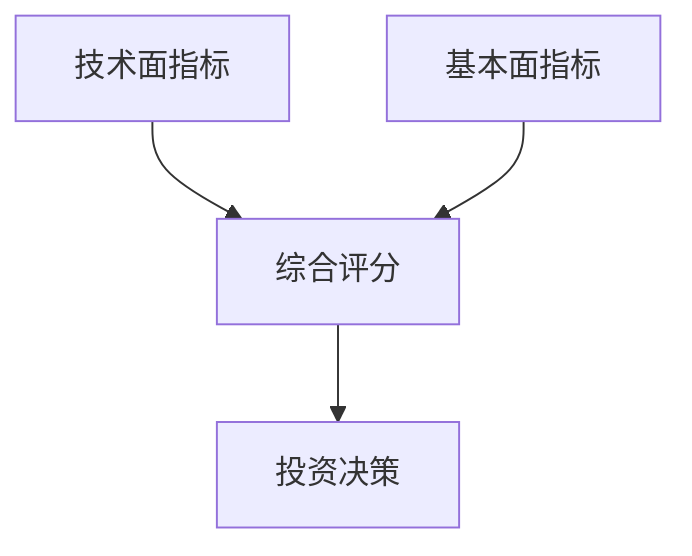
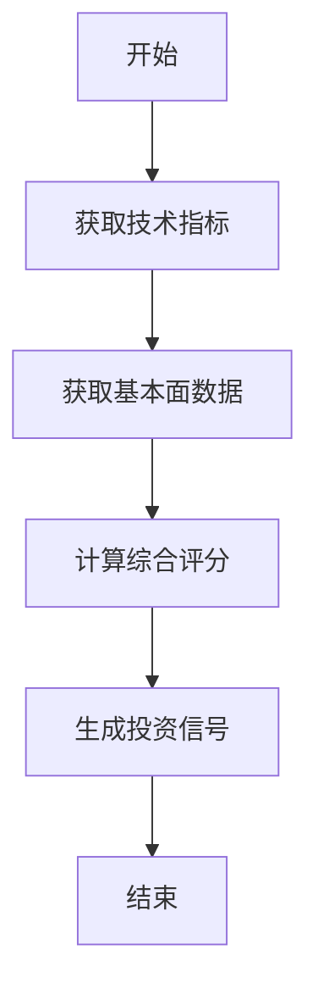
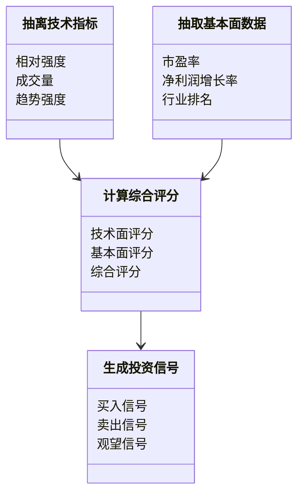
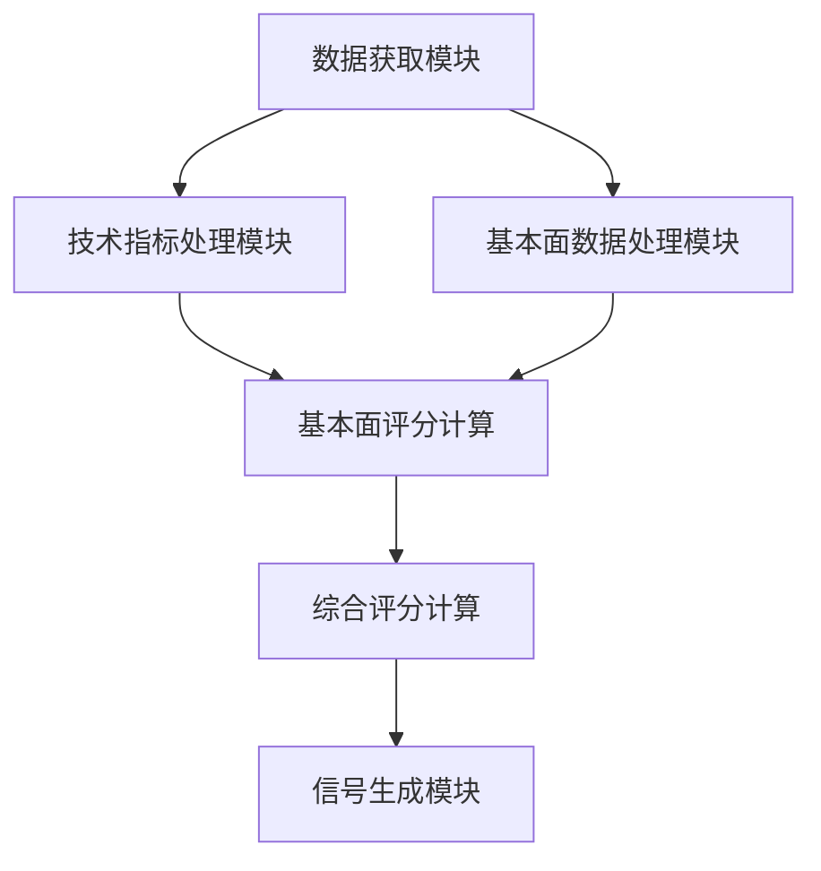
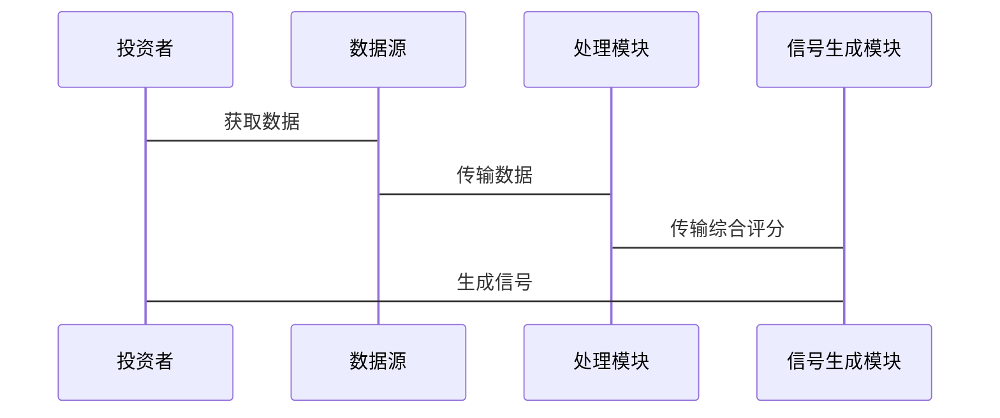

                 


# 威廉·欧奈尔的技术面与基本面结合策略

> 关键词：技术面分析，基本面分析，威廉·欧奈尔，投资策略，股票交易

> 摘要：本文系统地介绍了威廉·欧奈尔的技术面与基本面结合的投资策略，从背景、核心概念、算法原理、系统架构到项目实战，全面剖析了该策略的理论基础、数学模型、实现方法及其在实际投资中的应用。通过详细分析，本文揭示了如何将技术分析和基本面分析有机结合，以提高投资决策的准确性和可靠性。

---

# 第一部分: 背景介绍

## 第1章: 技术面与基本面分析的背景

### 1.1 问题背景

#### 1.1.1 技术分析与基本面分析的局限性
技术分析和基本面分析是投资领域中两大传统方法。技术分析依赖于价格、成交量等市场数据，通过识别价格趋势和形态来预测未来的价格走势。然而，技术分析的局限性在于它忽略了基本面因素，无法全面反映企业的内在价值。基本面分析则侧重于公司的财务状况、行业地位、盈利能力等内在因素，但其缺点在于无法及时反映市场的短期波动。

#### 1.1.2 技术面与基本面结合的必要性
单一的技术分析或基本面分析往往难以应对复杂多变的市场环境。通过将技术面与基本面结合，投资者可以综合利用两者的优点，避免片面决策，提高投资的准确性和稳健性。威廉·欧奈尔正是基于这一思想，提出了技术面与基本面结合的投资策略。

#### 1.1.3 威廉·欧奈尔策略的核心目标
威廉·欧奈尔的策略旨在通过结合技术分析和基本面分析，识别出那些具有强大基本面支持且处于上升趋势的股票，从而实现超额收益。

### 1.2 核心概念

#### 1.2.1 技术面分析的定义与特点
- **定义**：技术分析是一种通过分析历史价格和成交量数据来预测未来价格走势的方法。
- **特点**：注重价格和成交量的变化，依赖于图表和指标。

#### 1.2.2 基本面分析的定义与特点
- **定义**：基本面分析是通过研究公司的财务报表、行业地位、管理团队等内在因素来评估其投资价值的方法。
- **特点**：关注公司的内在价值，注重长期投资。

#### 1.2.3 两者结合的定义与特点
- **定义**：技术面与基本面结合是一种综合分析方法，既考虑市场技术指标，又关注公司基本面因素。
- **特点**：兼顾短期市场波动和长期内在价值，适合不同市场环境下的投资决策。

### 1.3 问题解决

#### 1.3.1 技术面与基本面结合的解决方案
通过综合分析技术面和基本面指标，筛选出同时满足技术形态和基本面改善的股票。

#### 1.3.2 该策略在投资中的应用价值
- 提高投资决策的全面性。
- 降低单一分析方法的局限性。
- 增强策略的稳定性和收益性。

#### 1.3.3 成功案例分析
例如，某公司在基本面改善的同时，股价也呈现出上升趋势，通过威廉·欧奈尔策略成功捕捉到这一机会，实现超额收益。

### 1.4 边界与外延

#### 1.4.1 适用的市场环境与资产类型
- 适用市场环境：股票、基金、期货等。
- 适用资产类型：股票、债券等。

#### 1.4.2 不适用的情况与限制
- 市场剧烈波动或非理性阶段。
- 数据不足或数据质量差的情况。

#### 1.4.3 策略的可扩展性与适应性
通过调整参数和指标，该策略可以适应不同市场环境和投资目标。

### 1.5 概念结构与核心要素

#### 1.5.1 核心要素组成分析
- 技术面指标：如相对强度、RSI等。
- 基本面指标：如市盈率、净利润率等。
- 综合评分：结合技术面和基本面的综合指标。

#### 1.5.2 要素之间的关系与作用
技术面指标反映市场情绪，基本面指标反映公司价值，两者共同作用于综合评分，决定投资决策。

#### 1.5.3 概念结构图展示
使用Mermaid图展示技术面与基本面的交互关系。

```

```

---

# 第二部分: 核心概念与联系

## 第2章: 技术面与基本面结合的核心原理

### 2.1 核心概念原理

#### 2.1.1 技术面分析的核心工具与方法
- 技术指标：如RSI、MACD等。
- 图表分析：如K线图、趋势线等。

#### 2.1.2 基本面分析的关键指标与模型
- 市盈率（P/E）：评估股票的相对价值。
- 净利润增长率：评估公司的盈利能力。
- 财务健康状况：如资产负债率、现金流等。

#### 2.1.3 两者结合的逻辑框架
通过技术面指标筛选出具有上升趋势的股票，再通过基本面指标进一步筛选出具备投资价值的股票。

### 2.2 核心概念属性对比

#### 2.2.1 技术面与基本面的属性特征对比
| 属性       | 技术面分析                 | 基本面分析                 |
|------------|--------------------------|--------------------------|
| 数据来源   | 历史价格、成交量         | 公司财务报表、行业数据     |
| 分析目标   | 短期价格走势预测         | 长期投资价值评估           |
| 适用场景   | 短期交易决策             | 长期投资决策               |

#### 2.2.2 通过表格展示核心概念的对比分析
通过表格详细对比技术面和基本面分析的优缺点，帮助读者理解两者结合的必要性。

### 2.3 ER实体关系图架构

#### 2.3.1 实体关系图展示（使用Mermaid）

```
```mermaid
erDiagram
    actor 投资者
    actor 市场数据
    actor 公司基本面
    investor --> 市场数据: 获取技术指标
    investor --> 公司基本面: 获取基本面数据
    市场数据 --> 公司基本面: 数据关联
```
```

---

# 第三部分: 算法原理讲解

## 第3章: 技术面与基本面结合的算法原理

### 3.1 算法原理

#### 3.1.1 威廉·欧奈尔策略的数学模型

威廉·欧奈尔策略的核心是通过综合评分来评估股票的投资价值。综合评分由技术面评分和基本面评分两部分组成：

$$
\text{综合评分} = \text{技术面评分} + \text{基本面评分}
$$

其中，技术面评分和基本面评分的具体计算方法如下：

$$
\text{技术面评分} = \text{相对强度} \times \text{成交量} \times \text{趋势强度}
$$

$$
\text{基本面评分} = \text{市盈率} + \text{净利润增长率} + \text{行业排名}
$$

#### 3.1.2 算法的逻辑流程图（使用Mermaid）

```

```

### 3.2 算法实现

#### 3.2.1 Python源代码实现

```python
def william_oney尔_strategy(技术指标, 基本面数据):
    技术面评分 = 计算技术面评分(技术指标)
    基本面评分 = 计算基本面评分(基本面数据)
    综合评分 = 技术面评分 + 基本面评分
    if 综合评分 > 70:
        return "买入信号"
    elif 综合评分 < 30:
        return "卖出信号"
    else:
        return "观望"
```

#### 3.2.2 技术面评分和基本面评分的计算函数

```python
def 计算技术面评分(技术指标):
    相对强度 = 技术指标['相对强度']
    成交量 = 技术指标['成交量']
    趋势强度 = 技术指标['趋势强度']
    return 相对强度 * 成交量 * 趋势强度

def 计算基本面评分(基本面数据):
    市盈率 = 基本面数据['市盈率']
    净利润增长率 = 基本面数据['净利润增长率']
    行业排名 = 基本面数据['行业排名']
    return 市盈率 + 净利润增长率 + 行业排名
```

---

# 第四部分: 系统分析与架构设计

## 第4章: 系统分析与架构设计

### 4.1 系统功能设计

#### 4.1.1 领域模型设计（使用Mermaid类图）

```

```

### 4.2 系统架构设计

#### 4.2.1 系统架构图展示（使用Mermaid）

```

```

### 4.3 系统接口设计

#### 4.3.1 数据获取接口

- **输入**：股票代码、时间段。
- **输出**：技术指标数据、基本面数据。

#### 4.3.2 信号生成接口

- **输入**：综合评分。
- **输出**：买入信号、卖出信号、观望信号。

### 4.4 系统交互设计

#### 4.4.1 系统交互流程图（使用Mermaid）

```

```

---

# 第五部分: 项目实战

## 第5章: 项目实战

### 5.1 环境安装与配置

#### 5.1.1 安装Python环境

```bash
pip install python
pip install pandas
pip install numpy
pip install matplotlib
pip install yfinance
```

#### 5.1.2 安装数据获取工具

安装Yahoo Finance API或其他股票数据获取工具。

### 5.2 核心代码实现

#### 5.2.1 数据获取与预处理

```python
import yfinance as yf
import pandas as pd

# 获取股票数据
data = yf.download('AAPL', start='2020-01-01', end='2023-12-31')

# 数据预处理
data['MA20'] = data['Close'].rolling(20).mean()
data['MA50'] = data['Close'].rolling(50).mean()
```

#### 5.2.2 技术面评分计算

```python
def 计算技术面评分(data):
    相对强度 = data['Close'] / data['MA20']
    成交量 = data['Volume'].rolling(10).mean()
    趋势强度 = data['MA20'] / data['MA50']
    return 相对强度 * 成交量 * 趋势强度
```

#### 5.2.3 基本面评分计算

```python
def 计算基本面评分(公司数据):
    市盈率 = 公司数据['PE']
    净利润增长率 = 公司数据['净利润增长率']
    行业排名 = 公司数据['行业排名']
    return 市盈率 + 净利润增长率 + 行业排名
```

#### 5.2.4 综合评分与信号生成

```python
def 综合评分(tech_score, fundamental_score):
    return tech_score + fundamental_score

def 生成信号(评分):
    if 评分 > 70:
        return "买入信号"
    elif 评分 < 30:
        return "卖出信号"
    else:
        return "观望"
```

### 5.3 案例分析

#### 5.3.1 案例背景

以苹果公司（AAPL）为例，分析其股价走势和基本面数据。

#### 5.3.2 数据分析与结果展示

使用数据可视化工具展示AAPL的技术面和基本面评分，以及综合评分和投资信号。

### 5.4 项目小结

通过实战项目，验证了威廉·欧奈尔策略的有效性，并展示了如何在实际投资中应用该策略。

---

# 第六部分: 最佳实践与小结

## 第6章: 最佳实践与小结

### 6.1 最佳实践

#### 6.1.1 数据来源的可靠性
确保数据来源的可靠性和准确性。

#### 6.1.2 策略的可调性
根据市场环境调整策略参数。

#### 6.1.3 风险管理
设置止损点和止盈点，控制投资风险。

### 6.2 小结

通过本文的详细讲解和实战分析，威廉·欧奈尔的技术面与基本面结合策略在投资中具有重要的应用价值。该策略通过综合分析市场技术指标和公司基本面数据，能够有效提高投资决策的准确性和稳健性。

### 6.3 注意事项

- 确保数据的完整性和及时性。
- 定期更新策略参数和模型。
- 结合实际市场环境灵活应用策略。

### 6.4 拓展阅读

- 《The Intelligent Investor》
- 《Technical Analysis of the Stock Market》
- 相关学术论文和研究报告

---

# 作者

作者：AI天才研究院/AI Genius Institute & 禅与计算机程序设计艺术/Zen And The Art of Computer Programming

