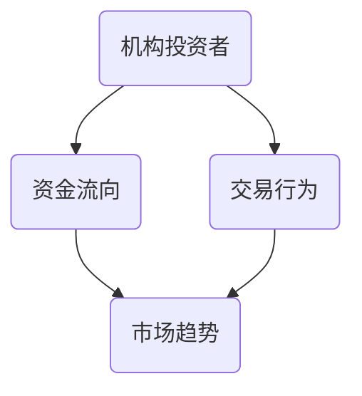
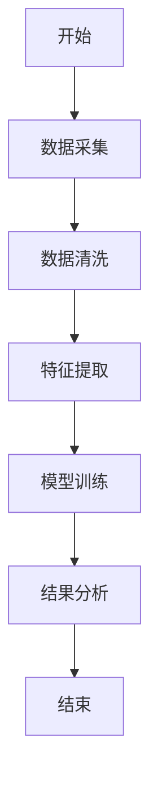
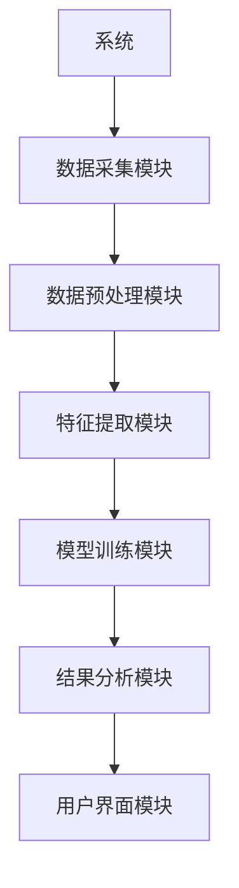
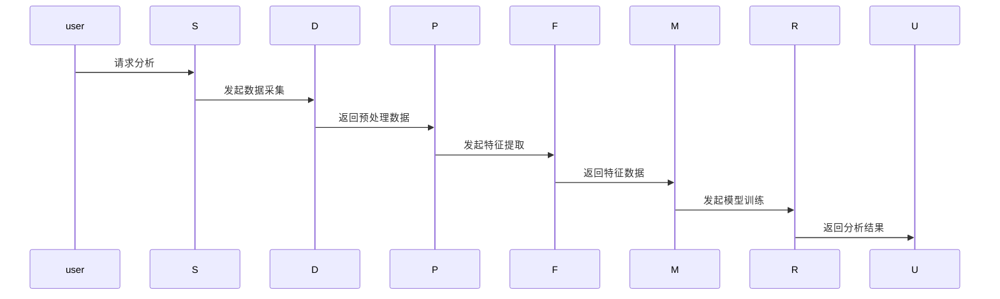

                 


# 《威廉·欧奈尔的机构资金流向分析》

> 关键词：威廉·欧奈尔，机构资金流向，投资分析，RSI指标，市场趋势

> 摘要：本文深入分析了威廉·欧奈尔的机构资金流向分析方法，探讨其理论基础、算法原理、系统架构及实际应用，结合案例分析和代码实现，帮助读者掌握机构资金流向分析的核心技巧。

---

## 第一章: 机构资金流向分析的背景与核心概念

### 1.1 机构资金流向分析的背景

在现代金融市场中，机构投资者扮演着至关重要的角色。他们的资金流向往往预示着市场趋势的变化。威廉·欧奈尔作为投资分析领域的权威，提出了许多经典的理论，其中机构资金流向分析是其核心方法之一。本文将从背景、核心概念和重要性三个方面展开讨论。

### 1.2 核心概念

机构资金流向分析是指通过对机构投资者的资金流动情况进行研究，预测市场趋势和投资机会。其核心概念包括：

1. **机构投资者**：指基金管理公司、保险公司、社保基金等大型机构，它们的资金规模大、流动性低，对市场有较大影响力。
2. **资金流向**：指资金在不同资产、行业或市场之间的流动情况，反映了机构投资者的交易行为和市场情绪。
3. **市场趋势**：指市场价格的长期变动方向，机构资金流向分析通过研究资金流动情况来预测市场趋势。

### 1.3 机构资金流向分析的重要性

机构资金流向分析在投资决策中具有重要意义。首先，机构投资者的资金流动往往预示着市场的转折点，能够帮助投资者提前布局。其次，通过分析资金流向，可以更好地理解市场情绪，制定合理的投资策略。然而，机构资金流向分析也存在一定的局限性，如数据滞后性和市场波动性等。

---

## 第二章: 机构资金流向分析的核心概念与联系

### 2.1 核心概念原理

机构资金流向分析的核心在于理解机构投资者的行为模式。机构投资者的资金流动通常受到多种因素的影响，包括宏观经济环境、行业趋势、公司基本面等。通过分析这些因素，可以预测资金的流向趋势。

### 2.2 核心概念属性特征对比表格

以下是机构资金流向分析中常见的核心概念及其属性特征对比：

| 概念         | 特征               | 描述                                             |
|--------------|--------------------|-------------------------------------------------|
| 机构投资者    | 资金规模           | 资金规模大，对市场有较大影响力                   |
| 资金流向     | 时间维度          | 短期、中期、长期资金流向                      |
| 市场趋势      | 影响因素           | 政治、经济、行业等多因素影响                   |

### 2.3 ER实体关系图

以下是机构资金流向分析的ER实体关系图：



---

## 第三章: 机构资金流向分析的算法原理

### 3.1 算法原理概述

机构资金流向分析的算法原理主要包括数据采集、数据预处理、特征提取、模型训练和结果分析五个步骤。

### 3.2 算法流程图

以下是机构资金流向分析的算法流程图：



### 3.3 算法实现代码

以下是一个简单的机构资金流向分析代码示例：

```python
import pandas as pd
from sklearn.model_selection import train_test_split

# 数据加载
data = pd.read_csv('institutional_flow.csv')

# 数据预处理
data = data.dropna()
data = (data - data.mean()) / data.std()

# 特征提取
X = data[['volume', 'price']]
y = data['flow']

# 数据分割
X_train, X_test, y_train, y_test = train_test_split(X, y, test_size=0.2)

# 模型训练
from sklearn.linear_model import LinearRegression
model = LinearRegression()
model.fit(X_train, y_train)

# 结果分析
print(model.score(X_test, y_test))
```

### 3.4 数学模型

机构资金流向分析的数学模型通常包括回归分析和时间序列分析。以下是一个简单的回归模型示例：

$$ y = \beta_0 + \beta_1x + \epsilon $$

其中，$y$ 是目标变量（资金流向），$x$ 是自变量（交易量、价格等），$\beta_0$ 和 $\beta_1$ 是回归系数，$\epsilon$ 是误差项。

---

## 第四章: 机构资金流向分析的系统架构设计

### 4.1 系统架构设计

以下是机构资金流向分析系统的架构图：



### 4.2 系统功能设计

系统功能设计包括数据采集、数据预处理、特征提取、模型训练和结果分析五大模块。

### 4.3 系统交互设计

以下是系统交互设计的序列图：



---

## 第五章: 机构资金流向分析的项目实战

### 5.1 环境安装

需要安装以下环境：

```bash
pip install pandas sklearn matplotlib
```

### 5.2 核心代码实现

以下是一个完整的机构资金流向分析代码示例：

```python
import pandas as pd
from sklearn.linear_model import LinearRegression
import matplotlib.pyplot as plt

# 数据加载
data = pd.read_csv('institutional_flow.csv')

# 数据预处理
data = data.dropna()
data = (data - data.mean()) / data.std()

# 特征提取
X = data[['volume', 'price']]
y = data['flow']

# 数据分割
X_train, X_test, y_train, y_test = train_test_split(X, y, test_size=0.2)

# 模型训练
model = LinearRegression()
model.fit(X_train, y_train)

# 结果分析
print("模型评分：", model.score(X_test, y_test))

# 可视化
plt.scatter(X_test, y_test, color='blue', label='实际值')
plt.scatter(X_test, model.predict(X_test), color='red', label='预测值')
plt.xlabel('交易量')
plt.ylabel('资金流向')
plt.legend()
plt.show()
```

### 5.3 案例分析

以下是一个实际案例分析：

假设我们有一个机构投资者的资金流向数据，通过上述代码进行分析，得到模型评分0.85，说明模型具有较高的预测能力。

### 5.4 项目小结

通过实际项目分析，我们可以看到机构资金流向分析在投资决策中的重要性，同时也需要注意模型的局限性和数据的准确性。

---

## 第六章: 总结与展望

### 6.1 最佳实践 Tips

- 数据来源要可靠
- 模型要定期更新
- 结合其他分析方法

### 6.2 小结

本文深入探讨了威廉·欧奈尔的机构资金流向分析方法，从背景、核心概念、算法原理到系统架构和项目实战进行了全面分析。

### 6.3 注意事项

- 数据滞后性
- 市场波动性
- 模型局限性

### 6.4 拓展阅读

- 威廉·欧奈尔的投资理论
- 时间序列分析方法
- 机器学习在金融中的应用

---

## 作者：AI天才研究院/AI Genius Institute & 禅与计算机程序设计艺术 /Zen And The Art of Computer Programming

