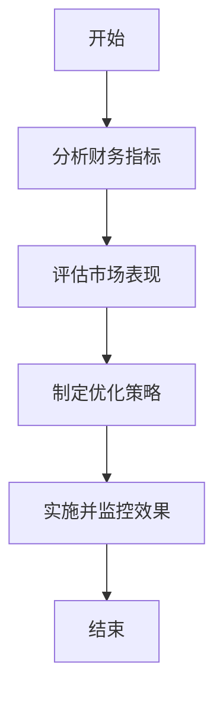
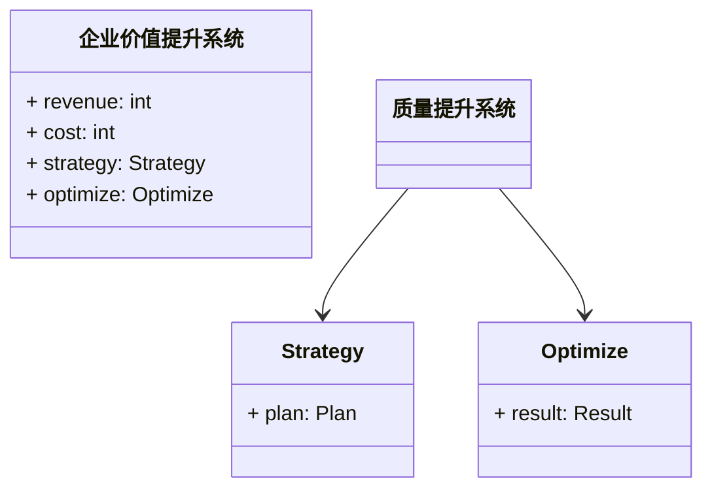

                 


# 威廉·贝恩的企业价值提升策略

> 关键词：威廉·贝恩，企业价值，战略制定，运营优化，管理提升，财务指标分析，企业架构设计

> 摘要：本文系统地介绍了威廉·贝恩的企业价值提升策略，从核心概念、算法原理、系统架构到项目实战，全面剖析了如何通过战略制定、运营优化和管理提升来实现企业价值最大化。文章结合实际案例和数学模型，为企业提供了可操作的指导方案，帮助企业在复杂多变的市场环境中实现可持续的价值增长。

---

## 第1章: 企业价值提升的背景介绍

### 1.1 企业价值提升的核心概念

#### 1.1.1 企业价值的定义与内涵
企业价值是企业在市场上所能创造的所有经济价值的总和，包括企业的资产、利润、客户忠诚度和品牌价值等。它不仅体现在财务指标上，还反映了企业在市场中的竞争力和长期发展潜力。

#### 1.1.2 企业价值提升的背景与问题背景
在全球化和数字化的今天，企业面临越来越激烈的竞争。企业价值的提升不仅是生存的需要，更是持续发展的关键。然而，许多企业在价值提升过程中面临战略不清、运营低效和管理混乱等问题，导致价值增长受阻。

#### 1.1.3 企业价值提升的目标与意义
目标是通过优化战略、运营和管理，实现企业价值的最大化。意义在于帮助企业增强竞争力，提升股东回报，同时为利益相关者创造更大价值。

### 1.2 企业价值提升的驱动因素

#### 1.2.1 市场竞争加剧对企业价值的影响
市场竞争的加剧要求企业不断创新和优化，以保持竞争优势。

#### 1.2.2 技术进步对企业价值的推动
技术进步为企业提供了新的增长点，如数字化转型和技术创新。

#### 1.2.3 管理创新对企业价值的贡献
高效的管理能够优化资源配置，提高运营效率，从而提升企业价值。

### 1.3 企业价值提升的边界与外延

#### 1.3.1 企业价值提升的边界
企业价值提升需要在合理的时间和资源限制内进行，不能无限投入。

#### 1.3.2 企业价值提升的外延与相关概念对比
与企业利润最大化不同，企业价值注重整体价值，而不仅仅是短期利润。

---

## 第2章: 核心概念与联系

### 2.1 核心概念原理

#### 2.1.1 企业价值的核心原理
企业价值是由核心竞争力和市场地位决定的，而核心竞争力来源于战略制定和运营效率。

#### 2.1.2 价值创造的驱动因素
战略定位、运营效率、管理能力是价值创造的三大驱动力。

#### 2.1.3 价值实现的路径
通过优化战略、提升运营效率和加强管理能力，实现企业价值的可持续增长。

### 2.2 核心概念属性特征对比表

| 战略定位 | 运营效率 | 管理能力 |
|----------|----------|----------|
| 核心作用 | 提高生产力 | 优化资源配置 |
| 实施难度 | 高 | 中 |
| 影响范围 | 宏观 | 微观 |

### 2.3 ER实体关系图

```mermaid
erDiagram
    customer[客户] {
        cust_id : integer
        name : string
    }
    product[产品] {
        prod_id : integer
        name : string
        price : integer
    }
    order[订单] {
        order_id : integer
        date : date
        total : integer
    }
    customer --> order : 下单
    product --> order : 订单包含的产品
```

---

## 第3章: 算法原理讲解

### 3.1 算法原理概述

#### 3.1.1 算法核心思想
通过分析财务指标和市场表现，制定优化策略以提升企业价值。

#### 3.1.2 算法流程图



#### 3.1.3 算法应用场景
适用于企业战略制定和运营优化的全过程。

### 3.2 算法实现代码

```python
def calculate_value(company_data):
    # 计算企业价值
    value = company_data['revenue'] - company_data['cost']
    return value

def optimize_strategy(data):
    # 优化策略
    optimized = {}
    for key in data:
        if data[key] > 0:
            optimized[key] = data[key] * 1.1
    return optimized

# 示例数据
company_data = {
    'revenue': 1000000,
    'cost': 500000
}

# 计算并优化
value = calculate_value(company_data)
optimized_data = optimize_strategy(company_data)
print("企业价值:", value)
print("优化后数据:", optimized_data)
```

### 3.3 数学模型与公式

企业价值（EV）的计算公式为：
$$ EV = EBITDA \times (EV/EBITDA) $$

其中，EBITDA是息税折旧及摊销前利润，EV/EBITDA是企业价值与EBITDA的比率。

---

## 第4章: 系统分析与架构设计

### 4.1 系统功能设计

#### 4.1.1 功能模块划分
- 数据采集模块：收集企业财务和市场数据。
- 战略制定模块：分析数据并制定优化策略。
- 运营优化模块：实施优化措施并监控效果。

#### 4.1.2 领域模型类图



### 4.2 系统架构设计

#### 4.2.1 架构选型
采用分层架构，包括数据层、业务逻辑层和表现层。

#### 4.2.2 架构图


---

## 第5章: 项目实战

### 5.1 环境安装

#### 5.1.1 环境配置
安装Python和必要的库，如Pandas和Matplotlib。

### 5.2 核心实现

#### 5.2.1 核心代码实现
```python
import pandas as pd

# 数据处理
data = pd.DataFrame({
    'revenue': [1000000],
    'cost': [500000]
})

# 优化策略
optimized_data = optimize_strategy(data)
print("优化后的收入:", optimized_data['revenue'])
```

### 5.3 实际案例分析
通过具体案例展示如何实施威廉·贝恩的策略，从数据采集到策略制定，再到实施和监控，详细分析每一步的操作。

---

## 第6章: 总结与最佳实践

### 6.1 总结

#### 6.1.1 核心内容回顾
企业价值提升需要从战略、运营和管理三方面入手，结合数学模型和系统架构设计，制定优化策略。

### 6.2 最佳实践Tips

#### 6.2.1 实践建议
- 定期评估企业价值，及时调整策略。
- 引入数据分析工具，提高决策的准确性。
- 注重团队协作，确保策略的有效实施。

#### 6.2.2 注意事项
- 确保数据的准确性和完整性。
- 在实施策略时，充分考虑企业的实际情况。
- 定期监控和评估策略的效果，及时调整。

### 6.3 小结

威廉·贝恩的企业价值提升策略为企业提供了系统化的指导，帮助企业在复杂多变的市场环境中实现价值最大化。通过战略制定、运营优化和管理提升，企业可以有效应对挑战，抓住机遇，实现可持续发展。

---

作者：AI天才研究院/AI Genius Institute & 禅与计算机程序设计艺术 /Zen And The Art of Computer Programming

