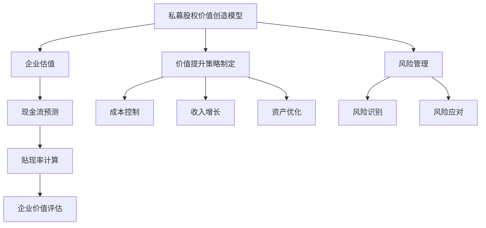
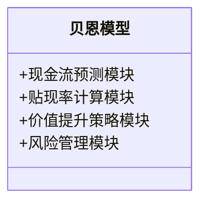

                 


# 威廉·贝恩的私募股权价值创造模型

## 关键词：私募股权、价值创造、贝恩模型、投资分析、风险管理

## 摘要：本文深入探讨了威廉·贝恩提出的私募股权价值创造模型，结合私募股权的核心概念、贝恩模型的理论基础、算法原理、系统架构及实际项目案例，详细解析了如何通过该模型实现企业价值最大化。文章从背景介绍、模型构建、算法实现到项目实战，全面阐述了贝恩模型的应用价值和实施策略。

---

# 第一部分：私募股权与价值创造模型概述

## 第1章：私募股权的基本概念

### 1.1 私募股权的定义与特点

私募股权（Private Equity，PE）是指通过非公开市场进行的企业部分或全部股权的投资。其特点包括：

- **非公开性**：私募股权的投资不通过公开市场，交易发生在投资者与目标公司之间。
- **高门槛**：通常需要较高的初始投资金额。
- **长期性**：私募股权的投资周期较长，通常为3-7年。
- **高风险高回报**：私募股权的风险较高，但潜在回报也较高。

### 1.2 私募股权的价值创造目标

私募股权的核心目标是通过投资和管理，提升企业的价值。具体包括：

- **提升企业盈利能力**：通过优化管理、降低成本、提高效率等方式。
- **增强企业市场地位**：通过战略并购、市场扩展等方式。
- **实现资本增值**：通过企业价值的提升，实现股权的增值。

### 1.3 私募股权与传统投资的区别

| 方面       | 私募股权                              | 传统投资                          |
|------------|-------------------------------------|------------------------------------|
| 投资对象   | 非上市公司股权                      | 公开市场股票                      |
| 投资周期   | 长期（3-7年）                       | 短期（几天到几年）                 |
| 投资策略   | 主动管理，深度参与企业运营         | 被动投资，较少干预企业运营         |
| 风险水平   | 高风险                              | 中低风险                          |

## 1.4 贝恩模型的核心思想与创新点

贝恩模型是一种基于私募股权价值创造的系统化方法，其核心思想是通过对企业内外部资源的优化配置，实现企业价值的最大化。创新点包括：

- **系统化的方法论**：将企业价值创造分解为可操作的步骤。
- **动态调整机制**：根据市场变化和企业实际情况，实时调整投资策略。

---

## 第2章：贝恩模型的核心概念

### 2.1 贝恩模型的组成要素

贝恩模型主要包括以下几个核心要素：

- **企业估值**：通过DCF模型等方法对企业进行估值。
- **价值提升策略**：包括成本控制、收入增长、资产优化等。
- **风险管理**：识别和应对潜在风险，确保投资安全。

### 2.2 贝恩模型的数学公式与属性对比

贝恩模型的核心公式为：

$$ V = \frac{CF}{(r - g)} $$

其中：
- \( V \) 表示企业价值。
- \( CF \) 表示未来现金流。
- \( r \) 表示贴现率。
- \( g \) 表示增长率。

与传统DCF模型相比，贝恩模型在现金流预测和贴现率计算上更加注重企业的实际运营情况。

| 比较维度     | 贝恩模型                          | 传统DCF模型                        |
|--------------|-----------------------------------|------------------------------------|
| 现金流预测   | 基于企业实际运营情况              | 基于市场平均值                      |
| 贴现率计算   | 考虑企业特定风险因素              | 基于市场平均利率                    |
| 适用场景     | 私募股权投资                     | 公开市场企业估值                   |

---

## 第3章：贝恩模型的算法原理

### 3.1 贝恩模型的算法步骤

1. **企业估值**：通过DCF模型对企业进行初步估值。
2. **价值提升策略制定**：根据企业实际情况，制定具体的提升措施。
3. **风险管理**：识别潜在风险，并制定应对策略。
4. **动态调整**：根据市场变化和企业实际表现，实时调整投资策略。

### 3.2 贝恩模型的系统架构



---

## 第4章：贝恩模型的系统架构与实现

### 4.1 系统功能设计



### 4.2 系统架构设计

```mermaid
container 私募股权价值创造系统 {
    component 企业估值模块 {
        [现金流预测]
        [贴现率计算]
        [企业价值评估]
    }
    component 价值提升模块 {
        [成本控制]
        [收入增长]
        [资产优化]
    }
    component 风险管理模块 {
        [风险识别]
        [风险应对]
    }
}
```

---

## 第5章：贝恩模型的项目实战

### 5.1 环境配置

- **工具安装**：安装Python、Pandas、Matplotlib等工具。
- **数据准备**：收集目标企业的财务数据和市场数据。

### 5.2 核心代码实现

```python
import pandas as pd
import numpy as np

# 示例数据
CF = [100, 150, 200, 250, 300]
r = 0.1
g = 0.05

# 计算企业价值
V = CF[0] / (r - g)
print(f"企业价值：{V:.2f}")
```

### 5.3 案例分析

假设我们投资于一家制造企业，年现金流分别为100、150、200、250、300万元，贴现率为10%，增长率5%。根据公式计算：

$$ V = \frac{100}{(0.1 - 0.05)} = 2000 \text{万元} $$

---

## 第6章：总结与展望

### 6.1 本章小结

贝恩模型通过系统化的方法，帮助企业实现价值的最大化。其核心在于对企业内外部资源的优化配置和动态调整。

### 6.2 未来展望

未来，贝恩模型可以通过引入更多数据源和机器学习技术，进一步提升其预测精度和决策能力。

---

# 作者：AI天才研究院 & 禅与计算机程序设计艺术

