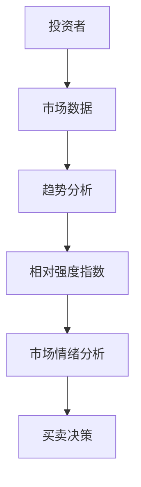
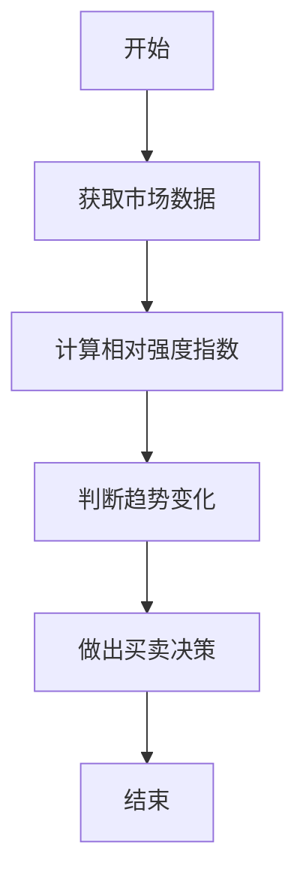
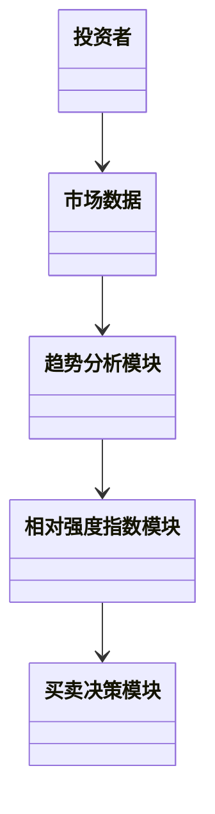
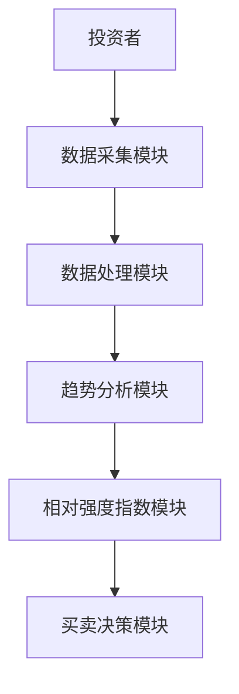

                 


# 威廉欧奈尔的股票买卖时机选择

> 关键词：威廉欧奈尔，股票买卖时机，CAN SLIM，相对强度指数，趋势分析，交易系统，Python实现

> 摘要：本文详细探讨了威廉欧奈尔的股票买卖时机选择方法，结合其著名的CAN SLIM投资系统，分析了其背后的数学模型和算法原理，通过实际案例展示了如何在Python中实现该策略，并对其在现代金融市场的适用性进行了深入分析。

---

## 第1章 威廉欧奈尔的背景与投资理论概述

### 1.1 威廉欧奈尔的生平简介

威廉·欧奈尔（William O'Neil）是一位著名的投资专家和作家，以其独特的投资理论和交易策略闻名于世。他创立了“CAN SLIM”投资系统，这套系统结合了技术分析和市场情绪分析，帮助投资者在股票市场中找到最佳的买卖时机。

#### 1.1.1 早年经历与职业发展

威廉·欧奈尔出生于美国纽约，年轻时便对股票市场产生了浓厚的兴趣。他在职业生涯中积累了丰富的投资经验，并通过不断的实践和研究，逐步形成了自己独特的投资理论。

#### 1.1.2 投资理论的形成与实践

欧奈尔的投资理论主要基于对市场趋势和个股表现的深入研究。他提出了一套名为“CAN SLIM”的投资系统，该系统强调通过技术分析和市场情绪分析来选择最佳的买卖时机。

### 1.2 欧奈尔投资理论的核心思想

欧奈尔的投资理论以“CAN SLIM”系统为核心，该系统包括以下几个关键要素：

#### 1.2.1 “CAN SLIM”投资系统

“CAN SLIM”是欧奈尔提出的一套选股和买卖时机选择的方法，其名称代表了七个关键因素：

1. **C**：公司背景（Company）
2. **A**： aggressiveness（ aggressiveness of the company's earnings growth）
3. **N**：净利润（Net income）
4. **S**：股息（Dividends）
5. **L**：流动性（ Liquidity）
6. **I**：机构认同度（Institutional Affiliation）
7. **M**：市场趋势（Market Trend）

#### 1.2.2 市场情绪与资金流动分析

欧奈尔认为，市场情绪和资金流动是影响股票价格波动的重要因素。他通过分析市场情绪的变化来判断市场的趋势，并据此制定买卖策略。

#### 1.2.3 股票选择与时机选择的结合

欧奈尔强调，股票选择和时机选择是相辅相成的。只有在合适的时机选择合适的股票，才能实现最大的投资收益。

### 1.3 欧奈尔买卖时机选择的哲学基础

欧奈尔的买卖时机选择方法建立在对市场周期、趋势和反转的深刻理解之上。

#### 1.3.1 市场周期理论

欧奈尔认为，市场是有周期性的，每个周期包括上涨、下跌、盘整等阶段。投资者需要根据市场周期的变化来调整自己的投资策略。

#### 1.3.2 趋势与反转的判断

欧奈尔提出，股票价格的走势通常会形成趋势，并且在趋势发生反转时，投资者需要及时做出反应。他通过技术分析来判断趋势的变化。

#### 1.3.3 风险管理与资金分配

欧奈尔非常重视风险管理，他认为，合理的资金分配和风险管理是实现长期稳定收益的关键。

---

## 第2章 股票买卖时机选择的核心概念与方法

### 2.1 股票买卖时机选择的背景介绍

股票买卖时机选择是指在合适的时机买入或卖出股票，以实现最大的投资收益。正确的买卖时机选择可以显著提高投资收益，减少投资风险。

#### 2.1.1 问题背景与问题描述

股票市场的波动性使得买卖时机的选择变得复杂。投资者需要通过技术分析和市场情绪分析来判断市场的走势，并据此做出买卖决策。

#### 2.1.2 问题解决的思路与方法

欧奈尔的“CAN SLIM”系统提供了一套科学的买卖时机选择方法，通过分析市场趋势和个股表现，帮助投资者找到最佳的买卖时机。

#### 2.1.3 买卖时机选择的边界与外延

买卖时机选择的边界包括市场周期、趋势变化、市场情绪等因素。其外延则涉及风险管理、资金分配等重要内容。

### 2.2 核心概念与联系

欧奈尔买卖时机选择的核心概念包括趋势分析、相对强度指数、市场情绪分析等。

#### 2.2.1 概念属性特征对比表格

以下是几个核心概念的对比表格：

| 概念        | 定义与特征                          |
|-------------|-----------------------------------|
| 趋势分析     | 通过价格走势判断市场的主趋势       |
| 相对强度指数 | 股票相对于市场指数的表现强度       |
| 市场情绪分析 | 通过市场参与度判断市场情绪         |

#### 2.2.2 ER实体关系图架构的Mermaid流程图



---

## 第3章 股票买卖时机选择的算法原理

### 3.1 算法原理讲解

欧奈尔的买卖时机选择算法基于趋势分析和相对强度指数。

#### 3.1.1 买卖时机选择的数学模型与公式

以下是相对强度指数的计算公式：

$$
RSI = \frac{100}{1 + \frac{A - B}{C}}
$$

其中：
- A是上涨幅度
- B是下跌幅度
- C是时间段

#### 3.1.2 算法流程图的Mermaid图示



#### 3.1.3 算法实现的Python源代码

以下是一个简单的相对强度指数计算代码示例：

```python
def calculate_rsi(prices, periods=14):
    # 计算涨跌幅度
    up = prices['Close'].diff().apply(lambda x: x if x > 0 else 0)
    down = -prices['Close'].diff().apply(lambda x: abs(x) if x < 0 else 0)
    
    # 计算相对强度
    RS = down.rolling(periods).mean() / up.rolling(periods).mean()
    RSI = 100 / (1 + RS)
    
    return RSI
```

### 3.2 算法原理的数学模型与公式

相对强度指数（RSI）是衡量股票相对于市场指数表现强度的重要指标。其公式为：

$$
RSI = \frac{100}{1 + \frac{A - B}{C}}
$$

其中，A是上涨幅度，B是下跌幅度，C是时间段。

---

## 第4章 股票买卖时机选择的系统分析与架构设计

### 4.1 问题场景介绍

股票买卖时机选择系统需要处理大量的市场数据，并通过算法计算出最佳的买卖时机。

#### 4.1.1 投资者需求分析

投资者需要一个高效、准确的系统来帮助他们做出买卖决策。

#### 4.1.2 系统目标与功能需求

系统目标是实现欧奈尔买卖时机选择方法，功能需求包括数据采集、趋势分析、相对强度指数计算等。

### 4.2 系统功能设计

#### 4.2.1 领域模型Mermaid类图



#### 4.2.2 系统架构设计Mermaid架构图



---

## 第5章 项目实战与案例分析

### 5.1 环境安装与配置

#### 5.1.1 开发环境搭建

需要安装Python、Pandas、Matplotlib等库。

#### 5.1.2 数据源获取与处理

使用Yahoo Finance获取股票数据，并进行清洗和预处理。

### 5.2 系统核心实现源代码

#### 5.2.1 数据处理模块

```python
import pandas as pd
import numpy as np

def get_data(ticker, start_date, end_date):
    data = pd.DataFrame()
    data['Close'] = pdDataReader(ticker, data_source='yahoo', start=start_date, end=end_date)['Close']
    return data
```

#### 5.2.2 趋势分析模块

```python
def calculate_trend(data, window=20):
    sma = data['Close'].rolling(window).mean()
    data['SMA'] = sma
    data['Trend'] = data['Close'] > data['SMA']
    return data
```

#### 5.2.3 相对强度指数模块

```python
def calculate_rsi(prices, periods=14):
    up = prices['Close'].diff().apply(lambda x: x if x > 0 else 0)
    down = -prices['Close'].diff().apply(lambda x: abs(x) if x < 0 else 0)
    RS = down.rolling(periods).mean() / up.rolling(periods).mean()
    RSI = 100 / (1 + RS)
    return RSI
```

#### 5.2.4 买卖决策模块

```python
def make_decision(data, rsi_data):
    data['Signal'] = 0
    data['Signal'][rsi_data['RSI'] > 70] = -1
    data['Signal'][rsi_data['RSI'] < 30] = 1
    return data
```

### 5.3 实际案例分析

以苹果公司（AAPL）为例，使用上述代码进行买卖时机选择。

#### 5.3.1 数据获取与处理

```python
import pandas_datareader as pdr
import matplotlib.pyplot as plt

start_date = '2020-01-01'
end_date = '2023-01-01'
data = get_data('AAPL', start_date, end_date)
data = calculate_trend(data)
data = calculate_rsi(data)
data = make_decision(data, data)
```

#### 5.3.2 买卖信号生成与可视化

```python
plt.figure(figsize=(12, 6))
plt.plot(data['Close'], label='Close Price')
plt.plot(data['SMA'], label='SMA')
plt.scatter(data.index, data['Close'], c=data['Signal'], cmap='hot', label='Signals')
plt.legend()
plt.show()
```

### 5.4 项目小结

通过实际案例分析，我们可以看到，欧奈尔的买卖时机选择方法能够有效捕捉市场的趋势变化，并生成相应的买卖信号。然而，实际操作中需要注意市场的波动性和不可预测性。

---

## 第6章 总结与最佳实践

### 6.1 总结

本文详细探讨了威廉欧奈尔的股票买卖时机选择方法，结合其“CAN SLIM”投资系统，分析了其背后的数学模型和算法原理，并通过实际案例展示了如何在Python中实现该策略。

### 6.2 最佳实践 tips

- **风险管理**：在实际操作中，投资者需要合理分配资金，设置止损点，以降低投资风险。
- **持续学习**：市场环境不断变化，投资者需要不断学习新的知识和技能，以适应市场的变化。
- **工具选择**：选择合适的工具和平台，能够提高交易的效率和准确性。

### 6.3 注意事项

- **市场波动性**：股票市场具有高度的波动性，投资者需要具备心理素质，避免情绪化决策。
- **数据质量**：数据的准确性和及时性对买卖时机的选择至关重要。
- **算法优化**：根据市场变化，投资者需要不断优化自己的算法和策略。

### 6.4 拓展阅读

- 威廉·欧奈尔的《股票作手回忆录》
- 《技术分析的真谛》
- 《投资学基础》

---

## 作者：AI天才研究院/AI Genius Institute & 禅与计算机程序设计艺术/Zen And The Art of Computer Programming

---

以上是《威廉欧奈尔的股票买卖时机选择》的技术博客文章的完整目录大纲和内容。

