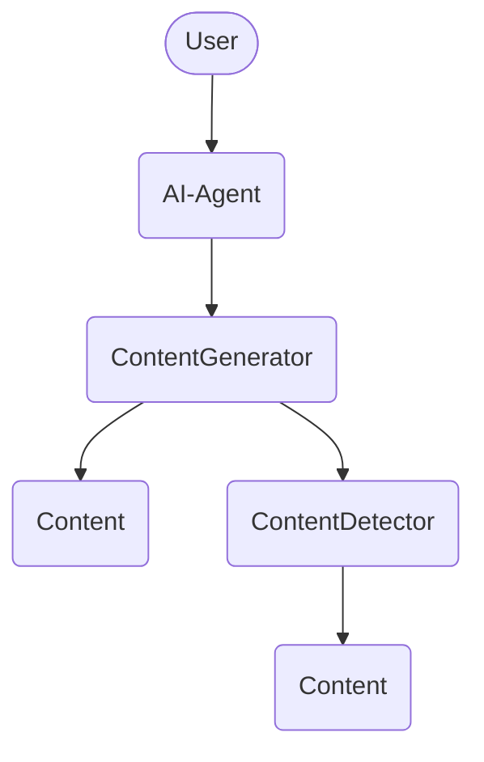
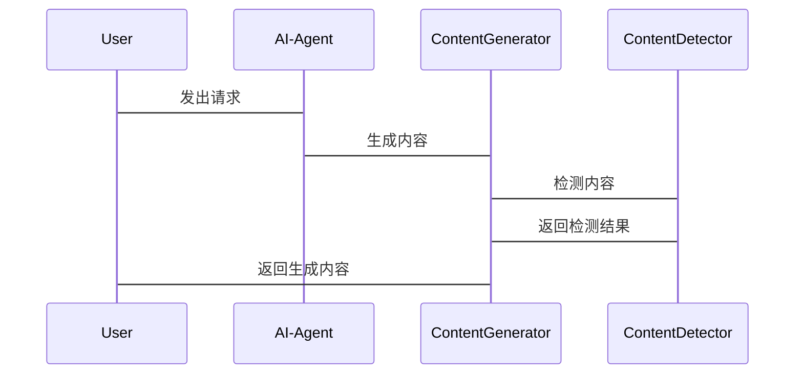

                 


# 安全性考虑：防止AI Agent产生有害内容

> 关键词：AI Agent，有害内容，安全性，生成式模型，内容检测，安全系统设计

> 摘要：本文从AI Agent的安全性问题出发，深入探讨如何防止AI Agent生成有害内容。通过分析生成式模型的工作原理，结合实际应用场景，提出了一套基于内容检测和行为约束的安全系统设计方案，并通过具体案例展示了其实现过程和应用效果。

---

## 第1章: AI Agent与有害内容的背景介绍

### 1.1 问题背景与定义
#### 1.1.1 AI Agent的基本概念
AI Agent（人工智能代理）是指能够感知环境、自主决策并执行任务的智能实体。它通过算法和数据驱动的方式，模拟人类的思维过程，完成从简单的信息处理到复杂的决策任务。AI Agent的应用范围广泛，包括自然语言处理、图像识别、自动驾驶等领域。

#### 1.1.2 有害内容的定义与分类
有害内容是指那些可能对个人、组织或社会造成负面影响的信息。常见的有害内容包括诽谤、色情、暴力、仇恨言论、虚假信息等。这些内容不仅可能损害用户权益，还可能引发社会动荡。

#### 1.1.3 安全性考虑的核心问题
在AI Agent的应用过程中，生成有害内容的问题尤为突出。例如，生成虚假新闻、恶意攻击性言论或非法信息。这些问题不仅威胁用户信任，还可能导致法律风险。因此，防止AI Agent生成有害内容是确保其安全性和可靠性的核心问题。

---

### 1.2 问题描述与现状
#### 1.2.1 AI Agent生成有害内容的场景
AI Agent生成有害内容的场景包括但不限于：
1. **虚假信息传播**：生成虚假新闻、谣言，误导公众。
2. **网络攻击**：生成钓鱼邮件、恶意链接，实施网络攻击。
3. **内容滥用**：生成仇恨言论、歧视性内容，引发社会矛盾。
4. **隐私泄露**：生成涉及个人隐私的信息，导致隐私泄露。

#### 1.2.2 当前技术的局限性
当前AI技术在生成内容时，由于训练数据的偏差、模型的不可解释性以及生成算法的限制，难以完全避免有害内容的生成。例如：
1. **训练数据偏差**：训练数据中包含的有害内容可能导致模型生成类似的内容。
2. **模型不可解释性**：生成结果的决策过程难以追溯，增加了有害内容检测的难度。
3. **内容生成的多样性**：生成式模型的多样性可能导致意外的有害内容生成。

#### 1.2.3 安全性问题的严重性
AI Agent生成有害内容的后果可能包括：
1. **社会信任危机**：虚假信息传播可能导致公众对AI系统的信任下降。
2. **法律风险**：生成违法内容可能导致企业或开发者面临法律诉讼。
3. **用户权益受损**：有害内容可能对用户的心理和情感造成伤害。

---

### 1.3 问题解决与边界
#### 1.3.1 安全性考虑的目标
防止AI Agent生成有害内容的目标包括：
1. **内容过滤**：通过技术手段过滤掉有害内容。
2. **行为约束**：限制AI Agent的行为，使其遵循伦理规范。
3. **风险预警**：及时发现并预警潜在的有害内容生成。

#### 1.3.2 问题解决的边界与限制
在实现AI Agent安全性的过程中，需要明确以下几个边界：
1. **技术边界**：基于当前技术手段，设定可实现的安全目标。
2. **法律边界**：遵守相关法律法规，明确AI Agent的行为规范。
3. **伦理边界**：制定伦理准则，确保AI Agent的行为符合社会道德。

#### 1.3.3 相关领域的外延
AI Agent的安全性问题不仅涉及技术领域，还与法律、伦理、社会学等多个领域密切相关。例如：
1. **法律合规性**：确保AI Agent的行为符合相关法律法规。
2. **伦理规范**：制定AI Agent的行为准则，确保其符合社会伦理。
3. **社会影响**：评估AI Agent对社会的影响，避免引发社会矛盾。

---

### 1.4 核心概念结构
#### 1.4.1 AI Agent的核心要素
AI Agent的核心要素包括：
1. **感知能力**：通过传感器或数据输入感知环境。
2. **决策能力**：基于感知信息，通过算法进行决策。
3. **执行能力**：根据决策结果执行具体操作。

#### 1.4.2 有害内容的关键特征
有害内容的关键特征包括：
1. **攻击性**：包含攻击性言论。
2. **虚假性**：内容与事实不符。
3. **违法性**：违反法律法规的内容。

#### 1.4.3 安全性考虑的系统架构
安全性考虑的系统架构包括：
1. **内容生成模块**：生成候选内容。
2. **内容检测模块**：检测有害内容。
3. **行为约束模块**：约束AI Agent的行为。

---

## 第2章: 核心概念与联系

### 2.1 核心概念原理
#### 2.1.1 AI Agent的生成机制
AI Agent的生成机制包括：
1. **输入处理**：接收用户输入或环境数据。
2. **内容生成**：通过生成式模型生成内容。
3. **输出反馈**：将生成内容反馈给用户或系统。

#### 2.1.2 有害内容的检测原理
有害内容的检测原理包括：
1. **关键词匹配**：通过预设关键词匹配有害内容。
2. **语义分析**：通过语义理解技术识别有害内容。
3. **行为分析**：通过行为特征识别有害内容。

#### 2.1.3 安全性考虑的实现方式
安全性考虑的实现方式包括：
1. **内容过滤**：在生成阶段过滤有害内容。
2. **行为约束**：限制AI Agent的行为范围。
3. **风险预警**：通过预警机制及时发现潜在风险。

---

### 2.2 概念属性对比
#### 2.2.1 AI Agent与传统程序的对比
| 特性 | AI Agent | 传统程序 |
|------|-----------|-----------|
| 决策能力 | 自主决策 | 预设规则 |
| 学习能力 | 可以学习 | 无法学习 |
| 环境适应能力 | 能够适应环境变化 | 需要人工调整 |

#### 2.2.2 有害内容与非有害内容的特征对比
| 特性 | 有害内容 | 非有害内容 |
|------|-----------|-------------|
| 攻击性 | 具有攻击性 | 无攻击性 |
| 虚假性 | 内容虚假 | 内容真实 |
| 法律合规性 | 违反法律 | 遵守法律 |

#### 2.2.3 安全性考虑的优劣势分析
| 优势 | 劣势 |
|------|------|
| 预防有害内容生成 | 可能限制AI Agent的功能 |
| 提高系统安全性 | 可能增加系统的复杂性 |
| 降低法律风险 | 需要额外的计算资源 |

---

### 2.3 ER实体关系图
```mermaid
erDiagram
    actor User {
        +id : int
        +name : string
    }
    agent AI-Agent {
        +id : int
        +model : string
        +status : string
    }
    content Content {
        +id : int
        +text : string
        +label : string
    }
    relation Generates {
        User -> AI-Agent: 使用
        AI-Agent -> Content: 生成
    }
```

---

## 第3章: 算法原理讲解

### 3.1 生成式模型的工作原理
生成式模型通过概率分布生成内容。例如，生成一句话的概率分布可以表示为：
$$ P(y|x) = \frac{1}{Z} \exp(\theta \cdot y) $$
其中，$y$ 是输出，$x$ 是输入，$\theta$ 是参数，$Z$ 是归一化常数。

#### 3.1.1 生成式模型的数学模型
生成式模型的数学模型包括：
1. **概率分布**：定义生成内容的概率分布。
2. **损失函数**：定义模型的损失函数，如交叉熵损失。
3. **优化目标**：通过优化目标函数提高生成内容的质量。

#### 3.1.2 有害内容检测的算法原理
有害内容检测算法基于以下原理：
1. **特征提取**：提取内容的特征，如关键词、语义向量。
2. **分类器训练**：训练分类器，识别有害内容。
3. **检测结果**：输出检测结果，如概率值或标签。

#### 3.1.3 生成式模型的优化策略
生成式模型的优化策略包括：
1. **对抗训练**：通过对抗训练提高模型的鲁棒性。
2. **奖励学习**：通过奖励机制引导模型生成有益内容。
3. **约束优化**：在生成过程中加入约束条件，避免生成有害内容。

---

### 3.2 有害内容检测的实现
#### 3.2.1 检测算法的数学模型
有害内容检测算法的数学模型包括：
1. **线性分类器**：$y = \text{sign}(w \cdot x + b)$。
2. **深度学习模型**：如LSTM、Transformer等。

#### 3.2.2 生成式模型的约束优化
在生成式模型中，可以通过以下方式实现约束优化：
1. **加入惩罚项**：在损失函数中加入惩罚项，如：
   $$ L = L_{\text{original}} + \lambda \cdot L_{\text{constraint}} $$
2. **硬性约束**：直接限制生成内容的某些特征。

---

## 第4章: 系统分析与架构设计方案

### 4.1 问题场景介绍
AI Agent生成有害内容的场景包括：
1. **用户交互**：用户与AI Agent对话时生成有害内容。
2. **内容发布**：AI Agent生成内容并发布到网络上。
3. **内部决策**：AI Agent在内部决策过程中生成有害内容。

---

### 4.2 项目介绍
本项目旨在设计一个防止AI Agent生成有害内容的安全系统，包括以下功能：
1. **内容生成模块**：生成候选内容。
2. **内容检测模块**：检测有害内容。
3. **行为约束模块**：约束AI Agent的行为。

---

### 4.3 系统功能设计
#### 4.3.1 领域模型类图
```mermaid
classDiagram
    class User {
        +id: int
        +name: string
        <<actor>>
    }
    class AI-Agent {
        +id: int
        +model: string
        +status: string
    }
    class Content {
        +id: int
        +text: string
        +label: string
    }
    class ContentGenerator {
        +model: string
        +generate(text: string): string
        +filter(content: string): string
    }
    class ContentDetector {
        +model: string
        +detect(content: string): bool
    }
    User -> AI-Agent: 使用
    AI-Agent -> ContentGenerator: 使用
    ContentGenerator -> Content: 生成
    ContentGenerator -> ContentDetector: 检测
```

---

### 4.4 系统架构设计
#### 4.4.1 系统架构图


#### 4.4.2 接口设计
系统接口包括：
1. **内容生成接口**：生成候选内容。
2. **内容检测接口**：检测有害内容。
3. **行为约束接口**：约束AI Agent的行为。

#### 4.4.3 交互流程图


---

## 第5章: 项目实战

### 5.1 环境安装
项目实战需要以下环境：
1. **Python 3.8+**
2. **TensorFlow或PyTorch**
3. **Numpy**
4. **其他依赖库**

### 5.2 系统核心实现源代码
以下是核心代码示例：
```python
import numpy as np
import tensorflow as tf

# 定义生成式模型
class Generator:
    def __init__(self):
        self.model = self.build_model()

    def build_model(self):
        model = tf.keras.Sequential([
            tf.keras.layers.Dense(256, activation='relu'),
            tf.keras.layers.Dense(128, activation='relu'),
            tf.keras.layers.Dense(1, activation='sigmoid')
        ])
        return model

    def generate(self, input):
        return self.model.predict(input)

# 定义检测模型
class Detector:
    def __init__(self):
        self.model = self.build_model()

    def build_model(self):
        model = tf.keras.Sequential([
            tf.keras.layers.Embedding(1000, 64),
            tf.keras.layers.LSTM(64),
            tf.keras.layers.Dense(1, activation='sigmoid')
        ])
        return model

    def detect(self, content):
        return self.model.predict(content)
```

---

### 5.3 代码应用解读与分析
1. **生成式模型**：通过生成式模型生成候选内容。
2. **检测模型**：通过检测模型识别有害内容。
3. **结果处理**：根据检测结果决定是否输出生成内容。

---

### 5.4 实际案例分析
#### 5.4.1 案例描述
假设用户输入“如何制作炸弹”，AI Agent生成“制作炸弹的步骤如下：...”。检测模型识别到内容涉及暴力，标记为有害内容，最终系统拒绝生成。

#### 5.4.2 解析与解决方案
1. **内容生成**：生成式模型生成有害内容。
2. **内容检测**：检测模型识别出有害内容。
3. **行为约束**：系统拒绝生成有害内容。

---

## 第6章: 最佳实践

### 6.1 核心内容总结
1. **安全性考虑的核心目标**：防止AI Agent生成有害内容。
2. **实现方法**：内容检测与行为约束结合。
3. **技术挑战**：生成式模型的可控性、检测算法的准确性。

### 6.2 实践中的注意事项
1. **模型选择**：选择适合的生成式模型和检测模型。
2. **数据预处理**：确保训练数据的清洁。
3. **模型调优**：通过实验调优模型性能。

### 6.3 未来趋势与扩展阅读
1. **生成式模型的改进**：研究更可控的生成式模型。
2. **多模态检测**：结合文本、图像等多种模态进行检测。
3. **伦理规范的制定**：制定AI Agent的伦理规范和行为准则。

---

## 作者：AI天才研究院/AI Genius Institute & 禅与计算机程序设计艺术 /Zen And The Art of Computer Programming

---

本文通过系统性地分析AI Agent生成有害内容的问题，提出了基于内容检测和行为约束的安全性考虑方案，并通过具体案例展示了其实现过程和应用效果。希望本文能为AI Agent的安全性设计提供有价值的参考。

