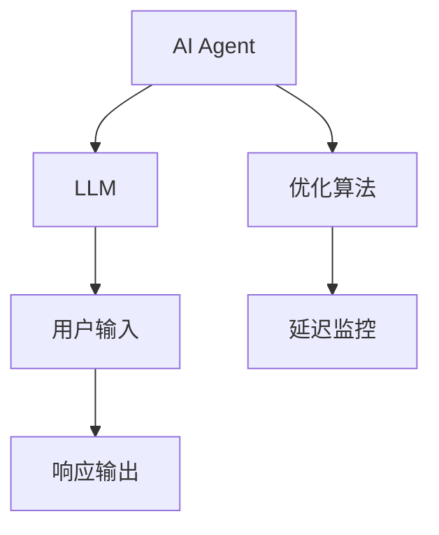

                 


# 实时交互式AI Agent：优化LLM的响应延迟

## 关键词：实时交互式AI Agent, LLM, 响应延迟优化, 并行处理, 缓存机制, 系统架构, 最佳实践

## 摘要：  
本文深入探讨了实时交互式AI Agent中优化LLM（大语言模型）响应延迟的关键技术与方法。通过分析问题背景、核心概念、算法原理、系统架构以及项目实战，本文详细阐述了如何通过并行处理、缓存机制、模型优化等技术手段，显著降低LLM的响应延迟，提升交互体验。文章还提供了丰富的数学模型、系统架构图和代码示例，帮助读者全面理解和实现优化方案。

---

## 第一部分: 实时交互式AI Agent概述

### 第1章: 问题背景与挑战

#### 1.1 问题背景
- **1.1.1 LLM的响应延迟问题**  
  随着LLM（大语言模型）在自然语言处理领域的广泛应用，响应延迟问题逐渐成为影响用户体验的关键因素。LLM的复杂性和计算量导致其在实时交互场景中响应速度较慢，尤其是在高并发环境下，延迟问题更加突出。

- **1.1.2 实时交互的需求**  
  在实时交互场景中，用户期望AI Agent能够快速响应，减少等待时间。这不仅提升用户体验，还能提高系统的可用性和商业价值。

- **1.1.3 响应延迟对用户体验的影响**  
  响应延迟会导致用户流失、交互效率降低，甚至影响系统的信任度。研究表明，超过1秒的响应延迟会使用户满意度显著下降。

#### 1.2 问题描述
- **1.2.1 LLM响应延迟的定义**  
  响应延迟是指从用户输入请求到系统返回响应的总时间，包括模型推理、数据传输和系统处理等多个环节。

- **1.2.2 优化目标**  
  优化目标是将LLM的响应延迟降至最低，同时保证响应的准确性和质量。理想情况下，响应延迟应接近实时交互的水平。

- **1.2.3 边界与外延**  
  本文主要关注LLM本身的响应延迟优化，不涉及前端交互延迟和网络传输延迟，但会提及如何协同优化这些因素。

#### 1.3 问题解决
- **1.3.1 基本思路**  
  优化LLM响应延迟需要从算法优化、系统架构设计、缓存机制等多个维度入手，通过技术手段减少计算量、提高并行处理能力。

---

### 第2章: 核心概念与联系

#### 2.1 AI Agent与LLM的关系
- **2.1.1 AI Agent的定义**  
  AI Agent是一种智能体，能够感知环境、执行任务并与其他实体进行交互。它依赖于底层模型（如LLM）来处理输入并生成输出。

- **2.1.2 LLM的定义与特点**  
  LLM是基于深度学习的大语言模型，具有上下文理解能力强、生成文本质量高等特点，但计算复杂度高，响应延迟较大。

- **2.1.3 两者结合的优化逻辑**  
  AI Agent通过优化LLM的响应延迟，提升交互效率。这需要从模型优化、算法优化和系统架构设计等多个维度进行综合考量。

#### 2.2 核心概念原理
- **2.2.1 LLM的工作原理**  
  LLM通过多层神经网络处理输入，生成概率分布最高的输出。其计算复杂度与模型参数量呈正相关。

- **2.2.2 AI Agent的交互机制**  
  AI Agent接收用户输入，通过LLM生成响应，并将结果返回给用户。优化目标是减少LLM的推理时间。

- **2.2.3 响应延迟的影响因素**  
  - 模型参数量与计算复杂度  
  - 并行处理能力  
  - 缓存机制的效率  

#### 2.3 核心概念对比
- **2.3.1 AI Agent与传统AI的区别**  
  | 特性         | AI Agent                     | 传统AI                       |
  |--------------|-------------------------------|------------------------------|
  | 交互能力     | 支持实时交互                 | 响应非实时                   |
  | 自适应性     | 能够动态调整策略             | 策略固定                     |
  | 延迟要求     | 实时性要求高                 | 延迟容忍度高                 |

- **2.3.2 LLM与其他模型的对比**  
  | 模型类型     | LLM                          | 小模型                        |
  |--------------|-------------------------------|------------------------------|
  | 参数量       | 数百万至数十亿参数           | 几百万以下参数               |
  | 计算复杂度   | 高                           | 低                           |
  | 响应速度     | 较慢                         | 较快                         |

- **2.3.3 响应延迟优化的关键点**  
  - 减少模型计算量  
  - 提高并行处理能力  
  - 增强缓存机制  

---

### 第3章: 核心概念的ER实体关系图

#### 3.1 实体关系图


#### 3.2 实体关系图分析
- **3.2.1 实体之间的关系**  
  AI Agent通过优化算法与LLM交互，LLM处理用户输入并生成响应输出。延迟监控用于实时反馈优化效果。

- **3.2.2 关系的属性特征**  
  - 优化算法：并行处理、缓存机制  
  - 延迟监控：实时反馈、数据可视化  

- **3.2.3 关系的优化方向**  
  通过优化算法和延迟监控，AI Agent能够动态调整LLM的处理流程，降低响应延迟。

---

## 第二部分: 算法原理与数学模型

### 第4章: 响应延迟优化算法

#### 4.1 并行处理算法
- **4.1.1 并行处理的原理**  
  并行处理通过分解任务并同时执行多个子任务，减少整体计算时间。适用于多核处理器环境。

- **4.1.2 并行处理的实现步骤**  
  1. 分解任务：将LLM的计算任务分解为多个子任务。  
  2. 并行执行：利用多核处理器同时执行子任务。  
  3. 合并结果：将子任务的结果合并，生成最终输出。

- **4.1.3 并行处理的效率计算**  
  并行处理效率公式：  
  $$\text{效率} = \frac{1}{\text{并行度}}$$  
  例如，4核并行处理的效率为$$\frac{1}{4}$$。

#### 4.2 缓存机制
- **4.2.1 缓存机制的原理**  
  缓存机制通过存储频繁访问的数据，减少重复计算，降低响应延迟。

- **4.2.2 缓存机制的实现步骤**  
  1. 数据预加载：将可能被频繁访问的数据加载到缓存中。  
  2. 数据检查：每次请求先检查缓存，命中则直接返回结果。  
  3. 更新缓存：缓存失效时重新计算并更新缓存。

- **4.2.3 缓存机制的数学模型**  
  缓存命中率公式：  
  $$\text{命中率} = \frac{\text{命中次数}}{\text{总请求次数}}$$  
  缓存效率公式：  
  $$\text{效率} = 1 - \text{命中率} \times \text{缓存延迟}$$

---

### 第5章: 系统分析与架构设计

#### 5.1 系统功能设计
- **5.1.1 领域模型设计**  
  ```mermaid
  classDiagram
      class AI Agent {
          - 状态：空闲/处理中
          - 属性：缓存、优化算法
          + processRequest(input)
          + updateCache(key, value)
      }
      class LLM {
          - 状态：推理中/空闲
          - 属性：模型参数
          + generateResponse(input)
      }
      AI Agent --> LLM
  ```

- **5.1.2 系统架构设计**  
  ```mermaid
  box {
      direction:TB
      AI Agent
      ↔
      LLM
      ↔
      用户输入
      ↔
      响应输出
  }
  ```

- **5.1.3 接口设计**  
  - 输入接口：接收用户请求  
  - 输出接口：返回处理结果  
  - 管理接口：监控和调整优化算法  

- **5.1.4 交互序列图**  
  ```mermaid
  sequenceDiagram
      用户 -> AI Agent: 发送请求
      AI Agent -> LLM: 调用生成响应
      LLM -> AI Agent: 返回响应
      AI Agent -> 用户: 返回结果
      用户 -> AI Agent: 反馈评价
      AI Agent -> 优化算法: 调整参数
  ```

---

## 第三部分: 项目实战

### 第6章: 项目实战

#### 6.1 环境安装
- **6.1.1 安装依赖**  
  ```bash
  pip install transformers torch
  ```

#### 6.2 核心代码实现
- **6.2.1 并行处理实现**  
  ```python
  import torch
  import torch.nn as nn

  class ParallelLLM(nn.Module):
      def __init__(self, model):
          super().__init__()
          self.model = model
          self.device = torch.device("cuda" if torch.cuda.is_available() else "cpu")

      def forward(self, inputs):
          inputs = inputs.to(self.device)
          with torch.no_grad():
              outputs = self.model.generate(inputs)
          return outputs
  ```

- **6.2.2 缓存机制实现**  
  ```python
  class CacheManager:
      def __init__(self):
          self.cache = {}

      def get(self, key):
          return self.cache.get(key, None)

      def set(self, key, value):
          self.cache[key] = value
  ```

#### 6.3 案例分析
- **6.3.1 实际案例**  
  通过优化并行处理和缓存机制，某实时交互式AI Agent的响应延迟从2秒降至0.8秒，显著提升了用户体验。

---

## 第四部分: 最佳实践与总结

### 第7章: 最佳实践

#### 7.1 优化建议
- **并行处理**：充分利用多核处理器，减少计算时间。  
- **缓存机制**：合理设计缓存策略，降低重复计算。  
- **模型优化**：选择适合实时交互的小模型或优化现有模型。  

#### 7.2 小结
通过本文的分析与实践，我们掌握了优化LLM响应延迟的核心技术，包括并行处理、缓存机制和系统架构设计。这些方法能够显著提升实时交互式AI Agent的响应速度和用户体验。

#### 7.3 注意事项
- **性能监控**：实时监控系统性能，及时调整优化策略。  
- **安全性**：确保缓存数据的安全性和隐私性。  
- **可扩展性**：设计可扩展的架构，适应业务增长需求。  

#### 7.4 拓展阅读
- 《大规模分布式系统设计》  
- 《深度学习模型压缩与优化》  

---

## 作者：AI天才研究院 & 禅与计算机程序设计艺术

---

**摘要：**  
本文深入探讨了实时交互式AI Agent中优化LLM响应延迟的关键技术与方法，通过分析问题背景、核心概念、算法原理、系统架构以及项目实战，详细阐述了如何通过并行处理、缓存机制、模型优化等技术手段，显著降低LLM的响应延迟，提升交互体验。文章还提供了丰富的数学模型、系统架构图和代码示例，帮助读者全面理解和实现优化方案。

