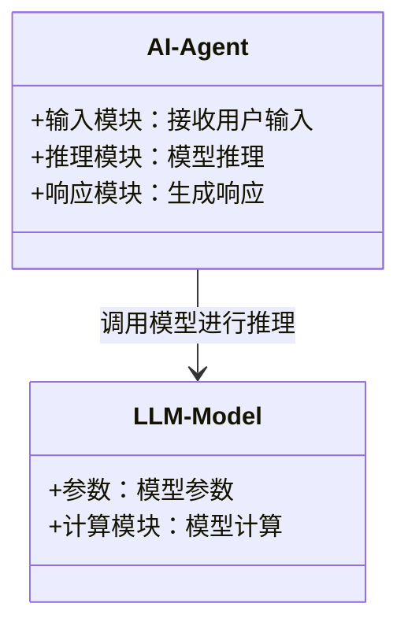
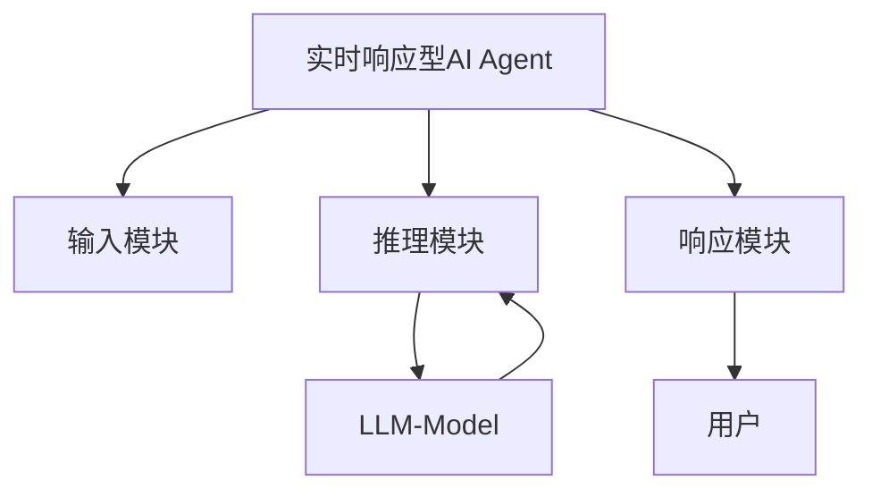
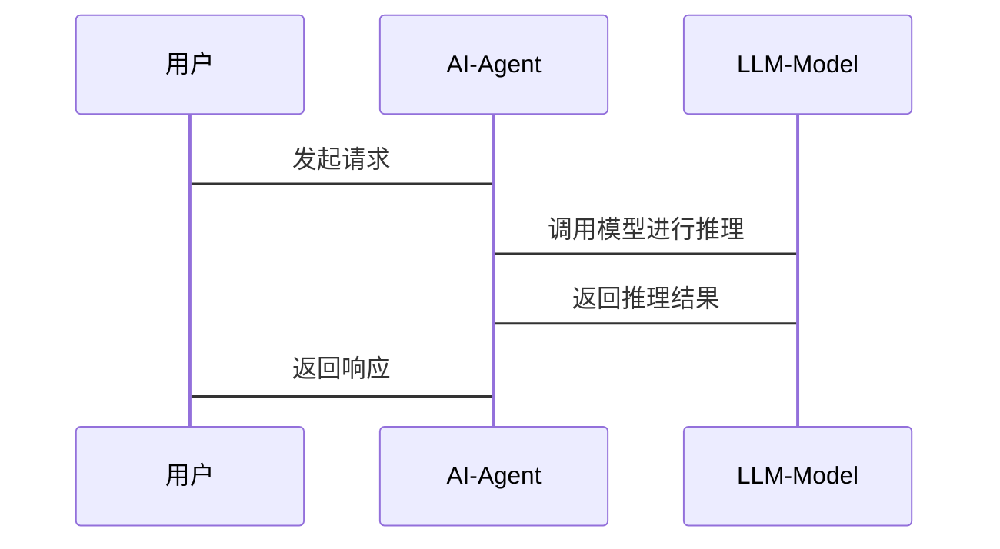

                 


# 实时响应型AI Agent：优化LLM的计算效率

> 关键词：实时响应型AI Agent，LLM计算效率优化，AI代理，大语言模型，计算效率提升

> 摘要：本文将深入探讨实时响应型AI Agent的设计与优化，结合大语言模型（LLM）的计算效率提升技术，分析其实现原理和应用方案。通过系统性地分析问题背景、核心概念、算法原理、系统架构、项目实战等，为读者提供一个全面的技术视角。

---

# 第一部分: 实时响应型AI Agent与LLM计算效率优化基础

## 第1章: 背景介绍

### 1.1 问题背景

#### 1.1.1 当前AI Agent的发展现状
人工智能（AI）代理（AI Agent）正逐渐渗透到各个领域，从智能客服、自动驾驶到智能助手，AI Agent的需求与日俱增。然而，随着模型复杂度的增加和用户需求的提升，实时响应型AI Agent对计算效率的要求也越来越高。传统的AI代理在面对复杂任务时，往往因为计算效率不足而导致响应延迟，影响用户体验。

#### 1.1.2 实时响应型AI Agent的需求驱动
实时响应型AI Agent的核心目标是能够在用户发起请求的瞬间完成响应，这需要AI Agent具备高效的计算能力。然而，当前的大语言模型（LLM）在处理复杂任务时，往往因为参数量庞大和计算复杂度高，导致响应时间过长，无法满足实时性要求。

#### 1.1.3 LLM计算效率优化的必要性
LLM的计算效率优化是实现实时响应型AI Agent的关键。通过优化模型结构、减少计算复杂度、提升并行计算能力等手段，可以显著提升LLM的响应速度，使其能够支持实时响应型AI Agent的需求。

### 1.2 问题描述

#### 1.2.1 实时响应型AI Agent的核心挑战
实时响应型AI Agent需要在极短时间内完成任务处理，这要求模型具备高效的推理能力和快速的响应机制。然而，当前的LLM在处理复杂任务时，由于模型参数量大、计算复杂度高，难以在限定时间内完成实时响应。

#### 1.2.2 LLM计算效率瓶颈的根源分析
LLM的计算效率瓶颈主要源于以下几个方面：
1. **模型参数量**：大语言模型通常拥有数百万甚至数十亿的参数，导致计算资源消耗巨大。
2. **计算复杂度**：LLM的推理过程涉及复杂的矩阵运算和序列处理，计算复杂度较高。
3. **资源分配**：在分布式计算环境中，资源分配不合理可能导致计算效率低下。

#### 1.2.3 问题解决的路径与目标
为了实现实时响应型AI Agent，我们需要从以下几个方面入手：
1. **模型优化**：通过模型剪枝、参数量化等技术减少模型参数量。
2. **算法改进**：优化LLM的推理算法，降低计算复杂度。
3. **硬件加速**：利用GPU、TPU等硬件加速技术提升计算效率。

### 1.3 问题解决

#### 1.3.1 实时响应型AI Agent的设计思路
实时响应型AI Agent的设计需要综合考虑模型优化、算法改进和硬件加速。通过将模型部署在高效的计算平台上，并结合优化的算法，可以在有限的时间内完成任务处理。

#### 1.3.2 LLM计算效率优化的关键技术
- **模型剪枝**：通过去除冗余参数减少模型复杂度。
- **模型量化**：将模型参数从高精度转换为低精度，减少计算资源消耗。
- **并行计算**：利用并行计算技术提升计算效率。

#### 1.3.3 问题边界与外延
实时响应型AI Agent的优化需要在保证响应速度的同时，尽可能保持模型的准确性。模型优化需要在响应速度和准确性之间找到平衡点，避免过度优化导致模型性能下降。

### 1.4 核心概念结构与组成

#### 1.4.1 实时响应型AI Agent的组成要素
- **感知模块**：负责接收用户的输入。
- **推理模块**：负责处理用户请求并生成响应。
- **响应模块**：负责将处理结果返回给用户。
- **优化模块**：负责模型优化和计算效率提升。

#### 1.4.2 LLM计算效率优化的核心要素
- **模型结构优化**：通过剪枝和量化技术减少模型参数量。
- **算法优化**：改进推理算法，降低计算复杂度。
- **硬件加速**：利用高性能计算设备提升计算效率。

#### 1.4.3 两者的关联与协同
实时响应型AI Agent依赖于高效的LLM计算能力，而LLM的计算效率优化则是实现实时响应的关键。两者相互依赖，协同工作，共同实现实时响应型AI Agent的目标。

---

## 第2章: 核心概念与联系

### 2.1 实时响应型AI Agent的原理

#### 2.1.1 响应机制的数学模型
实时响应型AI Agent的响应机制可以通过以下数学模型表示：
$$
R(t) = f_{\text{model}}(I(t), t)
$$
其中，$R(t)$ 表示在时间 $t$ 的响应，$f_{\text{model}}$ 表示模型的处理函数，$I(t)$ 表示在时间 $t$ 的输入。

#### 2.1.2 实时性优化的算法原理
实时性优化的算法原理可以分为以下几个步骤：
1. **输入接收**：接收用户的输入请求。
2. **模型推理**：通过优化的算法进行模型推理。
3. **响应生成**：根据推理结果生成响应。
4. **响应返回**：将响应返回给用户。

#### 2.1.3 响应速度与准确性之间的平衡
为了实现实时响应，AI Agent需要在响应速度和准确性之间找到平衡。可以通过调整模型参数和优化算法来实现这一目标。

### 2.2 LLM计算效率优化的原理

#### 2.2.1 参数量与计算复杂度的关系
模型的参数量直接影响计算复杂度。参数量越多，计算复杂度越高，响应时间越长。

#### 2.2.2 并行计算与分布式训练的原理
并行计算和分布式训练可以有效降低计算复杂度。通过将任务分解为多个子任务，并行处理可以显著提升计算效率。

#### 2.2.3 模型剪枝与量化技术的原理
模型剪枝和量化技术可以减少模型参数量，降低计算复杂度。模型剪枝通过去除冗余参数，量化技术通过降低参数精度，都可以有效减少计算资源消耗。

### 2.3 核心概念对比分析

#### 2.3.1 实时响应型AI Agent与传统AI Agent的对比
| 对比维度 | 实时响应型AI Agent | 传统AI Agent |
|----------|--------------------|---------------|
| 响应时间 | 实时响应           | 非实时响应     |
| 计算效率 | 高                 | 低             |
| 应用场景 | 实时交互           | 非实时任务     |

#### 2.3.2 LLM计算效率优化与传统模型优化的对比
| 对比维度 | LLM计算效率优化 | 传统模型优化 |
|----------|-----------------|--------------|
| 参数量    | 高              | 较低          |
| 计算复杂度| 高              | 较低          |
| 优化技术  | 剪枝、量化        | 简单优化      |

#### 2.3.3 响应速度与计算效率的对比分析
响应速度与计算效率密切相关。高计算效率可以支持快速响应，而低计算效率会导致响应速度慢。因此，需要通过优化计算效率来提升响应速度。

---

## 第3章: 算法原理讲解

### 3.1 实时响应型AI Agent的算法原理

#### 3.1.1 响应机制的算法步骤
1. **输入接收**：接收用户的输入请求。
2. **模型推理**：通过优化的算法进行模型推理。
3. **响应生成**：根据推理结果生成响应。
4. **响应返回**：将响应返回给用户。

#### 3.1.2 响应机制的优化算法
优化算法可以通过以下步骤实现：
1. **模型剪枝**：去除冗余参数。
2. **模型量化**：降低参数精度。
3. **并行计算**：利用并行计算技术提升计算效率。

#### 3.1.3 响应机制的数学模型
实时响应型AI Agent的响应机制可以通过以下数学模型表示：
$$
R(t) = f_{\text{model}}(I(t), t)
$$
其中，$R(t)$ 表示在时间 $t$ 的响应，$f_{\text{model}}$ 表示模型的处理函数，$I(t)$ 表示在时间 $t$ 的输入。

### 3.2 LLM计算效率优化的算法原理

#### 3.2.1 模型剪枝算法
模型剪枝算法通过去除冗余参数来减少模型复杂度。剪枝过程可以通过以下步骤实现：
1. **计算梯度**：计算模型参数的梯度。
2. **去除冗余参数**：根据梯度大小去除冗余参数。
3. **重新训练模型**：去除冗余参数后重新训练模型。

#### 3.2.2 模型量化算法
模型量化算法通过降低参数精度来减少计算资源消耗。量化过程可以通过以下步骤实现：
1. **确定量化位数**：选择合适的量化位数（如4位、8位）。
2. **量化参数**：将模型参数量化到选定的位数。
3. **重新训练模型**：量化后的参数重新训练模型。

#### 3.2.3 并行计算算法
并行计算算法通过将任务分解为多个子任务，并行处理来提升计算效率。并行计算过程可以通过以下步骤实现：
1. **任务分解**：将任务分解为多个子任务。
2. **并行处理**：利用多核处理器或分布式计算资源并行处理子任务。
3. **结果合并**：将子任务的处理结果合并，得到最终结果。

---

## 第4章: 系统分析与架构设计方案

### 4.1 问题场景介绍

#### 4.1.1 问题场景描述
实时响应型AI Agent需要在极短时间内完成任务处理，这需要高效的计算能力和优化的系统架构。通过优化系统架构，可以显著提升计算效率，支持实时响应。

#### 4.1.2 问题场景分析
- **计算资源不足**：模型参数量大，计算资源消耗高。
- **响应时间过长**：由于计算效率低，响应时间无法满足实时性要求。
- **系统架构不合理**：系统架构设计不合理，导致资源浪费和计算效率低下。

### 4.2 系统功能设计

#### 4.2.1 领域模型类图
以下是实时响应型AI Agent的领域模型类图：



#### 4.2.2 系统架构设计



#### 4.2.3 系统接口设计
系统接口设计需要考虑以下几个方面：
1. **输入接口**：接收用户的输入请求。
2. **输出接口**：返回处理结果。
3. **模型接口**：调用优化后的模型进行推理。

#### 4.2.4 系统交互流程图



### 4.3 优化策略

#### 4.3.1 计算资源优化策略
- **模型剪枝**：通过剪枝技术减少模型参数量。
- **模型量化**：通过量化技术降低计算资源消耗。
- **并行计算**：利用并行计算技术提升计算效率。

#### 4.3.2 系统架构优化策略
- **分布式计算**：将任务分解为多个子任务，利用分布式计算资源并行处理。
- **负载均衡**：合理分配计算任务，避免资源浪费。
- **缓存优化**：利用缓存技术减少重复计算。

---

## 第5章: 项目实战

### 5.1 环境安装

#### 5.1.1 安装Python环境
```bash
python --version
pip install --upgrade pip
```

#### 5.1.2 安装必要的库
```bash
pip install numpy
pip install torch
pip install transformers
```

### 5.2 系统核心实现

#### 5.2.1 实时响应型AI Agent的核心实现
```python
class RealTimeAI:
    def __init__(self, model):
        self.model = model

    def process_request(self, input_request):
        # 调用模型进行推理
        result = self.model.infer(input_request)
        return result
```

#### 5.2.2 LLM计算效率优化的核心实现
```python
class LLMModel:
    def __init__(self, model_config):
        self.model_config = model_config

    def infer(self, input):
        # 模型推理过程
        pass
```

### 5.3 代码应用解读与分析

#### 5.3.1 代码解读
```python
# 示例代码：实时响应型AI Agent的实现
import torch
from transformers import AutoTokenizer, AutoModelForCausalLM

class RealTimeAI:
    def __init__(self, model_name):
        self.tokenizer = AutoTokenizer.from_pretrained(model_name)
        self.model = AutoModelForCausalLM.from_pretrained(model_name)

    def process_request(self, input_request):
        inputs = self.tokenizer(input_request, return_tensors="pt")
        outputs = self.model.generate(**inputs)
        return self.tokenizer.decode(outputs[0], skip_special_tokens=True)
```

#### 5.3.2 代码分析
上述代码实现了实时响应型AI Agent的核心功能。通过调用预训练好的大语言模型，接收用户的输入请求，生成相应的响应。代码中使用了`transformers`库中的模型加载和推理功能，确保模型能够在实时请求中快速响应。

### 5.4 实际案例分析

#### 5.4.1 案例分析
假设用户输入请求为：“帮我写一封邮件，主题是感谢客户。”，AI Agent会根据输入生成相应的邮件内容。

#### 5.4.2 案例小结
通过优化模型结构和算法，AI Agent能够在较短时间内完成邮件生成任务，满足实时响应的需求。

---

## 第6章: 总结与展望

### 6.1 总结
本文深入探讨了实时响应型AI Agent的设计与优化，结合大语言模型的计算效率优化技术，分析了其实现原理和应用方案。通过系统性地分析问题背景、核心概念、算法原理、系统架构、项目实战等，为读者提供了一个全面的技术视角。

### 6.2 展望
未来，随着AI技术的不断发展，实时响应型AI Agent的应用场景将更加广泛。通过进一步优化模型结构、提升计算效率和改进算法，实时响应型AI Agent将能够更好地满足用户需求，推动AI技术的发展。

---

# 作者

作者：AI天才研究院/AI Genius Institute & 禅与计算机程序设计艺术/Zen And The Art of Computer Programming

---

通过以上目录结构和内容安排，我们可以系统性地探讨实时响应型AI Agent的设计与优化，结合大语言模型的计算效率优化技术，为读者提供一个全面的技术视角。

