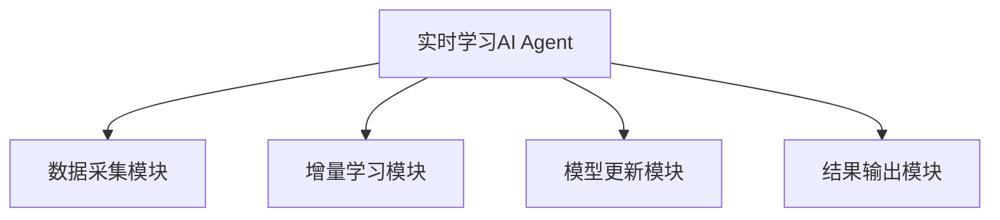

                 


# 实时学习AI Agent：LLM的在线增量学习

> 关键词：实时学习AI Agent，LLM，在线增量学习，微调，持续学习，数据流处理

> 摘要：本文深入探讨了实时学习AI Agent的核心概念，特别是大语言模型（LLM）的在线增量学习机制。通过分析在线增量学习的原理、算法、系统架构以及实际项目案例，本文为读者提供了从理论到实践的全面指导，帮助理解如何构建和优化实时学习AI Agent。

---

## 第1章 实时学习AI Agent概述

### 1.1 背景与概念

#### 1.1.1 问题背景
在动态变化的环境中，传统的离线训练方法难以满足实时更新的需求。实时学习AI Agent需要在数据流中实时更新模型，以适应新的输入和反馈。

#### 1.1.2 问题描述
实时学习AI Agent需要在实时数据流中不断更新模型，以保持高性能。LLM的在线增量学习是实现这一目标的关键技术。

#### 1.1.3 问题解决
通过在线增量学习，LLM可以在不重新训练整个模型的情况下，逐步更新其参数以适应新数据。

#### 1.1.4 边界与外延
实时学习AI Agent的边界包括实时数据流处理、模型更新频率和计算资源限制。外延包括结合强化学习和自监督学习的优化方法。

#### 1.1.5 核心要素组成
实时学习AI Agent的核心要素包括实时数据流、增量学习算法、模型更新机制和性能评估指标。

---

## 第2章 LLM的在线增量学习机制

### 2.1 增量学习的基本原理

#### 2.1.1 增量学习的核心概念
增量学习是一种在新数据流到来时逐步更新模型的技术，避免了重新训练整个模型的高计算成本。

#### 2.1.2 LLM的实时学习特点
LLM的实时学习特点包括高维度参数更新、数据流的连续性处理和模型更新的低延迟要求。

### 2.2 LLM的增量学习技术

#### 2.2.1 微调方法
微调方法通过在特定任务上对预训练模型进行 fine-tuning，逐步更新模型参数以适应新数据。

#### 2.2.2 参数高效微调
参数高效微调（PEFT）通过参数共享和任务适配器减少参数更新的计算成本。

#### 2.2.3 持续学习策略
持续学习通过记忆机制和知识蒸馏技术，增强模型的持续学习能力，防止旧知识遗忘。

### 2.3 数据流处理

#### 2.3.1 数据流的实时处理
实时数据流处理包括数据预处理、特征提取和增量批次处理。

#### 2.3.2 数据质量控制
数据质量控制通过数据清洗和异常检测技术，确保增量数据的准确性。

#### 2.3.3 数据增量的特征提取
特征提取技术通过降维和流数据处理，提高增量学习的效率。

---

## 第3章 实时学习的关键算法

### 3.1 在线学习算法概述

#### 3.1.1 在线学习算法的分类
在线学习算法可以分为基于梯度的增量优化算法和基于模型重参数化的优化算法。

#### 3.1.2 在线学习算法的数学模型
在线学习算法的数学模型可以表示为：
$$f(x) = w_1x + b$$
$$w_{n+1} = w_n + \alpha (y - f(x))x$$
$$b_{n+1} = b_n + \alpha (y - f(x))$$

### 3.2 增量训练策略

#### 3.2.1 增量训练的核心步骤
增量训练的核心步骤包括数据预处理、模型初始化、参数更新和模型评估。

#### 3.2.2 增量训练的数学公式
增量训练的数学公式可以表示为：
$$w_{n+1} = w_n + \alpha (y - f(x))x$$
$$b_{n+1} = b_n + \alpha (y - f(x))$$

### 3.3 算法优化策略

#### 3.3.1 动态学习率调整
动态学习率调整通过自适应优化算法（如Adam）动态调整学习率，提高收敛速度。

#### 3.3.2 增量样本选择策略
增量样本选择策略通过选择性采样技术，优化增量数据的质量。

---

## 第4章 系统架构与设计

### 4.1 系统整体架构

#### 4.1.1 系统模块划分
实时学习AI Agent的系统模块包括数据采集模块、增量学习模块、模型更新模块和结果输出模块。

#### 4.1.2 模块化设计
模块化设计通过分离数据处理、模型训练和结果输出，提高系统的可维护性和扩展性。

### 4.2 系统功能设计

#### 4.2.1 功能模块说明
功能模块包括实时数据采集、增量学习算法实现、模型更新和结果输出。

#### 4.2.2 系统交互流程
系统交互流程包括数据输入、模型更新、结果输出和反馈处理。

### 4.3 系统架构图



---

## 第5章 项目实战

### 5.1 环境搭建

#### 5.1.1 环境要求
需要安装Python 3.8及以上版本、TensorFlow 2.0及以上版本和Hugging Face Transformers库。

#### 5.1.2 环境安装命令
```bash
pip install python>=3.8
pip install tensorflow>=2.0
pip install transformers
```

### 5.2 核心代码实现

#### 5.2.1 数据预处理代码
```python
def preprocess(data):
    # 数据清洗和特征提取代码
    pass
```

#### 5.2.2 模型微调代码
```python
from transformers import AutoModelForMaskedLM, AutoTokenizer
import torch

model = AutoModelForMaskedLM.from_pretrained('bert-base-uncased')
tokenizer = AutoTokenizer.from_pretrained('bert-base-uncased')

optimizer = torch.optim.Adam(model.parameters(), lr=1e-5)
criterion = torch.nn.CrossEntropyLoss()
```

### 5.3 案例分析

#### 5.3.1 案例场景描述
以实时文本分类任务为例，展示如何在增量数据流中更新分类模型。

#### 5.3.2 代码实现与解读
```python
# 微调代码示例
def train_model(model, optimizer, criterion, data_loader):
    model.train()
    for batch in data_loader:
        optimizer.zero_grad()
        outputs = model(batch['input_ids'])
        loss = criterion(outputs, batch['labels'])
        loss.backward()
        optimizer.step()
```

### 5.4 项目小结

---

## 第6章 优化与挑战

### 6.1 模型优化策略

#### 6.1.1 模型稳定性优化
通过调整学习率和批量大小，优化模型的训练稳定性。

#### 6.1.2 模型效率优化
采用并行计算和分布式训练技术，提高模型更新的效率。

### 6.2 实际应用中的挑战

#### 6.2.1 数据质量控制
数据质量控制是实时学习中的关键挑战，需要通过数据清洗和特征选择技术来解决。

#### 6.2.2 计算资源限制
在资源受限的环境下，需要采用轻量化模型和增量学习技术，降低计算成本。

#### 6.2.3 模型鲁棒性
模型鲁棒性是实时学习中的重要挑战，需要通过模型蒸馏和知识表示学习技术来提高模型的鲁棒性。

---

## 第7章 总结与展望

### 7.1 本章总结
实时学习AI Agent的在线增量学习技术通过持续更新模型参数，显著提升了模型的适应性和性能。

### 7.2 未来展望
未来的研究方向包括更高效的增量学习算法、更强大的模型优化策略以及更广泛的实际应用。

---

## 作者

作者：AI天才研究院/AI Genius Institute & 禅与计算机程序设计艺术 /Zen And The Art of Computer Programming

