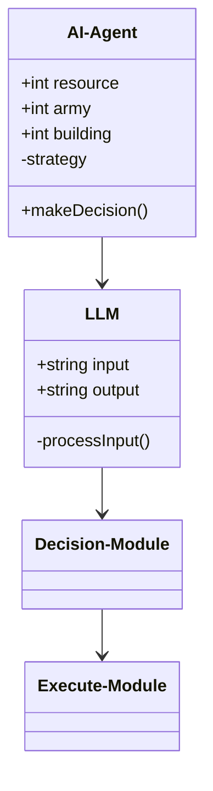
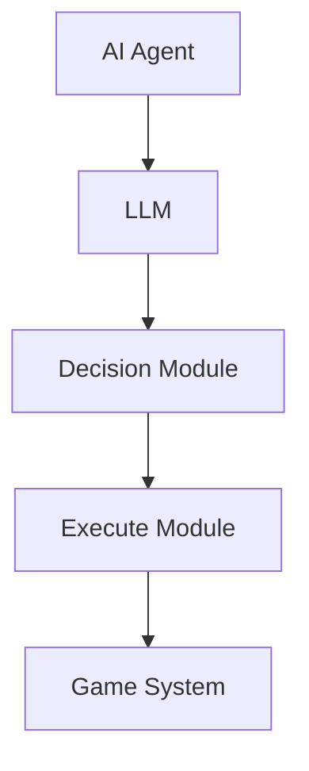

                 


# 实时策略AI Agent：LLM在游戏AI中的应用

## 关键词：实时策略游戏，AI代理，大语言模型（LLM），游戏AI，NLP

## 摘要
本文探讨了大语言模型（LLM）在实时策略游戏AI中的应用，分析了LLM的优势及其在实时策略AI代理中的应用前景。文章从背景介绍、核心概念、算法原理、系统架构到项目实战，全面解析了LLM在实时策略游戏AI中的应用，并展望了未来的发展方向。

---

## 第一部分：实时策略AI Agent与LLM的背景介绍

### 第1章：实时策略游戏与AI代理概述

#### 1.1 实时策略游戏的背景与发展
实时策略游戏是一种以策略为核心的电子游戏，玩家需要在限定时间内做出决策，管理资源、指挥军队、制定战术。这类游戏要求玩家具备高度的战略思维和快速决策能力。

- **游戏特点**：
  - 多资源管理：资源如人口、建筑、军队等需要同时管理。
  - 实时决策：玩家需要在短时间内做出决策。
  - 高复杂度：涉及多目标优化，如资源、建筑、战术等。

- **AI在实时策略中的作用**：
  - 提供智能对手，提升游戏体验。
  - 协助玩家决策，降低游戏难度。
  - 生成多样化的游戏内容，丰富玩法。

#### 1.2 大语言模型（LLM）的基本概念
LLM是基于深度学习的自然语言处理模型，如GPT系列。其特点包括大规模参数、强大的上下文理解和生成能力。

- **LLM的特点**：
  - 大规模参数（通常超过 billions）。
  - 上下文理解能力强，能处理长文本。
  - 自然语言生成能力强，能生成连贯的文字。

- **LLM与传统NLP模型的区别**：
  - **参数规模**：传统模型参数较小，LLM参数规模大。
  - **训练方法**：传统模型通常使用监督学习，LLM使用自监督学习。
  - **应用场景**：LLM适用于复杂任务，如对话生成、文本摘要，而传统模型适用于简单任务。

#### 1.3 实时策略AI Agent与LLM的结合
实时策略AI Agent需要在复杂环境中做出决策，而LLM能够提供强大的上下文理解和生成能力，两者结合可以提升AI Agent的智能水平。

- **结合的意义**：
  - 利用LLM的自然语言处理能力，增强AI Agent的决策能力。
  - 提供多样化的决策方式，丰富游戏体验。

---

## 第二部分：核心概念与联系

### 第2章：实时策略AI Agent的核心需求

#### 2.1 核心需求
实时策略AI Agent需要具备以下核心能力：

- **资源分配与管理**：合理分配资源以实现目标。
- **战术规划与执行**：制定并执行复杂的战术策略。
- **多目标优化**：在多个目标之间进行权衡，找到最优解。

#### 2.2 LLM在实时策略AI中的独特优势
LLM在实时策略AI中的优势包括：

- **大规模上下文理解**：能够处理复杂的上下文信息，做出更合理的决策。
- **自然语言处理能力**：能够理解和生成自然语言，增强人机交互。
- **知识库的整合**：可以结合外部知识库，提供更丰富的决策依据。

#### 2.3 实时策略AI Agent与LLM的关系
- **协同工作原理**：LLM为AI Agent提供决策支持，AI Agent执行具体操作。
- **实体关系图（ER图）**：
  ```mermaid
  graph TD
    A[实时策略AI Agent] --> L[LLM]
    L --> D[决策模块]
    D --> E[执行模块]
  ```

---

## 第三部分：算法原理

### 第3章：LLM的训练过程

#### 3.1 监督微调
- **定义**：在特定任务上对预训练模型进行微调。
- **流程**：
  1. 预训练模型初始化。
  2. 使用特定任务数据进行微调。
  3. 优化模型参数以适应任务需求。

#### 3.2 强化学习
- **定义**：通过奖励机制优化模型的决策能力。
- **流程**：
  1. 定义奖励函数。
  2. 模型在环境中交互，获得奖励。
  3. 使用策略梯度方法优化模型参数。

#### 3.3 数学模型
- **损失函数**：
  $$ L = -\sum_{i=1}^{n} y_i \log(p_i) $$
- **优化目标**：
  $$ \arg \min L $$

### 第4章：实时策略中的决策树

#### 4.1 决策树的构建
- **构建过程**：
  1. 确定决策节点。
  2. 生成可能的分支。
  3. 评估每个分支的价值。

#### 4.2 博弈论模型
- **定义**：模拟对手的可能行为，优化自己的策略。
- **数学表达**：
  $$ \text{收益} = \max_{a} \min_{b} (R(a,b)) $$

---

## 第四部分：系统分析与架构设计

### 第5章：系统功能设计

#### 5.1 领域模型类图


#### 5.2 系统架构图


#### 5.3 接口设计
- **输入接口**：接受游戏状态、目标等信息。
- **输出接口**：输出决策指令。

---

## 第五部分：项目实战

### 第6章：环境安装与核心代码实现

#### 6.1 环境安装
- **开发环境**：Python 3.8+
- **依赖库**：TensorFlow、Keras、Hugging Face库

#### 6.2 核心代码实现
- **AI Agent实现**：
  ```python
  class AI-Agent:
      def __init__(self):
          self.resource = 0
          self.army = 0
          self.building = 0
      def makeDecision(self):
          # 使用LLM进行决策
          pass
  ```

- **LLM集成**：
  ```python
  from transformers import GPT2LMHeadModel, GPT2Tokenizer

  model = GPT2LMHeadModel.from_pretrained('gpt2')
  tokenizer = GPT2Tokenizer.from_pretrained('gpt2')
  ```

#### 6.3 案例分析
- **案例**：AI Agent在实时策略游戏中的资源分配决策。
- **效果对比**：与传统AI相比，LLM驱动的AI Agent表现出更高的灵活性和智能性。

---

## 第六部分：总结与展望

### 6.1 总结
- **核心内容回顾**：LLM在实时策略AI中的应用，从背景、算法到实现。
- **挑战与局限性**：计算资源限制、实时决策延迟、多模态数据处理难度。

### 6.2 未来展望
- **技术进步**：模型轻量化、推理加速。
- **应用场景扩展**：其他类型的游戏AI，如角色扮演游戏。

---

## 注意事项与最佳实践
- **性能优化**：优化LLM的推理速度，减少延迟。
- **数据隐私**：处理游戏数据时需注意隐私保护。
- **可扩展性**：设计时考虑未来的扩展需求。

---

## 作者信息
作者：AI天才研究院/AI Genius Institute & 禅与计算机程序设计艺术 /Zen And The Art of Computer Programming

