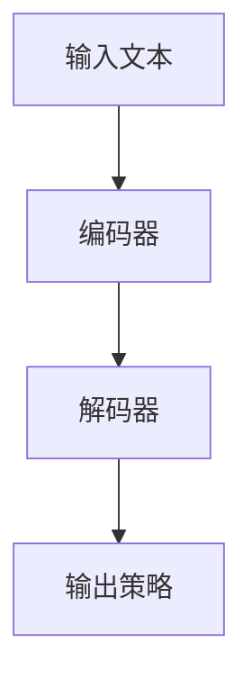
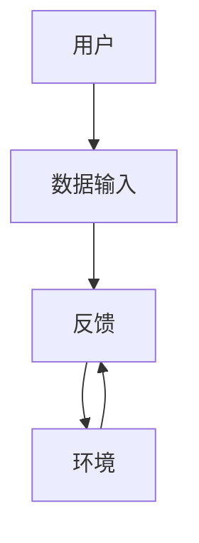
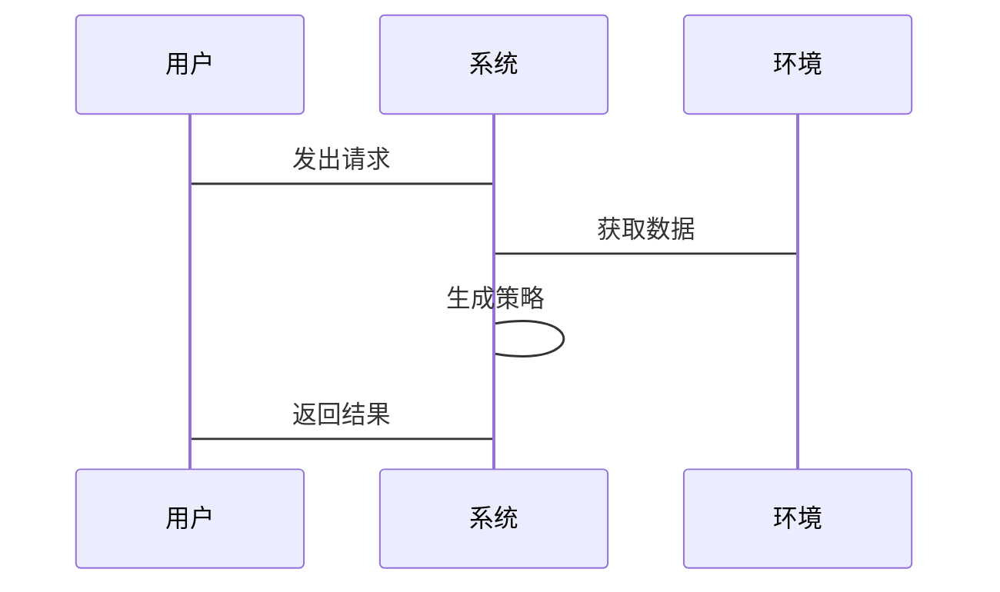

                 


# 实时策略生成AI Agent：LLM在动态决策中的应用

## 关键词
实时策略生成、AI Agent、大语言模型（LLM）、动态决策、决策支持系统

## 摘要
本文探讨了实时策略生成AI Agent在动态决策中的应用，重点分析了基于大语言模型（LLM）的策略生成技术。文章从问题背景出发，详细讲解了LLM的核心概念、算法原理、系统架构，并通过项目实战展示了实际应用案例，最后总结了最佳实践和未来研究方向。

---

## 第一部分: 实时策略生成AI Agent背景与概述

### 第1章: 实时策略生成AI Agent概述

#### 1.1 问题背景
- **1.1.1 传统决策方式的局限性**
  传统决策方法依赖于规则和静态模型，难以适应动态变化的环境，决策效率和准确性较低。
- **1.1.2 动态环境下的决策挑战**
  动态环境中，信息复杂且变化迅速，传统方法难以实时生成灵活的策略。
- **1.1.3 实时策略生成的必要性**
  实时策略生成能够快速响应变化，提升决策系统的适应性和智能化水平。

#### 1.2 问题描述
- **1.2.1 动态决策问题的定义**
  动态决策问题是指在不断变化的环境中，需要根据实时信息调整策略的过程。
- **1.2.2 传统决策与实时决策的对比**
  | 对比维度 | 传统决策 | 实时决策 |
  |----------|----------|----------|
  | 响应时间 | 周期性   | 实时性   |
  | 灵活性   | 较低     | 较高     |
  | 适应性   | 有限     | 强         |

#### 1.3 核心概念与必要性
- **1.3.1 AI Agent的基本概念**
  AI Agent是能够感知环境并自主决策的智能体，具备学习、推理和执行能力。
- **1.3.2 实时策略生成的必要性**
  在动态环境中，实时策略生成能够快速调整策略，提高决策效率和系统性能。

---

## 第二部分: 核心概念与联系

### 第2章: LLM的核心概念与工作原理

#### 2.1 LLM的基本结构
- **2.1.1 编码器结构**
  - **输入处理**：将输入文本转换为向量表示。
  - **注意力机制**：计算输入序列中各词之间的相关性权重。
- **2.1.2 解码器结构**
  - **自回归生成**：逐步生成输出文本，每一步都依赖之前的生成结果。
  - **交叉注意力**：解码器与编码器之间的信息交互。

#### 2.2 LLM的工作流程


#### 2.3 实时策略生成的关键环节
- **输入处理**：接收动态环境中的实时数据。
- **策略生成**：利用LLM生成适应当前状态的策略。
- **反馈优化**：根据执行结果调整生成策略。

#### 2.4 核心概念对比
| 对比维度 | 传统决策方法 | LLM驱动的实时决策 |
|----------|--------------|------------------|
| 决策速度 | 周期性       | 实时性           |
| 策略复杂度 | 简单         | 复杂             |
| 适应性   | 低           | 高               |

#### 2.5 实体关系图
```mermaid
erd
    actor 用户;
    actor 环境;
    entity 策略;
    entity 状态;
    状态 --> 策略;
    用户 --> 策略;
    环境 --> 策略;
```

---

## 第三部分: 算法原理与数学模型

### 第3章: 生成式模型的算法原理

#### 3.1 生成式模型的数学模型
- **转换器模型结构**
  ```mermaid
  graph TD
      A[input] --> B[编码器];
      B --> C[解码器];
      C --> D[输出];
  ```

#### 3.2 注意力机制公式
- **注意力权重计算**
  $$\text{Attention}(Q, K, V) = \text{softmax}\left(\frac{QK^T}{\sqrt{d_k}}\right)V$$
- **查询、键、值向量**
  $$Q = W_q x, K = W_k x, V = W_v x$$

#### 3.3 解码器结构
- **自回归生成**
  $$P(y_i | y_{<i}, x) = \prod_{i=1}^n P(y_i | y_{<i}, x)$$
- **交叉熵损失**
  $$\mathcal{L} = -\sum_{i=1}^n \log P(y_i | y_{<i}, x)$$

#### 3.4 策略生成的优化
- **梯度下降**
  $$\theta = \theta - \eta \frac{\partial \mathcal{L}}{\partial \theta}$$

#### 3.5 代码实现
```python
def attention(q, k, v, mask=None):
    d_k = k.size(-1)
    scores = (q @ k.transpose(-2, -1)) / np.sqrt(d_k)
    if mask is not None:
        scores = scores.masked_fill(mask == 0, -np.inf)
    scores = F.softmax(scores, dim=-1)
    output = (scores @ v).squeeze(1)
    return output

class LLMGenerator(nn.Module):
    def __init__(self, d_model, nhead, dropout):
        super().__init__()
        self.encoder = nn.TransformerEncoder(...)
        self.decoder = nn.TransformerDecoder(...)
        
    def forward(self, input, mask=None):
        enc_out = self.encoder(input, mask)
        dec_out = self.decoder(enc_out, input, mask)
        return dec_out
```

---

## 第四部分: 系统分析与架构设计

### 第4章: 系统架构与交互设计

#### 4.1 系统功能模块
- **数据输入模块**
  - 实时接收环境数据。
- **策略生成模块**
  - 调用LLM生成策略。
- **反馈处理模块**
  - 根据执行结果调整策略。

#### 4.2 系统架构图


#### 4.3 接口设计
- **输入接口**
  ```python
  def generate_strategy(input_data):
      # 调用LLM生成策略
      return strategy
  ```
- **输出接口**
  ```python
  def execute_strategy(strategy):
      # 执行策略并返回结果
      return result
  ```

#### 4.4 交互流程图


---

## 第五部分: 项目实战与案例分析

### 第5章: 项目实战

#### 5.1 实验环境
- **硬件配置**：高性能计算服务器。
- **软件环境**：Python 3.8，TensorFlow 2.5，PyTorch 1.9。

#### 5.2 核心代码实现
```python
import torch
import torch.nn as nn

class RealTimeStrategyGenerator:
    def __init__(self, model_path):
        self.model = torch.load(model_path)
        self.model.eval()
    
    def generate_strategy(self, input_data):
        with torch.no_grad():
            strategy = self.model.generate(input_data)
        return strategy
```

#### 5.3 应用场景分析
- **案例1：电商推荐系统**
  - **输入**：用户行为数据。
  - **输出**：实时推荐策略。
- **案例2：金融交易决策**
  - **输入**：市场数据。
  - **输出**：交易策略。

#### 5.4 性能优化
- **模型压缩**：减少模型大小，提升推理速度。
- **并行计算**：利用多线程加速策略生成。

#### 5.5 代码解读
```python
def evaluate_model(model, test_data):
    correct = 0
    total = 0
    for batch in test_data:
        outputs = model(batch)
        _, predicted = torch.max(outputs.data, 1)
        correct += (predicted == batch['label']).sum().item()
        total += len(batch['label'])
    accuracy = correct / total
    return accuracy
```

---

## 第六部分: 总结与展望

### 第6章: 最佳实践与未来展望

#### 6.1 最佳实践
- **模型选择**：根据任务需求选择合适的LLM模型。
- **数据处理**：确保数据质量和多样性。
- **训练优化**：合理设置超参数，避免过拟合。

#### 6.2 未来展望
- **多模态决策**：结合视觉、听觉等多模态信息。
- **分布式计算**：提升系统的扩展性和性能。
- **自适应学习**：增强模型的自适应能力，支持在线学习。

#### 6.3 注意事项
- 数据隐私保护。
- 模型的可解释性。
- 系统的实时性和稳定性。

---

## 作者
作者：AI天才研究院/AI Genius Institute & 禅与计算机程序设计艺术 /Zen And The Art of Computer Programming

---

通过以上目录结构和内容安排，文章详细探讨了实时策略生成AI Agent的设计与实现，从理论到实践，结合具体案例，为读者提供了全面的技术指导和深度分析。

