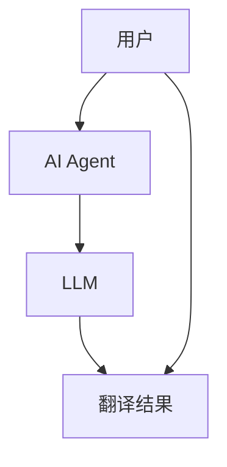
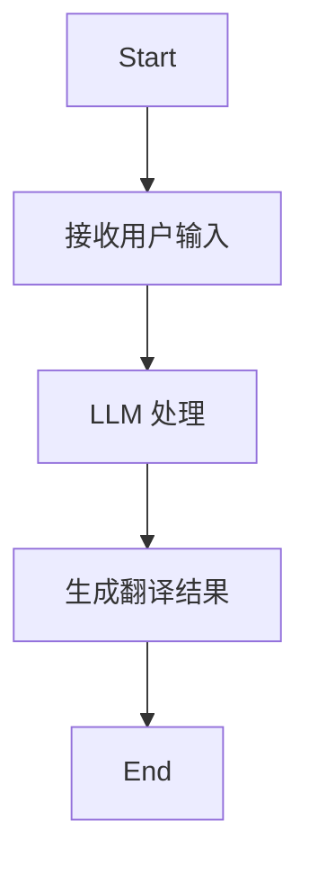

                 


# 实时翻译 AI Agent：LLM 在即时通讯中的语言转换

## 关键词：
实时翻译，LLM，AI Agent，即时通讯，语言转换

## 摘要：
本文探讨了实时翻译AI代理在即时通讯中的应用，详细分析了LLM技术在语言转换中的核心作用，从背景到实现，全面解析其工作原理和系统架构，结合实际案例，深入探讨了技术挑战与解决方案，为开发者提供了实践指导。

---

# 第1章: 实时翻译 AI Agent 的背景与问题背景

## 1.1 问题背景

### 1.1.1 实时翻译的挑战
- **延迟问题**：实时翻译需要快速响应，减少处理时间。
- **资源消耗**：高计算资源需求可能导致性能瓶颈。
- **准确性**：复杂语言结构和文化差异影响翻译质量。
- **多语言支持**：需支持多种语言，提升覆盖范围。

### 1.1.2 LLM 在实时翻译中的优势
- **上下文理解**：LLM能够处理复杂语境，提升翻译准确度。
- **快速响应**：基于预训练模型，实时处理能力强大。
- **语言适应性**：支持多种语言和文化背景，适应不同用户需求。

### 1.1.3 即时通讯中的语言转换需求
- **实时性**：即时通讯要求快速翻译，确保用户体验流畅。
- **准确性**：翻译结果需准确，避免误解。
- **低资源消耗**：减少计算资源占用，优化性能。

## 1.2 问题描述

### 1.2.1 实时翻译的定义与目标
- **定义**：实时翻译是在用户输入后立即生成目标语言的翻译，无需等待。
- **目标**：提供快速、准确、自然的翻译结果，满足用户即时需求。

### 1.2.2 即时通讯中的语言转换场景
- **跨语言对话**：支持不同语言的用户实时交流。
- **多语言支持**：覆盖多种语言，满足全球用户需求。
- **文化适应性**：根据目标语言的文化背景调整翻译。

### 1.2.3 用户需求与痛点分析
- **用户需求**：快速、准确、自然的翻译结果。
- **主要痛点**：延迟、准确性不足、资源消耗高、文化差异处理不当。

## 1.3 问题解决

### 1.3.1 LLM 的核心能力
- **自然语言理解**：LLM能够准确理解输入内容的语义和上下文。
- **生成能力**：具备生成高质量翻译结果的能力。
- **自适应学习**：能够根据反馈不断优化翻译质量。

### 1.3.2 实时翻译 AI Agent 的解决方案
- **实时响应**：通过优化算法和分布式计算，确保快速响应。
- **资源优化**：采用轻量化模型和边缘计算，减少资源消耗。
- **质量保证**：结合多模型融合和后编辑技术，提升翻译准确性。

### 1.3.3 技术实现的可行性分析
- **技术可行性**：LLM技术成熟，适合实时翻译场景。
- **性能优化**：通过模型剪枝和量化技术，提升运行效率。
- **用户体验**：实时翻译能够显著提升用户体验，具有广泛应用前景。

## 1.4 边界与外延

### 1.4.1 实时翻译的边界条件
- **输入限制**：支持的字符长度和语言种类有限制。
- **处理时间**：存在最大延迟，确保实时性。
- **资源限制**：计算资源有限，影响处理能力。

### 1.4.2 语言转换的适用范围
- **支持的语言**：目前主要支持主流语言，部分小语种可能受限。
- **文化适应性**：主要针对通用场景，特定文化背景可能需要人工校对。
- **内容类型**：适用于日常对话，复杂专业内容可能需要额外处理。

### 1.4.3 系统的可扩展性与限制
- **扩展性**：支持新语言和新模型的快速集成。
- **限制**：计算资源和模型性能的限制可能影响大规模应用。

## 1.5 核心概念与组成

### 1.5.1 实时翻译 AI Agent 的核心要素
- **LLM模型**：负责理解和生成翻译内容。
- **实时通信协议**：确保快速响应和数据传输。
- **用户界面**：提供友好的交互界面，方便用户使用。

### 1.5.2 LLM 在系统中的角色
- **理解输入**：解析用户输入的语义和上下文。
- **生成输出**：基于LLM生成准确的翻译结果。
- **动态调整**：根据反馈优化翻译质量。

### 1.5.3 系统架构的核心组成
- **前端**：接收用户输入，展示翻译结果。
- **后端**：处理翻译请求，调用LLM进行翻译。
- **LLM服务**：提供翻译能力，支持实时响应。

# 第2章: 实时翻译 AI Agent 的核心概念与联系

## 2.1 核心概念原理

### 2.1.1 LLM 的工作原理
- **预训练**：通过大量数据训练模型，掌握语言规律。
- **微调**：针对特定任务优化模型，提升性能。
- **生成机制**：基于概率分布生成最可能的翻译结果。

### 2.1.2 实时翻译的技术原理
- **数据接收**：接收用户输入，进行预处理。
- **模型调用**：调用LLM生成翻译结果。
- **结果反馈**：将翻译结果返回给用户。

### 2.1.3 AI Agent 的交互机制
- **接收指令**：通过用户输入或API接收翻译请求。
- **处理请求**：调用LLM进行翻译，生成结果。
- **反馈结果**：将翻译结果以指定格式返回。

## 2.2 核心概念属性对比

### 2.2.1 LLM 与传统机器翻译的对比

| 特性                | LLM                      | 传统机器翻译                 |
|---------------------|--------------------------|-----------------------------|
| **数据需求**        | 需要大量语料库           | 依赖双语对照数据             |
| **训练方式**        | 预训练+微调             | 基于特定语料训练             |
| **生成能力**        | 支持创造性生成           | 仅支持准确翻译               |
| **处理速度**        | 预测快，适合实时处理     | 训练快但生成可能较慢           |
| **适应性**          | 能够处理未见数据         | 需要特定领域数据             |

### 2.2.2 实时翻译与离线翻译的对比

| 特性                | 实时翻译                | 离线翻译                  |
|---------------------|-------------------------|---------------------------|
| **响应时间**        | 实时响应，延迟低         | 需要等待，延迟高           |
| **资源消耗**        | 高，需高性能计算资源     | 低，适合批量处理           |
| **应用场景**        | 即时通讯、实时客服       | 批量文档翻译、文件转换     |
| **用户体验**        | 用户感知明显，要求高     | 用户感知低，适合后台处理   |

### 2.2.3 AI Agent 与传统翻译工具的对比

| 特性                | AI Agent                | 传统翻译工具              |
|---------------------|-------------------------|---------------------------|
| **交互方式**        | 支持实时交互             | 仅支持批量处理             |
| **学习能力**        | 能够自适应学习           | 依赖人工更新和维护         |
| **功能扩展性**       | 支持多种任务，如翻译、问答 | 仅支持单一翻译功能         |
| **技术实现**        | 基于AI和机器学习         | 基于规则和统计方法         |

## 2.3 ER 实体关系图



# 第3章: 实时翻译 AI Agent 的算法原理

## 3.1 算法原理讲解

### 3.1.1 LLM 的训练过程

#### 3.1.1.1 预训练
- **目标**：通过大量通用数据训练模型，掌握语言规律。
- **方法**：使用自监督学习，预测下一个词或填补空缺。
- **模型结构**：采用Transformer架构，支持长文本处理。
- **优化目标**：最小化预测错误，提升生成能力。

#### 3.1.1.2 微调
- **目标**：针对特定任务优化模型，提升性能。
- **方法**：使用任务相关数据，采用相同损失函数继续训练。
- **模型结构**：保持预训练结构，仅调整参数。
- **优化目标**：针对特定任务，优化模型参数。

### 3.1.2 实时翻译的实现流程

#### 3.1.2.1 数据预处理
- **分词**：将输入文本分割成词或短语。
- **去噪**：去除无关符号，提升模型理解能力。
- **格式化**：统一文本格式，确保模型正确处理。

#### 3.1.2.2 模型调用
- **输入传递**：将预处理后的文本输入LLM模型。
- **推理过程**：模型内部进行解码，生成翻译结果。
- **结果获取**：从模型输出端获取翻译文本。

#### 3.1.2.3 结果后处理
- **格式调整**：调整翻译结果的格式，使其符合目标要求。
- **质量评估**：使用指标如BLEU、ROUGE等评估翻译质量。
- **反馈优化**：根据用户反馈优化模型。

### 3.1.3 AI Agent 的交互逻辑

#### 3.1.3.1 接收输入
- **数据接收**：通过API或用户界面接收输入文本。
- **解析处理**：解析输入数据，提取翻译内容和参数。

#### 3.1.3.2 处理请求
- **模型调用**：调用LLM进行翻译，生成结果。
- **结果处理**：对生成结果进行校对和优化。
- **错误处理**：处理翻译过程中出现的错误，如网络异常。

#### 3.1.3.3 反馈结果
- **结果返回**：将翻译结果返回给用户。
- **状态反馈**：反馈处理状态，如成功或失败。
- **日志记录**：记录处理日志，便于后续分析。

## 3.2 算法流程图



## 3.3 Python 核心实现

### 3.3.1 环境安装
```bash
pip install transformers torch
```

### 3.3.2 核心代码实现

```python
from transformers import AutoTokenizer, AutoModelForSeq2Seq
import torch

# 初始化模型和分词器
model_name = "facebook/m2m100"
tokenizer = AutoTokenizer.from_pretrained(model_name)
model = AutoModelForSeq2Seq.from_pretrained(model_name)

def translate(text, src_lang, tgt_lang):
    # 分词处理
    inputs = tokenizer(text, return_tensors="pt", src_lang=src_lang)
    # 模型推理
    with torch.no_grad():
        outputs = model.generate(**inputs, max_length=100, forced_bos_token_id=tokenizer.get_special_token_ids().get("forced_bos_token_id", None))
    # 解码结果
    translated = tokenizer.decode(outputs[0], skip_special_tokens=True)
    return translated

# 示例
input_text = "Hello, how are you?"
src_lang = "en"
tgt_lang = "zh"
result = translate(input_text, src_lang, tgt_lang)
print(result)
```

### 3.3.3 数学模型和公式

#### 3.3.3.1 损失函数
$$ \text{损失函数} = -\sum_{i=1}^{n} \log P(w_i) $$

其中，$$ P(w_i) $$ 是模型预测词 $$ w_i $$ 的概率。

#### 3.3.3.2 优化器
$$ \text{Adam} = \text{优化器} $$

其中，Adam是常用的优化器，结合动量和自适应学习率调整。

### 3.3.4 代码功能说明

#### 3.3.4.1 模型加载
```python
model_name = "facebook/m2m100"
tokenizer = AutoTokenizer.from_pretrained(model_name)
model = AutoModelForSeq2Seq.from_pretrained(model_name)
```

#### 3.3.4.2 翻译函数实现
```python
def translate(text, src_lang, tgt_lang):
    inputs = tokenizer(text, return_tensors="pt", src_lang=src_lang)
    with torch.no_grad():
        outputs = model.generate(**inputs, max_length=100, forced_bos_token_id=tokenizer.get_special_token_ids().get("forced_bos_token_id", None))
    translated = tokenizer.decode(outputs[0], skip_special_tokens=True)
    return translated
```

#### 3.3.4.3 示例调用
```python
input_text = "Hello, how are you?"
src_lang = "en"
tgt_lang = "zh"
result = translate(input_text, src_lang, tgt_lang)
print(result)
```

---

## 总结

通过本章的分析，我们详细探讨了实时翻译AI代理的核心概念、工作原理和算法实现。从LLM的训练到实时翻译的实现流程，再到AI Agent的交互逻辑，我们逐步拆解了技术细节，并通过代码示例和流程图加深了对算法的理解。接下来的章节将深入分析系统的架构设计和项目实战，帮助读者进一步掌握实时翻译AI代理的实现技巧。

---

**作者：AI天才研究院/AI Genius Institute & 禅与计算机程序设计艺术 /Zen And The Art of Computer Programming**

