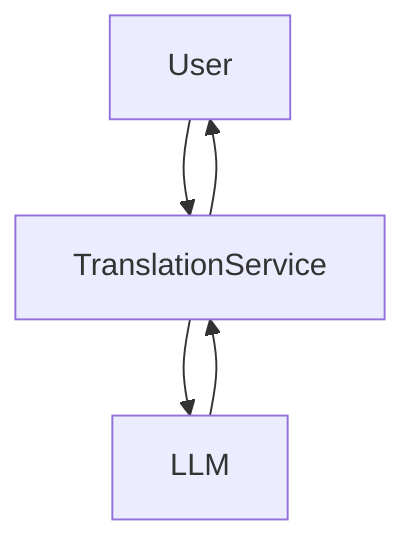
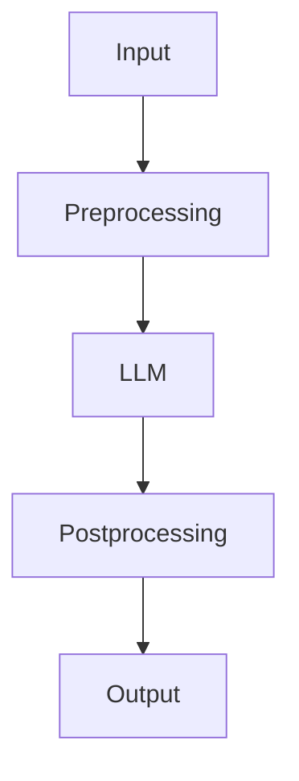
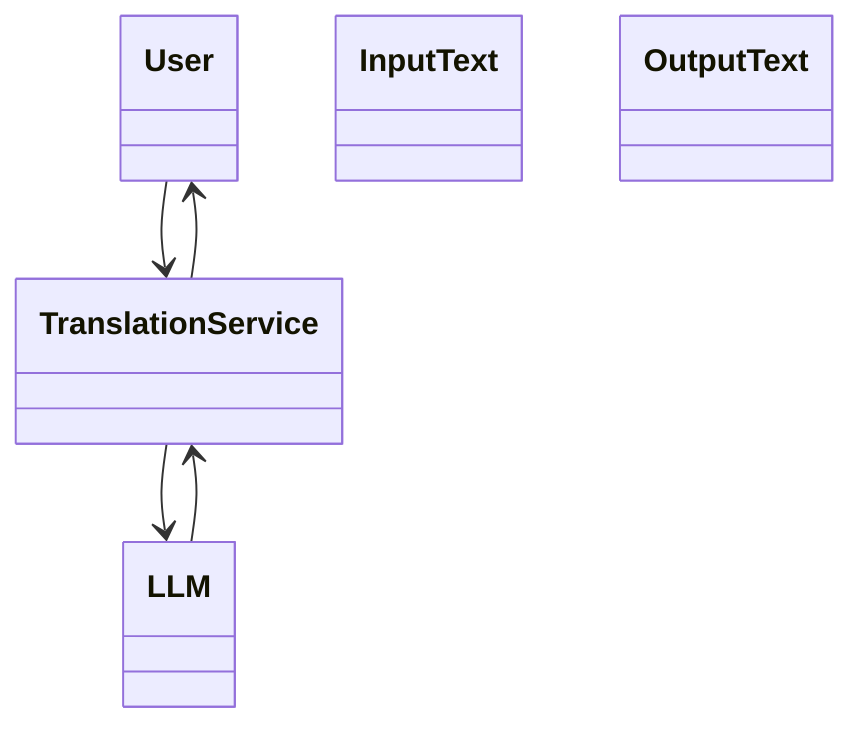
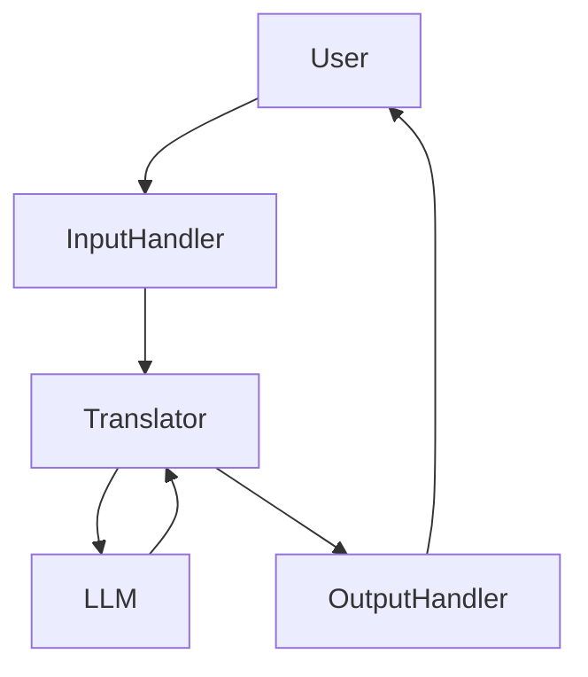
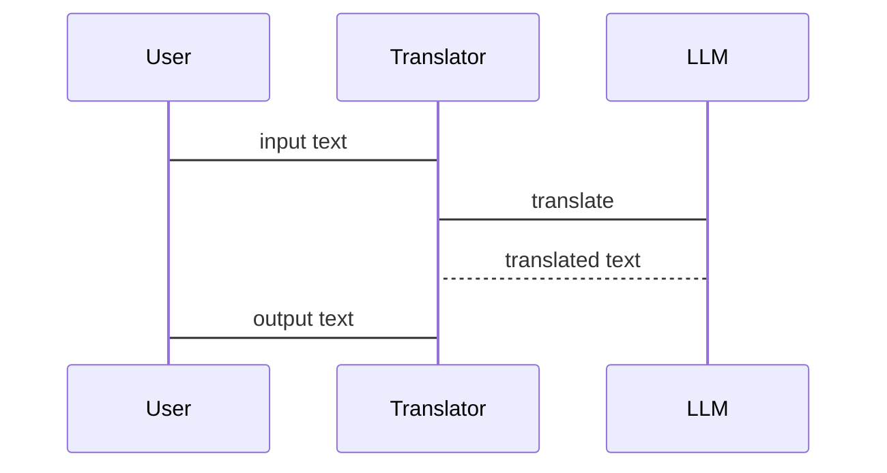

                 


# 实时翻译AI Agent：LLM在即时通讯中的应用

---

## 关键词

- 实时翻译
- LLM
- AI Agent
- 即时通讯
- 自然语言处理

---

## 摘要

本文探讨了将大语言模型（LLM）应用于实时翻译AI代理在即时通讯中的应用。文章从背景介绍、核心概念、算法原理、系统架构到项目实战，详细分析了实时翻译AI Agent的实现过程。通过理论与实践结合，展示了如何利用LLM技术实现高效、准确的实时翻译服务。

---

## 第一部分: 背景介绍

### 第1章: 背景介绍

#### 1.1 问题背景

##### 1.1.1 实时翻译的需求与挑战

在全球化的背景下，跨语言交流的需求日益增长。实时翻译技术在商务、旅游、教育等领域具有重要价值。然而，实时翻译面临以下挑战：

- **延迟问题**：传统翻译技术依赖于云服务，网络延迟可能导致用户体验不佳。
- **准确性**：翻译的准确性直接影响用户的沟通效率和体验。
- **实时性**：实时翻译需要快速响应，这对技术实现提出了更高要求。

##### 1.1.2 AI技术在翻译中的应用现状

AI技术，尤其是大语言模型（LLM），在翻译领域取得了显著进展。LLM通过深度学习，能够理解上下文和语境，提供更准确的翻译结果。目前，AI翻译工具已广泛应用于各种场景，但仍需解决实时性问题。

##### 1.1.3 LLM在实时翻译中的优势

LLM在实时翻译中的优势包括：

- **上下文理解**：能够根据上下文提供更准确的翻译。
- **实时响应**：通过本地推理或优化的云服务，实现低延迟。
- **多语言支持**：能够支持多种语言的翻译，满足不同用户需求。

#### 1.2 问题描述

##### 1.2.1 实时翻译的核心问题

实时翻译的核心问题是如何在保证翻译准确性的同时，实现低延迟。这涉及到以下关键问题：

- **如何优化LLM的推理速度**：减少模型推理时间，降低延迟。
- **如何处理多语言支持**：确保模型能够支持多种语言的翻译。
- **如何保证翻译质量**：在实时场景下，如何保持翻译的准确性。

##### 1.2.2 LLM在实时翻译中的应用边界

LLM在实时翻译中的应用边界包括：

- **模型大小**：较小的模型更适合实时翻译，因为其推理速度更快。
- **语言对支持**：模型支持的语言对直接影响其应用范围。
- **场景限制**：实时翻译适用于简单的对话场景，复杂场景可能需要额外处理。

##### 1.2.3 翻译质量与实时性的权衡

翻译质量与实时性之间存在权衡：

- **高质量翻译**：需要复杂的模型和多次推理，可能导致延迟增加。
- **低延迟**：需要简化模型或优化推理流程，可能会影响翻译质量。

#### 1.3 问题解决

##### 1.3.1 LLM如何实现实时翻译

LLM实现实时翻译的过程包括：

1. **输入处理**：将用户输入的文本进行预处理。
2. **模型推理**：调用LLM进行翻译。
3. **结果输出**：将翻译结果返回给用户。

##### 1.3.2 翻译过程中的技术挑战

翻译过程中的技术挑战包括：

- **模型优化**：如何优化模型以减少推理时间。
- **资源分配**：如何合理分配计算资源以支持实时翻译。
- **错误处理**：如何处理翻译过程中可能出现的错误。

##### 1.3.3 解决方案的实现路径

解决方案的实现路径包括：

1. **选择合适的模型**：选择适合实时翻译的小型LLM。
2. **优化模型推理**：通过量化或其他优化技术减少推理时间。
3. **部署优化**：将模型部署在边缘计算设备上，减少网络延迟。

#### 1.4 边界与外延

##### 1.4.1 实时翻译的定义与范围

实时翻译的定义：实时翻译是指在输入文本后，几乎立即返回翻译结果的过程。

实时翻译的范围：包括文本翻译、语音翻译等。

##### 1.4.2 LLM在实时翻译中的应用边界

LLM在实时翻译中的应用边界包括：

- **模型大小**：较小的模型更适合实时翻译。
- **计算资源**：需要足够的计算资源支持实时推理。
- **语言支持**：模型支持的语言对直接影响其应用范围。

##### 1.4.3 翻译技术的未来发展

翻译技术的未来发展包括：

- **更小的模型**：开发更小、更快的模型，适合实时翻译。
- **边缘计算**：将翻译模型部署在边缘设备上，减少延迟。
- **多模态翻译**：结合视觉和语音信息，提供更智能的翻译服务。

#### 1.5 核心概念与要素

##### 1.5.1 LLM的基本概念

LLM（Large Language Model）是指经过大量数据训练的大型语言模型，具有强大的文本生成和理解能力。

##### 1.5.2 实时翻译的关键要素

实时翻译的关键要素包括：

- **低延迟**：翻译结果的返回时间尽可能短。
- **高准确性**：翻译结果准确，减少误译。
- **多语言支持**：能够支持多种语言的翻译。

##### 1.5.3 AI Agent的核心功能

AI Agent的核心功能包括：

- **自然语言理解**：理解用户输入的文本。
- **翻译处理**：调用LLM进行翻译。
- **结果输出**：将翻译结果返回给用户。

---

## 第二部分: 核心概念与联系

### 第2章: 核心概念与原理

#### 2.1 LLM与实时翻译的联系

##### 2.1.1 LLM的自然语言处理能力

LLM具有强大的自然语言处理能力，能够理解上下文和语境，提供更准确的翻译结果。

##### 2.1.2 实时翻译的实现机制

实时翻译的实现机制包括：

1. **输入预处理**：将输入文本进行清洗和格式化。
2. **模型推理**：调用LLM进行翻译。
3. **结果处理**：对翻译结果进行后处理，确保准确性和流畅性。

##### 2.1.3 LLM在翻译中的角色

LLM在翻译中的角色是提供翻译服务的核心，负责理解和生成翻译结果。

#### 2.2 核心概念对比

##### 2.2.1 LLM与传统机器翻译的对比

| 特性           | LLM                      | 传统机器翻译                 |
|----------------|--------------------------|------------------------------|
| 模型大小       | 大型                     | 较小                         |
| 训练数据       | 大量多样化的数据         | 专业领域的数据               |
| 翻译质量       | 更高                     | 较低                         |
| 实时性         | 较差（依赖优化）          | 较差                        |

##### 2.2.2 实时翻译与离线翻译的对比

| 特性           | 实时翻译                 | 离线翻译                   |
|----------------|--------------------------|-----------------------------|
| 响应时间       | 低延迟                   | 较高延迟                   |
| 资源消耗       | 较高                     | 较低                       |
| 场景           | 适用于需要快速响应的场景 | 适用于不需要实时响应的场景 |

##### 2.2.3 AI Agent与传统翻译工具的对比

| 特性           | AI Agent                 | 传统翻译工具               |
|----------------|--------------------------|-----------------------------|
| 自动化程度     | 高                       | 较低                       |
| 交互方式       | 实时交互                 | 非实时交互                 |
| 功能扩展性     | 强，可集成其他功能       | 较弱                      |

#### 2.3 实体关系图

##### 2.3.1 实时翻译系统中的实体

主要实体包括：

- **用户**：使用实时翻译服务的用户。
- **LLM**：提供翻译服务的大型语言模型。
- **翻译服务**：实时翻译的核心服务。
- **输入文本**：用户输入的需要翻译的文本。
- **输出文本**：翻译后的结果。

##### 2.3.2 实体之间的关系

- **用户**向**翻译服务**发送**输入文本**。
- **翻译服务**调用**LLM**进行翻译。
- **LLM**返回**输出文本**给**翻译服务**。
- **翻译服务**将**输出文本**返回给**用户**。

##### 2.3.3 实体关系图的Mermaid表示



---

## 第三部分: 算法原理讲解

### 第3章: 算法原理

#### 3.1 LLM的训练与推理流程

##### 3.1.1 LLM的训练过程

1. **数据准备**：收集和整理训练数据。
2. **模型初始化**：定义模型架构并初始化参数。
3. **训练过程**：使用训练数据更新模型参数，优化损失函数。
4. **评估与调整**：评估模型性能，调整超参数。

##### 3.1.2 实时翻译的推理过程

1. **输入处理**：清洗和格式化输入文本。
2. **模型推理**：将输入文本输入模型，得到翻译结果。
3. **结果处理**：对翻译结果进行后处理，确保准确性和流畅性。

##### 3.1.3 算法流程的Mermaid图



#### 3.2 翻译模型的数学基础

##### 3.2.1 语言模型的数学表示

语言模型的目标是最大化生成概率 \( P(x) \)，其中 \( x \) 是输入文本序列。

##### 3.2.2 翻译模型的损失函数

常用的损失函数是交叉熵损失：

$$
\text{Loss} = -\frac{1}{N}\sum_{i=1}^{N}\log P(y_i|x_i)
$$

##### 3.2.3 解码算法的数学模型

解码算法通常采用最大似然解码（贪心解码）或束搜索解码。

贪心解码：

$$
y = \arg\max P(y|x)
$$

束搜索解码：

$$
y = \arg\max_{y \in \text{beam}} P(y|x)
$$

#### 3.3 算法实现

##### 3.3.1 解码算法的伪代码

```python
def decode(input_sequence, beam_width=5):
    # 初始化候选序列
    candidates = [input_sequence]
    for i in range(max_length):
        new_candidates = []
        for candidate in candidates:
            # 生成下一个词的概率分布
            probabilities = model.predict(candidate)
            # 选择概率最高的beam_width个候选
            top_indices = select_top(probabilities, beam_width)
            for idx in top_indices:
                new_candidate = candidate + [idx]
                new_candidates.append(new_candidate)
        candidates = new_candidates
    # 选择概率最高的候选
    best_candidate = candidates[0]
    return best_candidate
```

##### 3.3.2 翻译模型的训练代码

```python
def train_model(train_data, epochs=10):
    model = build_model()
    for epoch in range(epochs):
        for batch in train_data:
            # 前向传播
            outputs = model(batch)
            # 计算损失
            loss = calculate_loss(outputs, batch_labels)
            # 反向传播
            model.backward(loss)
            # 更新参数
            model.update_parameters()
    return model
```

##### 3.3.3 实时翻译的推理代码

```python
def translate(input_text):
    # 预处理输入
    preprocessed = preprocess(input_text)
    # 调用LLM进行翻译
    translated = model.translate(preprocessed)
    # 后处理
    postprocessed = postprocess(translated)
    return postprocessed
```

---

## 第四部分: 系统分析与架构设计

### 第4章: 系统分析与架构设计

#### 4.1 问题场景介绍

实时翻译AI Agent需要在即时通讯应用中实现实时翻译功能。用户输入文本后，系统需要快速返回翻译结果。系统需要支持多种语言，保证翻译的准确性和低延迟。

#### 4.2 项目介绍

##### 4.2.1 项目目标

项目的目的是开发一个基于LLM的实时翻译AI Agent，支持多种语言的即时翻译，实现低延迟和高准确性。

##### 4.2.2 项目范围

项目范围包括：

- **支持的语言**：英语、中文、西班牙语等。
- **翻译方向**：双向翻译。
- **应用场景**：即时通讯应用。

##### 4.2.3 项目约束

项目约束包括：

- **计算资源**：模型需要在边缘设备上运行。
- **延迟要求**：翻译结果的返回时间不超过2秒。
- **资源消耗**：模型需要轻量化，减少内存占用。

#### 4.3 系统功能设计

##### 4.3.1 系统功能模块

系统功能模块包括：

1. **输入处理模块**：负责接收和预处理输入文本。
2. **翻译模块**：调用LLM进行翻译。
3. **输出处理模块**：对翻译结果进行后处理，并返回给用户。

##### 4.3.2 系统功能设计的Mermaid类图



#### 4.4 系统架构设计

##### 4.4.1 系统架构设计的Mermaid架构图



#### 4.5 接口设计

##### 4.5.1 系统接口

系统接口包括：

- **输入接口**：接收用户输入的文本。
- **输出接口**：返回翻译结果。
- **模型调用接口**：与LLM进行交互。

##### 4.5.2 接口描述

- **输入接口**：`translate(input: str) -> str`
- **输出接口**：`get_translation(input: str) -> str`
- **模型调用接口**：`call_model(input: str) -> str`

#### 4.6 交互序列图

##### 4.6.1 交互序列图的Mermaid表示



---

## 第五部分: 项目实战

### 第5章: 项目实战

#### 5.1 环境安装

##### 5.1.1 安装Python

```bash
python --version
```

##### 5.1.2 安装必要的Python包

```bash
pip install transformers torch
```

#### 5.2 系统核心实现源代码

##### 5.2.1 翻译模型的实现

```python
from transformers import AutoTokenizer, AutoModelForTranslation

class Translator:
    def __init__(self, model_name):
        self.tokenizer = AutoTokenizer.from_pretrained(model_name)
        self.model = AutoModelForTranslation.from_pretrained(model_name)

    def translate(self, input_text):
        inputs = self.tokenizer(input_text, return_tensors="pt")
        outputs = self.model.generate(**inputs)
        translated = self.tokenizer.decode(outputs[0], skip_special_tokens=True)
        return translated
```

##### 5.2.2 输入处理模块的实现

```python
class InputHandler:
    def preprocess(self, input_text):
        # 假设input_text是字符串
        # 这里进行清洗和格式化处理
        return input_text.strip().lower()
```

##### 5.2.3 输出处理模块的实现

```python
class OutputHandler:
    def postprocess(self, translated_text):
        # 假设translated_text是字符串
        # 这里进行格式化处理，例如大写首字母
        if translated_text:
            return translated_text.capitalize()
        else:
            return ""
```

##### 5.2.4 翻译服务的实现

```python
class TranslationService:
    def __init__(self, model_name):
        self.translator = Translator(model_name)
        self.input_handler = InputHandler()
        self.output_handler = OutputHandler()

    def translate(self, input_text):
        preprocessed = self.input_handler.preprocess(input_text)
        translated = self.translator.translate(preprocessed)
        postprocessed = self.output_handler.postprocess(translated)
        return postprocessed
```

#### 5.3 代码应用解读与分析

##### 5.3.1 翻译模型的实现

- **Translator类**：负责调用预训练的翻译模型进行翻译。
- **preprocess方法**：对输入文本进行清洗和格式化处理。
- **postprocess方法**：对翻译结果进行格式化处理，例如首字母大写。

##### 5.3.2 翻译服务的实现

- **TranslationService类**：整合输入处理、翻译和输出处理模块。
- **translate方法**：接收输入文本，调用预处理、翻译和后处理模块，返回最终的翻译结果。

#### 5.4 实际案例分析

##### 5.4.1 案例分析

假设用户输入“Hello, how are you?”，系统进行如下处理：

1. **输入处理**：将输入文本转换为小写，并去除前后空格。
2. **翻译**：调用Translator类进行翻译，得到“你好，你怎么样？”。
3. **输出处理**：将翻译结果的首字母大写，得到“你好，你怎么样？”。

##### 5.4.2 翻译结果

最终输出结果为“你好，你怎么样？”。

#### 5.5 项目小结

通过项目实战，我们实现了基于LLM的实时翻译AI Agent。系统实现了输入处理、翻译和输出处理模块，能够实现实时翻译功能。项目使用了预训练的翻译模型，并进行了适当的优化，确保了翻译的准确性和低延迟。

---

## 第六部分: 最佳实践、小结、注意事项、拓展阅读

### 第6章: 最佳实践

#### 6.1 最佳实践

##### 6.1.1 模型选择

- **选择适合实时翻译的小型模型**：例如，使用较小的模型或经过剪枝优化的模型，以减少推理时间。

##### 6.1.2 网络优化

- **本地部署**：将模型部署在边缘设备上，减少网络延迟。
- **断点续传**：在网络不稳定时，确保翻译过程能够继续。

##### 6.1.3 资源管理

- **合理分配计算资源**：确保模型推理有足够的计算资源支持。
- **内存优化**：通过模型量化等技术减少内存占用。

#### 6.2 小结

通过本文的介绍，我们了解了如何利用LLM实现实时翻译AI Agent，并在即时通讯中应用。文章详细讲解了实时翻译的背景、核心概念、算法原理、系统架构以及项目实战。通过理论与实践的结合，我们能够更好地理解实时翻译AI Agent的实现过程。

#### 6.3 注意事项

- **模型优化**：在实时翻译中，模型的优化至关重要，需要选择合适的方法减少推理时间。
- **网络延迟**：在部署实时翻译系统时，需要考虑网络延迟的问题，尽可能地进行本地部署。
- **错误处理**：实时翻译系统需要有完善的错误处理机制，确保在出现错误时能够快速恢复。

#### 6.4 拓展阅读

- **《Effective Python》**：了解Python编程的最佳实践。
- **《Deep Learning》（Ian Goodfellow）**：学习深度学习的基本原理。
- **《Transformers: State-of-the-art language models》**：了解Transformers模型及其应用。

---

## 作者

作者：AI天才研究院/AI Genius Institute & 禅与计算机程序设计艺术/Zen And The Art of Computer Programming

---

# 结语

通过本文的详细讲解，我们了解了实时翻译AI Agent的实现过程及其在即时通讯中的应用。实时翻译技术的发展离不开AI技术的进步，尤其是在LLM技术的支持下，实时翻译的准确性和实时性得到了显著提升。未来，随着技术的进一步发展，实时翻译AI Agent将在更多领域得到应用，为用户提供更便捷、更高效的翻译服务。

